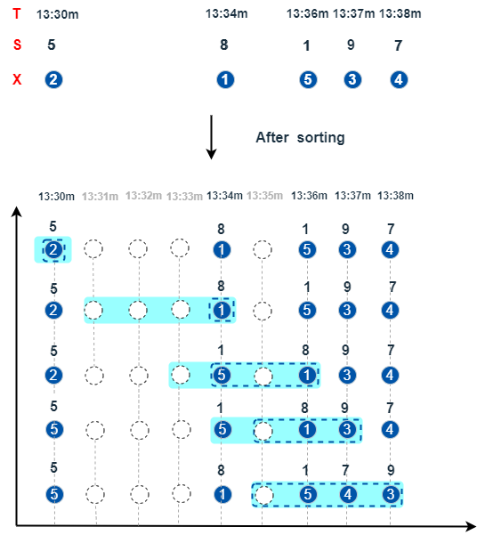

# tmTopN 系列

DolphinDB 提供了 tmTopN 系列函数，在根据时间滑动的窗口内，将数据根据某个指标排序后，只取排序靠前的 top 个元素进行计算。

tmTopN 系列函数的通用参数模板如下：

```
tmTopN(T, X, S, window, top, [ascending=true], [tiesMethod='latest'])
tmTopN(T, X, Y, S, window, top, [ascending=true], [tiesMethod='latest'])
```

## 参数

* **T** 是一个非严格递增的时间类型向量。
* **X** (**Y**) 数值型的向量。
* **S** 数值类型或时间类型的向量，表示 X 的排序指标。S 中的空值会被忽略（不参与排序）。
* **window** 正整型或 DURATION 标量。表示滑动窗口的长度。
* **top** 一个正整数或范围介于 (0, 1) 之间的浮点数。表示将 X 基于 S 排序后，排序靠前的元素数量（数量由 top
  的数据类型决定）。
  + 当 top 是整数时，数量是 top。
  + 当 top 是浮点数时，数量是 max(1, floor(size(窗口)\*top))。
* **ascending** 是一个布尔值，表示 *S* 是否按升序排序。 默认值是 true。
* **tiesMethod** 字符串。在滑动窗口内对 S 进行排序后，如果有多个具有相同值的元素无法全部进入前
  top，可以通过该参数来指定选择元素的方式。可选值为：
  + 'oldest'：从最早进入窗口的元素开始选取，直至达到 top 个。
  + 'latest'：从最晚进入窗口的元素开始向前选取，直至达到 top 个。
  + 'all'：选取所有元素。

tmTopN 系列函数如下：

单目：

* [tmsumTopN](../t/tmsumTopN.md)
* [tmavgTopN](../t/tmavgTopN.md)
* [tmstdTopN](../t/tmstdTopN.md)
* [tmstdpTopN](../t/tmstdpTopN.md)
* [tmvarTopN](../t/tmvarTopN.md)
* [tmvarpTopN](../t/tmvarpTopN.md)
* [tmskewTopN](../t/tmskewTopN.md)
* [tmkurtosisTopN](../t/tmkurtosisTopN.md)

双目：

* [tmbetaTopN](../t/tmbetaTopN.md)
* [tmcorrTopN](../t/tmcorrTopN.md)
* [tmcovarTopN](../t/tmcovarTopN.md)
* [tmwsumTopN](../t/tmwsumTopN.md)

## 窗口确定规则

tmTopN 系列函数的
window 长度以时间衡量。window 可以是正整数类型或者 DURATION 类型。对于 T 中每个元素 Ti，确定的窗口区间为 (temporalAdd(Ti,
-window), Ti]。

对 T 逐元素滑动，在由元素确定的窗口区间内，将 X 或 (X, Y) 根据 S
列进行稳定排序（排序方式由 ascending 指定，默认 true 为升序），取排序后结果的前 top 个元素进行计算。

以下图为例，在滑动的时间窗口内，将 X 的元素根据 S 的升序排序后，取前 3 个元素进行计算。



上图的对应代码，这里以 [tmsumTopN](../t/tmsumTopN.md)
为例：

```
T=13:30m 13:34m 13:36m 13:37m 13:38m
S = 5 8 1 9 7
X = 2 1 5 3 4
tmsumTopN(T, X, S, window=4, top=3)
// output
[2,1,6,9,12]

T=2021.01.03+1..7
X = [2, 1, 4, 3, 4, 3, 1]
S = [5, 8, 1, 1, 1, 1, 3]
//在倒数第2个滑动窗口中，S 中有4个1，但只取前3个排名，此时根据 tiesMethod 的设置值来选取元素
//tiesMethod 未指定，则取默认值 'latest'，即选取后3个1，对应 X 中的3, 4, 3元素
tmsumTopN(T,X,S,4,3)
// output
[2,3,7,9,11,10,10]
//tiesMethod = 'oldest'，即选前后3个1，对应 X 中的4, 3, 4元素
tmsumTopN(T,X,S,4,3,tiesMethod=`oldest)
// output
[2,3,7,9,11,11,10]
//tiesMethod = 'all'，即选取全部的1，对应 X 中的4, 3, 4, 3元素
tmsumTopN(T,X,S,4,3,tiesMethod=`all)
// output
[2,3,7,9,11,14,10]
```

