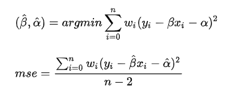

# wslr

## 语法

`wslr(Y, X, W, [mse=false])`

## 参数

**Y** INTEGRAL, FLOATING 或 DECIMAL类型向量，表示因变量。

**X** INTEGRAL, FLOATING 或 DECIMAL类型向量，表示自变量。

**W** INTEGRAL, FLOATING 或 DECIMAL类型向量，表示权重，其元素非负。

**mse** 布尔标量，设置是否输出残差均方差。默认值为false，表示不输出。

其中，Y, X, W 的长度必须相等。

## 详情

wslr 是 weighted single linear regression 的缩写，计算 Y 在 X 上加权线性回归的结果。返回一个元组，其元素依次代表回归系数
beta、截距 alpha 和残差均方差 mse (若有)。

其中



n 为非空数据个数。

相比于函数 wls：

* wls 以向量的形式返回结果，wslr 返回元组
* wls 是向量函数，wlsr 是聚合函数
* wls 可在查询时应用于分布式表，wlsr 不支持

注： 此函数无法用于分布式表查询。

## 例子

```
x = [0.78,0.38,0.2,0.52,0.12,0.49,0.02,0.67,0.94,0.85]
y = [0.11,0.63,0.19,0.36,0.02,0.35,0.98,0.07,0.55,0.43]
w = [0.05665,0.155172,0.142857,0.236453,0.125616,0.061576,0.064039,0.051724,0.004926,0.100985]
wslr(y,x,w)
//output:(0.385342531009792,-0.076256407696962)
wslr(y,x,w,true)
//output:(0.385342531009792,-0.076256407696962,0.007842049148797)
```

由于 wls 是向量函数，无法直接与 moving 结合使用，需要用户自定义聚合函数。而 wlsr 可直接与 moving 结合使用。

```
s = ["001","002","003","004","005","006","007","008","009","010"]
y = [0.2531,0.5672,0.8347,0.6436,0.699,0.3732,0.0676,0.9129,0.0167,0.755]
x = [0.5782,0.8064,0.5035,0.7857,0.5955,0.4156,0.7609,0.093,0.6504,0.9092]
w = [0,0.095909021199675,0.195930114343433,0.300024080233914,0.408136784222979]

t = table(s,y,x)
select moving(wslr{,,w,true},[y,x],5,5) as `bate`alpha`mse from t
```

| bate | alpha | mse |
| --- | --- | --- |
|  |  |  |
|  |  |  |
|  |  |  |
|  |  |  |
| 1.0968659790128028 | -0.6117304039349463 | 0.0004078518285504836 |
| 0.14198850512877909 | 0.7741808484080007 | 0.005713017371341482 |
| 0.7303333678486678 | -0.6250737654103594 | 0.01852879218352463 |
| 1.0082522818242372 | -1.1740015481453143 | 0.006523442161727362 |
| 1.0214599029781481 | -1.4342061326057263 | 0.002086531347398113 |
| 0.6657822330605759 | -0.25445296261591593 | 0.04738923724610222 |

