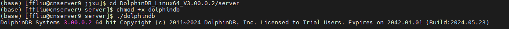
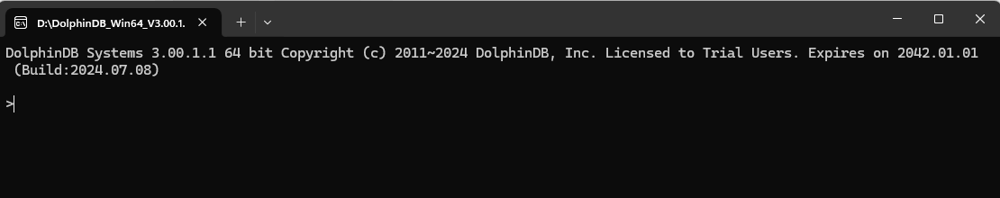
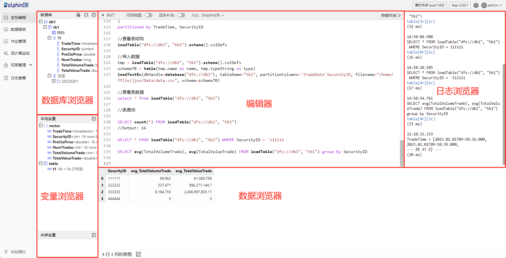
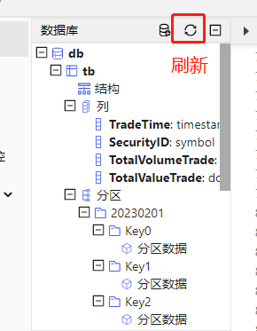
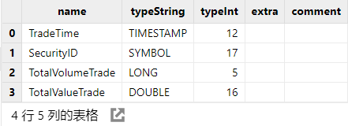
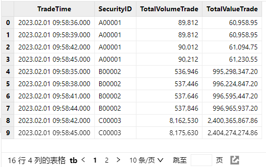
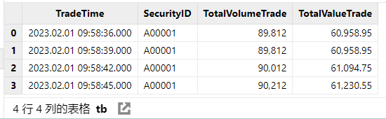
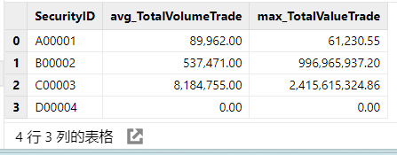
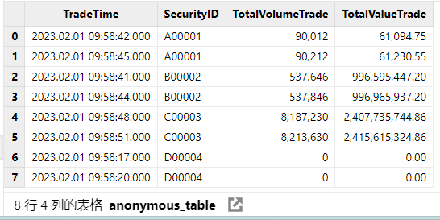
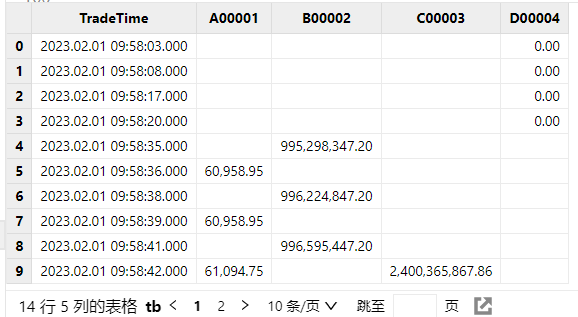

# 快速上手

本节以简短的例子展示如何在使用 DolphinDB 的初期完成快速部署、建立数据库、建立数据表、写入数据、导入数据、查询数据等基本操作。DolphinDB
为用户提供了更多丰富内容，请点击页面左侧的相应主题章节以了解更多细节。

## 1. 安装使用

### 1.1 下载与安装

步骤一：前往 [DolphinDB 官网](https://www.dolphindb.cn/product#downloads)下载 DolphinDB server 压缩包。

步骤二：将 DolphinDB server 压缩包解压到本地目录。

### 1.2 启动 server

*server* 目录中包含 Web 集群管理工具、服务端程序以及 license
文件。解压完成后不需要进一步安装。若有更多部署需求，可参考文档：

* [单节点部署与升级](../tutorials/standalone_server.md)
* [单服务器集群部署与升级](../tutorials/single_machine_cluster_deploy.md)
* [多服务器集群部署与升级](../tutorials/multi_machine_cluster_deployment.md)
* [高可用集群部署与升级](../tutorials/ha_cluster_deployment.md)
* [云环境部署](../tutorials/docker_single_deployment.md)

下面以单节点为例。进入 server 目录直接启动执行文件。以下是不同系统的启动指令示例：

* Linux 系统前台运行：

```
cd path_to_DolphinDB_server   //请修改为当前 DolphinDB/server 所在的实际路径
chmod +x dolphindb            //首次启动时需要修改文件权限
./dolphindb
```

图 1. 图 1-1 Linux 系统中 server 成功启动后的界面



* Windows 系统：双击 *dolphindb.exe* 文件，或者右键单击文件后选择“打开”。

图 2. 图 1-2 Windows 系统中 server 成功启动后的界面



图 1-1 和图 1-2 中都会显示当前 server 的版本号、许可证的授权类型（trial 试用版/test 测试版/commercial
商业版，可替换）和到期时间、server 的最新编译时间。

注：

* 如使用其他版本 license，则将 license 文件名改为
  *dolphindb.lic*，并将其替换社区版中的同名文件即可使用。
* 系统默认端口号为 8848。如需自定义端口，请编辑同级目录下的配置文件*dolphindb.cfg*，并修改 [*localSite*
  配置项](../db_distr_comp/cfg/function_configuration.md)。例如修改为“localSite=localhost:8890:datanode”修改后保存文件，并重新启动
  server。

### 1.3 连接客户端

DolphinDB 提供 [VSCode
Extension](../db_distr_comp/vscode.md), [Web Console](../db_distr_comp/db_man/web/intro.md),
[Java GUI](../db_distr_comp/gui.md) 等多种[客户端](../db_distr_comp/clients.md)，其中更推荐用户使用 VSCode
Extension，本节为方便介绍如何快速上手，将以 Web Console （后文将简称为 Web）为例进行说明。

注： 防火墙需要开放对应端口。

**步骤一：在浏览器地址栏中输入** `<ip>:<port>`

即 DolphinDB 所在服务器的 IP 和端口号。例如，通过 Web
访问在本机部署的单节点服务器的地址为：

```
http://localhost:8848
```

**步骤二：登录**

点击 Web
客户端左上区域的“去登录”。在登录界面中输入正确的用户名和密码（首次登录请使用账号“admin”和密码“123456”），最后点击“登录”。

注： 若不登录依然可以执行脚本，但无法查看分布式数据库的结构，且可能无法使用部分权限。

## 2. 建库建表

DolphinDB 可以通过 `[database](../funcs/d/database.md)`/`[table](../funcs/t/table.md)`函数或者 SQL 语句来建库建表。此处以 SQL 编程为例，创建一个按 SYMBOL
类型的值分区的数据库，并在该数据库中创建一个数据表。下图为 Web 界面的简易说明，更多详细文档可参考 [DolphinDB-交互编程](../db_distr_comp/db_man/web/Shell.md)。

图 3. 图 2-1 Web 界面简易说明



在后文中，将以简单的股票数据为例，包含
TradeTime（日期时间）、SecurityID（证券代码）、TotalVolumeTrade（累计成交量）、TotalValueTrade（累计成交金额）四类基本信息，并根据这些信息进行库表查询操作。

首先使用 [create 语句](../db_distr_comp/db_oper/create_db_tb.md)创建名为 db
的分布式数据库（以 OLAP 引擎为例）。复制粘贴下述代码至 DolphinDB Web 的编辑器中，选中需要执行代码点击执行（执行快捷键：Ctrl+E）即可。

```
CREATE DATABASE "dfs://db"
PARTITIONED BY VALUE(2020.01.01..2021.01.01), HASH([SYMBOL, 4])
```

然后使用 create 语句在 db 数据库中创建名为 tb 的数据表。其中分区列为 `TradeTime` 和
`SecurityID`。在编辑器中输入并选中下述脚本，然后执行。

注： DolphinDB
支持在数据库层面进行多种类型的分区，此处仅为示例。选择合适的分区类型，不仅利于用户根据业务特点对数据进行均匀分割，还可以降低系统响应延迟、提高数据吞吐量。更多说明可阅读文档[数据分区](../db_distr_comp/db/db_partitioning.md)。

```
CREATE TABLE "dfs://db"."tb"(
    TradeTime TIMESTAMP
    SecurityID SYMBOL
    TotalVolumeTrade LONG
    TotalValueTrade DOUBLE
)
partitioned by TradeTime, SecurityID
```

点击数据库浏览器上方的刷新按钮，可以查看前述步骤创建的数据库和数据表。

图 4. 图 2-2 分区数据库表结构



运行不报错，即说明执行成功。

可以执行下述代码查看分区表的表结构信息：

```
loadTable("dfs://db", "tb").schema().colDefs
```

返回结果：

图 5. 图 2-3 分区表结构



## 3. 导入数据

下载示例数据 [testdata.csv](data/testdata.csv) ，并上传到
DolphinDB 部署的 server 目录下。执行下述代码，将 CSV
文本数据从磁盘导入到分布式数据表中。（`"path_to_testdata.csv"`请替换为具体路径的数据文件）

```
tmp = loadTable("dfs://db", "tb").schema().colDefs
schemaTB = table(tmp.name as name, tmp.typeString as type)
loadTextEx(dbHandle=database("dfs://db"), tableName="tb", partitionColumns=`TradeTime`SecurityID, filename="path_to_testdata.csv", schema=schemaTB)
```

成功导入后可以执行下述代码，将表数据[加载](../funcs/l/loadTable.md)至内存中进行查看：

```
select * from loadTable("dfs://db", "tb")
```

返回结果：

图 6. 图 3-1 导入表数据



注： 在当前示例 Web 中规定小数位数为 2 位，用户亦可自行设置。

关于 DolphinDB
数据导入的更多说明如表头包含数字的正确处理、如何实现自动解析数据类型、手动导入日期与时间格式数据的方法、提升数据导入效率的技巧等问题可参阅教程[数据导入最容易忽略的十个细节](../tutorials/data_import_details.md)。

## 4. 查询数据

基于前文已经建立的表，指定条件进行查询操作。

**例 1** 查询分区表 tb 中所有总记录数。

```
SELECT count(*) FROM loadTable("dfs://db", "tb")
//Output: 16
```

**例 2** 查询分区表 tb 中所有 SecurityID = A00001 的数据。

```
SELECT * FROM loadTable("dfs://db", "tb") WHERE SecurityID = `A00001
```

返回结果：

图 7. 图 4-1 例 2 返回结果



**例 3** 根据 SecurityID 分组，使用[group
by](../funcs/ho_funcs/groupby.md)查询每支股票中 TotalVolumeTrade 列的平均值和 TotalValueTrade 列的最大值。

```
SELECT avg(TotalVolumeTrade), max(TotalValueTrade) FROM loadTable("dfs://db", "tb") group by SecurityID
```

返回结果：

图 8. 图 4-2 例 3 返回结果



**例 4** 根据 SecurityID 分组，使用[context
by](../progr/sql/contextBy.md)查询每支股票最后两条记录。

注： context by 是 DolphinDB 的独有功能，能够简化对时间序列数据的操作。

```
select * from loadTable("dfs://db", "tb") context by SecurityID limit -2
```

图 9. 图 4-3 例 4 返回结果



**例 5** 使用 [pivot by](../progr/sql/pivotBy.md) 将表 tb 的
TradeTime 列作为行索引，SecurityID 列作为列索引，查看 TotalValueTrade 列的值。

注： pivot by 是 DolphinDB 的独有功能，能够将表中一列或多列的内容按照两个维度重新排列等。

```
select TotalValueTrade from loadTable("dfs://db", "tb") pivot by TradeTime, SecurityID
```

图 10. 图 4-4 例 5 返回结果



## 5. 学习建议

针对不同角色的专业人士，我们为您量身定制了学习路径：

* 若您是数据分析工程师，建议您深入探索 [SQL
  查询](../progr/sql/sql_intro.html "DolphinDB 中 SQL 语句的基本语法和用法")的重要操作，包括聚合操作、时序数据处理以及表关联技巧。同时，[流数据框架](../stream/str_intro.md)中的订阅机制和引擎级联计算也值得您重点关注，这将大大提升您应对吞吐量大、时延要求高、复杂实时分析等业务场景的能力。（点击了解
  [DolphinDB 中的 SQL
  标准化](../progr/sql/sql_intro.html "DolphinDB 中 SQL 语句的基本语法和用法")）
* 若您是数据库开发工程师，则可以将重心放在[数据库核心概念](../db_distr_comp/cfg/db_intro.md)和 [DolphinDB
  编程语言](../progr/lang_intro.html "脚本编程相关概念参考，包括：数据类型与形式、对象、运算符、编程语句、数据操作、函数化编程、文件操作和 SQL 语句。")上。这些知识将帮助您充分利用 DolphinDB 的高性能特性，开发出更加高效的数据应用。
* 若您是数据库运维工程师，[系统运维](../sys_man/om_intro.md)和[故障排查](../error_codes/troubleshooting.md)章节将是您的必修课。掌握这些内容，您将能够确保DolphinDB 系统的稳定运行和高效管理。

最后，诚邀您了解并参与 DolphinDB 数据库专员（DolphinDB Certified Associate) 、DolphinDB
数据分析专员（DolphinDB Certified Data Analytics Associate) 的[认证考试](https://dolphindb.cn/skill-certification)。您将获得来自 DolphinDB 官方的权威认可，同时探索数据领域的更多内容。

## 6. 技术支持

若在使用 DolphinDB 的过程中碰到无法解决的问题，您可通过以下途径获取帮助信息和技术支持：

|  |  |
| --- | --- |
| **渠道** | **说明** |
| ASK 社区 | 在 [DolphinDB 问答社区](https://ask.dolphindb.cn/)提问。技术支持人员会尽可能在 1 个工作日内回复。  请注意：提问时请尽量描述清使用的 server 版本号（如 2.00.12 JIT）/API 版本号（如 3.0.0.0）/插件版本号，操作系统（win / linux），OS 内核版本号等信息，另请尽量描述清遇到的问题，同时上传文件、截图等，以方便工作人员解答。 |
| 教程文档 | DolphinDB 准备了覆盖不同场景、不同需求的[使用教程](../tutorials/about_tutorials.md)。用户可根据需求自行阅读。 |
| 智臾科技知乎主页 | 知乎的[智臾科技公司主页](https://www.zhihu.com/org/zhe-jiang-zhi-yu-ke-ji-you-xian-gong-si)是 DolphinDB 产品对外发布的主要社媒平台。与产品相关的技术和测评类文章，都可以在知乎上找到。常设专栏：   * [DolphinDB   与量化金融](https://www.zhihu.com/column/DolphinDBinQuantitativeFinance) * [DolphinDB   与物联网](https://www.zhihu.com/column/DolphinDBinIoT) * [DolphinDB   测评报告](https://www.zhihu.com/column/orcapandas) * [DolphinDB   视频教程](https://www.zhihu.com/column/c_1330085975784333312) * [DolphinDB   客户故事](https://www.zhihu.com/column/c_1621476722632523776) |
| 电子邮件 | 发邮件至：support@dolphindb.com。DolphinDB 技术支持人员尽可能在 1 个工作日内回复您的问题。较为复杂的问题可能需要更多的时间进行分析和答复。我们希望您：   * 尽量详细描述您遇到的问题、软硬件环境、问题发生的业务场景等。 * 附上电话或微信等联系方式，以便深入交流。 |
| 技术交流群 | 扫描下方二维码，或者添加客服微信：13306510479，加入技术交流群：   |

## 7. 视频课程

DolphinDB 在国内外主流视频平台投放技术探讨、产品介绍、公开课录屏等精品视频：

* 国内平台：

  + [DolphinDB 数据库入门](https://space.bilibili.com/1351925320/channel/collectiondetail?sid=2780468)：以视频形式生动讲解
    DolphinDB 的基本安装，如何在 DolphinDB
    中建库建表、写入数据、查询数据、备份恢复、权限管理与作业管理，DolphinDB TSDB
    引擎的深度讲解，以及如何进行DolphinDB 的运维等。
  + [DolphinDB 流数据入门](https://space.bilibili.com/1351925320/channel/collectiondetail?sid=3159755)：通过视频演示如何在
    DolphinDB 中部署和发布流数据、如何使用强大的流数据计算引擎，以及发布-订阅模型的详细介绍等。
  + [DolphinDB 公开课](https://space.bilibili.com/1351925320/channel/seriesdetail?sid=3701865)：TSDB
    存储引擎、模拟撮合引擎、窗口计算、流数据、Python API、C++ API、Java API……
  + [更多](https://space.bilibili.com/1351925320)：直播回放、教程视频、……
* 国外平台：[YouTube](https://www.youtube.com/%40dolphindb8736)

