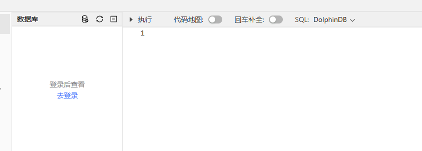

# 快速部署

以下内容介绍如何快速部署 DolphinDB，以及如何使用 WEB 客户端。

注： 为简便部署以及快速上手，以下步骤均以社区版服务器为运行前提。

1. 前往 [DolphinDB 官网](https://www.dolphindb.cn/product#downloads) 下载社区版本的 DolphinDB Server
   压缩包。
   
2. 将 DolphinDB Server 压缩包解压到本地目录。
3. 单节点部署。进入\server\目录直接启动执行文件即可。以下是不同系统的启动指令示例：
   * Linux
     系统后台运行：

     ```
     sh startSingle.sh
     ```
   * Windows 系统：在 Windows 环境中，双击
     dolphindb.exe。弹出如下窗口表示启动成功。
     

   注： 系统默认端口号为 8848，如需自定义端口，请编辑同级目录下的配置文件
   *dolphindb.cfg*，并修改 *localSite* 配置项。
4. 登录 Web 客户端。
   1. 打开一个主流浏览器。

      注： 使用 Web
      集群管理器前，请确保浏览器版本满足以下要求：
      * Chrome/Firefox/Edge 浏览器：版本高于 100
      * Safari 浏览器：版本高于 16
   2. 在浏览器地址栏中输入 <ip>:<port>，即
      DolphinDB 所在服务器的 IP 和端口号 8848。例如，通过 Web
      访问在本机部署的单节点服务器的地址为：

      ```
      http://localhost:8848
      ```

注： 未进行用户登录时，用户仅可以直接执行部分不需要权限的函数和脚本。对于需要权限的功能，例如创建数据库、创建表、管理作业、查看日志、查到当前脚本变量、查看运行结果或报错信息等，必须用户登录后方可使用。

## WEB 中用户登录

1. 点击 WEB 客户端左侧靠上区域的 去登录。

   
2. 在随后显示的登录界面中输入 **用户名** 和 **密码** 后点击
   登录。

   

   提示： 初次使用 DolphinDB
   时，请通过默认的管理员账号和密码登录：`admin/123456`。

## 其他客户端

Web 客户端具有上手快速、简单易用的特点，但与同样具备图形界面的 DolphinDB GUI 客户端相比，功能较为单一。对于具有深度编程需求的用户，则建议使用
DolphinDB VS Code 插件。

**相关信息**

* [GUI 客户端](../db_distr_comp/gui.html "GUI 客户端")
* [Web 操作手册](../db_distr_comp/db_man/web/intro.html "Web 操作手册")
* [VS Code 插件](../db_distr_comp/vscode.html "VS Code 插件")

