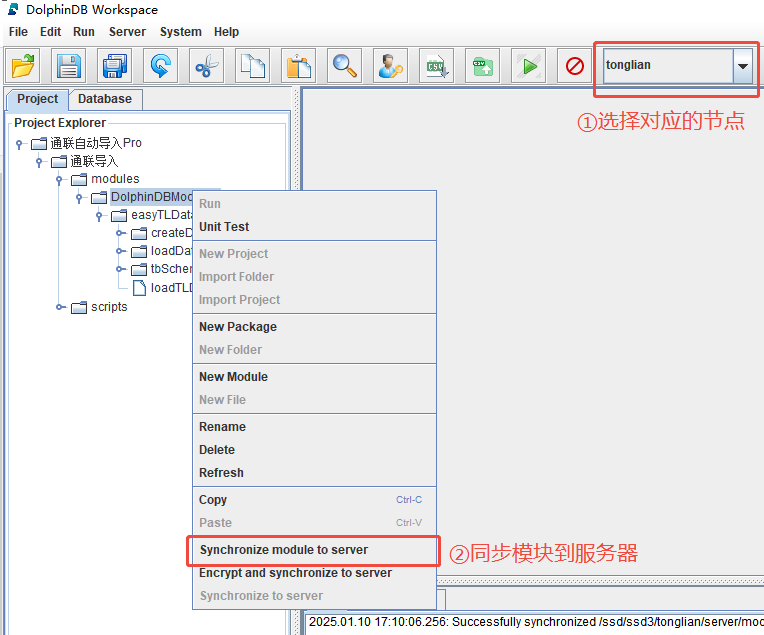

# easyTLDataImport 通联历史数据自动化导入功能模块

在部署完 DolphinDB 后，需要将历史数据批量导入数据库，再进行数据查询、计算和分析等操作。为便于用户快速导入通联历史 Level-2 行情数据，DolphinDB 开发了 DolphinDBModules::easyTLDataImport 模块（简称 easyTLDataImport 模块），主要用于通联历史 Level-2 行情数据的自动化导入。

* 沪深 Level-2 快照行情
* 沪深逐笔委托
* 沪深逐笔成交

## 1. 模块版本说明

自 2.00.10 版本开始，DolphinDB 安装包的 server/modules 目录下已预装 easyTLDataImport 模块（模块版本 1.0）。

由于 1.0 版本的 easyTLDataImport 模块存在以下问题：

无法适配上交所从 2023.11.27 启用的逐笔合并数据文件（对应通联的 mdl\_4\_24\_0.csv 文件）。

内存使用较高，至少需要 64 GB 以上内存才能执行导入任务。

对于导入任务的进度以及每天的任务执行结果无法监控。

模块结构不清晰，二次开发难度较大。

因此，开发了 2.0 版本的 easyTLDataImport 模块。对原来的模块结构进行了调整，对导入流程进行了优化。

自 2.00.15 和 3.00.3 版本开始，DolphinDB 安装包的 server/modules 目录下预装 easyTLDataImport 模块（模块版本 2.0）。

若需要安装 1.0 版本，也可以从 9.1 的附录章节下载对应的模块包。解压后，覆盖节点所在服务器上 [home]/modules 路径下的对应文件夹，从而对模块进行升级。（[home] 目录可以通过 getHomeDir 函数查看。）

本文将对 easyTLDataImport 模块（模块版本 2.0）进行详细介绍。

## 2. 历史数据文件结构

在使用本教程功能模块时，用户需要自行解压通联数据，并确保在主目录下创建了以日期命名的文件夹（"yyyyMMdd" 的日期格式）。每个日期目录下包含该日期的 .csv 文件。

例如，主目录是 level2，则文件结构可以设置如下：

```
|—— level2
|      |—— 20211201
|      |      |—— xxx.csv
|      |      |—— …
|      |—— 20211202
|      |      |—— xxx.csv
|      |      |—— …
|      |—— …

数据也可以按年组织，则文件结构如下
|—— level2
|      |—— 2021
|      |      |—— 20211201
|      |      |      |—— xxx.csv
|      |      |      |—— …
|      |      |—— …
|      |—— 2022
|      |      |—— 20221201
|      |      |      |—— xxx.csv
|      |      |      |—— …
|      |      |—— …
|      |—— …

数据也可以按年组织，则文件结构如下

|—— level2

|      |—— 2021

|      |      |—— 20211201

|      |      |      |—— xxx.csv

|      |      |      |—— …

|      |      |—— …

|      |—— 2022

|      |      |—— 20221201

|      |      |      |—— xxx.csv

|      |      |      |—— …

|      |      |—— …

|      |—— …
```

**注意**：日期这一层目录之前的文件结构和日期目录下的文件结构都没有要求。

## 3. 模块介绍

easyTLDataImportPro 模块主要包含主函数（loadTLData.dos）、数据表结构 (tbSchema)、分布式库表创建 (createDbAndTb) 和数据导入 (loadData) 四个部分。


### 3.1 主函数: autoLoadTongLianData

**语法**

```
autoLoadTongLianData(fileDir, dataSource,
						dbName="dfs://TL_Level2", tableName=NULL, market="ALL",
						startDate=NULL, endDate=NULL, parallel=1, initialDB=false, initialTB=false,
						isDataDuplicated=true, isConcatTime=true, isNeedOrderQueue=true)
```

**详情**

将 *fileDir* 路径下从 *startDate* 到 *endDate* 日期的通联数据导入指定的分布式表里。

**参数**

* **fileDir** 指定的存放通联 .csv 文件的文件目录。该目录下必须包含 “yyyyMMdd” 格式的日期文件夹。
* **dataSource** 数据源。目前支持的参数值如下：
  + "TLAll": 目前支持的所有通联数据，包括快照行情、逐笔成交和逐笔委托。
  + "TLSnapshot": 通联的快照行情数据。
  + "TLEntrust": 通联的逐笔委托数据。
  + "TLTrade": 通联的逐笔成交数据。
  + "TLTradeEntrust": 通联的逐笔数据，包括逐笔成交和逐笔委托。
* **dbName** 导入的数据库名。支持字符串和字典两种格式，默认值是 "dfs://TL\_Level2"。
  + 当参数是字典类型时，其 key 是一个字符串标量，表示数据源，目前支持 "TLSnapshot", "TLEntrust", "TLTrade"；其 value 是一个字符串标量，表示数据源对应的导入库名。
  + 当参数是字符串标量时，表示 "TLSnapshot", "TLEntrust", "TLTrade" 三种数据类型的数据都会写入同一个数据库。
* **tableName** 导入的分布式表名。支持空值、字符串标量和字典三种格式，默认值是 NULL。
  + 当参数值为 NULL 时，表示使用默认的分布式表名。"TLSnapshot" 数据对应的表名为 "snapshot"；"TLEntrust" 数据对应的表名为 "entrust"；"TLTrade" 数据对应的表名为 "trade"。
  + 当参数是字典类型时，其 key 是一个字符串标量，表示数据源，目前支持 "TLSnapshot", "TLEntrust", "TLTrade"；其 value 是一个字符串标量，表示数据源对应的分布式表名。
  + 只有 *dataSource* 属于 "TLSnapshot", "TLEntrust", "TLTrade" 之一时，参数可以是字符串标量，表示对应数据源需要存入的分布式表名。
* **market** 交易所。目前支持的参数值如下：
  + "ALL": 表示将沪深数据合并存储，会将所有数据全部导入一个分布式表，其表名为 *tableName 。*
  + "SZ": 表示将深交所数据单独存储，会将深交所数据单独导入一个分布式表，其表名为 *tableName*+*market*（比如 "snapshotSZ"）。
  + "SH": 表示将上交所数据单独存储，会将上交所数据单独导入一个分布式表，其表名为 *tableName*+*market*（比如 "snapshotSH"）。
* **startDate** 空值或形如 "yyyyMMdd" 的字符串标量，表示导入数据的起始日期。
  + 当参数值为 NULL 时，不会对起始日期做判断。
  + 当参数是形如 "yyyyMMdd" 的字符串标量时，会导入大于等于该日期的通联数据。
* **endDate** 空值或形如 "yyyyMMdd" 的字符串标量，表示导入数据的结束日期。
  + 当参数值为 NULL 时，不会对结束日期做判断。
  + 当参数是形如 "yyyyMMdd" 的字符串标量时，会导入小于等于该日期的通联数据。
* **parallel** 后台任务的并行度。按日期拆分导入任务，*parallel* 控制后台任务的个数。
* **initialDB** 布尔值，表示是否需要初始化数据库。如果已经存在名为 *dbName* 的数据库，当 *initialDB*=true 时，会删除原来的数据库并重新创建；否则会保留原来的数据库。
* **initialTB** 布尔值，表示是否需要初始化分布式表。如果在 dbName 数据库下已经存在名为 tbName 的表，当 *initialTB*=true 时，会删除原来的表并重新创建；否则会保留原来的分布式表。
* **isDataDuplicated** 布尔值，表示是否需要对数据进行去重。
  + "TLSnapshot" 对应的快照数据的去重字段："TradeDate", "TradeTime", "SecurityID", "ImageStatus" 。
  + "TLEntrust" 对应的逐笔委托数据的去重字段："TradeDate", "SecurityID", "ChannelNo", "ApplSeqNum"。
  + "TLTrade" 对应的逐笔成交数据的去重字段："TradeDate", "SecurityID", "ChannelNo", "ApplSeqNum"。
* **isConcatTime** 布尔值，表示是否需要将日期列和时间列合并为一列。
  + 当参数值为 true 时，会用类型为 TIMESTAMP 的时间列 TradeTime 来存储数据时间。
  + 当参数值为 false 时，会用类型为 DATE 的日期列 TradeDate 和类型为 TIME 的时间列 TradeTime 存储数据时间。
* **isNeedOrderQueue** 布尔值，表示导入快照数据时，是否需要合并最优报价 50 档委托队列的数据。

### 3.2 数据表结构

tbSchema 文件夹下定义了所有数据表的表结构。

* csvSchema 文件夹下的文件用于指定 DolphinDB 读取 .csv 文件时的数据格式。
* dfsSchema 文件夹下的文件用于指定 DolphinDB 数据存入数据库的数据格式。
  + 用户可以通过指定 *market* 参数选择将沪深两个交易所的数据分开单独存储还是合并存储。当 *market="ALL"* 时，会将沪深数据存储到同一张表中，表中的字段是两个交易所数据字段的并集，并新增 Market 字段用于标识数据来自哪个交易所。
  + 用户可以通过指定 *isConcatTime* 参数选择是否将数据的日期列和时间列合并为一列。
  + 上交所和深交所两个交易所数据的结构不同，且不同时期同一个交易所的数据结构也不同。因此，我们根据《沪深 L2 高频行情文件说明》整理了两个交易所不同时期的数据结构，最终确定了存入数据库的表结构。具体表结构可以查看 9.3 章节。

### 3.3 分布式库表创建

createDbAndTb 文件夹下定义了分布式库表创建脚本。

* createDB.dos 用于创建存储通联数据的数据库。
* createTB.dos 用于创建存储通联数据的分布式表。

基于客户的实践经验，确定了如下的分区方案：

| **沪深是否分开存储** | **日期列和时间列是否合并** | **分区方案** | **分区列** | **排序列** |
| --- | --- | --- | --- | --- |
| *market="SH" or market="SZ"* | *isConcatTime =true* | 时间维度按天 VALUE 分区 + 证券代码维度 HASH 25 分区 | "TradeTime", "SecurityID" | "SecurityID", "TradeTime" |
| *market="SH" or market="SZ"* | *isConcatTime =false* | 时间维度按天 VALUE 分区 + 证券代码维度 HASH 25 分区 | "TradeDate", "SecurityID" | "SecurityID", "TradeTime" |
| *market="ALL"* | *isConcatTime =true* | 时间维度按天 VALUE 分区 + 证券代码维度 HASH 50 分区 | "TradeTime", "SecurityID" | "Market","SecurityID", "TradeTime" |
| *market="ALL"* | *isConcatTime =false* | 时间维度按天 VALUE 分区 + 证券代码维度 HASH 50 分区 | "TradeDate", "SecurityID" | "Market","SecurityID", "TradeTime" |

### 3.4 数据导入

loadData 文件夹下定义了数据转换和导入的规则。

* loadOneDayData 文件夹下的文件用于指定对一天的通联数据的处理和导入规则。
  + loadOneDaySnapshot.dos：指定通联提供的快照行情数据的处理和导入规则。
    - 会用 [textChunkDS](https://docs.dolphindb.cn/zh/funcs/t/textChunkDS.md) 函数将文件划分为 512 MB 大小的数据源，再通过 [mr](https://docs.dolphindb.cn/zh/funcs/m/mr.md) 函数写入到数据库中。
    - 当 *isNeedOrderQueue=true* 时，会读取对应的最优报价 50 档委托队列的数据文件，用左连接的方式将其关联到快照行情数据中（关联列："SecurityID", "TradeTime", "ImageStatus"）；当 \*isNeedOrderQueue=false \*时，会直接将对应的列置空。
    - 当 *isDataDuplicated=true* 时，会通过 [upsert!](https://docs.dolphindb.cn/zh/funcs/u/upsert_.md) 函数写入数据，写入时根据 "TradeDate", "TradeTime", "SecurityID", "ImageStatus" 字段进行去重；当 *isDataDuplicated=false* 时，会通过 [append!](https://docs.dolphindb.cn/zh/funcs/a/append%21.md) 函数写入数据，此时不会进行去重操作。
  + loadOneDayEntrust.dos：指定通联提供的逐笔委托数据的处理和导入规则。
    - 会用 [textChunkDS](https://docs.dolphindb.cn/zh/funcs/t/textChunkDS.md) 函数将文件划分为 512 MB 大小的数据源，再通过 [mr](https://docs.dolphindb.cn/zh/funcs/m/mr.md) 函数写入到数据库中。
    - 当 *isDataDuplicated=true* 时，会通过 [upsert!](https://docs.dolphindb.cn/zh/funcs/u/upsert_.md) 函数写入数据，写入时根据 "TradeDate", "SecurityID", "ChannelNo", "ApplSeqNum" 字段进行去重；当 *isDataDuplicated=false* 时，会通过 [append!](https://docs.dolphindb.cn/zh/funcs/a/append%21.md) 函数写入数据，此时不会进行去重操作。
  + loadOneDayTrade.dos：指定通联提供的逐笔成交数据的处理和导入规则。
    - 会用 [textChunkDS](https://docs.dolphindb.cn/zh/funcs/t/textChunkDS.md) 函数将文件划分为 512 MB 大小的数据源，再通过 [mr](https://docs.dolphindb.cn/zh/funcs/m/mr.md) 函数写入到数据库中。
    - 当 *isDataDuplicated=true* 时，会通过 [upsert!](https://docs.dolphindb.cn/zh/funcs/u/upsert_.md) 函数写入数据，写入时根据 "TradeDate", "SecurityID", "ChannelNo", "ApplSeqNum" 字段进行去重；当 *isDataDuplicated=false* 时，会通过 [append!](https://docs.dolphindb.cn/zh/funcs/a/append%21.md) 函数写入数据，此时不会进行去重操作。
  + loadOneDayTradeEntrust.dos：指定通联提供的上交所逐笔数据的处理和导入规则。（仅针对 mdl\_4\_24\_0.csv 文件）
    - 会用 [textChunkDS](https://docs.dolphindb.cn/zh/funcs/t/textChunkDS.md) 函数将文件划分为 512 MB 大小的数据源，再通过 [mr](https://docs.dolphindb.cn/zh/funcs/m/mr.md) 函数写入到数据库中。
    - 会将 mdl\_4\_24\_0.csv 文件中 Type="T" 的数据写入逐笔成交的分布式库里。
    - 会将 mdl\_4\_24\_0.csv 文件中 Type!="T" 的数据写入逐笔委托的分布式库里。（包含 Type="A" 新增委托、Type="D" 删除委托、Type="S" 产品状态的数据）
    - 当 *isDataDuplicated=true* 时，会通过 [upsert!](https://docs.dolphindb.cn/zh/funcs/u/upsert_.md) 函数写入数据，写入时根据 "TradeDate", "SecurityID", "ChannelNo", "ApplSeqNum" 字段进行去重；当 *isDataDuplicated=false* 时，会通过 [append!](https://docs.dolphindb.cn/zh/funcs/a/append%21.md) 函数写入数据，此时不会进行去重操作。
* loadOneDayData.dos：用于指定导入一天对应交易所数据的导入规则。
* loadData.dos：用于指定导入若干天的通联数据的导入规则。

## 4. 使用示例

* **第一步**：用户按照第 2 章文件结构中的要求解压并准备好数据。

假设数据放在 /hdd/hdd1/data/TLData/ 目录下，文件结构如下图：


* **第二步**：将模块同步到 DolphinDB 的 *server/modules* 的目录下。
  + [VS Code 插件](https://docs.dolphindb.cn/zh/db_distr_comp/vscode.md)：连接对应的节点 ——> 右键 DolphinDBModules 文件夹 ——> 选择 DolphinDB: Upload Module
  + [GUI 客户端](https://docs.dolphindb.cn/zh/db_distr_comp/gui.md)：连接对应的节点 ——> 右键 DolphinDBModules 文件夹 ——> 选择 Synchronize module to server



* **第三步**：载入模块和导入数据方法如下：

```
// 加载模块
use DolphinDBModules::easyTLDataImport::loadTLData

// 配置参数
fileDir = "/hdd/hdd1/data/TLData/"
dataSource = "TLAll"
dbName = {
	"TLSnapshot": "dfs://Level2",
	"TLEntrust": "dfs://Level2",
	"TLTrade": "dfs://Level2"
}
tableName = {
	"TLSnapshot": "snapshot",
	"TLEntrust": "entrust",
	"TLTrade": "trade"
}
isDataDuplicated = false
isConcatTime = false
isNeedOrderQueue = true

// 调用函数，导入通联数据
jobid = autoLoadTongLianData(fileDir=fileDir, dataSource=dataSource, dbName=dbName, tableName=tableName,
                              isDataDuplicated=isDataDuplicated, isConcatTime=isConcatTime, isNeedOrderQueue=isNeedOrderQueue)
```

## 5.任务状态监控

**（1）使用以下代码可以查询后台任务状态：**

```
getTLJobStatus(jobid)             // 函数名发生变更，1.0 版本中为 getJobStatus(jobid)
```


* *jobid* 为 `autoLoadTongLianData` 函数的返回值，对应 [getRecentJobs()](https://docs.dolphindb.cn/zh/funcs/g/getRecentJobs.md) 结果里的 jobDesc 字段值。
* 通过函数里的参数 *parallel* 可以设置提交的后台任务的个数。
* 通过配置文件里的参数 *maxBatchJobWorker* 可以设置处理后台任务的最大工作线程数。
* 返回的结果表里，startTime 不是空值表示任务已经开始执行；endTime 不是空值表示任务已经结束执行。

**（2）使用以下代码可以查询后台任务导入进度：**

```
getTLJobDetails(jobid)          // 函数名发生变更，1.0 版本中为 getJobDetails(jobid)
```


* *jobid* 为 `autoLoadTongLianData` 函数的返回值，对应 [getRecentJobs()](https://docs.dolphindb.cn/zh/funcs/g/getRecentJobs.md) 结果里的 jobDesc 字段值。
* 通过输出的信息，可以了解哪些日期的任务已经执行完毕，哪些日期的任务正在执行。

**（3）使用以下代码可以查询导入子任务状态：**

共享内存表 TLDataImportStatusTable 记录了查询导入子任务的状态。

```
select * from TLDataImportStatusTable
```

* 模块会自动生成一个共享表，记录每个导入子任务的状态。
* 脚本拆分的最小导入任务是：一天一个数据源的导入任务。
* 如果 TLDataImportStatusTable 没有对应的日期对应数据源的任务信息，表示该任务还没有结束。只有等一个最小导入任务执行结束，才会在共享表里写入任务状态。
* 每次执行 `autoLoadTongLianData` 函数都会重置任务状态的共享表 TLDataImportStatusTable。
* 会出现的报错信息详情可以查看 9.2 章节。

## 6. 参数设置注意事项

* **fileDir**

模块中对数据文件查找的方法如下：

（1）从 *fileDir* 目录下递归查找所有由 8 位数字组成的文件夹路径，即 "yyyyMMdd" 格式的日期文件夹。

（2）再将找到的所有日期和 *startDate、endDate* 进行字符串比较，从而达到导入数据日期筛选的目的。

（3）最后在每个日期文件夹下，递归查找所有以 csv 结尾的文件，从而获取该日期下的所有 .csv 文件的绝对路径。

因为第一步是查找所有 8 位数字组成的文件夹，所以参数 *fileDir* 指定的文件路径下必须有一层目录是以 "yyyyMMdd" 格式的日期命名。

所以如果用户想要导入一天的数据，需要通过 *startDate、endDate* 参数控制导入日期，而不是通过 *fileDir* 参数。

以图 4-1中的文件结构为例，假设只想导入 2021.12.01 这一天的数据，不是配置参数 *fileDir* 为 "/hdd/hdd1/data/TLData/20211201"，而是配置 *startDate* 和 *endDate* 为 "20211201"。

* **isNeedOrderQueue**

参数 *isNeedOrderQueue* 为 true 时，对最优报价 50 档委托队列的数据处理逻辑如下：

（1）先读取对应的委托队列的 .csv 文件到内存中。

（2）对委托队列的内存表进行格式处理，生成 OfferOrders 和 BidOrders 列分别存储卖方和买方的委托队列。

（3）用 [textChunkDS](https://docs.dolphindb.cn/zh/funcs/t/textChunkDS.md) 函数将快照数据的文件划分为 512 MB 大小的数据源。

（4）通过 [mr](https://docs.dolphindb.cn/zh/funcs/m/mr.md) 函数对快照数据源和全量的委托队列数据进行左连接，连接列为 "TradeTime", "SecurityID", "ImageStatus"。并将关联后的结果写入对应的数据库。

因为需要将委托队列的数据全量读到内存并进行关联操作，所以这种方式会使用更多的内存。

**可用内存小于 64 GB 的不推荐设置参数*isNeedOrderQueue* 为 true。**

* **isDataDuplicated**

测试发现，2016 年左右的数据中，快照数据和 50 档委托数据里都会有大量的重复数据（以"TradeTime", "SecurityID", "ImageStatus"为键值的重复数据）。

如果直接做左连接，会让结果表的数据量大幅增加，导致内存使用暴增，经常出现 OOM。

因此导入 2016 年左右的快照数据且需要合并最优报价的 50 档委托数据（即参数 *isNeedOrderQueue* 为 true）时，推荐设置参数 *isDataDuplicated* 为 true。

导入近期的快照行情数据时，推荐设置参数 *isDataDuplicated* 为 false。

* **parallel**

当 *parallel* 参数设置很大时，可能会出现后台导入任务部分处于等待状态并未执行的情况，这可能与配置文件里的 *maxBatchJobWorker* 参数有关。函数里的 *parallel* 参数只能设置提交的后台任务的个数。同时执行的后台任务个数需要通过配置文件里的 *maxBatchJobWorker* 参数进行设置。

*parallel* 越大使用的内存会越多。在资源有限的情况下，*parallel* 参数不宜设置的过大。参数 *parallel* 对导入性能以及资源使用的影响可以参考 7.2 章节。

## 7. 性能测试

### 7.1 测试环境

测试环境的软硬件配置如下表：

| **软硬件项** | **信息** |
| --- | --- |
| OS（操作系统） | CentOS Linux 7 (Core) |
| 内核 | 3.10.0-1160.el7.x86\_64 |
| CPU | Intel(R) Xeon(R) Gold 5220R CPU @ 2.20GHz |
| CPU 逻辑核数 | 8（使用 license 限制节点使用的核数） |
| 内存 | 使用 dolphindb.cfg 里的配置项限制节点使用的内存大小maxMemSize：64 GBOLAPCacheEngineSize：2 GBTSDBCacheEngineSize：2 GBTSDBLevelFileIndexCacheSize：2 GB |
| 磁盘 | 1 块 SSD，3.84 TB 固态硬盘 SATA 读取密集型 6 Gbps 512 2.5 英寸 Flex Bay AG 硬盘 1 DWPD |
| server 版本 | 2.00.14.3 |

### 7.2 性能结果

**测试数据集**：2023.02.06~2023.02.10 共 5 天的数据。

以下只测试了通联数据沪深合并存储时的导入性能：

* isDataDuplicated=false

| **数据源** | **数据量** | **原始 csv 大小(GB)** | **磁盘占用大小(GB)** | **压缩比** | **并发数** | **耗时(min)** | **最大内存占用(GB)** | **RPS(W/s)** | **吞吐量(MB/s)** |
| --- | --- | --- | --- | --- | --- | --- | --- | --- | --- |
| snapshot+order queue | 118,551,389 | 111.87 | 12.08 | 9.26 | 1 | 37.67 | 41 | 52 | 51 |
| snapshot | 118,551,389 | 69.99 | 9.73 | 7.20 | 1 | 22.50 | 7 | 88 | 53 |
| snapshot | 118,551,389 | 69.99 | 9.73 | 7.20 | 5 | 10.89 | 18 | 181 | 110 |
| entrust | 660,586,205 | 52.70 | 15.86 | 3.32 | 1 | 18.11 | 7 | 608 | 50 |
| entrust | 660,586,205 | 52.70 | 15.86 | 3.32 | 5 | 8.63 | 18 | 1276 | 104 |
| trade | 503,367,925 | 45.95 | 12.70 | 3.62 | 1 | 15.97 | 8 | 525 | 49 |
| trade | 503,367,925 | 45.95 | 12.70 | 3.62 | 5 | 7.39 | 20 | 1135 | 106 |

* isDataDuplicated=true

| **数据源** | **数据量** | **原始 csv 大小(GB)** | **磁盘占用大小(GB)** | **压缩比** | **并发数** | **耗时(min)** | **最大内存占用(GB)** | **RPS(W/s)** | **吞吐量(MB/s)** |
| --- | --- | --- | --- | --- | --- | --- | --- | --- | --- |
| snapshot+order queue | 118,518,576 | 111.87 | 12.09 | 9.25 | 1 | 47.37 | 43 | 42 | 40 |
| snapshot | 118,518,576 | 69.99 | 9.15 | 7.65 | 1 | 22.91 | 14 | 86 | 52 |
| snapshot | 118,518,576 | 69.99 | 9.15 | 7.65 | 5 | 12.04 | 21 | 164 | 99 |
| entrust | 660,586,205 | 52.70 | 15.96 | 3.30 | 1 | 24.03 | 16 | 458 | 37 |
| entrust | 660,586,205 | 52.70 | 15.96 | 3.30 | 5 | 10.02 | 20 | 1099 | 90 |
| trade | 503,367,925 | 45.95 | 12.67 | 3.63 | 1 | 21.35 | 16 | 393 | 37 |
| trade | 503,367,925 | 45.95 | 12.67 | 3.63 | 5 | 9.23 | 21 | 909 | 85 |

## 8. 模块开发

目前，easyTLDataImport 模块只支持导入快照行情、逐笔成交和逐笔委托。如果想要基于 easyTLDataImport 模块导入更多数据源的数据，用户可以按照以下流程对模块进行二次开发。

模块结构可以查看第 3 章节。下面将增加 dataSource="TLIndex" 的数据源，使模块能导入上交所指数数据（Index.csv）。

（1）在 DolphinDBModules/easyTLDataImport/tbSchema/csvSchema 文件夹下新增一个 indexCsvSchema.dos 文件，用于指定目标导入数据的结构。

```
module DolphinDBModules::easyTLDataImport::tbSchema::csvSchema::indexCsvSchema

def indexCsvSchema(){
	name = ["UpdateTime", "DataStatus", "SecurityID", "PreCloseIndex", "OpenIndex", "Turnover", "HighIndex",
            "LowIndex", "LastIndex", "TradTime", "TradVolume", "CloseIndex", "LocalTime", "SeqNo"]
	typeString = ["TIME", "INT", "SYMBOL", "DOUBLE", "DOUBLE", "DOUBLE", "DOUBLE",
                "DOUBLE", "DOUBLE", "TIME", "DOUBLE", "DOUBLE", "TIME", "LONG"]
	return table(name, typeString)
}
```

（2）在 DolphinDBModules/easyTLDataImport/tbSchema/dfsSchema 文件夹下新增一个 indexSchema.dos 文件，用于指定分布式表的表结构。

```
module DolphinDBModules::easyTLDataImport::tbSchema::dfsSchema::indexSchema

def indexSchemaTb(isConcatTime){
	if(isConcatTime==true){
        name = ["TradeTime", "DataStatus", "SecurityID", "PreCloseIndex", "OpenIndex", "Turnover", "HighIndex",
                "LowIndex", "LastIndex", "TradTime", "TradVolume", "CloseIndex", "LocalTime", "SeqNo"]
        typeString = ["TIMESTAMP", "INT", "SYMBOL", "DOUBLE", "DOUBLE", "DOUBLE", "DOUBLE",
                        "DOUBLE", "DOUBLE", "TIME", "DOUBLE", "DOUBLE", "TIME", "LONG"]
    }else{
        name = ["TradeDate", "TradeTime", "DataStatus", "SecurityID", "PreCloseIndex", "OpenIndex", "Turnover", "HighIndex",
                "LowIndex", "LastIndex", "TradTime", "TradVolume", "CloseIndex", "LocalTime", "SeqNo"]
        typeString = ["DATE", "TIME", "INT", "SYMBOL", "DOUBLE", "DOUBLE", "DOUBLE", "DOUBLE",
                    "DOUBLE", "DOUBLE", "TIME", "DOUBLE", "DOUBLE", "TIME", "LONG"]
    }
	return table(1:0, name, typeString)
}
```

（3）在 DolphinDBModules/easyTLDataImport/createDbAndTb/createDB.dos 的 `createDb` 函数里增加创建数据库的语句。

```
def createDb(dbName, dataSource, merge){
    if(dataSource in ["TLSnapshot", "TLTrade", "TLEntrust"]){
        // ... ...
    }else if(dataSource=="TLIndex"){                            // 新增  TLIndex 的建库语句
        db = database(dbName, VALUE, 2021.01.01..2021.01.03)
    }
}
```

（4）在 DolphinDBModules/easyTLDataImport/createDbAndTb/createTB.dos 的 `createTb` 函数里增加创建分布式表的语句。

```
use DolphinDBModules::easyTLDataImport::tbSchema::dfsSchema::indexSchema   // 新增

def createTb(dbName, tbName, dataSource, market, isConcatTime){
    db = database(dbName)
    // Handle different data types for the table
    if(dataSource=="TLSnapshot"){
       // ... ...
    }else if(dataSource=="TLEntrust"){
       // ... ...
    }else if(dataSource=="TLTrade"){
       // ... ...
    }else if(dataSource=="TLIndex"){                                      // 新增  TLIndex 的建表语句
        t = indexSchemaTb(isConcatTime)
        partitionColumns=iif(isConcatTime, `TradeTime, `TradeDate)
        db.createPartitionedTable(table=t, tableName=tbName, partitionColumns=partitionColumns)
    }
}
```

（5）在 DolphinDBModules/easyTLDataImport/loadData/loadOneDayData 文件夹下新增一个 loadOneDayIndex.dos 文件，它是包含数据转化规则的导入脚本。

```
module DolphinDBModules::easyTLDataImport::loadData::loadOneDayData::loadOneDayIndex

use DolphinDBModules::easyTLDataImport::tbSchema::csvSchema::indexCsvSchema

def appendIndex(day, t, dbName, tbName, isConcatTime){
    // 转换数据格式
    tmpData = select day as TradeDate, UpdateTime as TradeTime, DataStatus as DataStatus, SecurityID as SecurityID,PreCloseIndex as PreCloseIndex,
                    OpenIndex as OpenIndex, Turnover as Turnover,HighIndex as HighIndex,LowIndex as LowIndex,LastIndex as LastIndex,
                    TradTime as TradTime,TradVolume as TradVolume,CloseIndex as CloseIndex,LocalTime as LocalTime,SeqNo as SeqNo
                from t
    if(isConcatTime==true){
        tmpData.replaceColumn!(`TradeTime, concatDateTime(tmpData["TradeDate"], tmpData["TradeTime"]))
        tmpData.dropColumns!(`TradeDate)
    }

	// 写入数据库
	loadTable(dbName, tbName).append!(tmpData)
}

def loadOneDayIndexSH(csvFiles, day, dbName, tbName, isConcatTime){
	csvNames = "Index.csv"
	csvPath = csvFiles[endsWith(csvFiles, csvNames)][0]
    schemaTB = indexCsvSchema()
	try{
		ds = textChunkDS(filename=csvPath, chunkSize=512, schema=schemaTB)
		mr(ds, appendIndex{day, , dbName, tbName, isConcatTime}, parallel=false)
	}catch(ex){
		errorMessage = dict(`message`code, [string(ex[0])+":"+string(ex[1]), "error"])
		return errorMessage
	}
	return true
}
```

（6）在 DolphinDBModules/easyTLDataImport/loadData/loadOneDayData.dos 的 `loadOneDayDataSH` 函数里增加指数数据的导入规则。

```
use DolphinDBModules::easyTLDataImport::loadData::loadOneDayData::loadOneDayIndex  // 新增

def loadOneDayDataSH(csvFilesSH, day, dbNames, tbNames, merge, dtypes, isConcatTime, isDataDuplicated, isNeedOrderQueue) {
    csvFiles = csvFilesSH
    statTable = objByName(`TLDataImportStatusTable)     // 状态监控表
    // 定义数据源和导入函数的映射关系
    if("mdl_4_24_0.csv" in each(last, csvFiles.split("/"))){
        loadFuncs = ["TLSnapshot", "TLTradeEntrust", "TLIndex"]         // 新增  TLIndex 数据源
        loadTypes = ["TLSnapshot", ["TLTrade", "TLEntrust"], "TLIndex"] // 新增  TLIndex 数据源
    }else{
        loadFuncs = ["TLSnapshot", "TLEntrust", "TLTrade", "TLIndex"]   // 新增  TLIndex 数据源
        loadTypes = ["TLSnapshot", "TLEntrust", "TLTrade", "TLIndex"]   // 新增  TLIndex 数据源
    }
    // 串行导入多天的数据
    for(i in 0:size(loadFuncs)){       // i = 0
        if(any(loadTypes[i] in dtypes)){
            dtype = loadTypes[i]
            loadFunc = loadFuncs[i]
            if(loadFunc=="TLTradeEntrust"){
                dbName = dbNames
                tbName = tbNames
            }else{
                dbName = dbNames[dtypes==dtype][0]
                tbName = tbNames[dtypes==dtype][0]
            }
            // 导入开始时间
            start_time = now()
            // 使用新增的自定义函数导入指数数据
            if(loadFunc=="TLSnapshot"){
                // ... ...
            }else if(loadFunc=="TLEntrust"){
                // ... ...
            }else if(loadFunc=="TLTrade"){
                // ... ...
            }else if(loadFunc=="TLTradeEntrust"){
                // ... ...
            }else if(loadFunc=="TLIndex"){                              // 新增  TLIndex 数据源
                errorMessage = loadOneDayIndexSH(csvFiles, day, dbName, tbName, isConcatTime)
            }
            // 导入结束时间
            end_time = now()
            // 向子任务状态表记录任务情况
            try{
                if(typestr(errorMessage)=="BOOL")   errorMsg = ""
                else                                errorMsg = toStdJson(errorMessage)
                insert into statTable values(concat(dtype, ""), "SH", day, start_time, end_time, errorMsg)
            }catch(ex){print(ex)}
        }
    }
}
```

（7）在 DolphinDBModules/easyTLDataImport/loadTLData.dos 的主函数里增加新的数据源类型 "TLIndex"。

```
def autoLoadTongLianData(fileDir, dataSource,
						dbName="dfs://TL_Level2", tableName=NULL, market="ALL",
						startDate=NULL, endDate=NULL, parallel=1, initialDB=false, initialTB=false,
						isDataDuplicated=true, isConcatTime=true, isNeedOrderQueue=true){
    // ... ... (无需修改)

	// 对 dataSource 做参数校验时，增加数据源 TLIndex
	if(!(string(dataSource) in ["TLAll", "TLTradeEntrust", "TLSnapshot", "TLEntrust", "TLTrade", "TLIndex"])){
		errorMessage = dict(`message`code, ["数据源 [" + string(dataSource) + "] 暂时不支持", "error"])
		return printLog(errorMessage)
	}

	// 对数据类型做处理时，根据需求增加数据源 TLIndex
	if(dataSource=="TLTradeEntrust")	dtypes = ["TLTrade", "TLEntrust"]
	else if(dataSource=="TLAll")		dtypes = ["TLSnapshot", "TLTrade", "TLEntrust", "TLIndex"]
	else								dtypes = [dataSource]

    // ... ... (无需修改)
}
```

（8）重新同步模块后，即可导入上交所指数数据。（模块同步步骤查看第 4 章节）

```
// 加载模块
use DolphinDBModules::easyTLDataImport::loadTLData

// 配置参数
fileDir = "/hdd/hdd1/data/TLData/"
dataSource = "TLIndex"
dbName = {"TLIndex": "dfs://Level2Index"}
tableName = {"TLIndex": "index"}
isDataDuplicated = false
isConcatTime = false

// 调用函数，导入通联数据
jobid = autoLoadTongLianData(fileDir=fileDir, dataSource=dataSource, dbName=dbName, tableName=tableName,
                              isDataDuplicated=isDataDuplicated, isConcatTime=isConcatTime)
```

## 9. 附录

### 9.1 模块代码

* easyTLDataImport 模块（版本2.0）：[DolphinDBModulesV2.0](src/DolphinDBModulesV2.0.zip)
* easyTLDataImport 模块（版本1.0）：[DolphinDBModulesV1.0](src/DolphinDBModulesV1.0.zip)

### 9.2 异常处理

对于导入过程中可能出现的问题，会在日志中输出对应的报错提示信息。

| **情况** | **输出信息** |
| --- | --- |
| 参数 *market* 不属于 "ALL", "SZ", "SH" | {"code": "error","message": "市场 [market] 暂时不支持"} |
| 参数 *dataSource* 不属于 "TLAll", "TLSnapshot", "TLEntrust", "TLTrade" , "TLTradeEntrust" | {"code": "error","message": "数据源 [dataSource] 暂时不支持"} |
| 参数 *dbName* 不是字符串或者字典 | {"code": "error","message": "数据库名 [dbName] 参数类型有误"} |
| 参数 *tableName* 不是空值、字符串或者字典 | {"code": "error","message": "分布式表名 [tableName] 参数类型有误"} |
| 参数\* startDate\* 不是空值或者 "yyyyMMdd" 格式的日期字符串 | {"code": "error","message": "开始日期 [startDate] 格式有误"} |
| 参数\* endDate\* 不是空值或者"yyyyMMdd" 格式的日期字符串 | {"code": "error","message": "开始日期 [endDate] 格式有误"} |
| 参数\* fileDir\* 指定的路径下没有 *startDate* 到 *endDate* 内的 "yyyyMMdd" 格式的日期文件夹 | {"code": "warning","message": "[fileDir] 路径下没有找到指定日期的文件夹，请确认文件路径"} |
| 参数 *initialDB* 为 false，但是参数 \*dbName \*指定的数据库已经存在 | {"code": "info","message": "[dbName] 数据库已经存在"} |
| 参数 *initialTB* 为 false，但是参数 \*tableName \*指定的分布式表已经存在 | {"code": "info","message": "数据库 [dbName] 已经存在表 [tableName]"} |
| 数据导入时，文件夹下没有对应的 csv 文件 | {"code": "error","message": "深交所 [day] 日期的 [csvNames] 的 csv 文件不全或者不存在"}{"code": "error","message": "上交所 [day] 日期的 [csvNames] 的 csv 文件不全或者不存在"} |
| 实际 csv 文件的数据列数和 csvSchema 模块里面预设的表结构的列数不一致 | {"code": "error","message": "[csvPath] 的数据格式有误，列数不匹配"} |
| 其他错误【通过 try{}catch(ex){} 捕获异常】 | {"code": "error","message": 输出报错信息 ex} |

### 9.3 行情数据存储表结构

因为 .csv 文件里的时间为 TIME 类型，没有日期字段，所以处理数据格式时，会将上层文件夹名里的日期作为最终的日期字段。

#### 9.3.1 Level-2 快照数据

* 深交所数据（总共 37 列）

| **字段含义** | **入库字段名** | **入库数据类型** | **2010.05 - 2016.05.06（MarketData.csv）** | **2016.05.07 - 2019.06.04（mdl\_6\_28\_0.csv）** | **2019.06.05 - 至今（mdl\_6\_28\_0.csv）** |
| --- | --- | --- | --- | --- | --- |
| 数据生成时间 | TradeTime | TIMESTAMP | DataTimeStamp | UpdateTime | UpdateTime |
| 行情类别 | MDStreamID | SYMBOL |  | MDStreamID | MDStreamID |
| 证券代码 | SecurityID | SYMBOL | SecurityID | SecurityID | SecurityID |
| 证券代码源 | SecurityIDSource | SYMBOL |  | SecurityIDSource | SecurityIDSource |
| 交易阶段 | TradingPhaseCode | SYMBOL | EndOfDayMaker | TradingPhaseCode | TradingPhaseCode |
| 昨日收盘价 | PreCloPrice | DOUBLE | PreClosePx | PreCloPrice | PreCloPrice |
| 成交笔数 | NumTrades | LONG | NumTrades | TurnNum | TurnNum |
| 成交总量 | TotalVolumeTrade | LONG | TotalVolumeTrade | Volume | Volume |
| 成交总金额 | TotalValueTrade | DOUBLE | TotalValueTrade | Turnover | Turnover |
| 最近价 | LastPrice | DOUBLE | LastPx | LastPrice | LastPrice |
| 开盘价 | OpenPrice | DOUBLE | OpenPx | OpenPrice | OpenPrice |
| 最高价 | HighPrice | DOUBLE | HighPx | HighPrice | HighPrice |
| 最低价 | LowPrice | DOUBLE | LowPx | LowPrice | LowPrice |
| 升跌1（最新价-昨收价） | DifPrice1 | DOUBLE |  | DifPrice1 | DifPrice1 |
| 升跌2（最新价-上一最新价） | DifPrice2 | DOUBLE |  | DifPrice2 | DifPrice2 |
| 股票市盈率1 | PE1 | DOUBLE | PERatio1 | PE1 | PE1 |
| 股票市盈率2 | PE2 | DOUBLE | PERatio2 | PE2 | PE2 |
| 基金T-1净值 | PreCloseIOPV | DOUBLE |  | PreCloseIOPV | PreCloseIOPV |
| 基金实时参考净值 | IOPV | DOUBLE |  | IOPV | IOPV |
| 委托买入总量 | TotalBidQty | LONG | TotalBidQty | TotalBidQty | TotalBidQty |
| 加权平均买入价格 | WeightedAvgBidPx | DOUBLE | WeightedAvgBidPx | WeightedAvgBidPx | WeightedAvgBidPx |
| 委托卖出总量 | TotalOfferQty | LONG | TotalOfferQty | TotalOfferQty | TotalOfferQty |
| 加权平均卖出价格 | WeightedAvgOfferPx | DOUBLE | WeightedAvgOfferPx | WeightedAvgOfferPx | WeightedAvgOfferPx |
| 涨停价 | UpLimitPx | DOUBLE |  | HighLimitPrice | HighLimitPrice |
| 跌停价 | DownLimitPx | DOUBLE |  | LowLimitPrice | LowLimitPrice |
| 持仓量 | OpenInt | LONG | TotalLongPosition | OpenInt | OpenInt |
| 权证溢价率 | OptPremiumRatio | DOUBLE |  | OptPremiumRatio | OptPremiumRatio |
| 卖价10档 | OfferPrice | DOUBLE[] | AskPrice1..AskPrice10 | AskPrice1..AskPrice10 | AskPrice1..AskPrice10 |
| 买价10档 | BidPrice | DOUBLE[] | BidPrice1..BidPrice10 | BidPrice1..BidPrice10 | BidPrice1..BidPrice10 |
| 卖量10档 | OfferOrderQty | LONG[] | AskVolume1..AskVolume10 | AskVolume1..AskVolume10 | AskVolume1..AskVolume10 |
| 买量10档 | BidOrderQty | LONG[] | BidVolume1..BidVolume10 | BidVolume1..BidVolume10 | BidVolume1..BidVolume10 |
| 申买10档委托笔数 | BidNumOrders | INT[] |  |  | NumOrdersB1..NumOrdersB10 |
| 申卖10档委托笔数 | OfferNumOrders | INT[] |  |  | NumOrdersS1..NumOrdersS10 |
| 入库时间 | LocalTime | TIME | LocalTime | LocalTime | LocalTime |
| 消息序列号 | SeqNo | LONG | SeqNo | SeqNo | SeqNo |
| 委托卖量50档 | OfferOrders | LONG[] | OrderQty1..OrderQty50 (OrderQueue.csv) | OrderQty1..OrderQty50 (mdl\_6\_28\_1.csv) | OrderQty1..OrderQty50 (mdl\_6\_28\_1.csv) |
| 委托买量50档 | BidOrders | LONG[] | OrderQty1..OrderQty50 (OrderQueue.csv) | OrderQty1..OrderQty50 (mdl\_6\_28\_2.csv) | OrderQty1..OrderQty50 (mdl\_6\_28\_2.csv) |

* 上交所数据（总共 52 列）

| **字段含义** | **入库字段名** | **入库数据类型** | **2019.06.05 以前（MarketData.csv）** | **2019.06.06 - 至今（MarketData.csv）** |
| --- | --- | --- | --- | --- |
| 数据生成时间 | TradeTime | TIMESTAMP | UpdateTime | UpdateTime |
| 证券代码 | SecurityID | SYMBOL | SecurityID | SecurityID |
| 快照类型(全量/更新) | ImageStatus | INT | ImageStatus | ImageStatus |
| 昨日收盘价 | PreCloPrice | DOUBLE | PreCloPrice | PreCloPrice |
| 开盘价 | OpenPrice | DOUBLE | OpenPrice | OpenPrice |
| 最高价 | HighPrice | DOUBLE | HighPrice | HighPrice |
| 最低价 | LowPrice | DOUBLE | LowPrice | LowPrice |
| 最近价 | LastPrice | DOUBLE | LastPrice | LastPrice |
| 今收盘价 | ClosePrice | DOUBLE | ClosePrice | ClosePrice |
| 交易阶段 | TradingPhaseCode | SYMBOL | InstruStatus | InstruStatus |
| 成交笔数 | NumTrades | LONG | TradNumber | TradNumber |
| 成交总量 | TotalVolumeTrade | LONG | TradVolume | TradVolume |
| 成交总金额 | TotalValueTrade | DOUBLE | Turnover | Turnover |
| 委托买入总量 | TotalBidQty | LONG | TotalBidVol | TotalBidVol |
| 加权平均买入价格 | WeightedAvgBidPx | DOUBLE | WAvgBidPri | WAvgBidPri |
| 债券加权平均委买价格 | AltWAvgBidPri | DOUBLE | AltWAvgBidPri | AltWAvgBidPri |
| 委托卖出总量 | TotalOfferQty | LONG | TotalAskVol | TotalAskVol |
| 加权平均卖出价格 | WeightedAvgOfferPx | DOUBLE | WAvgAskPri | WAvgAskPri |
| 债券加权平均委卖价格 | AltWAvgAskPri | DOUBLE | AltWAvgAskPri | AltWAvgAskPri |
| ETF申购笔数 | ETFBuyNumber | INT | ETFBuyNumber | ETFBuyNumber |
| ETF申购数量 | ETFBuyAmount | LONG | EtfBuyVolume | EtfBuyVolume |
| ETF申购金额 | ETFBuyMoney | DOUBLE | ETFBuyMoney | ETFBuyMoney |
| ETF赎回笔数 | ETFSellNumber | INT | ETFSellNumber | ETFSellNumber |
| ETF赎回数量 | ETFSellAmount | LONG | ETFSellVolume | ETFSellVolume |
| ETF赎回金额 | ETFSellMoney | DOUBLE | ETFSellMoney | ETFSellMoney |
| 债券到期收益率 | YieldToMatu | DOUBLE | YieldToMatu | YieldToMatu |
| 权证执行的总数量 | TotWarExNum | DOUBLE | TotWarExNum | TotWarExNum |
| 涨停价 | UpLimitPx | DOUBLE | WarUpperPri | WarUpperPri |
| 跌停价 | DownLimitPx | DOUBLE | WarLowerPri | WarLowerPri |
| 买入撤单笔数 | WithdrawBuyNumber | INT | WiDBuyNum | WiDBuyNum |
| 买入撤单数量 | WithdrawBuyAmount | LONG | WiDBuyVol | WiDBuyVol |
| 买入撤单金额 | WithdrawBuyMoney | DOUBLE | WiDBuyMon | WiDBuyMon |
| 卖出撤单笔数 | WithdrawSellNumber | INT | WiDSellNum | WiDSellNum |
| 卖出撤单数量 | WithdrawSellAmount | LONG | WiDSellVol | WiDSellVol |
| 卖出撤单金额 | WithdrawSellMoney | DOUBLE | WiDSellMon | WiDSellMon |
| 买入总笔数 | TotalBidNumber | INT | TotBidNum | TotBidNum |
| 卖出总笔数 | TotalOfferNumber | INT | TotSellNum | TotSellNum |
| 买入委托成交最大等待时间 | MaxBidDur | INT | MaxBidDur | MaxBidDur |
| 卖出委托最大等待时间 | MaxSellDur | INT | MaxSellDur | MaxSellDur |
| 买方委托价位数 | BidNum | INT | BidNum | BidNum |
| 卖方委托价位数 | SellNum | INT | SellNum | SellNum |
| 基金实时参考净值 | IOPV | DOUBLE | IOPV | IOPV |
| 卖价10档 | OfferPrice | DOUBLE[] | AskPrice1..AskPrice10 | AskPrice1..AskPrice10 |
| 买价10档 | BidPrice | DOUBLE[] | BidPrice1..BidPrice10 | BidPrice1..BidPrice10 |
| 卖量10档 | OfferOrderQty | LONG[] | AskVolume1..AskVolume10 | AskVolume1..AskVolume10 |
| 买量10档 | BidOrderQty | LONG[] | BidVolume1..BidVolume10 | BidVolume1..BidVolume10 |
| 申买10档委托笔数 | BidNumOrders | INT[] |  | NumOrdersB1..NumOrdersB10 |
| 申卖10档委托笔数 | OfferNumOrders | INT[] |  | NumOrdersS1..NumOrdersS10 |
| 入库时间 | LocalTime | TIME | LocalTime | LocalTime |
| 消息序列号 | SeqNo | LONG | SeqNo | SeqNo |
| 委托卖量50档 | OfferOrders | LONG[] | OrderQty1..OrderQty50 (OrderQueue.csv) | OrderQty1..OrderQty50 (OrderQueue.csv) |
| 委托买量50档 | BidOrders | LONG[] | OrderQty1..OrderQty50 (OrderQueue.csv) | OrderQty1..OrderQty50 (OrderQueue.csv) |

* 沪深数据合并（总共 62 列）

| **字段含义** | **入库字段名** | **入库数据类型** | **深交所** |  |  | **上交所** |  |
| --- | --- | --- | --- | --- | --- | --- | --- |
|  |  |  | **2010.05 - 2016.05.06（MarketData.csv）** | **2016.05.07 - 2019.06.04（mdl\_6\_28\_0.csv）** | **2019.06.05 - 至今（mdl\_6\_28\_0.csv）** | **2019.06.05 以前（MarketData.csv）** | **2019.06.06 - 至今（MarketData.csv）** |
| 交易所名称 | Market | SYMBOL | "SZ" | "SZ" | "SZ" | "SH" | "SH" |
| 数据生成时间 | TradeTime | TIMESTAMP | DataTimeStamp | UpdateTime | UpdateTime | UpdateTime | UpdateTime |
| 行情类别 | MDStreamID | SYMBOL |  | MDStreamID | MDStreamID |  |  |
| 证券代码 | SecurityID | SYMBOL | SecurityID | SecurityID | SecurityID | SecurityID | SecurityID |
| 证券代码源 | SecurityIDSource | SYMBOL |  | SecurityIDSource | SecurityIDSource |  |  |
| 交易阶段 | TradingPhaseCode | SYMBOL | EndOfDayMaker | TradingPhaseCode | TradingPhaseCode | InstruStatus | InstruStatus |
| 快照类型(全量/更新) | ImageStatus | INT |  |  |  | ImageStatus | ImageStatus |
| 昨日收盘价 | PreCloPrice | DOUBLE | PreClosePx | PreCloPrice | PreCloPrice | PreCloPrice | PreCloPrice |
| 成交笔数 | NumTrades | LONG | NumTrades | TurnNum | TurnNum | TradNumber | TradNumber |
| 成交总量 | TotalVolumeTrade | LONG | TotalVolumeTrade | Volume | Volume | TradVolume | TradVolume |
| 成交总金额 | TotalValueTrade | DOUBLE | TotalValueTrade | Turnover | Turnover | Turnover | Turnover |
| 最近价 | LastPrice | DOUBLE | LastPx | LastPrice | LastPrice | LastPrice | LastPrice |
| 开盘价 | OpenPrice | DOUBLE | OpenPx | OpenPrice | OpenPrice | OpenPrice | OpenPrice |
| 最高价 | HighPrice | DOUBLE | HighPx | HighPrice | HighPrice | HighPrice | HighPrice |
| 最低价 | LowPrice | DOUBLE | LowPx | LowPrice | LowPrice | LowPrice | LowPrice |
| 今收盘价 | ClosePrice | DOUBLE |  |  |  | ClosePrice | ClosePrice |
| 升跌1（最新价-昨收价） | DifPrice1 | DOUBLE |  | DifPrice1 | DifPrice1 |  |  |
| 升跌2（最新价-上一最新价） | DifPrice2 | DOUBLE |  | DifPrice2 | DifPrice2 |  |  |
| 股票市盈率1 | PE1 | DOUBLE | PERatio1 | PE1 | PE1 |  |  |
| 股票市盈率2 | PE2 | DOUBLE | PERatio2 | PE2 | PE2 |  |  |
| 基金T-1净值 | PreCloseIOPV | DOUBLE |  | PreCloseIOPV | PreCloseIOPV |  |  |
| 基金实时参考净值 | IOPV | DOUBLE |  | IOPV | IOPV | IOPV | IOPV |
| 委托买入总量 | TotalBidQty | LONG | TotalBidQty | TotalBidQty | TotalBidQty | TotalBidVol | TotalBidVol |
| 加权平均买入价格 | WeightedAvgBidPx | DOUBLE | WeightedAvgBidPx | WeightedAvgBidPx | WeightedAvgBidPx | WAvgBidPri | WAvgBidPri |
| 债券加权平均委买价格 | AltWAvgBidPri | DOUBLE |  |  |  | AltWAvgBidPri | AltWAvgBidPri |
| 委托卖出总量 | TotalOfferQty | LONG | TotalOfferQty | TotalOfferQty | TotalOfferQty | TotalAskVol | TotalAskVol |
| 加权平均卖出价格 | WeightedAvgOfferPx | DOUBLE | WeightedAvgOfferPx | WeightedAvgOfferPx | WeightedAvgOfferPx | WAvgAskPri | WAvgAskPri |
| 债券加权平均委卖价格 | AltWAvgAskPri | DOUBLE |  |  |  | AltWAvgAskPri | AltWAvgAskPri |
| 涨停价 | UpLimitPx | DOUBLE |  | HighLimitPrice | HighLimitPrice | WarUpperPri | WarUpperPri |
| 跌停价 | DownLimitPx | DOUBLE |  | LowLimitPrice | LowLimitPrice | WarLowerPri | WarLowerPri |
| 持仓量 | OpenInt | LONG | TotalLongPosition | OpenInt | OpenInt |  |  |
| 权证溢价率 | OptPremiumRatio | DOUBLE |  | OptPremiumRatio | OptPremiumRatio |  |  |
| 卖价10档 | OfferPrice | DOUBLE[] | AskPrice1..AskPrice10 | AskPrice1..AskPrice10 | AskPrice1..AskPrice10 | AskPrice1..AskPrice10 | AskPrice1..AskPrice10 |
| 买价10档 | BidPrice | DOUBLE[] | BidPrice1..BidPrice10 | BidPrice1..BidPrice10 | BidPrice1..BidPrice10 | BidPrice1..BidPrice10 | BidPrice1..BidPrice10 |
| 卖量10档 | OfferOrderQty | LONG[] | AskVolume1..AskVolume10 | AskVolume1..AskVolume10 | AskVolume1..AskVolume10 | AskVolume1..AskVolume10 | AskVolume1..AskVolume10 |
| 买量10档 | BidOrderQty | LONG[] | BidVolume1..BidVolume10 | BidVolume1..BidVolume10 | BidVolume1..BidVolume10 | BidVolume1..BidVolume10 | BidVolume1..BidVolume10 |
| 申买10档委托笔数 | BidNumOrders | INT[] |  |  | NumOrdersB1..NumOrdersB10 |  | NumOrdersB1..NumOrdersB10 |
| 申卖10档委托笔数 | OfferNumOrders | INT[] |  |  | NumOrdersS1..NumOrdersS10 |  | NumOrdersS1..NumOrdersS10 |
| ETF申购笔数 | ETFBuyNumber | INT |  |  |  | ETFBuyNumber | ETFBuyNumber |
| ETF申购数量 | ETFBuyAmount | LONG |  |  |  | EtfBuyVolume | EtfBuyVolume |
| ETF申购金额 | ETFBuyMoney | DOUBLE |  |  |  | ETFBuyMoney | ETFBuyMoney |
| ETF赎回笔数 | ETFSellNumber | INT |  |  |  | ETFSellNumber | ETFSellNumber |
| ETF赎回数量 | ETFSellAmount | LONG |  |  |  | ETFSellVolume | ETFSellVolume |
| ETF赎回金额 | ETFSellMoney | DOUBLE |  |  |  | ETFSellMoney | ETFSellMoney |
| 债券到期收益率 | YieldToMatu | DOUBLE |  |  |  | YieldToMatu | YieldToMatu |
| 权证执行的总数量 | TotWarExNum | DOUBLE |  |  |  | TotWarExNum | TotWarExNum |
| 买入撤单笔数 | WithdrawBuyNumber | INT |  |  |  | WiDBuyNum | WiDBuyNum |
| 买入撤单数量 | WithdrawBuyAmount | LONG |  |  |  | WiDBuyVol | WiDBuyVol |
| 买入撤单金额 | WithdrawBuyMoney | DOUBLE |  |  |  | WiDBuyMon | WiDBuyMon |
| 卖出撤单笔数 | WithdrawSellNumber | INT |  |  |  | WiDSellNum | WiDSellNum |
| 卖出撤单数量 | WithdrawSellAmount | LONG |  |  |  | WiDSellVol | WiDSellVol |
| 卖出撤单金额 | WithdrawSellMoney | DOUBLE |  |  |  | WiDSellMon | WiDSellMon |
| 买入总笔数 | TotalBidNumber | INT |  |  |  | TotBidNum | TotBidNum |
| 卖出总笔数 | TotalOfferNumber | INT |  |  |  | TotSellNum | TotSellNum |
| 买入委托成交最大等待时间 | MaxBidDur | INT |  |  |  | MaxBidDur | MaxBidDur |
| 卖出委托最大等待时间 | MaxSellDur | INT |  |  |  | MaxSellDur | MaxSellDur |
| 买方委托价位数 | BidNum | INT |  |  |  | BidNum | BidNum |
| 卖方委托价位数 | SellNum | INT |  |  |  | SellNum | SellNum |
| 入库时间 | LocalTime | TIME | LocalTime | LocalTime | LocalTime | LocalTime | LocalTime |
| 消息序列号 | SeqNo | LONG | SeqNo | SeqNo | SeqNo | SeqNo | SeqNo |
| 委托卖量50档 | OfferOrders | LONG[] | OrderQty1..OrderQty50 (OrderQueue.csv) | OrderQty1..OrderQty50 (mdl\_6\_28\_1.csv) | OrderQty1..OrderQty50 (mdl\_6\_28\_1.csv) | OrderQty1..OrderQty50 (OrderQueue.csv) | OrderQty1..OrderQty50 (OrderQueue.csv) |
| 委托买量50档 | BidOrders | LONG[] | OrderQty1..OrderQty50 (OrderQueue.csv) | OrderQty1..OrderQty50 (mdl\_6\_28\_2.csv) | OrderQty1..OrderQty50 (mdl\_6\_28\_2.csv) | OrderQty1..OrderQty50 (OrderQueue.csv) | OrderQty1..OrderQty50 (OrderQueue.csv) |

#### 9.3.2 逐笔委托数据

* 深交所数据（总共 12 列）

| **字段含义** | **入库字段名** | **入库数据类型** | **2012.10 - 2016.05.06（Order.csv）** | **2016.05.07 - 至今（mdl\_6\_33\_0.csv）** |
| --- | --- | --- | --- | --- |
| 频道代码 | ChannelNo | INT | SetNo | ChannelNo |
| 委托索引 | ApplSeqNum | LONG | RecNo | ApplSeqNum |
| 行情类别 | MDStreamID | SYMBOL |  | MDStreamID |
| 证券代码 | SecurityID | SYMBOL | SecurityID | SecurityID |
| 证券代码源 | SecurityIDSource | SYMBOL |  | SecurityIDSource |
| 委托价格 | Price | DOUBLE | Price | Price |
| 委托数量 | OrderQty | LONG | OrderQty | OrderQty |
| 买卖方向 | Side | SYMBOL | FunctionCode | Side |
| 报价时间 | TradeTime | TIMESTAMP | OrderEntryTime | TransactTime |
| 委托类别 | OrderType | SYMBOL | OrderKind | OrdType |
| 入库时间 | LocalTime | TIME | LocalTime | LocalTime |
| 接收序列号 | SeqNo | LONG | SeqNo | SeqNo |

* 上交所数据（总共 13 列）

| **字段含义** | **入库字段名** | **入库数据类型** | **2021.06.07 - 2023.12.04（mdl\_4\_19\_0.csv）** | **2023.12.04 - 至今（mdl\_4\_24\_0.csv）** |
| --- | --- | --- | --- | --- |
| 数据状态 | DataStatus | INT | DataStatus |  |
| 委托序号 | ApplSeqNum | LONG | OrderIndex | BizIndex |
| 频道代码 | ChannelNo | INT | OrderChannel | Channel |
| 证券代码 | SecurityID | SYMBOL | SecurityID | SecurityID |
| 委托时间 | TradeTime | TIMESTAMP | OrderTime | TickTime |
| 订单类型 | OrderType | SYMBOL | OrderType | Type |
| 原始订单号 | OrderNO | INT | OrderNO | BuyOrderNO / SellOrderNO |
| 委托价格 | Price | DOUBLE | OrderPrice | Price |
| 委托数量 | OrderQty | LONG | Balance | Qty |
| 委托标识 | Side | SYMBOL | OrderBSFlag | TickBSFlag |
| 业务序列号 | BizIndex | LONG | BizIndex | BizIndex |
| 入库时间 | LocalTime | TIME | LocalTime | LocalTime |
| 接收序列号 | SeqNo | LONG | SeqNo | SeqNo |

* 沪深数据合并（总共 16 列）

| **字段含义** | **入库字段名** | **入库数据类型** | **深交所** |  | **上交所** |  |
| --- | --- | --- | --- | --- | --- | --- |
|  |  |  | **2012.10 - 2016.05.06（Order.csv）** | **2016.05.07 - 至今（mdl\_6\_33\_0.csv）** | **2021.06.07 - 至今（mdl\_4\_19\_0.csv）** | **2023.12.04 - 至今（mdl\_4\_24\_0.csv）** |
| 频道代码 | ChannelNo | INT | SetNo | ChannelNo | OrderChannel | Channel |
| 委托索引 | ApplSeqNum | LONG | RecNo | ApplSeqNum | OrderIndex | BizIndex |
| 行情类别 | MDStreamID | SYMBOL |  | MDStreamID |  |  |
| 证券代码 | SecurityID | SYMBOL | SecurityID | SecurityID | SecurityID | SecurityID |
| 证券代码源 | SecurityIDSource | SYMBOL |  | SecurityIDSource |  |  |
| 委托价格 | Price | DOUBLE | Price | Price | OrderPrice | Price |
| 委托数量 | OrderQty | LONG | OrderQty | OrderQty | Balance | Qty |
| 买卖方向 | Side | SYMBOL | FunctionCode | Side | OrderBSFlag | TickBSFlag |
| 报价时间 | TradeTime | TIMESTAMP | OrderEntryTime | TransactTime | OrderTime | TickTime |
| 委托类别 | OrderType | SYMBOL | OrderKind | OrdType | OrderType | Type |
| 入库时间 | LocalTime | TIME | LocalTime | LocalTime | LocalTime | LocalTime |
| 接收序列号 | SeqNo | LONG | SeqNo | SeqNo | SeqNo | SeqNo |
| 委托订单号 | OrderNO | LONG |  |  | OrderNO | BuyOrderNO / SellOrderNO |
| 数据状态 | DataStatus | INT |  |  | DataStatus |  |
| 业务序列号 | BizIndex | LONG |  |  | BizIndex | BizIndex |
| 交易所名称 | Market | SYMBOL | "SZ" | "SZ" | "SH" | “SH” |

#### 9.3.3 逐笔成交数据

* 深交所数据（总共 14 列）

| **字段含义** | **入库字段名** | **入库数据类型** | **2010.05 - 2016.05.06（Trade.csv）** | **2016.05.07 - 至今（mdl\_6\_36\_0.csv）** |
| --- | --- | --- | --- | --- |
| 频道代码 | ChannelNo | INT | SetNo | ChannelNo |
| 消息记录号 | ApplSeqNum | LONG | RecNo | ApplSeqNum |
| 行情类别 | MDStreamID | SYMBOL |  | MDStreamID |
| 买方委托索引 | BidApplSeqNum | LONG | BuyOrderRecNo | BidApplSeqNum |
| 卖方委托索引 | OfferApplSeqNum | LONG | SellOrderRecNo | OfferApplSeqNum |
| 证券代码 | SecurityID | SYMBOL | SecurityID | SecurityID |
| 证券代码源 | SecurityIDSource | SYMBOL |  | SecurityIDSource |
| 委托价格 | TradPrice | DOUBLE | Price | LastPx |
| 委托数量 | TradeQty | LONG | TradeQty | LastQty |
| 成交代码 | ExecType | SYMBOL | FunctionCode | ExecType |
| 成交时间 | TradeTime | TIMESTAMP | TradeTime | TransactTime |
| 接收时间戳 | LocalTime | TIME | LocalTime | LocalTime |
| 接收序列号 | SeqNo | LONG | SeqNo | SeqNo |
| 成交类别 | OrderKind | SYMBOL | OrderKind |  |

* 上交所数据（总共 14 列）

| **字段含义** | **入库字段名** | **入库数据类型** | **2021.04.25 以前（Transaction.csv）** | **2021.04.26 - 2023.12.04（Transaction.csv）** | **2023.12.04 - 至今（mdl\_4\_24\_0.csv）** |
| --- | --- | --- | --- | --- | --- |
| 数据状态 | DataStatus | INT | DataStatus | DataStatus |  |
| 消息记录号 | ApplSeqNum | LONG | TradeIndex | TradeIndex | BizIndex |
| 频道代码 | ChannelNo | INT | TradeChan | TradeChan | Channel |
| 证券代码 | SecurityID | SYMBOL | SecurityID | SecurityID | SecurityID |
| 成交时间 | TradeTime | TIMESTAMP | TradTime | TradTime | TickTime |
| 委托价格 | TradPrice | DOUBLE | TradPrice | TradPrice | Price |
| 委托数量 | TradeQty | LONG | TradVolume | TradVolume | Qty |
| 成交金额 | TradeMoney | DOUBLE | TradeMoney | TradeMoney | TradeMoney |
| 买方委托索引 | BidApplSeqNum | LONG | TradeBuyNo | TradeBuyNo | BuyOrderNO |
| 卖方委托索引 | OfferApplSeqNum | LONG | TradeSellNo | TradeSellNo | SellOrderNO |
| 内外盘标志 | TradeBSFlag | SYMBOL | TradeBSFlag | TradeBSFlag | TickBSFlag |
| 业务序列号 | BizIndex | LONG |  | BizIndex | BizIndex |
| 接收时间戳 | LocalTime | TIME | LocalTime | LocalTime | LocalTime |
| 接收序列号 | SeqNo | LONG | SeqNo | SeqNo | SeqNo |

* 沪深数据合并（总共 19 列）

| **字段含义** | **入库字段名** | **入库数据类型** | **深交所** |  | **上交所** |  |  |
| --- | --- | --- | --- | --- | --- | --- | --- |
|  |  |  | **2010.05 - 2016.05.06（Trade.csv）** | **2016.05.07 - 至今（mdl\_6\_36\_0.csv）** | **2021.04.25 以前（Transaction.csv）** | **2021.04.26 - 2023.12.04（Transaction.csv）** | **2023.12.04 - 至今（mdl\_4\_24\_0.csv）** |
| 频道代码 | ChannelNo | INT | SetNo | ChannelNo | TradeChan | TradeChan | Channel |
| 消息记录号 | ApplSeqNum | LONG | RecNo | ApplSeqNum | TradeIndex | TradeIndex | BizIndex |
| 行情类别 | MDStreamID | SYMBOL |  | MDStreamID |  |  |  |
| 买方委托索引 | BidApplSeqNum | LONG | BuyOrderRecNo | BidApplSeqNum | TradeBuyNo | TradeBuyNo | BuyOrderNO |
| 卖方委托索引 | OfferApplSeqNum | LONG | SellOrderRecNo | OfferApplSeqNum | TradeSellNo | TradeSellNo | SellOrderNO |
| 证券代码 | SecurityID | SYMBOL | SecurityID | SecurityID | SecurityID | SecurityID | SecurityID |
| 证券代码源 | SecurityIDSource | SYMBOL |  | SecurityIDSource |  |  |  |
| 委托价格 | TradPrice | DOUBLE | Price | LastPx | TradPrice | TradPrice | Price |
| 委托数量 | TradeQty | LONG | TradeQty | LastQty | TradVolume | TradVolume | Qty |
| 成交代码 | ExecType | SYMBOL | FunctionCode | ExecType |  |  |  |
| 成交时间 | TradeTime | TIMESTAMP | TradeTime | TransactTime | TradTime | TradTime | TickTime |
| 接收时间戳 | LocalTime | TIME | LocalTime | LocalTime | LocalTime | LocalTime | LocalTime |
| 接收序列号 | SeqNo | LONG | SeqNo | SeqNo | SeqNo | SeqNo | SeqNo |
| 数据状态 | DataStatus | INT |  |  | DataStatus | DataStatus |  |
| 成交金额 | TradeMoney | DOUBLE |  |  | TradeMoney | TradeMoney | TradeMoney |
| 内外盘标志 | TradeBSFlag | SYMBOL |  |  | TradeBSFlag | TradeBSFlag | TickBSFlag |
| 业务序列号 | BizIndex | LONG |  |  |  | BizIndex | BizIndex |
| 成交类别 | OrderKind | SYMBOL | OrderKind |  |  |  |  |
| 交易所名称 | Market | SYMBOL | "SZ" | "SZ" | "SH" | "SH" | "SH" |

