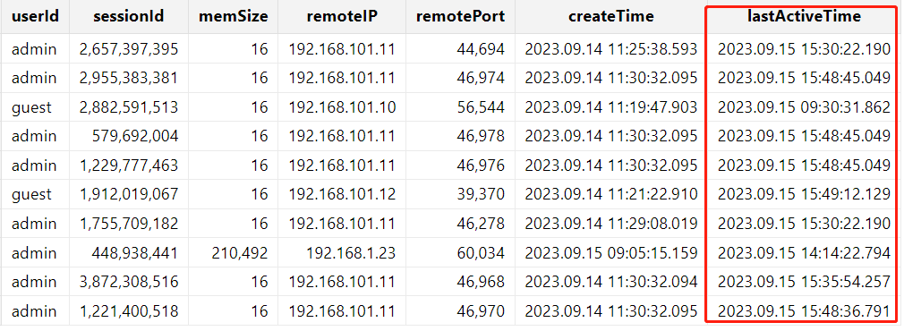

# 无法连接服务器

无法连接至 DolphinDB 最常见的原因是网络故障、连接数不足。

## 1. 网络故障

检查与服务器端口连接性，并检查网络带宽等资源。

1. 检测端口连通性

   在故障环境使用 telnet，ssh，nc 等工具检测端口连通性。以 telnet 为例，确保系统上已安装并启用telnet 工具，打开命令提示符（Windows 系统）或终端（Linux 系统）后输入以下命令 ：

   ```
   telnet ip port
   ```

   将 `ip` 和 `port` 替换为实际的服务器 IP 地址和端口号。例如：`telnet 192.168.1.206 8911`。若跳转到新的 telnet 窗口（Windows）系统或显示 `Connected to 192.168.1.206 8911` (Linux 系统），则表示端口连通性良好。
2. 检测包传输速率

   使用 `ping` 命令检测与服务器的包传输速率。Windows 用户在命令提示符输入以下命令 ：

   ```
   ping -l 16534 ip
   ```

   Linux 用户在终端输入以下命令：

   ```
   ping -s 16534 ip
   ```

   将 `ip` 替换为实际的服务器 IP 地址。执行 `ping` 命令后，会显示相关信息。如：

   ```
   # ping -s 16534 192.168.1.206
   PING 192.168.1.206 (192.168.1.206) 16534(16562) bytes of data.
   16542 bytes from 192.168.1.206: icmp_seq=1 ttl=61 time=18.9 ms
   16542 bytes from 192.168.1.206: icmp_seq=2 ttl=61 time=15.8 ms
   16542 bytes from 192.168.1.206: icmp_seq=3 ttl=61 time=16.0 ms
   ```

若端口连通且网络速率良好，则网络方面应无问题，需要进一步排查 DolphinDB 的相关故障。

## 2. 连接数不足

当系统的连接数超过 *maxConnections* （默认为512）时，将无法创建新的连接。若出现如下错误信息：

"Maximum connections reached. Close unused connections or increase maxConnections limit. RefId:S00006"

说明连接已经到达上限，需要检查程序是否存在连接泄露的情况。通过 `getSessionMemoryStat()` 可以获取当前节点所有连接会话状态，每个会话会耗用一个连接。

```
select * from getSessionMemoryStat() where sessionId is not null
```



为解决连接数不足的问题，可以采取如下应急处理手段：

1. 在线修改节点最大连接数 maxConnections

通过 `setMaxConnections` 函数临时增加连接数 。

```
```
pnodeRun(setMaxConnections{5000})
```
```

1. 关闭非活跃连接
   根据 *lastActiveTime* 判断是否是当前活跃 session，并通过 `closeSessions` 函数清理空闲会话以回收连接。为了更便捷地执行这一操作，可以借助 [ops](https://docs.dolphindb.cn/zh/modules/ops/ops.html) 模块：

   ```
   use ops
   closeInactiveSessions(hours=12)
   ```

## 3. 其他情况

除了网络故障和连接数不足，系统卡死也可能导致无法连接服务器。详情请参阅[系统卡死](omc_server_hang_guidelines.html)。

参考上述步骤仍无法解决问题的，请重启无法连接的 DolphinDB 节点。

