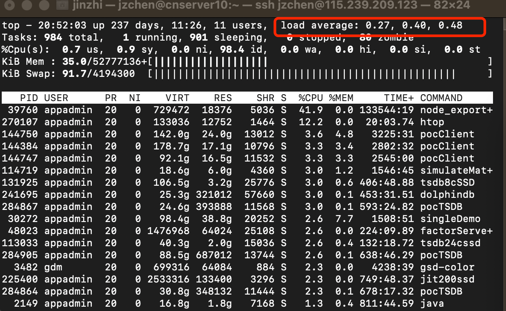
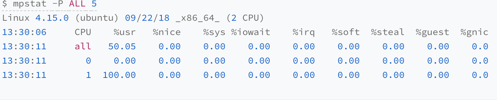
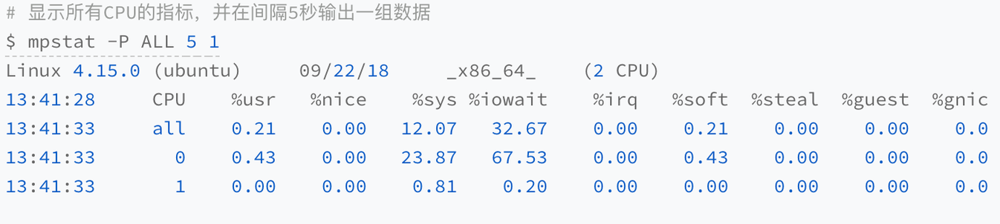
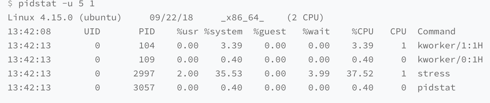
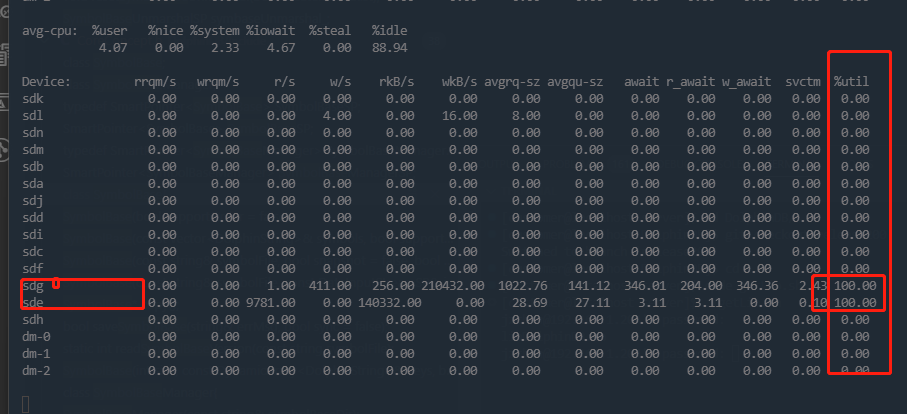
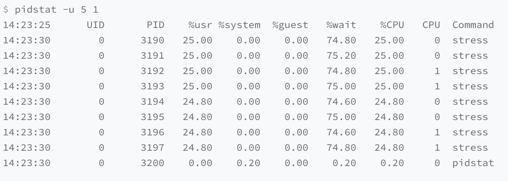

# 查询/写入慢

查询或者写入慢的原因多样，可以按照配置情况，查询/写入情况，库表设计，系统负载这几个角度去定位。

## 1. 配置情况

配置方面，主要是需要注意各个配合参数是否合理，如果参数配置不合理，可能也会导致查询/写入慢。一些会影响性能方面的参数如下：

| **参数** | **含义** | **配置注意点** |
| --- | --- | --- |
| diskIOConcurrencyLevel | 读写磁盘数据的线程数，默认为1 | 若 volumes 配置了 SSD 硬盘，建议设置 diskIOConcurrencyLevel = 0；若 volumes 全部配置为 HDD 硬盘，建议 diskIOConcurrencyLevel 设置为同 HDD 硬盘个数相同的值 |
| workerNum | 常规作业的工作线程的数量 | 一般设置为 license 的核数。控制节点的 workerNum 不能太小，否则频繁的查询会导致其为瓶颈 |
| TSDBAsyncSortingWorkerNum | 默认值为1，用于指定 TSDB cache engine 异步排序的工作线程数 | TSDB 写入 cache engine 中的数据将会根据 sortColumns 排序。数据写入 cache engine 和排序任务可以同步或异步进行，异步可以提升写入性能 **注意**：异步排序可以提高数据写入性能，但会降低查询性能，因为查询需要等待相关 chunk 的异步排序线程结束才能进行。如果是频繁大量数据写入，可以适当增加这个配置数，提升写入性能 |
| redoLogDir/TSDBRedoLogDir | OLAP 和 TSDB 引擎的 Redo 的存放目录 | 建议配置在 SSD 上，提升写入性能 |

## 2. 查询/写入情况

### 2.1 写入情况

在 DolphinDB 中，写入一批数据（比如5000条一批，一批数据量过大的情况除外）和写入一条数据，总时间开销接近，主要的耗时在于网络。因此，我们推荐按批来进行数据的写入，去提升写入性能。

DolphinDB 的 API 提供了批量写入的方式。通过 API 逐个写入数据效率较低，可以使用 API 提供的 MultithreadedTableWriter 的接口，在客户端实现批量数据写入。

### 2.2 查询情况

查询慢，可以先通过 DolphinDB 提供的函数 **getQueryStatus** 命令查看下当前节点发起且正在执行的查询任务状态。该函数会返回一个表，每一行代表一个查询，包含如下几列：

* id：表示到该查询任务为止，系统已执行的查询任务总数。
* sessionId：任务发起会话的 id。请注意，无法获取通过 submitJob 提交的查询任务的 sessionId。
* userId：任务发起会话的用户名。
* query：原始查询语句中主要的查询信息。
* startTime：查询任务开始的时间戳。
* elapsedTimeInMs：查询任务已经经过的时间，单位为毫秒。
* memoryUsage：查询过程中变量和结果所占用的内存空间，单位为字节。
* totalTaskCount：查询子任务总数。
* completedTaskCount：已完成的查询子任务数。
* percentComplete：已完成的查询子任务占比。

其中，主要需要注意 elapsedTimeInMs, totalTaskCount, completedTask, percentComplete。

在查询时，DolphinDB 会按照分区去生成查询子任务，一个查询涉及多少个分区，totalTaskCount就是多少。可以结合查询语句业务，判断下是否可能是一次查询了过多的分区，导致查询比较慢。或者系统中并发查询的数量过多。

一次查询涉及的分区数多的情况下，可以结合业务需要进行判断，是否可能可以通过where子句，去缩小分区数量，提升查询性能。同时，也可以通过 select/exec 关键字后添加 [HINT\_EXPLAIN] 来显示 SQL 语句的执行过程，便于 SQL 查询中实时监测查询的速度和执行的顺序。形式如下：

```
select [HINT_EXPLAIN] * from tb where id > 20
```

**注意**：添加 [HINT\_EXPLAIN] 后的查询语句仅返回一个 JSON 字符串显示了 SQL 的执行过程，不返回查询结果；对于 UPDATE 或者 DELETE 语句，目前还不支持查看执行计划。

## 3. 库表设计

库表设计可以参考[建库建表](../db_distr_comp/db_oper/create_db_tb.md)，需要注意分区的大小，TSDB 引擎的 sortKey 等的设置是否合理。如果不合理，也会导致查询/写入慢的情况。

为了更全面地掌握设计细节，避免常见陷阱，建议参阅[建库建表最容易忽略的十个细节](../tutorials/database_and_table_creation_details.md)。

## 4. 系统负载

系统负载方面，我们主要需要确定是否存在硬件的性能瓶颈。分析系统性能问题时，采取以下方法：

1. 查看系统负载
2. 判断系统负载合理性

从而判断出如下三大类的性能问题:

1. CPU 密集型
2. IO 密集型
3. 大量CPU 等待

### 4.1 查看系统负载

查看系统负载的 shell 命令：

```
top
```

或者

```
uptime
```

以上两个命令的返回内容里，都有系统1分钟,5分钟,15分钟的平均负载(Load Average)。以 top 为例，返回如下图中红框所示：



其中，从左到右分别代表1分钟、5分钟、15分钟的平均负载。可以通过这3个值观察系统平均负载的变化趋势。

简单来说，平均负载是指单位时间内，系统处于可运行状态和不可中断状态的平均进程数，也就是平均活跃进程数，它和 CPU 使用率并没有直接关系。

* 可运行状态的进程，指正在使用 CPU 或者正在等待 CPU 的进程，也就是通过 ps 命令看到的，处于 R 状态（Running 或 Runnable）的进程。
* 不可中断状态的进程，指正处于内核态关键流程中不可打断的进程。最常见的是等待硬件设备的 I/O 响应，也就是通过 ps 命令中看到的 D 状态（Uninterruptible Sleep，也称为 Disk Sleep）的进程。

**注**：

1. 不可中断状态实际上是系统对进程和硬件设备的一种保护机制。例如，当一个进程向磁盘读写数据时，为了保证数据的一致性，在得到磁盘回复前，它不能被其他进程或者中断打断，这个时候的进程就处于不可中断状态。如果此时的进程被打断，就容易出现磁盘数据与进程数据不一致的问题。
2. 处于不可中断状态时，用户观察到的系统活动特征近似于“卡住”。

### 4.2 判断系统负载合理性

查询了系统平均负载后，需要判断是否合理。平均负载最理想的情况是等于 CPU 个数。可以通过如下shell命令查询：

```
grep 'model name' /proc/cpuinfo | wc -l
```

或者

```
lscpu |grep 'CPU(s)'
```

常规的排查策略：

* 平均负载高于 CPU 数量 70%，分析排查负载高的问题了。负载过高可能导致进程响应变慢，进而影响服务的正常功能。

回到平均负载的含义上来，平均负载是指单位时间内，处于可运行状态和不可中断状态的进程数。所以，它不仅包括了正在使用 CPU 的进程，还包括等待 CPU 和等待 I/O 的进程。

而 CPU 使用率，是单位时间内 CPU 繁忙情况的统计，跟平均负载并不一定完全对应。比如：

* CPU 密集型进程，使用大量 CPU 会导致平均负载升高，此时这两者是一致的；
* I/O 密集型进程，等待 I/O 也会导致平均负载升高，但 CPU 使用率不一定很高；
* 大量等待 CPU 的进程调度也会导致平均负载升高，此时的 CPU 使用率也会比较高。

在分析 CPU 密集型,I/O 密集型,大量等待 CPU 的进程调度,也需要结合其他的 shell 命令

当然,如何确定是哪种类型的问题.可以通过 mpstat 命令

下面列举一下三种类型的 mpstat 命令的输出:

#### 4.2.1 CPU 密集型



上图所示，一个 CPU 的使用率为 100%，但它的 iowait 只有 0。这说明，平均负载的升高正是由于 CPU 使用率为 100%。

#### 4.2.2 IO 密集型

运行 mpstat 查看 CPU 使用率的变化情况：



如图所示，1 分钟的平均负载逐渐增加到 1.06，其中一个 CPU 的系统 CPU 使用率升至 23.87，而 iowait 高达 67.53%。

这说明，平均负载的升高是由于 iowait 的升高。

之后,可以通过 pidstat 定位对应进程



也可以用如下 shell 命令查看磁盘信息：

```
iostat -x 1
```



特别注意最后一列利用率， 如果100或者接近，说明可能达到了磁盘的瓶颈。

此外，ostat 显示的磁盘，是否是 DolphinDB 所在的磁盘，这点，需要结合 df -h 的结果和 DolphinDB 的配置文件来确认。

#### 4.2.3 多进程竞争资源



可以看出，8 个进程在争抢 2 个 CPU，每个进程等待 CPU 的时间（也就是代码块中的 %wait 列）高达 75%。这些超出 CPU 计算能力的进程，最终导致 CPU 过载。

