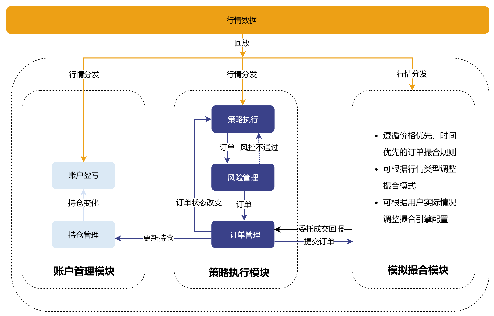

# Backtest

为精准测试和验证策略在实盘交易中的效果，DolphinDB
基于分布式存储和计算、多范式的编程语言和模拟撮合引擎插件，推出了事件型回测引擎，该引擎以插件的形式提供服务，其逻辑架构如图 1-1 所示。

图 1. 图 1-1 回测引擎架构图



回测引擎的主要工作流程如下：

* 接收按时间顺序回放的行情数据流，内部将数据分发至模拟撮合引擎和对应的行情回调函数。
* 行情回调函数处理策略逻辑并提交委托订单。
* 回测引擎根据策略生成的委托订单执行风控管理。
* 通过风控审核的订单会发送至模拟撮合引擎进行撮合处理。
* 回测引擎根据成交情况实时更新持仓和资金管理。
* 回测结束后返回策略的收益、成交明细等结果。

用户在使用回测引擎时，需依次完成以下步骤：

1. 在策略初始化中定义指标，并在各回调函数中编写自定义策略逻辑。
2. 配置策略的行情源、资金情况、订单延时和成交比例等参数。
3. 创建回测引擎。
4. 回放数据源并执行策略回测。
5. 获取回测结果，包括收益分析、成交明细等。

回测引擎插件支持多资产策略回测，涵盖股票、期权、期货、数字货币以及银行间债券。针对不同的资产类型和行情特征，回测引擎在配置、行情数据结构、回调函数输入参数及接口设计上均有所不同。本页面将重点介绍引擎接口，有关引擎配置、行情数据结构、策略函数说明、示例等方面内容，请至对应资产页面查看详细说明：股票、期权、期货、数字货币、银行间债券。

## 安装插件

### 版本要求

DolphinDB Server 2.00.14 和 3.00.2 及更高版本，支持 X86-64 的 Linux 和 Windows。

### 安装步骤

1. 在 DolphinDB 客户端中使用 `listRemotePlugins` 命令查看插件仓库中的插件信息。

   注意：仅展示当前操作系统和 server 版本支持的插件。若无预期插件，可在 [DolphinDB 用户社区](https://ask.dolphindb.cn/)进行反馈。

   ```
   login("admin", "123456")
   listRemotePlugins()
   ```
2. 使用 `installPlugin` 命令完成插件安装。

   ```
   installPlugin("Backtest")
   ```
3. 使用 `loadPlugin` 命令加载插件。

   ```
   loadPlugin("Backtest")
   ```

### 插件依赖

回测引擎插件内部依赖模拟撮合引擎插件，因此加载回测引擎之前需要先加载模拟撮合引擎，该插件同样可以通过插件市场安装。

1. 使用 `installPlugin` 命令完成模拟撮合引擎插件安装。

   ```
   installPlugin("MatchingEngineSimulator")
   ```
2. 使用 `loadPlugin` 命令加载模拟撮合引擎插件。

   ```
   loadPlugin("MatchingEngineSimulator")
   ```

## 引擎配置说明

创建回测引擎时，需要设置引擎的配置项（接口 `createBacktester` 的参数 *config* 或接口
`createBacktestEngine` 的参数
*userConfig*）。根据回测的资产和及所使用的行情类型的不同，配置项也有所区别。具体请参考对应资产页面。

| **key** | **说明** | **备注** |
| --- | --- | --- |
| "startDate" | 开始日期 | 必须配置，DATE 类型 例如 “2020.01.01” |
| "endDate" | 结束日期 | 必须配置，DATE 类型 例如 “2020.01.01” |
| "strategyGroup" | 策略类型 | 必须配置，SYMBOL 类型 “stock”：股票  “futures”：期货  ”option“：期权  “cryptocurrency”：数字货币  ”securityCreditAccount“：融资融券  "CFETSBond"：银行间债券  "XSHGBond"：上交所债券  “universal“: 通用品种 |
| "cash" | 初始资金 | 必须配置，DOUBLE 类型 |
| "commission" | 手续费 | 股票回测时，必须配置，DOUBLE 类型 其他品种回测时可在基本信息表中配置。 |
| "dataType" | 行情类型 | 必须配置，INT 类型，可选值为： 0：股票逐笔或股票逐笔+快照  1：快照  2：快照+逐笔成交明细  3：分钟频率  4：日频  5：股票逐笔（宽表）  6：股票逐笔+快照（宽表） |
| “frequency” | 逐笔数据以指定频率合成快照 或快照数据以指定频率合成 bar | INT 类型，默认为 0  * 当 dataType=0（逐笔）或 dataType = 5 时必须配置frequency>0，系统将逐笔数据合成   *frequency* 频率的快照，并以此触发onSnapshot 回调函数 * 当 dataType=0（逐笔+快照）、dataType=1 或 2 时，若配置   frequency>0，系统将快照数据合成 *frequency* 频率的 bar   数据，并以此触发onBar 回调函数 |
| "msgAsTable" | 行情的数据格式 | BOOL 类型，默认 false false：字典  true：表 （只能通过接口createBacktestEngine 创建引擎） |
| “matchingMode“ | 订单撮合模式 | INT 类型，分钟频和日频行情默认为 1 撮合模式。可选值为： 1：   * 日频：以收盘价撮合订单 * 分钟频：与订单时间之后的第一条可撮合行情进行撮合   2：   * 日频：以开盘价撮合订单 * 分钟频：行情时间等于订单时间时以当前行情的收盘价撮合订单，后续未完成订单撮合订单同 1   3：以委托价格成交  当 dataType=1 或 2 时，该参数设置为 1 或 2 时无效，默认使用模拟撮合引擎撮合订单。当matchingMode设置为3，策略的委托订单按照委托价格成交 |
| “benchmark” | 基准标的 | STRING 或 SYMBOL 类型 |
| "latency" | 订单延时 | INT 类型，单位为毫秒，用来模拟用户订单从发出到开始进行撮合的时延 |
| “enableIndicatorOptimize” | 是否开启指标优化 | BOOL 类型，默认为 false true：开启  false：不开启 |
| “isBacktestMode“ | 是否为回测模式 | BOOL 类型，默认为 true true：回测模式  false：模拟交易模式 |
| ”dataRetentionWindow“ | 开始指标优化时数据保留的窗口 | STRING 类型或 INT 类型。 当 enableIndicatorOptimize = true 时，该参数生效。  * isBacktestMode = true 时， 可选值为：    + “None”：默认值，不保留数据   + “ALL“：全部数据保留   + “20d”：支持按天保留数据，即交易日天数，如 “20d” 代表 20 个交易日   + 20：支持按条数保留数据，如 20 代表每个 symbol 保留最新的 20 条 * isBacktestMode = false 时，无需设置 |
| ”addTimeColumnInIndicator“ | 策略指标表是否包含时间列 | BOOL 类型，默认为 false true：增加  false：不增加 |
| "context" | 策略逻辑上下文，定义策略全局变量 | DICT 类型，策略全局变量构成的字典，如：  ``` context=dict(STRING,ANY) context["buySignalRSI"]=70.6 userConfig["context"]=context ``` |
| ”callbackForSnapshot “ | 快照行情触发回调模式 | INT 类型，默认为 0 ，可选值为： 0：表示只触发 onSnapshot  1 ：表示既触发 onSnpshot 又触发 onBar  2 ：表示只触发 onBar  当 frequency >0 时，必须触发 onBar 回调函数，即 callbackForSnapshot =1 或者 2 |
| “orderBookMatchingRatio” | 与行情订单薄的成交百分比 | DOUBLE 类型，默认 1.0，取值 0~1.0 之间 |
| “matchingRatio” | 区间撮合比例 | DOUBLE 类型，默认 1.0，取值 0~1.0 之间。默认和成交百分比 orderBookMatchingRatio 相等 |
| "tax" | 印花税 | 仅支持股票、融资融券，DOUBLE 类型 |
| “stockDividend” | 分红除权基本信息表 | 仅支持股票、融资融券，TABLE 类型，字段说明见页面最后一节 |
| “enableSubscriptionToTickQuotes” | 是否订阅逐笔行情 | 仅支持股票。BOOL 类型，默认为 false。当 dataType = 0 或 5，并且使用行情回调函数 onTick 时，必须配置为 true true：订阅  false：不订阅 |
| “outputQueuePosition” | 是否需要获取订单在行情中的位置 如果输出该信息，则在成交明细和未成交订单接口中会增加以下 5 个指标：   * 优于委托价格的行情未成交委托单总量 * 次于委托价格的行情未成交委托单总量 * 等于委托价格的行情未成交委托单总量 * 等于委托价格且早于用户订单时间的行情未成交委托单总量 * 优于委托价格的行情档位数 | 仅支持股票。INT 类型，可选值为： 0：默认值，表示不输出  1：表示订单撮合成交计算上述指标的时候，把最新的一条行情纳入订单薄  2：表示订单撮合成交计算上述指标的时候，把最新的一条行情不纳入订单薄，即统计的是撮合计算前的位置信息 |
| “prevClosePrice” | 前收盘价数据表 | 仅支持股票。TABLE 类型，为以下三列的表： [symbol, tradeDate, prevClose]  在深交所的逐笔行情时，创业板股票的前收盘价必须设置，否则订单撮合结果可能不符合预期 |
| “maintenanceMargin” | 维保比例 | 仅支持期权期货、融资融券。期权期货为 DOUBLE 类型，默认 1.0，取值0~1.0 之间；融资融券为 FLOAT 数组类型，为递减数组，[警戒线、追保线、最低线]。 |
| ”enableAlgoOrder” | 是否开启算法订单 | 仅支持期货。BOOL 类型，默认 false true：开启  false：不开启 |
| ”futuresType“ | 期货品种类型，如股指期货，商品期货等 | 仅支持期货。STRING 或 SYMBOL 类型 |
| “lineOfCredit” | 授信额度 | 仅支持融资融券，DOUBLE 类型，最大可融额度(融资+融券) |
| “marginTradingInterestRate” | 融资利率 | 仅支持融资融券，FLOAT 类型，如 0.15 |
| “secuLendingInterestRate” | 融券利率 | 仅支持融资融券，FLOAT 类型，可设置与融资利率不同的值，如 0.15 |
| “longConcentration” | 净多头集中度 集中度计算公式为：  stock\_i 持仓市值/总持仓市值 | 仅支持融资融券，FLOAT 数组类型，控制多头买入金额，如 [1.0, 0.85, 0.6], 三个元素分别控制三条警戒线。注意，最后一个元素是最高线，第一个元素是底线。 |
| “shortConcentration“ | 净空头负债集中度  集中度计算公式为：  stock\_i 持仓市值/总持仓市值 | 仅支持融资融券，FLOAT 数组类型，控制融券卖出金额，如 [1.0, 0.85, 0.6]。集中度越小，说明风险被组合降低。 |
| “outputOrderinfo” | 是否输出风控日志（在订单交易明细中） | 仅支持融资融券，BOOL 类型 true：输出  false：不输出 |
| “repayWithoutMarginBuy“ | 控制是否可以用融资买入的券抵消融券卖出的券 | 仅支持融资融券，BOOL 类型 true：可以抵消  false：不允许抵消 |
| “setLastDayPosition” | 设置底仓 | 仅支持融资融券，TABLE 类型，对于每一支选池内的股票进行底仓设置 |
| “outputSeqNum” | 订单交易明细表是否输出序号列 | BOOL 类型，默认值为 false，当 matchingMode=3 时不支持设置此参数。 |

股票分红除权基本信息表 “stockDividend” 字段说明如下：

| **字段** | **名称** |
| --- | --- |
| symbol | 股票代码 |
| endDate | 分红年度 |
| annDate | 预案公告日 |
| recordDate | 股权登记日 |
| exDate | 除权除息日 |
| payDate | 派息日 |
| divListDate | 红股上市日 |
| bonusRatio | 每股送股比例 |
| capitalConversion | 每股转增比例 |
| afterTaxCashDiv | 每股分红（税后） |
| allotPrice | 配股价格 |
| allotRatio | 每股配股比例 |

引擎配置中底仓表 “setLastDayPosition” 的具体字段说明如下：

| **字段** | **类型** | **备注** |
| --- | --- | --- |
| symbol | SYMBOL | 标的代码 |
| marginSecuPosition | LONG | 担保品买入持仓量 |
| marginSecuAvgPrice | DOUBLE | 买成交均价 |
| marginPosition | LONG | 融资买入持仓量 |
| marginBuyValue | DOUBLE | 融资买入金额 |
| secuLendingPosition | LONG | 融券卖出持仓量 |
| secuLendingSellValue | DOUBLE | 融券卖出金额 |
| closePrice | DOUBLE | 收盘价 |
| conversionRatio | DOUBLE | 保证金折算率 |
| tradingMargin | DOUBLE | 融资保证金比例 |
| lendingMargin | DOUBLE | 融券保证金比例 |

## 行情数据结构说明

当行情数据作为参数 *msg*，通过接口 `appendQuotationMsg`
向引擎中插入数据时，根据回测的资产和及所使用的行情类型的不同，行情数据结构也有所区别。具体请参考对应资产页面。

## 策略回调函数说明

回测引擎采用事件驱动机制，提供多种事件函数，包括策略初始化、每日盘前与盘后回调、逐笔、快照和 K
线行情的回调，以及委托和成交回报函数。用户可以在策略初始化中定义指标，并在其他相应的回调函数中编写自定义策略。

回测引擎提供的事件函数如下表所示：

| **事件函数** | **说明** |
| --- | --- |
| ``` def initialize(mutable context){} ``` | 策略初始化函数，只触发一次。 参数 *context* 为逻辑上下文。可以在该函数中通过 context 参数初始化一些全局变量，或者进行策略订阅指标计算。 |
| ``` def beforeTrading(mutable context){} ``` | 盘前回调函数，每日盘前触发一次。可以在该函数中执行当日启动前的准备工作，如订阅行情等。 |
| ``` def onTick(mutable context, msg,indicator){} ``` | 逐笔行情回调函数，逐笔委托和逐笔成交行情更新时触发。 |
| ``` def onSnapshot(mutable context, msg,indicator){} ``` | 快照行情回调函数。 |
| ``` def onBar(mutable context, msg,indicator){} ``` | 中低频行情回调函数。 |
| ``` def onTransaction(mutable context,msg,indicator){} ``` | 逐笔成交明细回调函数，该回调函数仅支持上交所债券。 |
| ``` def onOrder(mutable context,orders){} ``` | 委托回报回调函数，每个订单状态发生变化时触发。 |
| ``` def onTrade(mutable context,trades){} ``` | 成交回报回调函数，发生成交时触发。 |
| ``` def afterTrading(mutable context){} ``` | 策略每日盘后的回调函数，每日盘后触发一次。可以在该函数统计当日的成交、持仓等信息。 注： 数字货币无需定义此函数。 |
| ``` def finalize(mutable context){} ``` | 策略结束之前回调一次该函数。 |
| ``` def onTimer(mutable context){} ``` | 定时回调函数，在固定的时间或日期触发。 |

**context** 一个字典，用于设置策略的所有自定义变量。此外，引擎内部维护了 4 个变量：

* context.tradeTime 获取行情的最新时间
* context.tradeDate 获取当前日期
* context.BarTime 快照降频为低频行情时的当前Bar 时间戳
* context.engine 获取回测引擎实例

**indicator** 表示策略中订阅的指标。

**msg** 表示行情数据。

**orders** 一个字典，表示订单信息。

**trades** 一个字典，表示成交订单信息。

注：

*msg*，*orders*，*trades*
根据回测的资产和及所使用的行情类型的不同，键值、字段也有所区别，具体请参考对应资产页面。

回测引擎的策略事件函数提供的策略全局变量 context，行情消息 msg 和行情指标 indicator。

* 策略全局变量 context 的数据类型为字典，若要使用 JIT 优化，context 中用户定义的全局变量不支持表，其他所有 DolphinDB
  的数据类型均支持。
* 回测引擎的策略事件函数行情消息 msg 为字典。高频策略回测行情事件回调函数 `onSnapShot` 和
  `onTick` 中的 msg 为字典，代表一条消息，通过 msg.lastPrice 和 msg.price
  可以获取最新价。onBar 行情回调函数中的 msg 也为字典，但是一个嵌套字典，表示多条消息。第一层的字典的 key 是标的代码（sym)，value
  值为该标的的行情，可以通过 msg.sym.close 和 msg.sym.low 获取最新收盘价和最新低价。
* 行情指标 indicator 的数据类型同相应行情的 msg 的数据类型一致。

委托回报通知函数 `onOrder`，订单回报参数 orders 为订单信息的字典：

对于除上交所债券以外的其他资产，每个订单信息包含字段如下：

| **字段** | **类型** | **备注** |
| --- | --- | --- |
| orderId | LONG | 委托订单 id |
| symbol | STRING | 标的代码 |
| symbolSource | STRING | 交易所（仅支持期货） |
| timestamp | TIMESTAMP | 委托时间 |
| qty | LONG | 委托数量 |
| price | DOUBLE | 委托价格 |
| status | INT | 委托状态 4：已报  0：部成  1：已成  2：撤单成功  -1：审批拒绝  -2：撤单拒绝 |
| direction | INT | 委托方向 1 ：买开  2： 卖开  3： 卖平  4 ：买平 |
| tradeQty | LONG | 累计成交数量 |
| tradeValue | DOUBLE | 累计成交金额 |
| label | STRING | 标签，可对该订单增加备注信息 |
| updateTime | TIMESTAMP | 更新时间 |

对于上交所债券，每个订单信息包含字段如下：

| **字段** | **类型** | **含义** |
| --- | --- | --- |
| orderId | LONG | 委托订单 id |
| symbol | STRING | 标的代码 |
| timestamp | TIMESTAMP | 委托时间 |
| bidQty | LONG | 委买数量 |
| bidPrice | DOUBLE | 委买价格 |
| bidTotalVolume | LONG | 委买成交数量 |
| askQty | LONG | 委卖数量 |
| askPrice | DOUBLE | 委卖价格 |
| askTotalVolume | LONG | 委卖成交数量 |
| status | INT | 委托状态，可选值为： 4：已报  0：部成  1：已成  2：撤单成功  -1：审批拒绝  -2：撤单拒绝  -3：未成交订单 |
| direction | INT | 委托方向，可选值为： 1：买  2：卖  3：双边 |
| bidTradeValue | DOUBLE | 买成交金额 |
| askTradeValue | DOUBLE | 卖成交金额 |
| label | STRING | 标签，可对该订单增加备注信息 |
| updateTime | TIMESTAMP | 更新时间 |

成交回报通知函数 `onTrade`：订单成交参数 trades 为订单信息的字典，每个订单信息包含的具体字段如下：

| **字段** | **类型** | **备注** |
| --- | --- | --- |
| orderId | LONG | 委托订单 id |
| symbol | STRING | 标的代码 |
| tradePrice | DOUBLE | 当次成交价格 |
| tradeQty | LONG | 当次成交数量 |
| tradeValue | DOUBLE | 当次成交金额 |
| totalFee | DOUBLE | 总费用 |
| bidTotalQty | LONG | 买累计成交数量 |
| bidTotalValue | DOUBLE | 买累计成交金额 |
| askTotalQty | LONG | 卖累计成交数量 |
| askTotalValue | DOUBLE | 卖累计成交金额 |
| direction | INT | 委托方向 1 ：买开  2： 卖开  3： 卖平  4 ：买平 |
| tradeTime | TIMESTAMP | 成交时间 |
| orderPrice | DOUBLE | 委托价格 |
| label | STRING | 标签，可对该订单增加备注信息 |

## 回测示例参考

在完成 DolphinDB Script
策略编写后，回测引擎的使用可分为三个主要步骤：引擎配置、引擎创建与数据回放、回测结果获取。由于不同资产和行情类型会影响回测引擎的使用方式，相关细节已在前文中详细说明。本章将通过几个示例展示如何创建回测引擎，包括基于不同频率的行情和品种：快照型股票高频策略回测、逐笔与快照（宽表）结合的股票高频回测、分钟级期货策略回测，以及分钟级数字货币回测。接下来，我们将重点介绍脚本中的关键内容，并提供完整的代码示例与数据引用，供用户参考学习。

### 基于快照行情数据的股票回测示例

下面我们将从引擎配置设置、引擎创建及数据回放、回测结果获取这三个方面详细讲解基于快照行情数据的股票回测示例，本节所用的脚本文件见附件。

#### 引擎配置

首先，我们从示例脚本的配置入手，展示如何设置对应的回测引擎配置选项。

```
userConfig = dict(STRING, ANY)
userConfig["startDate"] = 2023.02.01
userConfig["endDate"] = 2023.02.28
userConfig["strategyGroup"] = "stock"      //策略类型：股票
userConfig["cash"] = 10000000
userConfig["commission"] = 0.0005
userConfig["tax"] = 0.001
userConfig["dataType"] = 1		       //行情为快照
userConfig["msgAsTable"] = false
userConfig["frequency"] = 0
//配置策略全局变量
Context = dict(STRING,ANY)
Context["initPrice"] = dict(SYMBOL,ANY)
Context["feeRatio"] = 0.00002
userConfig["context"]= Context
```

用户需根据回测策略确定策略类型以及行情类型，此处为快照的股票策略类型，即`userConfig["strategyGroup"] =
"stock"`，`userConfig["dataType"] = 1` 。

策略全局变量 context
为自定义的策略变量字典，用户可以根据策略需求定义。除此以外，还有一些策略的基础配置选项，如交易延时、手续费率、初始资金等等，用户可根据实际情况设置
。本示例行情回调函数中行情消息的数据类型为字典。在3.00.2 版本中，用户可以通过接口 createBacktester 创建引擎，并通过参数 JIT
选择是否开启 JIT 优化，这将显著地提升回测的效率。由于本教程不涉及JIT的教学，因此不做详细讲解。

#### 引擎创建及数据回放

接下来，用户可根据自己的逻辑编写回测策略，并创建回测引擎。下面为该类型（快照的股票回测）创建引擎所需的事件函数。

```
def initialize(mutable context){
}
def beforeTrading(mutable context){
}
def onSnapshot(mutable context,msg, indicator){
}
def onOrder(mutable context,orders){
}
def onTrade(mutable context,trades){
}
def afterTrading(mutable context){
}
def finalize(mutable context){
}
```

**创建回测引擎：**

```
callbacks = dict(STRING, ANY)
callbacks["initialize"] = initialize
callbacks["beforeTrading"] = beforeTrading
callbacks["onSnapshot"] = onSnapshot
callbacks["onOrder"] = onOrder
callbacks["onTrade"] = onTrade
callbacks["afterTrading"] = afterTrading
callbacks["finalize"] = finalize
strategyName = "Backtest_test1"
try{Backtest::dropBacktestEngine(strategyName)}catch(ex){print ex}
engine = Backtest::createBacktester(strategyName, userConfig, callbacks, )
timer Backtest::appendQuotationMsg(engine, tb)

//开启JIT优化
strategyName = "Backtest_test2"
try{Backtest::dropBacktestEngine(strategyName)}catch(ex){print ex}
engine2 = Backtest::createBacktester(strategyName, userConfig, callbacks, true, )
timer Backtest::appendQuotationMsg(engine2, tb)
```

通过上述方式创建引擎时，参数 callbacks 为策略回调函数的一个字典，用户可根据策略自定义编写对应的策略回调函数。此处为快照的数据类型，因此只需调用
onSnapshot 行情回调函数即`callbacks["onSnapshot"] = onSnapshot`。

在 3.00.2 版本中，用户可以使用接口`createBacktester`创建回测引擎，并选择是否开启 JIT
优化。另外，'try' 语句是为了删除该名称的回测引擎，从而避免无法创建新的回测引擎。如果没有该引擎，这句命令也不会报错。

**数据回放：**

不同资产或者同资产不同频率的行情字段稍微有些区别，用户必须按照特定数据结构传入回测引擎，否则导致回测运行失败。若现有的行情数据与回测引擎要求的字段名称、字段顺序、数据类型不匹配，用户可在数据导入中按照要求进行数据转换操作再传入即可。下面为快照行情的股票回测的数据结构要求：

```
colName = ["symbol", "symbolSource", "timestamp", "lastPrice", "upLimitPrice",
"downLimitPrice", "bidPrice", "bidQty",
"offerPrice", "offerQty", "signal", "prevClosePrice"]
colType = ["STRING", "STRING", "TIMESTAMP", "DOUBLE", "DOUBLE", "DOUBLE", "LONG",
"LONG", "DOUBLE[]", "LONG[]", "DOUBLE[]", "DOUBLE"]
tb=table(1:0, colName, colType)
//若不符合要求，可参考下面方式进行转换：
//tb = select ContractID as symbol,Market as symbolSource,concatDateTime(Date, BarTime) as timestamp,LastPrice as lastPrice,
//UPLimitPrice as upLimitPrice,downLimitPrice as downLimitPrice, //......
//from t
```

**执行回测：**

通过接口`appendQuotationMsg`
将符合要求的行情数据插入回测引擎中，并执行回测：

```
Backtest::appendQuotationMsg(engine, tb)
```

#### 回测结果获取

最后，用户可根据需要通过引擎接口获取回测结果。

```
tradeDetails = Backtest::getTradeDetails(engine)		  	//成交明细
openOrders = Backtest::getOpenOrders(long(engine))      	//查询当前的未成交（未完成）订单列表
dailyPosition = Backtest::getDailyPosition(long(engine))	//每日持仓
```

上述为部分回测结果的展示，更多接口信息请参考前文。

### 基于逐笔+快照（宽表）数据的股票回测示例

下面我们将从引擎配置、引擎创建及数据回放、回测结果获取这三个方面详细讲解基于逐笔+快照（宽表）行情数据的股票回测示例，本节所用的脚本文件见附件。

#### 引擎配置

首先，我们从示例脚本的配置入手，展示如何设置对应的回测引擎配置选项。

```
userConfig = dict(STRING, ANY)
userConfig["startDate"] = 2023.02.01
userConfig["endDate"] = 2023.02.28
userConfig["strategyGroup"] = "stock"      //策略类型：股票
userConfig["cash"] = 10000000
userConfig["commission"] = 0.0005
userConfig["tax"] = 0.001
userConfig["dataType"] = 6		       //行情为逐笔+快照（宽表）
userConfig["msgAsTable"] = false
userConfig["frequency"] = 0
userConfig["enableSubscriptionToTickQuotes"] = true
userConfig["outputQueuePosition"] = 1
//配置策略全局变量
Context = dict(STRING,ANY)
Context["maxBidAskSpread"] = 0.03
Context["maxVolatility_1m"] = 0.05
userConfig["context"] =  Context
```

用户需根据回测策略确定策略类型以及行情类型，此处为逐笔+快照（宽表）的股票策略类型，即`userConfig["strategyGroup"]
= "stock"`，`userConfig["dataType"] = 6` 。

策略全局变量 context
为自定义的策略变量字典，用户可以根据策略需求定义。除此以外，还有一些策略的基础配置选项，如交易延时、手续费率、初始资金等等，用户可根据实际情况设置。本示例行情回调函数中行情消息的数据类型为字典。在
3.00.2 版本中，用户可以通过接口 createBacktester 创建引擎，并通过参数 JIT 选择是否开启 JIT
优化，这将显著地提升回测的效率。由于本教程不涉及 JIT 的教学，因此不做详细讲解。

#### 引擎创建及数据回放

接下来，用户可根据自己的逻辑编写回测策略，并创建回测引擎。下列为该类型（逐笔+快照) 宽表的股票回测）创建引擎所需的事件函数。

```
def initialize(mutable context){
}
def beforeTrading(mutable context){
}
def onTick(mutable context, msg, indicator){
}
def onSnapshot(mutable context, msg, indicator){
}
def onOrder(mutable context, orders){
}
def onTrade(mutable context, trades){
}
def afterTrading(mutable context){
}
def finalize(mutable context){
}
```

**创建回测引擎：**

```
callbacks = dict(STRING,  ANY)
callbacks["initialize"] = initialize
callbacks["beforeTrading"] = beforeTrading
callbacks["onTick"] = onTick
callbacks["onSnapshot"] = onSnapshot
callbacks["onOrder"] = onOrder
callbacks["onTrade"] = onTrade
callbacks["afterTrading"] = afterTrading
callbacks["finalize"] = finalize
strategyName = "Backtest_test1"
try{Backtest::dropBacktestEngine(strategyName)}catch(ex){print ex}
engine = Backtest::createBacktester(strategyName, userConfig, callbacks, )
timer Backtest::appendQuotationMsg(engine, tb)
//开启JIT优化
strategyName = "Backtest_test2"
try{Backtest::dropBacktestEngine(strategyName)}catch(ex){print ex}
engine2 = Backtest::createBacktester(strategyName, userConfig, callbacks, true, )
timer Backtest::appendQuotationMsg(engine2, tb)
```

通过上述方式创建引擎时，参数 callbacks
为策略回调函数的一个字典，用户可根据策略自定义编写对应的策略回调函数。此处为逐笔+快照（宽表）的数据类型，因此可以调用onSnapshot，即
`callbacks["onSnapshot"]=onSnapshot`。

在 3.00.2 版本中，用户可以使用接口 `createBacktester` 创建回测引擎，并选择是否开启 JIT
优化。另外，'try' 语句是为了删除该名称的回测引擎，从而避免无法创建新的回测引擎。如果没有该引擎，这句命令也不会报错。

**数据回放：**

不同资产或者同资产不同频率的行情字段稍微有些区别，用户必须按照特定数据结构传入回测引擎，否则导致回测运行失败。若现有的行情数据与回测引擎要求的字段名称、字段顺序、数据类型不匹配，用户可在数据导入中按照要求进行数据转换操作再传入即可。下面为逐笔+快照（宽表）行情的股票回测的数据结构要求：

```
colName = ["symbol", "symbolSource", "timestamp", "sourceType", "orderType", "price", "qty", "buyNo",
"sellNo", "direction", "channelNo", "seqNum", "lastPrice", "upLimitPrice",
"downLimitPrice", "totalBidQty", "totalOfferQty", "bidPrice", "bidQty",
"offerPrice", "offerQty", "signal", "prevClosePrice"]
colType=["SYMBOL", "STRING", "TIMESTAMP", "INT", "INT", "DOUBLE", "LONG", "LONG",
"LONG", "INT","INT", "LONG", "DOUBLE", "DOUBLE", "DOUBLE", "LONG",
"LONG", "DOUBLE[]", "LONG[]", "DOUBLE[]", "LONG[]", "DOUBLE[]", "DOUBLE"]
tb = table(1:0, colName, colType)
//若不符合要求，可参考下面方式进行转换：
//tb = select ContractID as symbol,Market as symbolSource,concatDateTime(Date,BarTime) as timestamp,sourceType as sourceType,Price as price,
//Qty as qty,...... from t
```

**执行回测：**

通过接口`appendQuotationMsg`
将符合要求的行情数据插入回测引擎中，并执行回测：

```
timer Backtest::appendQuotationMsg(engine, tb)
```

#### 回测结果获取

最后，用户可根据需要通过引擎接口获取回测结果。

```
tradeDetails = Backtest::getTradeDetails(long(engine))
openOrders = Backtest::getOpenOrders(long(engine))
dailyPosition = Backtest::getDailyPosition(long(engine)) //每日持仓
enableCash  = Backtest::getAvailableCash(long(engine)) //可用资金
```

### 基于分钟频数据的期货回测示例

下面我们将从引擎配置、引擎创建及数据回放、回测结果获取这三个方面详细讲解基于分钟频行情数据的期货回测示例，本节所用的脚本文件见附件。

#### 引擎配置

首先，我们从示例脚本的配置入手，展示如何设置对应的回测引擎配置选项。

```
userConfig = dict(STRING, ANY)
userConfig["startDate"] = 2023.02.01
userConfig["endDate"] = 2023.02.28
userConfig["strategyGroup"] = "futures"        //策略类型：期货
userConfig["cash"] = 10000000
userConfig["commission"] = 0.0005
userConfig["tax"] = 0.001
userConfig["dataType"] = 3		       //行情为分钟频率
userConfig["frequency"] = 0
Context = dict(STRING,ANY)                //策略全局变量context
Context["buySignalRSI"] = 70.
Context["sellSignalRSI"] = 30.
Context["highPrice"] = dict(STRING, ANY)
userConfig["context"] = Context
```

用户需根据回测策略确定策略类型以及行情类型，此处为分钟频的期货策略类型，即`userConfig["strategyGroup"] =
"futures"`，`userConfig["dataType"] = 3` 。策略全局变量
context
为自定义的策略变量字典，用户可以根据策略需求定义。除此以外，还有一些策略的基础配置选项，如交易延时、手续费率、初始资金等等，用户可根据实际情况设置。本示例行情回调函数中行情消息的数据类型为字典。在3.00.2
版本中，用户可以通过接口 createBacktester 创建引擎，并通过参数 JIT 选择是否开启 JIT
优化，这将显著地提升回测的效率。由于本教程不涉及 JIT 的教学，因此不做详细讲解。

#### 引擎创建及数据回放

接下来，用户可根据自己的逻辑编写回测策略，并创建回测引擎。下列为该类型（分钟频的期货回测）创建引擎所需的事件函数。

```
def initialize(mutable context){
}
def beforeTrading(mutable context){
}
def onBar(mutable context, msg, indicator){
}
def onOrder(mutable context, orders){
}
def onTrade(mutable context, trades){
}
def afterTrading(mutable context){
}
def finalize(mutable context){
}
```

**创建回测引擎：**

```
callbacks = dict(STRING, ANY)
callbacks["initialize"] = initialize
callbacks["beforeTrading"] = beforeTrading
callbacks["onBar"] = onBar
callbacks["onOrder"] = onOrder
callbacks["onTrade"] = onTrade
callbacks["afterTrading"] = afterTrading
callbacks["finalize"] = finalize
strategyName = "Backtest_test1"
try{Backtest::dropBacktestEngine(strategyName)}catch(ex){print ex}
engine = Backtest::createBacktester(strategyName, userConfig, callbacks, , securityReference)

//开启JIT优化
strategyName = "Backtest_test2"
try{Backtest::dropBacktestEngine(strategyName)}catch(ex){print ex}
engine2 = Backtest::createBacktester(strategyName, userConfig, callbacks, true, securityReference)
```

通过上述方式创建引擎时，参数 callbacks
为策略回调函数的一个字典，用户可根据策略自定义编写对应的策略回调函数。此处为分钟频的数据类型，因此只需调用 onBar 行情回调函数，即
`callbacks["onBar"]=onBar`。另外，用户可以使用该接口`createBacktester`创建回测引擎，并选择是否开启
JIT 优化。

* 'try' 语句是为了删除该名称的回测引擎，从而避免无法创建新的回测引擎。如果没有该引擎，这句命令也不会报错。
* 期货回测需要设置合约基本信息表 `securityReference`
  ，相关信息见期货页面的"合约基本信息表说明" 一节 。

```
securityReference = table(symbol as symbol, take(100., size(symbol)) as multiplier, take(0.2, size(symbol)) as marginRatio,
				take(0.01, size(symbol)) as tradeUnit, take(0.02,size(symbol)) as priceUnit,
				take(0.03, size(symbol)) as priceTick, take(1.5, size(symbol)) as commission, take(1, size(symbol)) as deliveryCommissionMode)
```

**数据回放：**

不同资产或者同资产不同频率的行情字段稍微有些区别，用户必须按照特定数据结构传入回测引擎，否则导致回测运行失败。若现有的行情数据与回测引擎要求的字段名称、字段顺序、数据类型不匹配，用户可在数据导入中按照要求进行数据转换操作再传入即可。下面为分钟频行情的期货回测的数据结构要求：

```
colName = ["symbol", "symbolSource", "tradeTime", "tradingDay", "open", "low", "high", "close",
"volume", "amount", "upLimitPrice", "downLimitPrice", "signal", "prevClosePrice",
"settlementPrice", "prevSettlementPrice"]
colType = [SYMBOL, SYMBOL, TIMESTAMP, DATE, DOUBLE, DOUBLE, DOUBLE, DOUBLE, LONG, DOUBLE,
DOUBLE, DOUBLE, DOUBLE[], DOUBLE, DOUBLE, DOUBLE]
tb = table(1:0, colName, colType)
//若不符合要求，可参考下面方式进行转换：
//tb = select ContractID as symbol, Market as symbolSource, concatDateTime(Date, BarTime) as tradeTime, TradeDate as tradingDay, OpenPrice as open,
//LowPrice as low, HighPrice as high, ClosePrice as close, long(volume) as volume, Value*1.0 as amount, ULimitPrice as upLimitPrice,
//LLimitPrice as downLimitPrice,...... from t
```

**执行回测：**

通过接口`appendQuotationMsg` 将符合要求的行情数据插入回测引擎中，并执行回测：

```
timer Backtest::appendQuotationMsg(engine, tb)
```

#### 回测结果获取

最后，用户可根据需要通过引擎接口获取回测结果。

```
res1 = select * from Backtest::getTradeDetails(engine) where orderStatus in [0,1]
availCash1 = Backtest::getAvailableCash(engine)  //可用资金
dailyPos1 = Backtest::getDailyPosition(engine)  //每日盘后持仓
```

### 基于分钟频数据的数字货币回测示例

下面我们将从引擎配置、引擎创建及数据回放、回测结果获取这三个方面详细讲解基于分钟频行情数据的数字货币回测示例，本节所用的脚本文件见附件。

#### 引擎配置

首先，我们从示例脚本的配置入手，展示如何设置对应的回测引擎配置选项。

```
userConfig = dict(STRING, ANY)
userConfig["startDate"] = 2023.02.01
userConfig["endDate"] = 2023.02.28
userConfig["strategyGroup"] = "cryptocurrency"  //策略类型：数字货币
userConfig["frequency"] = 0
cash = dict(STRING, DOUBLE)
cash["spot"] = 100000.
cash["futures"] = 100000.
cash["option"] = 100000.
userConfig["cash"] = cash
userConfig["dataType"] = 3         //分钟频
userConfig["matchingMode"] = 1
userConfig["msgAsTable"] = false
//资金费率表
//userConfig["fundingRate"] = select  symbol, settlementTime,decimal128(lastFundingRate,8) as lastFundingRate from CryptoFundingRate
userConfig["fundingRate"] = table(1:0, [`symbol, `settlementTime, `lastFundingRate], [STRING, TIMESTAMP, DECIMAL128(8)])
//配置策略全局变量
Context = dict(STRING, ANY)
Context["initPrice"] = dict(SYMBOL, ANY)
Context["feeRatio"] = 0.00002
Context["N"] = dict(SYMBOL, ANY)
userConfig["context"] = Context
```

用户需根据回测策略确定策略类型以及行情类型，此处为分钟频的数字货币策略类型，即`userConfig["strategyGroup"] =
"cryptocurrency"`，`userConfig["dataType"]=3`。与其他资产策略不同的是，在数字货币的策略中，用户需要分别设置 spot、futures、option
三种的账户初始资金，并存入一个字典`userConfig["cash"]`中；另外还需要设置永续合约资金费率表`userConfig["fundingRate"]`。

策略全局变量 context
为自定义的策略变量字典，用户可以根据策略需求定义。除此以外，还有一些策略的基础配置选项，如交易延时、手续费率、初始资金等等，用户可根据实际情况设置。本示例行情回调函数中行情消息的数据类型为字典。目前数字货币暂时不支持通过接口
createBacktester 创建引擎，仅可使用createBacktestEngine 来创建，并且不支持 JIT 优化。

#### 引擎创建及数据回放

接下来，用户可根据自己的逻辑编写回测策略，并创建回测引擎。下列为该类型（分钟频的数字货币回测）创建引擎所需的事件函数。

```
def initialize(mutable context){
}
def beforeTrading(mutable context){
}
def onBar(mutable context,msg,indicator){
}
def onOrder(mutable context,orders){
}
def onTrade(mutable context,trades){
}
def finalize(mutable context){
}
```

**创建回测引擎：**

```
strategyName = "Backtest_test1"
try{Backtest::dropBacktestEngine(strategyName)}catch(ex){print ex}
engine = Backtest::createBacktestEngine(strategyName, userConfig, securityReference,
initialize, beforeTrading, onBar, , onOrder, onTrade, , finalize)
go
```

通过上述方式创建引擎时，用户可根据策略自定义编写对应的策略回调函数，并在引擎创建时调用。此处为分钟频的数据类型，因此只需调用 onBar
行情回调函数。另外，用户可以使用该接口 createBacktestEngine 创建回测引擎，对于不使用的行情回调函数
onSnapshot，需要用空格留出位置。

* 'try' 语句是为了删除该名称的回测引擎，从而避免无法创建新的回测引擎。如果没有该引擎，这句命令也不会报错。
* 数字货币回测需要设置`securityReference` 。

```
securityReference=select last(contractType)  as contractType from tb group by symbol
update securityReference set optType=1
update securityReference set strikePrice=decimal128(0, 8)
update securityReference set contractSize=decimal128(100.,8) //......
```

**数据回放**

不同资产或者同资产不同频率的行情字段稍微有些区别，用户必须按照特定数据结构传入回测引擎，否则导致回测运行失败。若现有的行情数据与回测引擎要求的字段名称、字段顺序、数据类型不匹配，用户可在数据导入中按照要求进行数据转换操作再传入即可。下面为分钟频行情的数字货币回测的数据结构要求：

```
colName = [`symbol, `symbolSource, `tradeTime, `tradingDay, `open, `low, `high, `close, `volume, `amount, `upLimitPrice,
        `downLimitPrice, `signal, `prevClosePrice, `settlementPrice, `prevSettlementPrice, `contractType]
colType = [SYMBOL, SYMBOL, TIMESTAMP, DATE, DECIMAL128(8), DECIMAL128(8), DECIMAL128(8), DECIMAL128(8), DECIMAL128(8),
DECIMAL128(8), DECIMAL128(8), DECIMAL128(8), DOUBLE[], DECIMAL128(8), DECIMAL128(8), DECIMAL128(8), INT]
tb=table(1:0, colName, colType)
//若不符合要求，可参考下面方式进行转换：
tb = select symbol+"_"+string(contractType) as symbol,symbolSource,tradeTime,tradingDay,decimal128(open,8) as open,decimal128(low,8) as low,
decimal128(high,8) as high,decimal128(close,8) as close,decimal128(volume,8) as volume,decimal128(amount,8) as amount,
decimal128(upLimitPrice,8) as upLimitPrice,decimal128(downLimitPrice,8) as downLimitPrice,signal,decimal128(prevClosePrice,8) as prevClosePrice,
decimal128(settlementPrice,8) as settlementPrice,decimal128(prevSettlementPrice,8) as prevSettlementPrice,contractType from Crypto1minData
```

#### 回测结果获取

最后，用户可根据需要通过引擎接口获取回测结果。

```
tradeDetails_spot = Backtest::getTradeDetails(engine, "spot")     //成交明细
tradeDetails_futeres = Backtest::getTradeDetails(engine, "futures")
Backtest::getDailyPosition(engine, "spot")  //每日持仓
```

上述为部分回测结果的展示，数字货币的部分接口需要指定账户类型（spot、futures、option）。

### 旧版本使用说明

在 3.00.2 之前的版本中，用户只能通过接口 `createBacktestEngine`创建引擎，且无法开启 JIT
优化。在旧版本中，配置项 msgAsTable = false 时行情 msg 与指标 indicator
为字典类型，其数据结构及相关用法与新版并无差异；配置项 msgAsTable = true 时行情 msg 与指标 indicator
为表结构，此时应使用不同的编写方式来获取表中的相关数据，如 msg.a[i] 为 msg 表的第 i 行的 ”a“
字段。若用户想了解这部分的使用方法，可以自行参考下列脚本。

* <data/demoStock_type0_old>
* <data/demoFutures_min_old>

## 附录

* 股票（快照）：<data/demoStock_type1.dos>
* 股票（逐笔+快照宽表）：<data/demoStock_type6.dos>
* 期货（分钟频）：<data/demoFutures_min.dos>
* 数字货币（分钟频）：<data/demoCrypto_min.dos>

