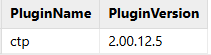
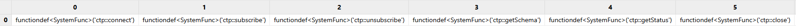
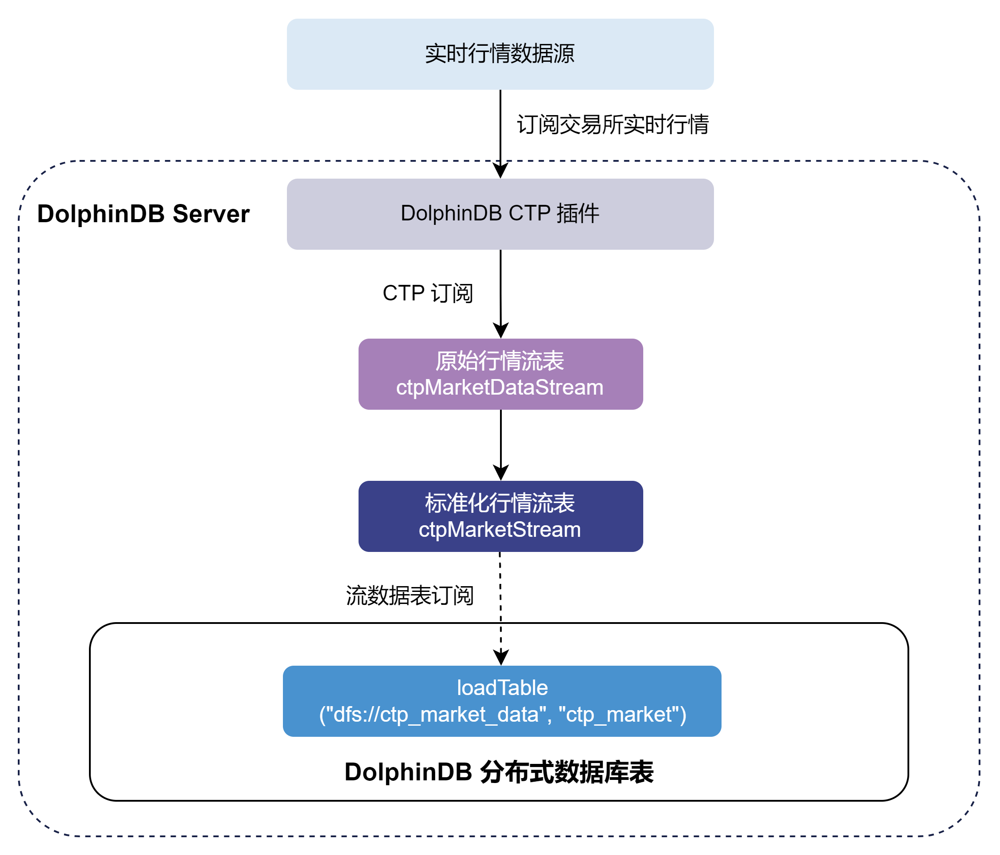
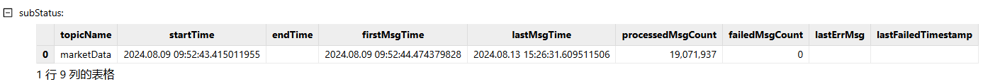
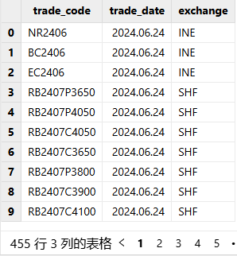

# DolphinDB CTP 行情插件最佳实践指南

综合交易平台（Comprehensive Transaction Platform），简称
CTP，是上海期货信息技术有限公司专门为期货公司开发的一套期货经纪业务管理系统，系统支持国内商品期货和股指期货的交易结算业务，并能自动生成、报送保证金监控文件和反洗钱监控文件。关于
CTP 插件的接口介绍详见 [CTP 文档说明](ctp.html)。注意， CTP
插件基于上海期货交易所官方提供的 CTP C++ API 实现， 推荐的版本号为 v6.6.8 和 v6.6.9。

DolphinDB 提供了对接 CTP 系统的 CTP 行情插件，可以订阅期货市场的实时行情数据和查询商品信息数据。插件基于多种 CTP SDK 进行开发，目前支持 CTP 与
CTPMini 两种。

本文主要介绍如何通过 CTP 插件将实时行情数据写入分布式数据库，以及如何实现节点启动时自动订阅 CTP 实时行情。本文全部代码需要运行在 2.00.11 或者更高版本的
DolphinDB server 以及插件上，目前仅支持 Linux 系统。

## 1. 基本使用介绍

节点启动后，可以使用 GUI, VS Code, Web UI 等 [DolphinDB 客户端](../db_distr_comp/clients.html) 连接相应节点并执行示例代码。

### 1.1 安装插件

安装插件前，需要登录有创建权限的账号。执行如下代码登录默认的管理员账号：

```
login("admin", "123456")
```

执行 `listRemotePlugins` 函数，即可查看当前 DolphinDB 所支持的插件版本信息。

```
listRemotePlugins();          // 所有插件的版本信息
listRemotePlugins("ctp");     // ctp 插件的版本信息
```

返回值为1行2列的表格，分别是插件名及其对应的版本信息，如图1-1：

图 1. 图 1-1 插件名及版本信息



执行 `installPlugin` 函数，则可以下载到与当前 server 版本适配的 CTP
插件文件，插件文件包括插件描述文件及插件的二进制文件：

```
installPlugin("ctp")
```

`installPlugin`
函数若正常返回，则代表下载成功，其返回值为插件描述文件（*PluginCtp.txt*）的安装路径，如：

```
/path_to_dolphindb_server/server/plugins/ctp/PluginCtp.txt
```

`installPlugin` 函数实际上是完成从远程文件服务器拉取插件文件到 DolphinDB server
所在的服务器，因此需要一定的时间，请耐心等待大约一分钟。

### 1.2 加载插件

在脚本中调用插件相关的接口前，需要先加载插件。

在 GUI（或 VS Code、Web UI）等[客户端](../db_distr_comp/clients.html)中执行
`loadPlugin` 函数加载插件。以下示例中直接使用了插件名，也可以使用相对路径
*./plugins/ctp/PluginCtp.txt* 及 1.1
中返回的绝对路径*/path\_to\_dolphindb\_server/server/plugins/ctp/PluginCtp.txt*。

```
loadPlugin("ctp")
```

`loadPlugin` 函数正常返回则插件加载成功，以 VS Code 为例，首次加载成功后返回的部分信息如图1-2，返回值是
CTP 插件提供的所有函数，至此插件安装与加载已全部完成。

图 2. 图 1-2 CTP插件函数预览



此外，需要注意，如果重复执行 `loadPlugin` 加载插件，会抛出模块已经被使用的错误提示，因为节点启动后，只需加载一次
CTP 插件，即可在任意会话中调用该插件提供的函数。错误提示如下：

```
The module [ctp] is already in use.
```

可以通过 [try-catch](../progr/statements/tryCatch.html)
语句捕获这个错误，避免因为插件已加载而中断后续脚本代码的执行：

```
try{ loadPlugin("ctp") } catch(ex){print ex}
```

此外，若节点重启，则需要重新加载插件。

## 2. 通过 CTP 行情插件将实时行情数据写入分布式数据库

本章以订阅中国金融期货交易所、上海期货交易所、广州期货交易所、郑州商品交易所、大连商品交易所及上海国际能源交易中心的期货期权交易数据实时写入 DolphinDB
分布式数据库为例，对 CTP 插件的使用进行说明，大致的流程如图2-1：

图 3. 图 2-1 CTP插件接入实时行情数据



* 通过 CTP 插件订阅实时交易数据写入 DolphinDB *ctpMarketDataStream*持久化流数据表中。流数据表是具备发布订阅功能的内存表。
* 订阅 *ctpMarketDataStream* 后对原始数据进行一些自定义的标准化处理，将标准化交易数据写入 DolphinDB
  *ctpMarketStream* 持久化流数据表中。
* 订阅 *ctpMarketStream* 持久化流数据表写入 DolphinDB 分布式数据库。分布式数据库将数据存储到磁盘上。

注：

CTP 与 CTPMini 的 API 与后台系统并不相互兼容，可能会导致 crash。请避免使用 CTP 版本插件连接 CTPMini 后台，或者使用
CTPMini 版本插件连接 CTP 后台。

下面分步骤介绍关键的 DolphinDB 代码实现，完整脚本见附录。

### 2.1 参数配置

**CTP 连接配置**

用户需要根据实际情况配置 CTP 账户信息。

```
// 配置账户信息
ip = "111.111.111.11"
port = 11111
config = {
    "OutputElapsed": true,
    "ReceivedTime": true,
    "ConcatTime": true
}

// 获取需要订阅的合约范围,路径信息需自行定义
ids = exec distinct trade_code from loadText("./future_basic.csv")
```

**变量说明：**

* *ip* 参数为 STRING 类型标量或向量，表示 CTP 行情服务器的 IP 地址。
* *port 参数*为 INT 类型标量或向量，表示 CTP 行情服务器的端口。如果为向量，其长度应与向量 *ip*
  的长度相等。
* *config* 为一个字典，key 是 STRING 类型标量，value 为 BOOL 标量。
  + 如果 *ConcatTime* 为 true，则会将 UpdateTime 和 UpdateMillisec 字段合并为一个
    tradeTime 字段置于表末尾，类型为 TIME。
  + 如果 *ReceivedTime* 为 true，则会将接收到数据的时间作为一个字段置于表末尾，类型为
    NANOTIMESTAMP。
  + 如果 *OutputElapsed* 为 true，则会将数据进入插件，到插入流表前的时间间隔作为一个字段置于表末尾，类型为
    LONG，单位为纳秒。
* *ids* 参数为 STRING 类型向量，是由合约 ID 组成的数组，表示需要订阅的合约范围。
  + ./future\_basic.csv 是相对于节点主目录的路径，可以通过 [getHomeDir](../funcs/g/getHomeDir.html)
    函数获取节点主目录。

**原始数据流数据表配置**

*marketTBCapacity* 参数是行情数据的流表预分配容量大小，表示流数据表在内存中最多保留多少行。可以根据机器的内存大小进行配置。

```
marketTBCapacity = 2000000
// 原始数据进入的流数据表表名及类型
ctpSubTBName = "ctpMarketDataStream"
ctpSubType = "marketData"
// 原始数据标准化后进入的流数据表表名
stdStreamTBName = "ctpMarketStream"
```

**原始数据入库配置**

```
// 标准化数据入库的数据库名
stdDestDBName = "dfs://ctp_market_data"
// 标准化数据入库的数据表名
stdDestTBName = "ctp_market"
```

### 2.2 清理环境（可选）

为保证本文的示例脚本能够反复执行，特提供了以下流环境清理脚本。

由于相同的流数据表名和订阅无法进行重复定义，因此先取消相关订阅并清除需要用到的流数据表。

```
use ops

// 清理原始数据环境
unsubscribeAll(tbName=ctpSubTBName)
dropStreamTable(ctpSubTBName, force=true)
// 清理标准化数据环境
unsubscribeAll(tbName=stdStreamTBName)
dropStreamTable(stdStreamTBName, force=true)
```

### 2.3 建立 CTP 连接

用户配置 CTP 账户信息，使用 [ctp::connect](ctp.html#ctpconnect) 函数创建一个和 CTP 行情服务器之间的连接，返回一个句柄。

```
conn = ctp::connect(ip, port, config)
```

### 2.4 创建库表

**创建持久化原始行情流数据表**

首先调用 [ctp::getSchema](ctp.html#ctpgetschema)函数获取 CTP 原始行情数据表的表结构，再调用 [enableTableShareAndPersistence](../funcs/e/enableTableShareAndPersistence.html) 函数将流数据表共享，创建持久化流数据表。

```
tb = ctp::getSchema(conn, ctpSubType)
enableTableShareAndPersistence(
  table=streamTable(marketTBCapacity:0, tb.name, tb.typeString),
  tableName=ctpSubTBName,
  cacheSize=marketTBCapacity,
  preCache=0)
```

* 为保证 `enableTableShareAndPersistence`
  函数能够正常执行，需要节点启动之前在配置文件中（单节点：*dolohindb.cfg*，集群：*cluster.cfg*）指定配置参数
  *persistenceDir* ，配置参考[功能配置](../db_distr_comp/cfg/function_configuration.html)。
* 函数中的 `cacheSize` 变量控制了在建表时预分配内存的大小以及流数据表在内存里的最大行数。设置较大的
  `cacheSize` 可以降低出现峰值时延的频率。此处引用了在 2.1
  中配置好的参数*marketTBCapacity*，具体大小可以根据实际的可使用的内存大小决定。具体优化原理可参考 [DolphinDB
  流计算时延统计与性能优化](../tutorials/streaming_timer.html)。

**创建分布式数据库**

为将行情数据存入分布式数据库，需要提前创建存储 CTP
行情数据的分布式库表。以下提供了一个示例，本例将期货和期权数据存储在同一数据库中，为了控制每个分区数据大小，选择对数据库采用按天分区和按期权期货代码 HASH
40 分区。具体分区规则参考自 [基于 DolphinDB 存储金融数据的分区方案最佳实践](../tutorials/best_practices_for_partitioned_storage.html)。

```
if(existsDatabase(stdDestDBName)){
    dropDatabase(stdDestDBName)
}
// 创建数据库
create database "dfs://ctp_market_data"
partitioned by VALUE(2024.01.01..2024.01.31), HASH([SYMBOL, 40])
engine='TSDB'
atomic='CHUNK'

// 构建分区表
// 按时间和代码分区，分区列：trade_date, unified_code
// 分区内排序字段（索引功能）sortColumns的设置： `unified_code`action_date`data_time
create table "dfs://ctp_market_data"."ctp_market"(
    trade_date              DATE
    exchange_id             SYMBOL
    unified_code            SYMBOL
    last_price              DOUBLE
    pre_settlement_price    DOUBLE
    pre_close_price         DOUBLE
    pre_open_price          DOUBLE
    open_price              DOUBLE
    high_price              DOUBLE
    low_price               DOUBLE
    volume                  LONG
    turnover                DOUBLE
    open_interest           DOUBLE
    close_price             DOUBLE
    settlement_price        DOUBLE
    change_rate             DOUBLE
    upper_limit_price       DOUBLE
    lower_limit_price       DOUBLE
    pre_delta               DOUBLE
    current_delta           DOUBLE
    update_time             SECOND
    update_ms               LONG
    bid_price               DOUBLE[]
    bid_volume              LONG[]
    ask_price               DOUBLE[]
    ask_volume              LONG[]
    avgerage_price          DOUBLE
    action_date             DATE
    ticker                  SYMBOL
    exchange_inst_id        SYMBOL
    banding_upper_price     DOUBLE
    banding_lower_price     DOUBLE
    data_time               TIME
)
partitioned by trade_date, unified_code,
sortColumns=[`unified_code,`action_date, `data_time],
keepDuplicates=ALL
```

注：

为方便后续对 CTP 行情数据的使用，本例选择将 5 档量价数据转化为 ArrayVector 类型进行存储，即将 bid\_price ,
bid\_volume, ask\_price, ask\_volume 列分别设置为 DOUBLE[]，LONG[]，DOUBLE[]，LONG[]
类型。用户可根据实际情况进行修改。

**创建持久化标准化行情流数据表**

调用 [schema](../funcs/s/schema.html) 函数获取存储 CTP
行情数据的分布式表的表结构，然后创建结构一致的持久化流数据表。

```
colNames = loadTable(stdDestDBName, stdDestTBName).schema().colDefs.name
colTypes = loadTable(stdDestDBName, stdDestTBName).schema().colDefs.typeString
tb = streamTable(marketTBCapacity:0, colNames, colTypes)
enableTableShareAndPersistence(
      table=tb,
      tableName=stdStreamTBName,
      cacheSize=marketTBCapacity,
      preCache=0)
setStreamTableFilterColumn(objByName(stdStreamTBName), `unified_code)
```

其中，`setStreamTableFilterColumn`
为可选步骤，其作用是给标准化流表设置过滤列。当下游对标准化流表有订阅时，可以指定 *filter* 参数，选择只接收指定标的范围的数据。

### 2.5 订阅流数据表并写入分布式数据库

首先订阅 2.4 节中的持久化原始行情流数据表进行数据预处理，再订阅持久化标准化行情流数据表，将增量数据实时写入分布式数据库。调用 [subscribeTable](../funcs/s/subscribeTable.html)
函数从客户端节点订阅本地或远程服务器的流数据表。

```
// 订阅持久化原始行情流数据表
subscribeTable(
  tableName=ctpSubTBName,
  actionName=ctpSubTBName + "Std",
  offset=-1,
  handler=ctpMarketHandler{, stdStreamTBName},
  msgAsTable=true,
  batchSize=10000,
  throttle=0.001,
  hash=0,
  reconnect=true)
// 订阅持久化标准化行情流数据表
subscribeTable(
  tableName=stdStreamTBName,
  actionName=stdStreamTBName + "ToDfs",
  offset=-1,
  handler=loadTable(stdDestDBName, stdDestTBName),
  msgAsTable=true,
  batchSize=5000,
  throttle=1,
  hash=1,
  reconnect=true)
```

**参数说明：**

* *batchSize* 参数为可选参数，是一个整数。若为正数，表示未处理消息的数量达到 *batchSize*
  时，*handler* 才会处理消息。若未指定或为非正数，每一批次的消息到达之后，*handler*
  就会马上处理。
* *throttle* 参数为可选参数，是一个浮点数，单位为秒，默认值为1。表示继上次 handler 处理消息之后，若
  *batchSize* 条件一直未达到，多久后再次处理消息。如果没有指定
  *batchSize*，*throttle* 即使指定，也不起作用。 因此，达到 *batchSize*设置的条件或者达到 *throttle* 设置的条件，才会向分布式数据库写入一次。
* *handler*
  参数为必选参数，是一元函数、二元函数或数据表，用于处理订阅的数据。以下示例提供了一种标准化原始行情数据的函数，用户可根据实际情况进行修改。

```
// 数据标准化函数
def ctpMarketHandler(msg, stdStreamTBName) {
    ctpProcess = select
                    TradingDay as trade_date,
                    ExchangeID as exchange_id,
                    InstrumentID as unified_code,
                    LastPrice as LastPrice,
                    PreSettlementPrice as PreSettlementPrice,
                    PreClosePrice as PreClosePrice,
                    PreOpenInterest as PreOpenInterest,
                    OpenPrice as OpenPrice,
                    HighestPrice as HighestPrice,
                    LowestPrice as LowestPrice,
                    Volume as Volume,
                    Turnover as Turnover,
                    OpenInterest as OpenInterest,
                    ClosePrice as ClosePrice,
                    SettlementPrice as SettlementPrice,
                    (LastPrice-PreSettlementPrice)\PreSettlementPrice as
change_rate,
                    UpperLimitPrice as UpperLimitPrice,
                    LowerLimitPrice as LowerLimitPrice,
                    PreDelta as PreDelta,
                    CurrDelta as CurrDelta,
                    UpdateTime as UpdateTime,
                    UpdateMillisec as UpdateMillisec,
                    fixedLengthArrayVector(BidPrice1, BidPrice2, BidPrice3,
BidPrice4, BidPrice5) as BidPrice,
                    fixedLengthArrayVector(BidVolume1, BidVolume2, BidVolume3,
BidVolume4, BidVolume5) as BidVolume,
                    fixedLengthArrayVector(AskPrice1, AskPrice2, AskPrice3,
AskPrice4, AskPrice5) as AskPrice,
                    fixedLengthArrayVector(AskVolume1, AskVolume2, AskVolume3,
AskVolume4, AskVolume5) as AskVolume,
                    AveragePrice as AveragePrice,
                    ActionDay as action_date,
                    InstrumentID as InstrumentID,
                    ExchangeInstID as ExchangeInstID,
                    BandingUpperPrice as BandingUpperPrice,
                    BandingLowerPrice as BandingLowerPrice,
                    tradeTime as tradeTime
                from msg
   objByName(stdStreamTBName).append!(ctpProcess)
}
```

注：

在原始行情数据标准化处理过程中，调用 [fixedLengthArrayVector](../funcs/f/fixedLengthArrayVector.html) 函数，将原始行情表中的 `BidPrice1` ，
`BidPrice2` ，`BidPrice3` ，
`BidPrice4` ， `BidPrice5` 五档买方价格，合并为一个
DOUBLE[] 类型的 `bid price` 列进行存储。`bid
volume`、`ask price`、`ask
volume`处理同上。

### 2.6 订阅 CTP 行情并写入流数据表

使用 [ctp::subscribe](ctp.html#ctpsubscribe)
函数订阅指定范围的合约数据，行情数据将进入流数据表。

```
ctp::subscribe(conn, ctpSubType, objByName(ctpSubTBName), ids)
```

### 2.7 查询 CTP 行情接收情况

运行过程中，可以调用 [ctp::getStatus(conn)](ctp.html#ctpgetstatus) 函数查询 CTP 行情的接收情况。

```
ctp::getStatus(conn)
```

返回结果如图2-2：

图 4. 图 2-2 CTP行情接收情况



当在盘中启动时，可以看到 firstMsgTime 与 lastMsgTime 均不为空，lastMsgTime
表示收到最后一条数据的系统时刻。processedMsgCount 表示已处理的数据量。

## 3. 节点启动时自动订阅 CTP 实时行情数据入库

DolphinDB 系统的启动流程如图3-1所示：

图 5. 图 3-1 DolphinDB 启动流程


* 用户启动脚本（*startup.dos*）

  用户启动脚本是通过配置参数 *startup* 后才会执行，单节点模式在
  *dolphindb.cfg* 中配置，集群模式在 *cluster.cfg*
  中配置，可配置绝对路径或相对路径。若配置了相对路径或者没有指定目录，系统会依次搜索本地节点的 home
  目录、工作目录和可执行文件所在目录。

  配置举例如下:

  ```
  startup=/DolphinDB/server/startup.dos
  ```

将上述业务代码添加到 */DolphinDB/server* 目录的 *startup.dos* 文件中，并在对应的配置文件中配置参数
*startup*，即可完成节点启动时的自动订阅部署。

注： CTP 的账户信息需要根据实际环境进行修改。

## 4. 常见问题解答（FAQ）

### 4.1 如何获取合约代码信息？

**方案一：**

通过登录交易端账号，调用 [ctp::queryInstrument()](ctp.html#ctpqueryinstrument--ctpminiqueryinstrument) 或 [ctpMini::queryInstrument()](ctp.html#ctpqueryinstrument--ctpminiqueryinstrument) 函数查询并返回包含所有合约代码的信息表。

```
// 在 ctp 中调用
ids =
  exec instrumentID
  from ctp::queryInstrument(ip, port, userID, password, brokerID, appID, authCode,
  [exchangeID], [waitTimes])
// 在 ctpMini 中调用
ids =
  exec instrumentID
  from ctpMini::queryInstrument(ip, port, userID, password, brokerID, appID,
  authCode, [exchangeID], [waitTimes])
```

注： 本函数需要有效的 CTP 交易端账号，行情端的账号将无法获取结果。目前 CTPMini
中只有此函数。

**方案二：**

若无法通过函数获取到合约代码信息表，可自行构建合约信息表。

* 将需要订阅的合约信息存储成文本文件，通过读取 csv 获得。如 2.1 章节中 CTP 参数配置部分。
* 将需要订阅的合约信息存在分布式表里，通过查询分布式表获得。

用户可根据实际需求创建期货期权合约代码的静态信息表，以下示例基于最基础的数据创建信息表。

```
// 构建合约代码存储的数据库
dbName = "dfs://future_basic"
db = database(dbName, VALUE, 2024.01.01..2024.12.31)
// 构建合约代码存储的分布式表
create table "dfs://future_basic"."future_basic"(
    trade_date DATE
    trade_code SYMBOL
    exchange SYMBOL
)
// 加载合约信息表并存储在创建好的分布式表中
t = loadText("./future_basic.csv")
loadTable("dfs://future_basic", "future_basic").append!(t)
```

静态信息表结构参考如图4-1：

图 6. 图 4-1 静态信息表结构



从合约信息表中获取需要订阅的合约范围，代码示例如下：

```
ids =
  exec trade_code
  from loadTable("dfs://future_basic", "future_basic")
  where trade_date=today()
```

### 4.2 如何对原始 CTP 数据做处理？

**如何处理 `exchange_id` ？**

原始行情数据中的 `ExchangeID` 都是空值。如果需要补充该字段信息，则需要依赖静态信息表。

可以在创建订阅之前，先将需要的静态信息存为一个共享内存表，然后在订阅的回调函数里，通过 `InstrumentID` 和
`trade_code` 字段进行关联，获取静态信息表中的
`exchange`信息。

注意：静态信息表可以用 4.1 中创建的 *future\_basic* 信息表。

```
// 将静态信息存为一个共享内存表
tmp = select trade_code, exchange from loadTable("dfs://future_basic",
"future_basic") where trade_date=today()
share(tmp, "basicInfoTable")
```

**如何处理 `trade_date` 和 `action_date` ？**

* `trade_date`
  ：交易日期，前一天夜盘和当天日盘属于一个完整交易日。即前一天夜盘收到的数据和当天日盘收到的数据，属于同一个`trade_date`
  。
* `action_date`
  ：实际日期，数据生成的真实日期。前一天夜盘数据使用前一天的日期，当天日盘数据使用当天日期。
* 由于不同交易所的原始行情中 `ActionDay` 和
  `TradingDay`的规则不太一样 ，所以需要用户自行对日期进行处理。以 2024.08.08
  晚上21点开始的夜盘交易数据，即交易日期为 2024.08.09，实际日期为 2024.08.08 的数据，不同交易所里的
  `ActionDay` 和 `TradingDay` 的值见表4-1：

图 7. 表4-1 不同交易所日期表

| **交易所** | **交易日期（TradingDay）** | **实际日期（ActionDay）** |
| --- | --- | --- |
| 上期所/上期能源 | 2024.08.09 | 2024.08.08 |
| 大商所 | 2024.08.09 | 2024.08.09 |
| 郑商所 | 2024.08.08 | 2024.08.08 |

* 为了能将同一天的交易数据存在同一个日期的分区里，需要对 `ActionDay` 和
  `TradingDay`进行处理。可以调用 [temporalAdd](../funcs/t/temporalAdd.html)
  函数对日期进行按照交易日的加减计算。`temporalAdd(trade_date, -1, `DCE)`
  就是按照 *DCE*（大商所）的交易日历找 `trade_date` 的前一个交易日期。

**如何处理重复数据?**

一般每天早上6-8点，CTP服务器会重复发送前一天夜盘的行情。为了避免重复写入数据，可以将数据里的 `tradeTime` 和
`receivedTime` 作为过滤条件对数据进行过滤。比如设置两个时间段 20:40~03:00 和
08:40~15:30，只有 `tradeTime` 和
`receivedTime`都在设置的时间段内，才将数据落库。

**注意**：`tradeTime` 和
`receivedTime`为插件新增的处理字段，需要建立连接时，设置 `"ConcatTime":
true` 和 `"ReceivedTime": true`。（参考 2.1 章节）

以下示例为完整版原始行情数据标准化处理过程，用户可根据实际情况进行修改。

```
// 数据标准化函数
def ctpMarketHandler(msg, stdStreamTBName,
                    startTime1=20:40:00.000, endTime1=03:00:00.000,
                    startTime2=08:40:00.000, endTime2=15:30:00.000) {
    tmp = select * from objByName("basicInfoTable")
    // 按照数据时间和接收时间过滤数据
    temp = select * from msg
                where ((tradeTime>=startTime1 or tradeTime<=endTime1) and
                (time(receivedTime)>=startTime1 or time(receivedTime)<=endTime1))
                or ((tradeTime>=startTime2 and tradeTime<=endTime2) and
                (time(receivedTime)>=startTime2 and time(receivedTime)<=endTime2))
    // 关联交易所信息，并处理数据格式
    ctpProcess = select
                    TradingDay as trade_date,
                    tmp.exchange as exchange_id,
                    iif(tmp.exchange!=NULL, temp.InstrumentID + "." + tmp.exchange,
                    temp.InstrumentID) as unified_code,
                    LastPrice as last_price,
                    PreSettlementPrice as pre_settlement_price,
                    PreClosePrice as pre_close_price,
                    PreOpenInterest as pre_open_price,
                    OpenPrice as open_price,
                    HighestPrice as high_price,
                    LowestPrice as low_price,
                    Volume as volume,
                    Turnover as turnover,
                    OpenInterest as open_interest,
                    ClosePrice as close_price,
                    SettlementPrice as settlement_price,
                    (LastPrice-PreSettlementPrice)\PreSettlementPrice as
                    change_rate,
                    UpperLimitPrice as upper_limit_price,
                    LowerLimitPrice as lower_limit_price,
                    PreDelta as pre_delta,
                    CurrDelta as current_delta,
                    UpdateTime as update_time,
                    UpdateMillisec as update_ms,
                    fixedLengthArrayVector(BidPrice1, BidPrice2, BidPrice3,
                    BidPrice4, BidPrice5)as bid_price,
                    fixedLengthArrayVector(BidVolume1, BidVolume2, BidVolume3,
                    BidVolume4, BidVolume5) as bid_volume,
                    fixedLengthArrayVector(AskPrice1, AskPrice2, AskPrice3,
                    AskPrice4, AskPrice5) as ask_price,
                    fixedLengthArrayVector(AskVolume1, AskVolume2, AskVolume3,
                    AskVolume4, AskVolume5) as ask_volume,
                    AveragePrice as avgerage_price,
                    ActionDay as action_date,
                    InstrumentID as ticker,
                    ExchangeInstID as exchange_inst_id,
                    BandingUpperPrice as banding_upper_price,
                    BandingLowerPrice as banding_lower_price,
                    tradeTime as data_time
                from lj(temp, tmp, `InstrumentID, `trade_code)
    // 更新交易日期和实际日期
    update ctpProcess set action_date=temporalAdd(trade_date, -1, `DCE) where
    data_time>=startTime1 and exchange_id="DCE"
    update ctpProcess set action_date=temporalAdd(trade_date, -1, `DCE)+1 where
    data_time<=endTime1 and exchange_id="DCE"
    update ctpProcess set trade_date=temporalAdd(trade_date, 1, `CZCE) where
    data_time>=startTime1 and exchange_id="CZC"
    objByName(stdStreamTBName).append!(ctpProcess)
}
```

### 4.3 如何设置定时任务？

由于每日收盘后 CTP 插件仍会接收一些测试数据，用户可以调用 [scheduleJob](../funcs/s/scheduleJob.html) 函数设定 CTP 连接和关闭的定时任务，参考代码如下：

```
// 由于 scheduleJob 中的 jobFunc 必须是没有参数的函数，所以首先定义关闭 CTP 连接函数
def ctp_dailyclose(){
    ip = "111.111.111.11"
    port = 11111
    config={
        "OutputElapsed": true,
        "ReceivedTime": true,
        "ConcatTime": true
    }
    conn = ctp::connect(ip, port, config)
    try{ ctp::close(conn) }catch(ex){print ex}
}

scheduleJob(jobId=`daily_open, jobDesc="Daily open job",
jobFunc=run{"startup.dos"}, scheduleTime=[08:55m, 20:55m], startDate=2024.08.27,
endDate=2025.08.27, frequency='D')
scheduleJob(jobId=`daily_close, jobDesc="Daily close job", jobFunc=ctp_dailyclose,
scheduleTime=[03:00m, 17:00m], startDate=2024.08.27, endDate=2025.08.27,
frequency='D')
```

注：

因为定时任务初始化时，会用到 CTP 插件里的函数，所以需要在启动时自动加载 CTP 插件。

可以通过配置参数 `preloadModules=plugins::ctp` 让节点启动时自动加载 CTP
插件。对于单节点，在 dolphindb.cfg 中配置 *preloadModules* 参数。对集群，在 controller.cfg 和
cluster.cfg 中配置 *preloadModules* 参数。

## 5. 附录

* 详细启动脚本配置可以参考官网文档教程：[启动脚本教程](../tutorials/Startup.html)。
* 关于节点启动时自动订阅处理业务的部署可以参考官网文档教程：[节点启动时的流计算自动订阅教程](../tutorials/streaming_auto_sub.html)。
* *[startup.dos](script/ctp_best_practice/startup.dos)* 启动脚本（账户信息需要根据用户实际情况进行修改） 。
* [future\_basic.csv](script/ctp_best_practice/future_basic.csv)

