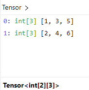

# LibTorch

DolphinDB 的 LibTorch 插件允许用户在 DolphinDB 环境中直接加载和使用 TorchScript 模型。这种集成使得用户能够将 DolphinDB 强大的数据处理能力与 PyTorch 的深度学习功能结合，从而进行高效的模型预测和数据分析。使用此插件，用户无需在不同的平台之间迁移数据，可以轻松地在数据库中进行模型操作。这样不仅提高了处理速度，还简化了数据分析流程。

## 安装

### 版本要求

Server：

* Shark（DolphinDB GPU 版本）3.00.1 及更高版本，支持 CPU 和 GPU(依赖 CUDA11.8) 两种版本插件。
* DolphinDB 3.00.2 及更高版本，支持 CPU 版本插件。

操作系统：Linux x86-64。

**注意**：目前 LibTorch 插件使用的 LibTorch 库版本为 2.1。为避免因训练、加载或预测模型时所用的 PyTorch 版本与插件库版本不一致而引发兼容性问题，请确保在模型训练时也使用 LibTorch 2.1 版本。

### 安装步骤

1. 使用 `listRemotePlugins` 命令查看插件仓库中的插件信息。

   注意：仅展示当前操作系统和 server 版本支持的插件。若无预期插件，可自行编译或在 [DolphinDB 用户社区](https://ask.dolphindb.cn/)进行反馈。

   ```
   login("admin", "123456")
   listRemotePlugins()
   ```
2. 使用 `installPlugin` 命令完成插件安装。

   ```
   installPlugin("LibTorch") // CPU 版本
   installPlugin("GpuLibTorch") // GPU 版本
   ```
3. 使用 `loadPlugin` 命令加载插件，CPU 版本插件名为 "LibTorch"，GPU 版本插件名为 "GpuLibTorch"，注意两个版本的插件不能同时加载。

   ```
   loadPlugin("LibTorch") // CPU 版本
   loadPlugin("GpuLibTorch") // GPU 版本
   ```

## 函数接口

### load

**语法**

```
load(filePath)
```

**详情**

加载 PyTorch 模型并返回一个句柄，会话结束时会自动释放。

**参数**

* **filePath** STRING 类型标量，表示要加载的 PyTorch 模型文件的路径。因为使用的是 LibTorch 库，所以必须使用 TorchScript 的模型文件。

**示例**

```
model = LibTorch::load("path/model.pth")
```

### predict

**语法**

```
predict(handle, input, [parseResult = true])
```

**详情**

使用 *input* 作为输入进行预测，返回 DolphinDB 类型的预测结果。

**参数**

* **handle** 调用 `load` 接口返回的句柄。
* **input** 输入一个 Tensor 对象或由多个 Tensor 对象组成的数组，作为预测的输入数据。
* **parseResult** 可选参数，用来指定是否解析预测的结果。默认值为 true，表示返回嵌套数组形式的结果。为 false 时返回 Tensor 形式的结果。

**返回值**

返回嵌套数组形式或者 Tensor 形式的预测结果。

*parseResult* 省略或者为 true 时，最多支持解析 4 维的预测结果，按如下方式转换：

| PyTorch 预测结果 | DolphinDB |
| --- | --- |
| 1D tensor | 数组（一层 vector） |
| 2D tensor | 2重嵌套数组（anyvector 嵌套一层 vector） |
| 3D tensor | 3重嵌套数组（2重 anyvector 嵌套一层 vector） |
| 4D tensor | 4重嵌套数组（3重 anyvector 嵌套一层 vector） |

**示例**

```
model = LibTorch::load("path/model.pth")

tensor1 = tensor([[0.7740, -1.7911], [0.0267, 0.1928]])
tensor2 = tensor([[0.0267, 0.1928], [-1.6544, 1.2538]])
ans = LibTorch::predict(model, [tensor1, tensor2])
```

### setDevice

**语法**

```
LibTorch::setDevice(handle, device, [deviceId])
```

**详情**

指定预测时所使用的计算设备，不调用该接口时默认使用 CPU。

**参数**

**handle** 通过 load 接口加载的 LibTorch 模型句柄。

**device** STRING 类型标量，可选值为 “CPU” 或者 “CUDA“，用于指定设备。

**deviceId** 可选参数，为 INT 类型标量，如果 *device* 为 “CUDA“，则此参数用于指定使用的 CUDA 设备 ID；如果 *device* 为 “CPU“，则此参数禁用。

**示例**

```
LibTorch::setDevice(handle, "CUDA")
```

## Tensor 转换规则

| 其他数据形式 | DolphinDB Tensor |
| --- | --- |
| Scalar | 1 维 tensor |
| Vector | 1 维 tensor |
| Matrix | 2 维 tensor |
| Table | 2 维 tensor |
| Tuple of Vector（即 Tuple 的每个元素都为 Vector） | 2 维 tensor |
| Tuple of Matrix（即 Tuple 的每个元素都为 Matrix） | 3 维 tensor |
| Tuple of (Tuple of Vector) | 3 维 tensor |
| Tuple of (Tuple of (Tuple of …)) | n 维 Tensor |

注意事项：

（1）在 pytorch 里，Scalar 转换为 0 维 tensor，而 DolphinDB 中是一维。

（2）Tensor 中的元素的数据类型需要相同。

（3）在 DolphinDB 的场景里，普通的 tuple of vector 的每一个元素都是代表一列，如：

```
t = [[1,2],[3,4],[5,6]]
tensor(t)
```

`[1,2], [3,4], [5,6]` 每个分别代表一列，所以共有两行三列，转换成的 tensor 如下：



可以使用 `setColumnarTuple!` 函数，转成和 python 相同的行存储的形式，如

```
t = [[1,2],[3,4],[5,6]].setColumnarTuple!()
tensor(t)
```

这样处理后 `[1,2], [3,4], [5,6]` 分别代表一行，所以是三行两列，转换成的 tensor 如下：


同样，如果输入的多重嵌套数组，且也希望按照行存储形式转换成 tensor 时，也可以通过 `setColumnarTuple!` 函数处理：

```
data = [[[1,2],[3,4],[5,6]], [[7,8],[9,10],[11,12]]]
for (i in 0: size(data)) {
    data[i] = data[i].setColumnarTuple!()
}
tensor(data) // 转换成 2 * 3 * 2 形状的 tensor
```

## 使用示例

```
loadPlugin("/path/PluginLibTorch.txt")
go

//加载数据
data_vector = float(loadText("/path/closing_prices.csv").Closing_Price)

//模型预测需要三维结构，所以需要对输入数据做预处理
//1. 加载数据并做归一化
//2. 按照 20 大小的滑动窗口展开生成预测所需的数据结构
def prepareData(data_vector){
    // 对数据进行归一化操作，归一化到 [-1,1]范围
    minv = min(data_vector)
    maxv = max(data_vector)
    data_normal = 2 * ((data_vector - minv) / (maxv - minv)) - 1

    // 按照 20 大小的滑动窗口展开成3维预测数据
    input = []
    aggrJoin = defg(mutable re, data){
        re.append!(matrix(data))
        return 0
    }
    moving(aggrJoin{input}, data_normal, 20)
    return input
}

// 输入数据集预处理，并将数据转换成 Tensor 形式
input = tensor(prepareData(data_vector))

// 加载模型并进行预测
model = LibTorch::load("/path/scripted_model.pth")
output = LibTorch::predict(model, input)

// 把 [-1,1] 范围的预测结果反归一化回原始范围
maxv = max(data_vector)
minv = min(data_vector)
result =  (output + 1) * (maxv - minv) / 2 + minv
```

## 附录

[使用示例模型](scripted_model.pth)

[使用示例数据](closing_prices.csv)

