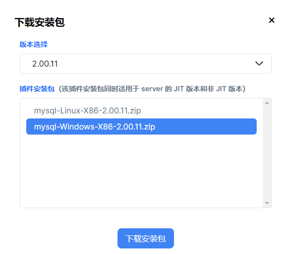

# 插件

## 插件一览

| 类型 | 插件名称 |
| --- | --- |
| 图像 | [GP](gp/gp.md) |
| 数据存取 | * [HBase](hbase/hbase.md) * [Kdb+](kdb/kdb.md) * [MongoDB](mongodb/mongodb.md) * [MySQL](mysql/mysql.md) * [ODBC](odbc/odbc.md) * [OPCUA](opcua/opcua.md) * [OPC](opc/opc.md) * [Redis](redis.md) * [Schemaless   Writer](slwriter.md) * [HDFS](hdfs/hdfs.md) * [LDAP](LDAP.md) |
| 金融 | * [amdQuote](amdquote/amdquote.md) * [INSIGHT](insight/insight.md) * [NSQ](nsq/nsq.md) * [Matching   Engine](MatchingEngine/me.md) * [模拟撮合引擎](matchingEngineSimulator/mes.md) * [Backtest](backtest.md) * [CTP](ctp.md) * [EFH](efh.md) * [DataFeed](datafeed.md) * [XTP](xtp.md) * [SSEQuotationFile](SSEQuotationFile.md) * [WindTDF](windtdf.md) |
| 消息队列 | * [Kafka](kafka/kafka.md) * [zmq](zmq/zmq.md) * [mqtt](mqtt/mqtt.md) * [RabbitMQ](rabbitMQ.md) * [RocketMQ](rocketMQ.md) |
| 数值计算 | * [Signal](signal/signal.md) * [gurobi](gurobi.md) |
| 网络 | * [HTTP   Client](httpClient/httpclient.md) * [TCPSocket](tcpsocket.md) * [WebSocket](websocket.md) |
| 云存储 | [AWS](aws/aws.md) |
| 机器学习 | * [XGBoost](xgboost/xgboost.md) * [SVM](svm/svm.md) |
| 扩展接口 | [Py](py/py.md) |
| 格式处理 | * [Feather](feather/feather.md) * [Arrow](Arrow/arrow.md) * [mseed](mseed/mseed.md) * [mat](mat/mat.md) * [Parquet](parquet/parquet.md) * [HDF5](hdf5/hdf5.md) * [EncoderDecoder](EncoderDecoder.md) * [ORC](orc.md) * [Zip](zip/zip.md) * [Zlib](zlib/zlib.md) |

注： 有关插件使用的一般规则、插件开发的相关介绍，参考：[插件开发教程](plg_dev_tutorial.md)。

## 插件下载

| 下载途径 | 安装方法 |
| --- | --- |
| 官网插件市场 | 1. 前往<https://marketplace.dolphindb.cn/>    注册个人用户。*如已创建，跳过此步。* 2. 在<https://marketplace.dolphindb.cn/>中选择所需插件。 3. 点击**下载安装包**。 4. 选择 **DolphinDB 版本**以及面向**不同操作系统**的插件安装包后下载。  5. 解压下载的插件压缩包到 /server/plugins/ 目录下。 6. 在客户端中使用 `loadPlugin` 命令加载插件。以下载 MySQL    插件为例，加载方法为：`loadPlugin("mysql")`。 |
| 客户端 | 参考：[通过插件仓库安装插件](#chap6_plugin__install_over_plugin_warehouse) |
| Gitee | 由于某些插件尚未上线插件仓库，您可以访问 [DolphinDB 插件](https://gitee.com/dolphindb/DolphinDBPlugin/tree/release200.11/)，选择版本分支，在以插件名称命名的插件目录下载插件的安装文件。例如：与 DolphinDB server 2.00.11 版本对齐的插件可通过选择 release200.11 分支。下载后，将插件包放置在 /server/plugins/ 目录下，在客户端中使用 `loadPlugin` 命令加载插件。 |

## 通过插件仓库安装插件

以安装 MySQL 插件为例，从插件仓库中获取并安装插件的步骤如下：

1. 在 DolphinDB 客户端中使用 [listRemotePlugins](../funcs/l/listRemotePlugins.md)
   命令查看插件仓库中的插件信息。

   ```
   login("admin", "123456")
   listRemotePlugins()
   ```

   注： 本步骤中使用的登录账号为初始管理员账号。请根据实际的管理员账号和密码相应调整。
2. 使用 [installPlugin](../funcs/i/installPlugin.md) 命令完成插件安装。以
   MySQL
   插件为例：

   ```
   installPlugin("mysql")
   ```

   注： 某些插件存在多个版本，例如 amdQuote，此时需要在使用
   `installPlugin`
   命令指定包含了版本号的插件名称。例如：`installPlugin("amdQuote401")`。其中，
   "401" 对应华锐 AMD 平台 SDK 的版本号，以此类推。
3. 使用 [loadPlugin](../funcs/l/loadPlugin.md) 命令加载插件。依然以 MySQL
   插件为例：

   ```
   loadPlugin("mysql")
   ```

   注： 部分插件存在多个版本号时，例如 amdQuote，此时需要在使用
   `loadPlugin`
   命令指定包含了版本号的插件名称。例如：`loadPlugin("amdQuote401")`

