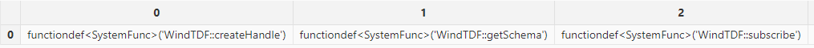
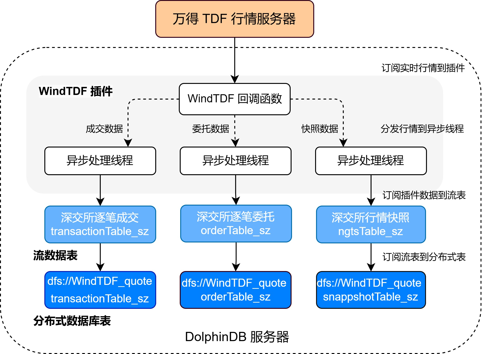
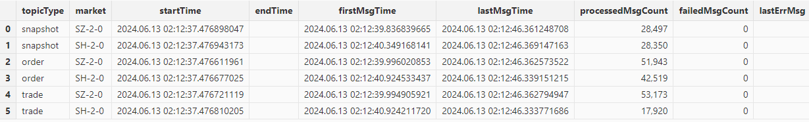
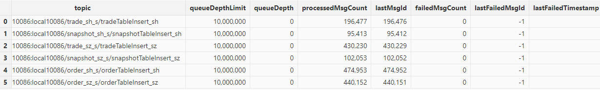
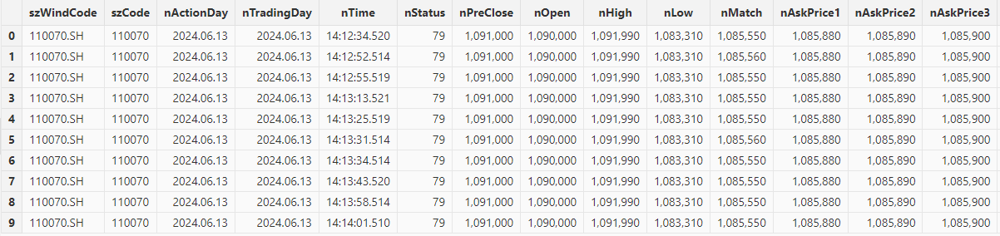

# WindTDF 行情插件最佳实践指南

万得宏汇行情系统为各类证券投资机构提供多市场整合的实时行情，通过统一的数据接口标准，提供低延时以及高质量的行情数据服务。DolphinDB 提供了基于万得宏汇行情系统 TD
获取高频行情数据的 WindTDF 插件，帮助用户方便地通过 DolphinDB 脚本语言将实时行情数据接入 DolphinDB 中，以便进行后续的计算或存储。

本文主要介绍如何通过 WindTDF 插件将实时行情数据接入流表、写入分布式数据库。本文全部代码需要运行在 2.00.11 或者更高版本的 DolphinDB Server
以及插件上。目前 WindTDF 插件仅支持在 Linux 版本 server 上运行。

## 1. WindTDF 插件基本使用

WindTDF 插件基于万得宏汇提供的行情数据服务 TDF\_C++ SDK 实现。其最核心的功能是实现了行情回调函数，每次接收到行情时会写入订阅时所指定的
DolphinDB 共享流表中。DolphinDB WindTDF
插件目前已经支持了包括上交所、深交所、中金所的股票基金快照、逐笔、期货等数据类型，具体订阅方式见下文。WindTDF 插件的接口见 [DolphinDB WindTDF Plugin 使用说明](windtdf.html)。

### 1.1 安装插件

节点启动后，连接节点并在 GUI（或 VS Code、Web UI）等 [DolphinDB 客户端](../db_distr_comp/clients.html)中执行 `installPlugin` 函数，可以下载到与当前 server
版本适配的 WindTDF 插件文件。

```
login("admin", "123456")
installPlugin("WindTDF")
```

### 1.2 加载插件

在脚本中调用插件相关的接口前，需要先加载插件。在 GUI（或 VS Code、Web UI）等[客户端](../db_distr_comp/clients.html)中执行
`loadPlugin("WindTDF")` 加载插件。

```
loadPlugin("WindTDF")
```

`loadPlugin` 函数正常返回则插件加载成功，以 VS Code 为例，首次加载成功后返回的部分信息如下，返回值内容是
WindTDF 插件所提供的函数：



## 2. 行情的接入与存储

本章以订阅沪深两市的全市场股票快照和逐笔数据、实时写入 DolphinDB 分布式数据库为例，对 WindTDF 插件的使用进行说明。

### 2.1 数据接入方案

数据接入的方案如下：

* 通过 WindTDF 插件订阅上海深圳市场的快照、逐笔委托、逐笔成交数据，写入 DolphinDB 的持久化流数据表。
* 订阅持久化流数据表写入 DolphinDB 分布式数据库，将数据存储到磁盘上。

注意：请勿使用 WindTDF
插件将行情数据直接写入分布式数据库。因为分布式数据库并不适用于此类高频的流式写入。建议在使用时，借助流数据表及其发布订阅功能以实现批量写入分布式表。这样既可以提高写入的吞吐量，也有助于降低时延。



下面分步骤介绍关键 DolphinDB 代码实现，完整脚本见[附录
1](#spm_nrq_pdc__ul_xcs_4hm_qdc)。

### 2.2 数据接入方案实施步骤

本节介绍了如何在 DolphinDB 中建立数据接入所需要的表，实施 WindTDF 订阅和连接。

#### 2.2.1 流表和分布式表的创建

为保证后续用于持久化的 `enableTableShareAndPersistence`
函数能够正常执行，需要节点启动之前在配置文件中（单节点：*dolphindb.cfg*，集群：*cluster.cfg*）指定配置参数
*persistenceDir* ，配置参考[功能配置](../db_distr_comp/cfg/function_configuration.html)。

**创建连接 handle**

由于万得 TD 系统在连接行情系统后无法修改订阅，因此在连接前需要预先设置所有数据的订阅。WindTDF 插件的基本使用流程为：创建
handle、进行数据订阅、连接。这里先创建连接 handle，再进行后续的操作。

```
handle = WindTDF::createHandle([HOST], [PORT], [USERNAME], [PASSWORD])
```

**获取表结构**

调用 [WindTDF::getSchema](windtdf.html#getschema)
方法可以获取行情数据各个表的表结构。运行以下代码可以获取快照、逐笔委托、逐笔成交三种表结构。注意，万得 TD 系统已经将数据进行了初步的处理和对齐，因此
WindTDF 插件不同市场的同种类型的数据表结构相同，比如上海市场的快照结构与深圳市场相同。

```
snapshotSchema = WindTDF::getSchema(`snapshot);
orderSchema = WindTDF::getSchema(`order);
tradeSchema = WindTDF::getSchema(`trade);
```

**创建持久化流数据表**

通过插件得到行情数据的表结构后，使用该表结构创建三种数据品类的持久化流数据表。

```
cacheSize = 1000000
snapshot_sh = streamTable(10000:0, snapshotSchema[`name], snapshotSchema[`typeString]);
enableTableShareAndPersistence(table=snapshot_sh,tableName=`snapshot_sh_s,cacheSize=cacheSize, preCache=cacheSize)
snapshot_sz = streamTable(10000:0, snapshotSchema[`name], snapshotSchema[`typeString]);
enableTableShareAndPersistence(table=snapshot_sz,tableName=`snapshot_sz_s,cacheSize=cacheSize, preCache=cacheSize)

order_sh = streamTable(10000:0, orderSchema[`name], orderSchema[`typeString]);
enableTableShareAndPersistence(table=order_sh,tableName=`order_sh_s,cacheSize=cacheSize, preCache=cacheSize)
order_sz = streamTable(10000:0, orderSchema[`name], orderSchema[`typeString]);
enableTableShareAndPersistence(table=order_sz,tableName=`order_sz_s,cacheSize=cacheSize, preCache=cacheSize)

trade_sh = streamTable(10000:0, tradeSchema[`name], tradeSchema[`typeString]);
enableTableShareAndPersistence(table=trade_sh,tableName=`trade_sh_s,cacheSize=cacheSize, preCache=cacheSize)
trade_sz = streamTable(10000:0, tradeSchema[`name], tradeSchema[`typeString]);
enableTableShareAndPersistence(table=trade_sz,tableName=`trade_sz_s,cacheSize=cacheSize, preCache=cacheSize)
```

代码第一行的 `cacheSize`
变量控制了在建表时预分配内存的大小、以及流数据表可占用的最大内存，其单位是行，设置较大的 `cacheSize`
可以降低出现峰值时延的频率。cacheSize 的具体大小可以根据实际的可使用的内存大小决定。具体优化原理可参考 [DolphinDB
流计算时延统计与性能优化](../tutorials/streaming_timer.html)。

**创建分布式数据库**

为将行情数据存入分布式数据库，需要根据之前得到的行情数据表结构来创建分布式库表，分区规则参考自[基于 DolphinDB 存储金融数据的分区方案最佳实践](../tutorials/best_practices_for_partitioned_storage.html)，使用按天分区 + 按股票代码
HASH25 分区的方式。

```
dbName = "dfs://WindTDF_quote"
shTransactionTbName = "transactionTable_sh"
shOrderTbName = "orderTable_sh"
shSnapshotTbName = "snapshotTable_sh"

szTransactionTbName = "transactionTable_sz"
szOrderTbName = "orderTable_sz"
szSnapshotTbName = "snapshotTable_sz"

dbDate = database(, partitionType=VALUE, partitionScheme=2024.01.01..2025.01.01)
dbID = database(, partitionType=HASH, partitionScheme=[SYMBOL, 25])
db = database(directory=dbName, partitionType=COMPO, partitionScheme=[dbDate, dbID],engine='TSDB',atomic='CHUNK')

tbSchema = table(1:0, snapshotSchema.name, snapshotSchema.typeInt)
db.createPartitionedTable(table=tbSchema,tableName=shSnapshotTbName,partitionColumns=`nActionDay`szWindCode,sortColumns=`szWindCode`nTime)
shSnapshot = loadTable(db, shSnapshotTbName)
db.createPartitionedTable(table=tbSchema,tableName=szSnapshotTbName,partitionColumns=`nActionDay`szWindCode,sortColumns=`szWindCode`nTime)
szSnapshot = loadTable(db, szSnapshotTbName)

tbSchema = table(1:0, orderSchema.name, orderSchema.typeInt)
db.createPartitionedTable(table=tbSchema,tableName=shOrderTbName,partitionColumns=`nActionDay`szWindCode,sortColumns=`szWindCode`nTime)
shOrder = loadTable(db, shOrderTbName)
db.createPartitionedTable(table=tbSchema,tableName=szOrderTbName,partitionColumns=`nActionDay`szWindCode,sortColumns=`szWindCode`nTime)
szOrder = loadTable(db, szOrderTbName)

tbSchema = table(1:0, tradeSchema.name, tradeSchema.typeInt)
db.createPartitionedTable(table=tbSchema,tableName=shTransactionTbName,partitionColumns=`nActionDay`szWindCode,sortColumns=`szWindCode`nTime)
shTrade = loadTable(db, shTransactionTbName)
db.createPartitionedTable(table=tbSchema,tableName=szTransactionTbName,partitionColumns=`nActionDay`szWindCode,sortColumns=`szWindCode`nTime)
szTrade = loadTable(db, szTransactionTbName)
```

#### 2.2.2 订阅 WindTDF 行情

**订阅行情数据到流数据表**

使用 [WindTDF::subscribe](windtdf.html#subscribe) 函数进行 WindTDF 行情订阅。

```
WindTDF::subscribe(handle, snapshot_sh_s, "SH-2-0", "snapshot");
WindTDF::subscribe(handle, snapshot_sz_s, "SZ-2-0", "snapshot");

WindTDF::subscribe(handle, order_sh_s, "SH-2-0", "order");
WindTDF::subscribe(handle, order_sz_s, "SZ-2-0", "order");

WindTDF::subscribe(handle, trade_sh_s, "SH-2-0", "trade");
WindTDF::subscribe(handle, trade_sz_s, "SZ-2-0", "trade");
```

有关 WindTDF 插件对数据品类的支持情况和相关订阅参数，参考[附录](#spm_nrq_pdc)。

**订阅流表写入分布式库**

订阅 2.2.1 节中的三个持久化流数据表，将增量数据实时写入分布式数据库。

```
def handleInsert(tb, mutable msg) {
        tableInsert(tb, msg)
}

subscribeTable(tableName="snapshot_sh_s", actionName="snapshotTableInsert_sh", offset=-1, handler=handleInsert{shSnapshot}, msgAsTable=true, batchSize=20000, throttle=1, reconnect=true)
subscribeTable(tableName="snapshot_sz_s", actionName="snapshotTableInsert_sz", offset=-1, handler=handleInsert{szSnapshot}, msgAsTable=true, batchSize=20000, throttle=1, reconnect=true)

subscribeTable(tableName="order_sh_s", actionName="orderTableInsert_sh", offset=-1, handler=handleInsert{shOrder}, msgAsTable=true, batchSize=20000, throttle=1, reconnect=true)
subscribeTable(tableName="order_sz_s", actionName="orderTableInsert_sz", offset=-1, handler=handleInsert{szOrder}, msgAsTable=true, batchSize=20000, throttle=1, reconnect=true)

subscribeTable(tableName="trade_sh_s", actionName="tradeTableInsert_sh", offset=-1, handler=handleInsert{shTrade}, msgAsTable=true, batchSize=20000, throttle=1, reconnect=true)
subscribeTable(tableName="trade_sz_s", actionName="tradeTableInsert_sz", offset=-1, handler=handleInsert{szTrade}, msgAsTable=true, batchSize=20000, throttle=1, reconnect=true)
```

* `handleInsert` 自定义函数会往将数据写入分布式数据库。
* 通过调整 [subscribeTable](../funcs/s/subscribeTable.html)
  函数中的 *batchSize* 和 *throttle*
  参数可以控制写入分布式数据库的频率，达到其中一个设置的条件，才会向分布式数据库写入一次。
  + *batchSize*=20000 表示当未处理消息的数量达到 20000 时，handler
    才会处理消息。
  + *throttle*=1 表示继上次 handler 处理消息之后，若未处理消息的数量还没有达到 20000
    ，但是时间间隔 1s 后也会处理消息。

**启动 WindTDF 连接，开启数据写入**

在订阅后，使用函数 [WindTDF::connect](windtdf.html#connect) 连接 WindTDF，行情数据将进入流数据表。

```
WindTDF::connect(handle)
```

### 2.3 WindTDF 运行状态监控

运行过程中，可以使用 [WindTDF::getStatus](windtdf.html) 查询 WindTDF 行情的接收情况。

```
WindTDF::getStatus()
```



查询流表的订阅，可以看到发布订阅都正常进行。

```
getStreamingStat().subWorkers
```



查询分布式表中某一只股票的数据。这里查询 110070 这只上交所股票的数据，执行以下命令，从 dfs 表中获取了连接后收到的所有该股票的逐笔数据。

```
select * from loadTable("dfs://WindTDF_quote", "snapshotTable_sh") where szWindCode=`110070.SH
```



至此，已经成功订阅上交所和深交所的快照和逐笔数据，并将它落盘到 DolphinDB 分布式表中。

## 3. 常见问题

* **插件是否支持断线重连**

  订阅数据时，如果网络波动或者 Wind 行情端服务器本身不稳定会导致插件连接断开。WindTDF
  插件内置断线重连机制，这一功能由 TDF SDK 提供保障，对插件本身透明。通过在日志中筛选以 [PLUGIN::WINDTDF]
  开头的记录，并关注其中包含 "connect" 和 "disconnect" 的条目，可以详细了解断线重连的具体情况。插件成功重连后，SDK
  不会重传数据，因此在断连期间的数据将会丢失。
* **如何避免因为阻塞丢失数据**

  在插件接收数据时，为确保及时处理，建议使用异步持久化的流表，并预设初始容量（如 100
  万条），以避免扩容影响写入速度，进而导致 SDK 端的行情缓存因满载而导致数据丢失。
* **如何使用插件 replay 功能重放数据**

  由于 WindTDF
  提供的是实时数据流，一旦网络出现波动导致数据丢包，系统无法实时重传以确保数据的完整性。因此，如果因为特殊原因发生数据丢失，需联系行情提供商获取当天的完整数据，或在交易日结束后利用插件
  connect 函数的 replay 功能（[connect](windtdf.html#connect)），回放当天所有的数据以进行补救。注意只能在 15 点收盘后进行回放，收盘前指定回放为 true
  进行连接时会报错。

  这里以回放上交所股票快照为例进行说明：

  ```
  // 订阅上交所的股票快照，准备工作与普通订阅相同
  handle = WindTDF::createHandle(HOST, PORT, USERNAME, PASSWORD, dict(["outputRecvTime", "outputElapsed"], [true, true]));
  schema = WindTDF::getSchema(`snapshot);
  snapshot_sh_s = streamTable(100000:0, schema[`name], schema[`typeString]);
  enableTableShareAndPersistence(table=snapshot_sh_s,tableName=`snapshot_sh_s1,cacheSize=cacheSize, preCache=cacheSize)
  WindTDF::subscribe(handle, snapshot_sh_s1, "SH-2-0", "snapshot");

  // 建立连接，第二个参数指定为 true，即回放数据
  WindTDF::connect(handle, true)
  ```
* **如何处理内存耗尽（OOM）**

  由于插件中使用了第三方
  SDK，如果系统遭遇内存耗尽（OOM），可能会导致性能急剧下降和不可预测的异常行为。如果接收数据的流表长时间无数据，并且日志中出现以
  [PLUGIN::WINDTDF] 开头的 'out of memory' 或 'bad alloc' 信息，说明可能发生了
  OOM。

  OOM 会导致数据写入失败，进而影响后续计算。因此，需尽量避免 OOM，以下是一些建议：

  1. 合理分配流数据的容量（capacity），并降低用于接收行情数据的流表的 cacheSize ，避免太多的数据被留存在内存中。
  2. 在接收行情数据的节点上，如果同时需要处理大规模数据或者执行复杂查询，需要特别注意内存的使用情况。
  3. 及时管理 session 的变量，可以通过 undef 函数将不需要的临时变量及时释放。
* **是否可以跨天连接**

  WindTDF 具备跨天连接的能力，前一日收盘前建立的连接在次日开盘后仍能保持，并继续接收数据。

## 附录

1. **订阅落库的脚本文件**

   [WindTDF 落库脚本文件.dos](script/WindTDF/WindTDF_script_1.dos)
2. **WindTDF 插件数据品类参数表**

   WindTDF
   插件目前支持了下表中出现的数据品类。在订阅时可以查询该表，找到想要订阅的数据入参。表中为空的项，对应字段在订阅时填空即可。

   | **行情源** | **行情数据类型** |
   | --- | --- |
   | SH-2-0（上交所 Level-2） | snapshot（快照）， trade（成交），order（委托），orderTrade（合成逐笔） |
   | SZ-2-0（深交所 Level-2） | snapshot（快照）， trade（成交），order（委托），orderTrade（合成逐笔） |
   | SI-1-0（申万一级行业指数） | index（指数） |
   | SH-1-1（上交所 Level-2 期权） | futures（期货），options（期权） |
   | SZ-1-1（深交所 Level-2 期权） | futures（期货），options（期权） |
   | CF-2-0（中金所 Level-2） | futures（期货），options（期权） |

