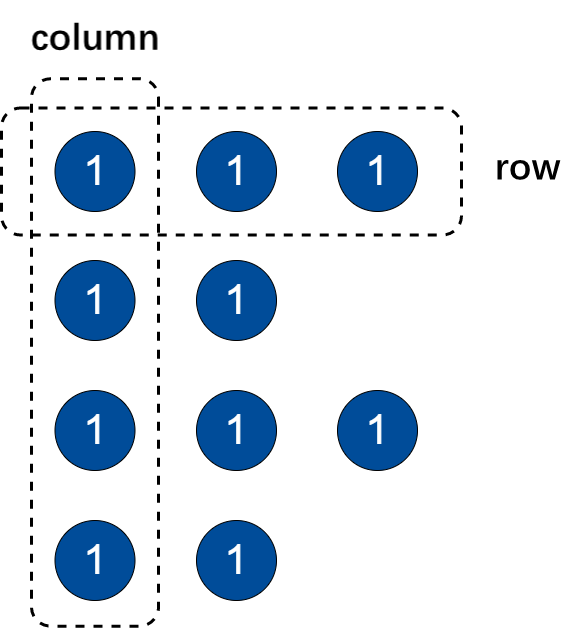

# 数组向量（array vector）

DolphinDB 中的数组向量 (array vector)
是一种特殊的向量，用于存储可变长度的二维数组，如一段时间内股票的多档报价。数据表通常将数据类型相同且含义相近的多列存为一列，例如股票的多档报价数据。这种存储方式可显著简化某些常用的查询与计算。若不同列中含有大量重复数据，使用数组向量存储亦可提高数据压缩比，提升查询速度。

数组向量的每一个元素仍是一个向量（类型完全相同的一维数组）。我们将数组向量的每个元素视为一行，每个元素中相同位置的标量所组成的向量视为一列，如下所示：



数组向量可以与标量、向量或另一个数组向量进行二元运算。

目前，仅内存表与使用 TSDB 存储引擎的分布式表支持数组向量，OLAP 存储引擎暂不支持数组向量。数组向量类型的列不可用作分布式表的分区字段或排序字段。

## 创建数组向量

使用 [array](../../funcs/a/array.html) 函数或 [bigarray](../../funcs/b/bigarray.html) 函数初始化生成空的数组向量。
请注意，指定数据类型时，需在数据类型后添加“[]”，以表示创建数组向量，且 initialSize 必须为 0。

目前支持以下数据类别：Logical, Integral（不包括 INT128, COMPRESS 类型）, Floating, DECIMAL,
Temporal。

## 向量和数组向量的相互转化

向量转数组向量：

* 通过 [arrayVector](../../funcs/a/arrayVector.html) 将单个向量转换成数组向量。
* 通过 [fixedLengthArrayVector](../../funcs/f/fixedLengthArrayVector.html) 将多个向量拼接成数组向量。

数组向量转向量：

通过 [flatten](../../funcs/f/flatten.html) 将数组向量转换成向量。

```
a=array(INT[], 0, 10).append!([1 2 3, 4 5, 6 7 8, 9 10]);
a
// output
[[1,2,3],[4,5],[6,7,8],[9,10]]

flatten(a)
// output
[1,2,3,4,5,6,7,8,9,10]
```

## 数组向量转化为矩阵

通过函数 [matrix](../../funcs/m/matrix.html) 可以将每个元素等长的数组向量转换成矩阵，以进一步进行矩阵计算。

```
bid = array(DOUBLE[], 0, 20).append!([1.4799 1.479 1.4787 1.4784 1.4667, 1.4796 1.479 1.4782 1.4781 1.4783, 1.4791 1.479 1.4785 1.4698 1.4720, 1.4699 1.469 1.4707 1.4704 1.4697, 1.4789 1.477 1.4780 1.4724 1.4669])
ask = array(DOUBLE[], 0, 20).append!([1.4821 1.4825 1.4828 1.4900 1.4792, 1.4818 1.482 1.4821 1.4818 1.4829, 1.4814 1.4818 1.482 1.4825 1.4823, 1.4891 1.4885 1.4898 1.4901 1.4799, 1.4811 1.4815 1.4818 1.4800 1.4799])

TradeDate = 2022.01.01 + 1..5
SecurityID = rand(`APPL`AMZN`IBM, 5)
t = table(SecurityID as `sid, TradeDate as `date, bid as `bid, ask as `ask)
result = select toArray(matrix(bid).corrMatrix()) as corr_bid,  toArray(matrix(ask).corrMatrix()) as corr_ask from t group by sid
corrMatrix_bid = result.corr_bid.matrix().avg().reshape(5:5)
corrMatrix_ask = result.corr_ask.matrix().avg().reshape(5:5)
corrMatrix_bid;
```

| col1 | col2 | col3 | col4 | col5 |
| --- | --- | --- | --- | --- |
| 1 | 0.9995 | 0.9984 | 0.7417 | (0.1308) |
| 0.9995 | 1 | 0.9997 | 0.7214 | (0.1466) |
| 0.9984 | 0.9997 | 1 | 0.7061 | (0.1589) |
| 0.7417 | 0.7214 | 0.7061 | 1 | (0.0264) |
| (0.1308) | (0.1466) | (0.1589) | (0.0264) | 1 |

```
corrMatrix_ask;
```

| col1 | col2 | col3 | col4 | col5 |
| --- | --- | --- | --- | --- |
| 1 | 0.9999 | 0.9997 | 0.9963 | (0.9861) |
| 0.9999 | 1 | 0.9999 | 0.9974 | (0.9883) |
| 0.9997 | 0.9999 | 1 | 0.9981 | (0.9899) |
| 0.9963 | 0.9974 | 0.9981 | 1 | (0.9968) |
| (0.9861) | (0.9883) | (0.9899) | (0.9968) | 1 |

## 向数组向量中插入数据

只支持使用`append!`向数组向量中插入标量、元组或数组向量。暂不支持对数组向量的更新和删除操作。

```
// 插入scalar
a=array(DOUBLE[], 0, 10).append!(2.5);
print a;
// output
[[2.5]]]

// 插入tuple
a=array(DATE[], 0, 10).append!((2021.10.15, 2021.10.16, 2021.10.17));
print a;
// output
[[2021.10.15],[2021.10.16],[2021.10.17]]

// 插入数组向量
a=array(INT[], 0, 10).append!([1 2 3, 4 5, 6 7 8, 9 10]);
print a;
// output
[[1,2,3],[4,5],[6,7,8],[9,10]]
```

注： 使用 `append!` 向数组向量插入数据时，若某一行为空
[]，插入后该行会被自动补充为 [null]。二者的区别在于：[] 长度为 0，而 [null] 长度为 1。

```
a=array(INT[]).append!([[1,2,3],[],[9,10]]);
a
// output
[[1,2,3],[null],[9,10]]
```

## 读取数组向量中的数据

* 数组向量

  ```
  a =array(DOUBLE[], 0, 10).append!([1.0, 2.1 4.1 6.8, 0.5 2.2 2]);
  print a
  // output
  [[1],[2.1,4.1,6.8],[0.5,2.2,2]]
  typestr(a)
  // output
  FAST DOUBLE[] VECTOR
  ```
* 元组

  ```
  tp = [[1],[2.1,4.1,6.8],[0.5,2.2,2]]
  typestr(tp)
  // output
  ANY VECTOR
  ```

由上述例子可以看出，数组向量和元组的打印（print）形式一致。但两者读取数据的方式不完全相同。

相同点：

都可以通过 [row](../../funcs/r/row.html) 读取行数据。

不同点：

数组向量的下标只能表示列索引，可以通过列索引（从0开始）读取一列数据，如 “a[index]”。若要读取某行数据，需通过 row
函数读取，如 “a.row(index)“。如需定位到某个具体的数据，可以先定位到列，再定位行，如
“a[index1][index2]”；或先定位行，如：a.row(index1)[index2]。

```
a[1]
// output
[,4.1,2.2]

tp[,1]
// output
(,4.1,2.2)

a.row(1)
// output
[2.1,4.1,6.8]

tp[1]
// output
[2.1,4.1,6.8]
```

## 修改数组向量中的数据

数组向量中的数据可以通过指定行和列的方式进行修改：`obj[rowIndex, colIndex] = newValue`

rowIndex 是标量或数据对，若是数据对，当不指定开始的索引时，表示从第 0 行开始；当不指定结束的索引时，表示到最后一行结束。rowIndex
可以省略，省略时代表所有行中对应的 colIndex 位置的数据都要修改。

colIndex 是标量或数据对，不可省略。当是数据对时，数据对的开始和结束索引不可省略。

newValue 是标量、向量或元组：

* newValue 是一个标量时，所有通过 rowIndex 和 colIndex 指定的数据都会修改为 newValue；
* newValue 是一个与 colIndex 长度相同的向量或元组时，每一行中由 colIndex 指定的数据都会对应替换为该向量或元组的值；
* newValue 是长度与 rowIndex 相同的向量或元组时，其中 newValue 的元素为标量或者长度与 colIndex
  相同的向量，每一行中的数据会替换为 newValue 中对应位置的元素。

```
// 创建数组向量 a
a = array(DOUBLE[], 0, 10).append!([1 2 3 4, 5 6 7 8 , 9 10 11 12]);
print a
// output
[[1,2,3,4],[5,6,7,8],[9,10,11,12]]

// 修改第0行、第1列的数据为 50
a[0,1] = 50
print a
// output
[[1,50,3,4],[5,6,7,8],[9,10,11,12]]

// 修改第0到1行中第1到2列的数据为 100 200
a[0:2, 1:3] = 100 200
print a
// output
[[1,100,200,4],[5,100,200,8],[9,10,11,12]]

// 修改第0到1行中第1到2列的数据为 300 400，省略行索引的起始索引值
a[:2, 1:3] = 300 400
print a
// output
[[1,300,400,4],[5,300,400,8],[9,10,11,12]]

// 修改第0行中第1到2列的数据为 500 600，修改第1行中第1到2列的数据为 700 800
a[0:2, 1:3] = (500 600, 700 800)
print a
// output
[[1,500,600,4],[5,700,800,8],[9,10,11,12]]

// 修改所有行中第1到2列的数据为 900 1000
a[, 1:3] = 900 1000
print a
// output
[[1,900,1000,4],[5,900,1000,8],[9,900,1000,12]]
```

## 导入表时存储为数组向量（2.00.4 及以上版本）

目前暂不支持导入时将文本文件的多列数据存成 DolphinDB
数据表的一列。如需导入数组向量，可以在导入前，将文本文件的多列数据合并存储到一列中，并通过特定的标识符分隔多列数据，如对于五档报价的一行数据可以在一列中存储为
“1.4799|1.479|1.4787|1.4796|1.479” 。

使用 loadText (ploadText) 与 loadTextEx 导入数据时，通过参数 arrayDelimiter 指定分隔符(上述报价数据分隔符是
“|”)，即可在导入数据表时将该列的识别为数组向量。

注： 导入数据前需在 schema 中修改数组向量对应列的类型。

```
bid = array(DOUBLE[], 0, 20).append!([1.4799 1.479 1.4787, 1.4796 1.479 1.4784, 1.4791 1.479 1.4784])
ask = array(DOUBLE[], 0, 20).append!([1.4821 1.4825 1.4828, 1.4818 1.482 1.4821, 1.4814 1.4818 1.482])
TradeDate = 2022.01.01 + 1..3
SecurityID = rand(`APPL`AMZN`IBM, 3)
t = table(SecurityID as `sid, TradeDate as `date, bid as `bid, ask as `ask)
t;
saveText(t,filename="/home/t.csv",delimiter=',',append=true)
path = "/home/t.csv"
schema=extractTextSchema(path);
update schema set type = "DOUBLE[]" where name="bid" or name ="ask"
t = loadText(path, schema=schema, arrayDelimiter=",")
t;
```

| sid | date | bid | ask |
| --- | --- | --- | --- |
| AMZN | 2022.01.02 | [1.4799,1.479,1.4787] | [1.4821,1.4825,1.4828] |
| AMZN | 2022.01.03 | [1.4796,1.479,1.4784] | [1.4818,1.482,1.4821] |
| IBM | 2022.01.04 | [1.4791,1.479,1.4784] | [1.4814,1.4818,1.482] |

## 将表的多列合并成一个数组向量

通过函数 [fixedLengthArrayVector](../../funcs/f/fixedLengthArrayVector.html) 将表的多列数据存成一列。

```
syms="A"+string(1..30)
datetimes=2019.01.01T00:00:00..2019.01.31T23:59:59
n=200
if(existsDatabase("dfs://stock")) {
dropDatabase("dfs://stock")
}
db=database("dfs://stock",RANGE,cutPoints(syms,3));
t=table(take(datetimes,n) as trade_time, take(syms,n) as sym,take(500+rand(10.0,n), n) as bid1, take(500+rand(20.0,n),n) as bid2)
quotes=db.createPartitionedTable(t,`quotes,`sym).append!(t)
t1=select sym, fixedLengthArrayVector(bid1,bid2) as bid from quotes
```

## 将表分组数据聚合成一个数组向量

DolphinDB 提供了函数 toArray 搭配 group by 语句使用。toArray 可以将 group by
分组的数据存储成数组向量的一行，便于用户直接查看该分组下的所有数据。

```
ticker = `AAPL`IBM`IBM`AAPL`AMZN`AAPL`AMZN`IBM`AMZN
volume = 106 115 121 90 130 150 145 123 155;
t = table(ticker, volume);

t1 = select toArray(volume) as volume_all from t group by ticker;
t1;
```

| ticker | volume\_all |
| --- | --- |
| AAPL | [106,90,150] |
| AMZN | [130,145,155] |
| IBM | [115,121,123] |

## 数组向量按行计算

**聚合计算**

* 支持 row 系列函数，如:

  + [rowMax](../../funcs/r/rowMax.html)
  + [rowStd](../../funcs/r/rowStd.html)
* 支持调用高阶函数 [byRow](../../funcs/ho_funcs/byRow.html)，对数组向量的每行元素进行聚合计算。

  ```
  a=array(DOUBLE[], 0, 10).append!([8.3 1.2 5.6, 1.8 3.3, 0.1 2.4 6.8]);
  rowMax(a);
  // output
  [8.3, 3.3, 6.8]

  bid = array(DOUBLE[], 0, 20).append!([1.4799 1.479 1.4787, 1.4796 1.479 1.4784, 1.4791 1.479 1.4784])
  ask = array(DOUBLE[], 0, 20).append!([1.4821 1.4825 1.4828, 1.4818 1.482 1.4821, 1.4814 1.4818 1.482])
  TradeDate = 2022.01.01 + 1..3
  SecurityID = rand(`APPL`AMZN`IBM, 3)
  t = table(SecurityID as `sid, TradeDate as `date, bid as `bid, ask as `ask)
  t;
  ```

  | sid | date | bid | ask |
  | --- | --- | --- | --- |
  | IBM | 2022.01.02 | [1.4799,1.479,1.4787] | [1.4821,1.4825,1.4828] |
  | APPL | 2022.01.03 | [1.4796,1.479,1.4784] | [1.4818,1.482,1.4821] |
  | APPL | 2022.01.04 | [1.4791,1.479,1.4784] | [1.4814,1.4818,1.482] |

  ```
  select SecurityID, TradeDate, bid, ask,  rowAvg(bid) as bid_avg, rowAvg(ask) as ask_avg from t
  ```

  | SecurityID | TradeDate | bid | ask | bid\_avg | ask\_avg |
  | --- | --- | --- | --- | --- | --- |
  | IBM | 2022.01.02 | [1.4799,1.479,1.4787] | [1.4821,1.4825,1.4828] | 1.4792 | 1.4825 |
  | APPL | 2022.01.03 | [1.4796,1.479,1.4784] | [1.4818,1.482,1.4821] | 1.479 | 1.482 |
  | APPL | 2022.01.04 | [1.4791,1.479,1.4784] | [1.4814,1.4818,1.482] | 1.4788 | 1.4817 |

**窗口计算（滑动窗口、累计窗口等）**

通过高阶函数 [byRow](../../funcs/ho_funcs/byRow.html)
将窗口计算应用在数组向量的每行元素上。

```
select SecurityID, TradeDate, bid, ask, byRow(cumavg, bid) as bid_cum, byRow(cumavg, ask) as ask_cum from t
```

| SecurityID | TradeDate | bid | ask | bid\_cum | ask\_cum |
| --- | --- | --- | --- | --- | --- |
| IBM | 2022.01.02 | [1.4799,1.479,1.4787] | [1.4821,1.4825,1.4828] | [1.4799,1.47945,1.4792] | [1.4821,1.4823,1.482467] |
| APPL | 2022.01.03 | [1.4796,1.479,1.4784] | [1.4818,1.482,1.4821] | [1.4796,1.4793,1.479] | [1.4818,1.4819,1.481967] |
| APPL | 2022.01.04 | [1.4791,1.479,1.4784] | [1.4814,1.4818,1.482] | [1.4791,1.47905,1.478833] | [1.4814,1.4816,1.481733] |

