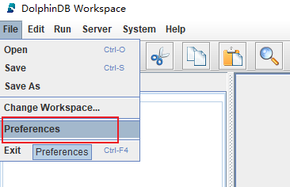
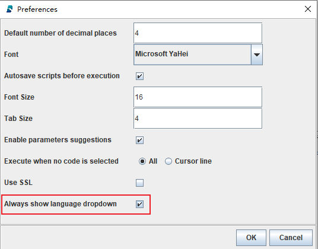
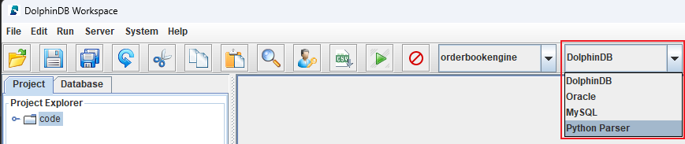
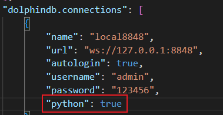

# 如何使用

## DolphinDB Server 安装与部署

参考以下教程，完成 DolphinDB 系统的安装部署：

* [Linux 系统部署准备](../../tutorials/prep_linux_for_deploy.md)
* [单节点部署与升级](../../tutorials/standalone_server.md)
* [单服务器集群部署与升级](../../tutorials/single_machine_cluster_deploy.md)
* [多服务器集群部署与升级](../../tutorials/multi_machine_cluster_deployment.md)

目前仅支持 3.0 及以上版本 DolphinDB server 支持 Python Parser。

Python Parser 体验版本目前不支持插件。

## Python Session

为支持 Python Parser 功能，DolphinDB server 除 DolphinDB Session 外，新增支持了解析 Python Parser 的 Session，即 Python Parser Session。不同类型的 Session 使用不同的解析器解析用户的脚本。如果使用 Python Parser，需要创建一个 Python Parser Session 连接。

本章主要介绍连接 Python Parser Session 的方式：

* 通过 GUI 连接，不低于 1.30.22.1 版本
* 通过 VSCode 连接，不低于 2.0.600 版本

其中，GUI 和 DolphinDB VSCode 都提供了配置选项，可以方便地在 DolphinDB Session 和 Python Parser Session 之间切换。可通过 [客户端](https://dolphindb.cn/product#client) 页面下载客户端。

## 通过 GUI 连接

关于 GUI 的安装和使用说明，详见 [DolphinDB GUI 手册](../../db_distr_comp/gui.md)及 [使用DolphinDB数据库及客户端](../../getstarted/use_clients_server.md)。

完成安装和启动后，对 GUI 进行如下配置：

* 如下图所示，在 GUI 首页点击 File --> Preferences，打开参数配置框

  
* 勾选 Always show language dropdown 后，点击 OK，关闭参数配置框。

  
* 在 GUI 首页，通过红框标示的下拉菜单选择 Python Parser，表示使用 Python Parser Session。

  

完成以上配置后，即可在 GUI 中打开一个 Python Parser Session，并在其中执行 Python 脚本。

## 通过 VS Code 连接

参考 [DolphinDB VS Code 插件](../../db_distr_comp/vscode.md)下载安装 VSCode 插件。

安装完成后，重启 VSCode 插件，点击菜单栏中的 `文件 > 首选项 > 设置 (File > Preferences > Settings)` 或者按快捷键 `Ctrl + 逗号` 打开 VSCode 设置。在搜索框中输入 dolphindb，点击 `在 settings.json 中编辑`，修改 `dolphindb.connections`  下的 `python` 为 true，表示使用 Python Parser Session。

完成以上配置后，通过资源管理器下的 DOLPHINDB 窗口查看或切换连接，并在选择的连接中执行 Python 脚本。

