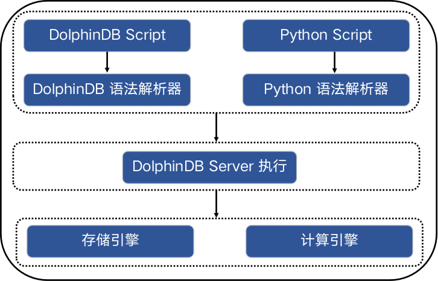

# Python Parser

Python Parser 是 Python 语言的一个 DolphinDB 实现，为基于 Python 语言编写的脚本提供了执行环境。与传统的 Python 不同，Python
Parser 不受全局锁 GIL（Global Interpreter Lock）的限制，因此能够充分发挥多核和分布式计算的潜力。Python Parser 与
DolphinDB 脚本共享对象系统和运行环境，这使得 Python Parser 具备直接控制 DolphinDB 存储引擎和计算引擎的能力，并能直接使用 DolphinDB
中的内置函数。此外，还实现了 Python Parser 的第三方库：pandas。下图展示 DolphinDB 系统内部的简略结构。



Python Parser 基于 Python 3.10 开发，目前支持了 Python 中最常用的语法，参考[基础语法](programming/syntax.html)。此外，Python Parser 兼容了
DolphinDB 部分独有的语法，引入了 SQL 等扩展语法，使得 Python Parser 的代码表达能力更强大。通过下面的例子，初步体验一下 Python
Parser 中的代码表达能力。

1. 在 Python Parser 中可以直接 SQL 查询语句，而不需要通过 API 的方式使用 SQL。

   ```
   def query(t):
       return select count(*) from t
   ```
2. 时间类型作为 Python Parser 的内置类型，可以直接通过字面值常量 `2012.06M` 创建，而不需要通过
   `import datetime` 的方式创建。目前 Python Parser 已经完全兼容[DolphinDB 常量数据类型](../data_types_forms_intro.html)。

   ```
   month = 2012.06M
   ```

更多关于 Python Parser 的拓展语法，请参考[拓展语法](programming/extension.html)。

注：

DolphinDB Python Parser 项目目前为 Alpha 试用版。

## 与 CPython 的区别

Python Parser 与 CPython 最本质的区别在于对象模型不同。Python Parser 与 DolphinDB
共用相同的对象模型，两者可以无缝集成。以整数的实现为例进行说明：Python Parser 的整数对应于 C++ 中的 `int`，参考
DolphinDB C++ API 中暴露的 Int 接口，而 CPython 的整数对象的实现参考 `struct
_longobject`，其除了数据之外，还包含类型信息。

和 CPython 不同，Python Parser 运行在 DolphinDB 服务器上，因此每次运行前需要使用 GUI, VSCode
插件等客户端连接到服务器创建一个 Session，而不是像 CPython 那样启动一个新的独立的进程。

## 与 Python API 的区别

与 DolphinDB 的 Python API 相比，Python Parser 直接运行在 DolphinDB Server 中，而 Python API 则需要在
Python 环境中与 DolphinDB 服务器建立连接，然后通过执行 DolphinDB 脚本的方式与 DolphinDB 进行交互。

