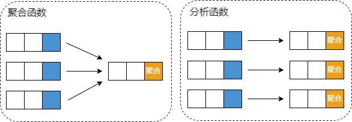
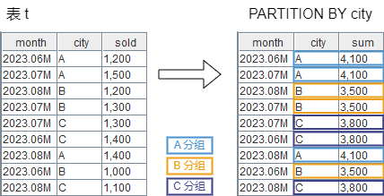
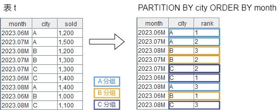
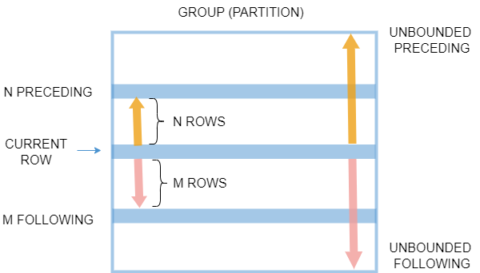
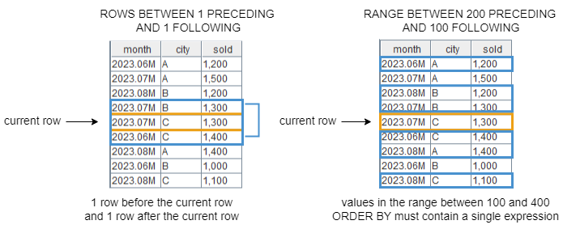

# 分析函数

## **OVER 子句**

分析函数（窗口函数）在特定窗口（行集）上应用聚合函数和排名函数，与聚合函数不同的时，聚合函数为一个分组返回一个结果，而分析函数为分组内的每行返回一个结果。OVER
子句与窗口函数一起使用来定义窗口。


### 语法

```
 <analytic_function> OVER (
    PARTITION BY <column>
    ORDER BY <column> ASC|DESC
    <window_frame>) <window_column_alias>
```

PARTITION BY、ORDER BY 和 window\_frame 都是可选的。

## PARTITION BY

PARTITION BY 子句用于将数据表分成多个组。可对每个分组数据单独应用分析函数。如果没有 PARTITION BY
子句，整个数据表是一个分组。

```
create table t(
    month MONTH,
    city STRING,
    sold INT
);

go

insert into t values(2023.06M, "A", 1200);
insert into t values(2023.07M, "A", 1500);
insert into t values(2023.08M, "B", 1200);
insert into t values(2023.07M, "B", 1300);
insert into t values(2023.07M, "C", 1300);
insert into t values(2023.06M, "C", 1400);
insert into t values(2023.08M, "A", 1400);
insert into t values(2023.06M, "B", 1000);
insert into t values(2023.08M, "C", 1100);

SELECT
  month,
  city,
  sum(sold) OVER (PARTITION BY city) AS sum
FROM t;
```



当对分布式表应用分析函数时，若 PARTITION BY
后的列是分区列，则在每个分区内部执行分析函数；否则，需要把整个表数据读取到内存中重新分区后执行分析函数。此时若分区表的数据量比较大，性能会比较差。

## ORDER BY

ORDER BY 子句指定应用分析函数的每个分组中的行顺序。如果没有指定 ORDER BY 子句，则分组内的行是无序的。如果指定了 ORDER BY
子句，分组中的数据会按照 ORDER BY 子句指定的列排序后再应用分析函数。

```
SELECT
  month,
  city,
  rank() OVER (PARTITION BY city ORDER BY month) AS rank
FROM t;
```



根据上面两个例子的结果，我们可以观察到，无论是否指定 ORDER BY，DolphinDB 输出的结果都会保持原表的顺序。

## 窗口帧（<window\_frame>）

### 窗口帧定义

对于每一行，其分组内都有一组行，称为窗口帧*。*例如一个分组有10行，则某行的窗口帧就是其中 N
行的集合，N的范围是[1,10]。某些窗口函数仅作用于窗口内的行，而不是整个分组。


DolphinDB 支持通过 ROWS 和 RANGE 定义窗口帧。

```
ROWS|RANGE BETWEEN lower_bound AND upper_bound
```

BETWEEN ... AND ... 指在... 之间，下限（lower bound）必须位于上限（upper
bound）之前。边界可以是5个选项中的任意一个：

* UNBOUNDED PRECEDING：当前行之前所有行
* n PRECEDING
* CURRENT ROW：仅当前行
* n FOLLOWING
* UNBOUNDED FOLLOWING：当前行之后所有行

其中，指定 n PRECEDING/FOLLOWING 时：

* ROWS 根据行号来确定窗口的范围，此时 n 必须是整数。例如，ROWS BETWEEN 1 PRECEDING AND 1 FOLLOWING
  表示当前行的前1行和后1行，共3行。
* RANGE 根据 ORDER BY 列的行值来确定窗口的范围。必须指定 ORDER BY 子句，且该子句只能包含一个表达式。此时 n 可以是整数或
  DURATION。当 n 是整数时，其单位和 ORDER BY 列相同；当 n 是 DURATION 时，它是一个时间间隔，其精度不能高于
  ORDER BY 列的时间精度。以 n 为整数为例，RANGE BETWEEN 200 PRECEDING AND 100 FOLLOWING
  表示当前行的值减200和当前行的值加100之间的所有行，包括相同排序值的行。
* 若同时指定 PRECEDING 和 FOLLOWING，则 n 的数据类型必须保持一致。



在定义窗口帧的边界时，支持使用以下缩写：

* `ROWS | RANGE UNBOUNDED PRECEDING` 等价于 `ROWS |
  RANGE BETWEEN UNBOUNDED PRECEDING AND CURRENT ROW`
* `ROWS | RANGE n PRECEDING` 等价于 `ROWS | RANGE
  BETWEEN n PRECEDING AND CURRENT ROW`
* `ROWS | RANGE CURRENT ROW` 等价于 `ROWS | RANGE
  BETWEEN CURRENT ROW AND CURRENT ROW`

### 默认窗口帧

如果没有指定 <window\_frame> 子句，则默认窗口帧取决于是否使用 ORDER BY 子句。

* 如果使用 ORDER BY，则默认窗口帧为 `RANGE BETWEEN UNBOUNDED PRECEDING AND
  CURRENT ROW`
* 如果不使用 ORDER BY，则默认窗口帧为 `ROWS BETWEEN UNBOUNDED PRECEDING AND
  UNBOUNDED FOLLOWING`

由于默认窗口帧根据是否使用 ORDER BY 子句而有所不同，因此是否使用 ORDER BY 子句也可能影响到查询结果。例如，sum
的计算结果可能会改变。因此建议在查询语句中明确指定窗口帧。

注：

* RANGE 搭配 ORDER BY 时，ORDER BY 后面的列字段只能是整型或时间类型。

## 分析函数（<analytic\_function>）

DolphinDB 支持以下几类分析函数，需要注意的是，在 DolphinDB 中，应用分析函数后的输出结果的顺序与原表的顺序保持一致。

| **函数名** | **说明** |
| --- | --- |
| sum | 行的总和。 |
| sum2 | 行的平方和。 |
| avg | 行的平均值。 |
| std | 计算标准差。 |
| stdp | 计算总体标准差。 |
| var | 计算方差。 |
| varp | 计算总体方差。 |
| count | 行的计数。 |
| min | 最小值。 |
| imin | 最小值的位置。如果有多个相同的最小值，返回左起第一个最小值的位置。 |
| iminLast | 最小元素的位置。如果有多个相同的最小值，返回右起第一个最小值的位置。 |
| max | 最大值。 |
| imax | 最大值的位置。如果有多个相同的最大值，返回左起第一个最大值的位置。 |
| imaxLast | 最大值的位置。如果有多个相同的最大值，返回右起第一个最大值的位置。 |
| skew | 倾斜度。 |
| kurtosis | 峰度。 |
| med | 中值。 |
| row\_number | 分组内每行的唯一编号，从1开始。 |
| rank | 某个值在分组内的排名，从1开始。 |
| dense\_rank | 某个值在分组内的密集排名，从1开始。 |
| percent\_rank | 某行的百分位排名，取值范围为[0,1]。 |
| cume\_dist | 某个值在分组中的累积分布。如果按升序排列，则统计行值小于等于当前行值的行数除以总行数。如果按降序排列，则统计行值大于等于当前值的行数除以总行数。取值范围为(0,1]。 |
| lead(expr, offset=1, default=NULL) | 当前行之后的行偏移值。offset 和 default 可选。不支持窗口帧。 |
| lag(expr, offset=1, default=NULL) | 当前行之前的行偏移值。offset 和 default 可选。不支持窗口帧。 |
| ntile | 将分组内的行尽可能均匀地分为 n 组，并为每行分配组号。当不使用 ORDER BY 子句时，输出表字段随机。不支持窗口帧。 |
| first\_value | 第一行的值。 |
| last\_value | 最后一行的值。 |
| nth\_value | 第 N 行的值。 |
| firstNot(X, [k]) | 第一个不为 NULL（或 *k*）的元素。 |
| lastNot(X, [k]) | 最后一个不为 NULL（或 *k*）的元素。 |
| prod | 所有行的乘积。 |
| percentile(X, percent, [interpolation='linear']) | 计算百分位数。 |
| wavg(X,Y) | 计算加权平均数。 |
| wsum(X,Y) | 计算 *X* 和 *Y* 之间内积。 |
| corr(X, Y) | 计算 *X* 和 *Y* 之间的相关性。 |
| covar(X, Y) | 计算 *X* 和 *Y* 的协方差。 |
| beta(X, Y) | 计算 *Y* 在 *X* 上的回归系数的最小二乘估计 |
| atImax(location, value) | 找出 *location* 中最大值所在的位置，然后返回 *value* 中该位置对应的值。 |
| atImin(location, value) | 找出 *location* 中最小值所在的位置，然后返回 *value* 中该位置对应的值。 |

**例子**

```
create table t(
    id INT,
    sym SYMBOL,
    volume INT
);

insert into t values(1, `R, 200);
insert into t values(2, `P, 500);
insert into t values(1, `P, 100);
insert into t values(1, `P, 300);
insert into t values(2, `R, 300);
insert into t values(2, `P, 400);
insert into t values(3, `R, 400);

select * from t;

```

| id | sym | volume |
| --- | --- | --- |
| 1 | R | 200 |
| 2 | P | 500 |
| 1 | P | 100 |
| 1 | P | 300 |
| 2 | R | 300 |
| 2 | P | 400 |
| 3 | R | 400 |

按 sym 分组后，获取每组内由当前行的前1行和后2行确定的窗口帧内的 volume 的总和。

```
select
  *,
  sum(volume) over (
    partition by sym
    rows between 1 preceding and 2 following)
from
  t;

```

| id | sym | volume | sum |
| --- | --- | --- | --- |
| 1 | R | 200 | 900 |
| 2 | P | 500 | 900 |
| 1 | P | 100 | 1,300 |
| 1 | P | 300 | 800 |
| 2 | R | 300 | 900 |
| 2 | P | 400 | 700 |
| 3 | R | 400 | 700 |

按 sym 分组并按 volume 升序排序后，获取每组内当前行的百分位排名。

```
select
  *,
  percent_rank() over (
    partition by sym
    order by volume)
from
  t;

```

| id | sym | volume | percent\_rank |
| --- | --- | --- | --- |
| 1 | R | 200 | 0 |
| 2 | P | 500 | 1 |
| 1 | P | 100 | 0 |
| 1 | P | 300 | 0.3333 |
| 2 | R | 300 | 0.5 |
| 2 | P | 400 | 0.6667 |
| 3 | R | 400 | 1 |

获取分组内每行根据 volume 的排名。如果不使用 order by 子句，则所有排名一样。如果指定 order by 子句，则会根据 order by
后的列进行排名，默认是升序。

```
// 不使用 order by
select
  *,
  rank() over (
    partition by sym)
from
  t;

```

| id | sym | volume | rank |
| --- | --- | --- | --- |
| 1 | R | 200 | 1 |
| 2 | P | 500 | 1 |
| 1 | P | 100 | 1 |
| 1 | P | 300 | 1 |
| 2 | R | 300 | 1 |
| 2 | P | 400 | 1 |
| 3 | R | 400 | 1 |

```

// 使用 order by
select
  *,
  rank() over (
    partition by sym
    order by volume)
from
  t;

```

| id | sym | volume | rank |
| --- | --- | --- | --- |
| 1 | R | 200 | 1 |
| 2 | P | 500 | 4 |
| 1 | P | 100 | 1 |
| 1 | P | 300 | 2 |
| 2 | R | 300 | 2 |
| 2 | P | 400 | 3 |
| 3 | R | 400 | 3 |

按 sym 分组按 id 降序排序后，在由当前行的前2行到当前行组成的窗口内，获取第一行的值。

```
 select
  *,
  first_value(volume) OVER(
    partition by sym
    ORDER BY id DESC
    rows 2 preceding)
from
  t;

```

| id | sym | volume | first\_value |
| --- | --- | --- | --- |
| 1 | R | 200 | 400 |
| 2 | P | 500 | 500 |
| 1 | P | 100 | 500 |
| 1 | P | 300 | 400 |
| 2 | R | 300 | 400 |
| 2 | P | 400 | 500 |
| 3 | R | 400 | 400 |

对分布式表应用分析函数。

```
t = table(1 2 1 1 2 2 3 as id, `R`P`L`P`R`L`R as sym, 200 500 100 300 300 400 400 as volume)
db_name = "dfs://window_function"
if (existsDatabase(db_name)) {
    dropDatabase(db_name)
}
db = database(db_name, HASH, [INT, 2], , 'TSDB')

pt = db.createPartitionedTable(t, "pt", "id", ,"volume")
pt.append!(t)

// 按 sym 列分组后，按 id 按升序排序后，获取 volume 当前行后面第1行的值，若没有对应行，则填充-1。
select
  *,
  lead(volume, 1, -1) OVER(
    PARTITION BY sym
    ORDER BY id)
from
  t;

```

| id | sym | volume | lead |
| --- | --- | --- | --- |
| 1 | R | 200 | 300 |
| 2 | P | 500 | -1 |
| 1 | L | 100 | 400 |
| 1 | P | 300 | 500 |
| 2 | R | 300 | 400 |
| 2 | L | 400 | -1 |
| 3 | R | 400 | -1 |

本例将介绍如何基于时间窗口进行字段统计。

```
n=10
date= rand(2022.10.01..2022.10.04 join 2022.11.01 join 2022.12.04 join 2022.12.06 join 2022.12.10 join 2023.01.01 join 2023.02.02, n)
price = [49.6,29.46,49.6,50.6,64.97,56.9,50.66,50.32,51.29,62.36]
qty = [2200,1900,2000,2200,6800,2100,1300,6600,8800,5300]
sym = rand(string(["C", "MS", "A"]), n)
t = table(date, sym, qty, price);
t
```

| date | sym | qty | price |
| --- | --- | --- | --- |
| 2022.10.02 | C | 2,200 | 49.6 |
| 2022.12.06 | C | 1,900 | 29.46 |
| 2022.12.10 | C | 2,000 | 49.6 |
| 2022.10.02 | A | 2,200 | 50.6 |
| 2022.10.02 | MS | 6,800 | 64.97 |
| 2023.02.02 | C | 2,100 | 56.9 |
| 2022.10.01 | C | 1,300 | 50.66 |
| 2023.02.02 | MS | 6,600 | 50.32 |
| 2022.10.03 | A | 8,800 | 51.29 |
| 2022.12.04 | MS | 5,300 | 62.36 |

首先基于 sym 字段进行分区，然后根据 date 字段进行排序。对每个记录的 date 值，开启一个 RANGE，包含前面1个月和后面1个月。统计每个 RANGE 中的
qty 的最大值。

```
select *, max(qty) over (partition by sym order by date RANGE BETWEEN 1M PRECEDING AND 1M FOLLOWING) from t
```

| date | sym | qty | price | max |
| --- | --- | --- | --- | --- |
| 2022.10.02 | C | 2,200 | 49.6 | 2,200 |
| 2022.12.06 | C | 1,900 | 29.46 | 2,000 |
| 2022.12.10 | C | 2,000 | 49.6 | 2,000 |
| 2022.10.02 | A | 2,200 | 50.6 | 8,800 |
| 2022.10.02 | MS | 6,800 | 64.97 | 6,800 |
| 2023.02.02 | C | 2,100 | 56.9 | 2,100 |
| 2022.10.01 | C | 1,300 | 50.66 | 2,200 |
| 2023.02.02 | MS | 6,600 | 50.32 | 6,600 |
| 2022.10.03 | A | 8,800 | 51.29 | 8,800 |
| 2022.12.04 | MS | 5,300 | 62.36 | 5,300 |

