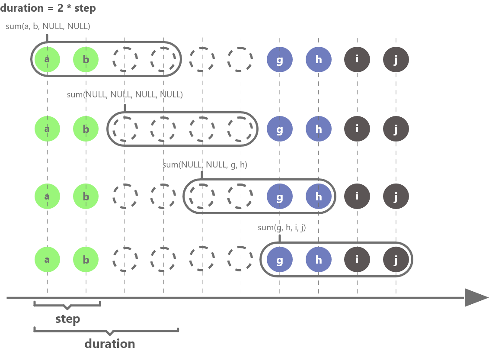
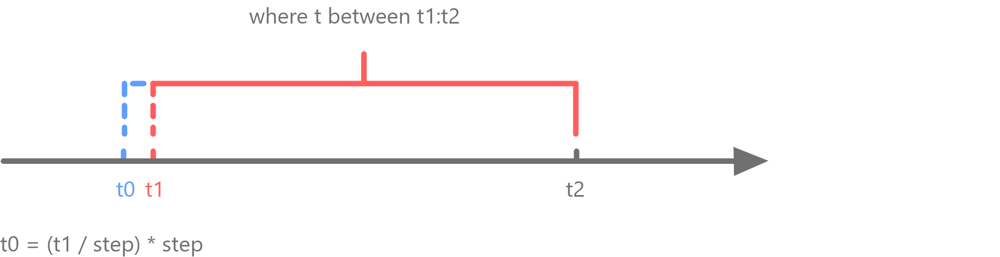

# interval

## 语法

`interval(X, duration, fill, [step], [explicitOffset=false], [closed],
[label], [origin])`

## 详情

在 SQL 语句中，构建涵盖 *X* 所有数据的连续窗口以进行计算，其中每个窗口长度为 *duration*。对无数据的组，根据
*fill* 参数指定的方式填充缺失的计算结果。该函数只能在 SQL 的 group by 子句中使用，以实现插值查询，不能单独使用。

注： 若SQL语句中指定where子句，条件中的时间类型支持自动转换。

## 参数

* **X** 是一个向量，必须是整数或者时间类型。
* **duration** 是一个整数或者 DURATION 类型。 *duration*
  支持的时间单位（区分大小写）：w, d, H, m, s, ms, us, ns 和由四个大写英文字母构成的交易日历标识（对应的文件必须保存在
  *marketHolidayDir* 中）。
* 对 *X* 以年进行分组时，需要调用[year](../../funcs/y/year.md) 对 *X* 进行转换。
* **fill** 是计算结果缺失值的填充方式，可取值为：'prev', 'post', 'linear', 'null', 'none'
  和一个数字。

  + 'prev'：使用前一个值填充。
  + 'post'：使用后一个值填充。
  + 'linear'：使用线性插值填充。对于非数值列，无法使用线性插值填充，这种情况下会使用 "prev" 的方式填充。
  + 'null'：使用 null 值填充。
  + 'none'：表示不进行插值。
  + 一个数字：以该值填充。
* **step** 是可选参数，是一个整数或者 DURATION 类型，表示计算窗口每次向前滑动的步长，必须为一个可以整除
  *duration* 的数。 通过 *step* 可以指定一个比 *duration* 更小的滑动步长。默认与
  *duration* 设置值相同，即计算窗口以 *duration* 的步长滑动。

  **注意**：
  + 指定 *step* 后，不支持以下聚合计算：atImax, atImin, difference, imax, imin,
    lastNot, mode, percentile。
  + 当 *step* 与 *duration* 的值不同时，在查询分区表时，不支持对查询列应用自定义聚合函数。
* **explicitOffset** 是可选参数，是一个布尔值，表示第一个插值窗口起点是否为 where 条件指定的起始值。
* **closed** 字符串，表示分组区间哪一个边界是闭合的。可取值为 'left' 或 'right'。
* **label** 字符串，表示将分组区间的哪一个边界作为 label 输出。可取值为 'left' 或 'right'。
* **origin** 字符串或与 X 具有相同时间类型的标量，表示基于时间戳调整分组。origin 为字符串时，可取以下值：

  + 'epoch'：分组起始点为1970-01-01。
  + 'start'：分组起始点为时间序列的第一个值。
  + 'start\_day'：分组起始点是时间序列的第一个值对应日期的午夜零点。
  + 'end'：分组起始点是时间序列的最后一个时间戳。
  + 'end\_day'：分组起始点是时间序列的最后一个时间戳对应日期的午夜24点（即下一日的零点）。

注： 若设置 explicitOffset = true，则不能设置 origin。

注：从 2.00.2 版本开始，取消了 *range* 参数。

下图以 *duration* = 2 \* *step* 为例，进一步解释插值窗口如何进行滑动计算（结果为 NULL 的窗口需要根据
*fill* 参数指定的方式进行填充）：



下图解释了 *explicitOffset* 不同设置下，插值起始窗口如何确定。图中 where 条件指定起始值为 t1，t1 前最近的一个能被
*step* 整除的值为 t0，当 *explicitOffset* 设置为 true 时，插值起始窗口以 t1 开始，当
*explicitOffset* 设置为 false 时，插值起始窗口以 t0 开始。



## 例子

使用前一个值填充：

```
timestampv = temporalAdd(2012.01.01T00:00:00.000, 0..11 join 15..20 , "s")
a1v = [3,2.5,1.7,1.1,1.8,2.1,1.1,1.4,1.9,2.4,2.9,2.6,1.1,2.7,1.1,2.9,1.9,1.7]
t = table(timestampv as timestamp, a1v as a1)

select max(a1) from t group by interval(timestamp, 3s, "prev")
```

| interval\_timestamp | max\_a1 |
| --- | --- |
| 2012.01.01T00:00:00.000 | 3 |
| 2012.01.01T00:00:03.000 | 2.1 |
| 2012.01.01T00:00:06.000 | 1.9 |
| 2012.01.01T00:00:09.000 | 2.9 |
| 2012.01.01T00:00:12.000 | 2.9 |
| 2012.01.01T00:00:15.000 | 2.7 |
| 2012.01.01T00:00:18.000 | 2.9 |

使用指定数字填充：

```
select max(a1) from t group by interval(timestamp, 3s, 100)
```

| interval\_timestamp | max\_a1 |
| --- | --- |
| 2012.01.01T00:00:00.000 | 3 |
| 2012.01.01T00:00:03.000 | 2.1 |
| 2012.01.01T00:00:06.000 | 1.9 |
| 2012.01.01T00:00:09.000 | 2.9 |
| 2012.01.01T00:00:12.000 | 100 |
| 2012.01.01T00:00:15.000 | 2.7 |
| 2012.01.01T00:00:18.000 | 2.9 |

下例中，以 2 年进行分组，需要将 *X* 的单位进行转换：

```
t=table([2016.10.12T00:00:00.500,2017.10.12T00:00:03.000,2018.10.12T00:00:03.000,2019.10.12T00:00:08.000,2020.10.12T00:00:08.000,2021.10.12T00:00:08.000] as time, [7,9,NULL,NULL,8,6] as price)
select max(price) from t  group by interval(X=year(time), duration=2, fill="prev")
```

| interval | max\_price |
| --- | --- |
| 2016 | 9 |
| 2018 | 9 |
| 2020 | 8 |

下例说明 *explicitOffset* 不同设置下，第一个窗口起始时间的显示值。

```
symbol = `A`A`A`A`A`A`A`A`B`B`B`B
price= [29.55,29.74,29.51,29.54,29.79,29.81,29.50,29.56,29.41,29.49,29.83,29.76]
volume = [2200,1900,2100,3200,8800,5800,4300,9300,7900,9100,7300,6500]
tradeTime = [09:33:56,09:33:59,09:34:08,09:34:16,09:34:51,09:34:59,09:35:47,09:35:26,09:35:36,09:36:26,09:37:12,10:00:00]
t = table(tradeTime, symbol, volume, price)
//explicitOffset设置为true时，起始窗口以where指定的起始值09:33:50开始。
select max(price) as max_price, min(price) as min_price from t where tradeTime between 09:33:50:09:35:00 group by symbol, interval(X=tradeTime, duration=30, fill="post", explicitOffset=true) as tradeTime
```

| symbol | tradeTime | max\_price | min\_price |
| --- | --- | --- | --- |
| A | 09:33:50 | 29.74 | 29.51 |
| A | 09:34:20 | 29.81 | 29.79 |
| A | 09:34:50 | 29.81 | 29.79 |

*explicitOffset* 设置为 false，第一个窗口的起始时间为 09:33:30，即 where
指定的起始时间（09:33:50）前第一个可以被 *step* 整除的时间点。本例中没有设置 *step*，它的取值与
*duration* 一样，第一个窗口起始时间计算方式为：second(09:33:50/30\*30)。

```
select max(price) as max_price, min(price) as min_price from t where tradeTime between 09:33:50:09:35:00 group by symbol, interval(X=tradeTime, duration=30,fill="prev",explicitOffset=false) as tradeTime
```

| symbol | tradeTime | max\_price | min\_price |
| --- | --- | --- | --- |
| A | 09:33:30 | 29.74 | 29.55 |
| A | 09:34:00 | 29.54 | 29.51 |
| A | 09:34:30 | 29.81 | 29.79 |
| A | 09:35:00 | 29.81 | 29.79 |

下例指定 *step* 为 20s，计算窗口长度为 60s，每 20s 向前滑动一次，进行计算。

```
select max(price) as max_price, min(price) as min_price from t where tradeTime between 09:33:50:09:35:00 group by symbol, interval(X=tradeTime, duration=60, fill=0, step=20, explicitOffset=false) as tradeTime
```

| symbol | tradeTime | max\_price | min\_price |
| --- | --- | --- | --- |
| A | 09:33:40 | 29.74 | 29.51 |
| A | 09:34:00 | 29.81 | 29.51 |
| A | 09:34:20 | 29.81 | 29.79 |
| A | 09:34:40 | 29.81 | 29.79 |
| A | 09:35:00 | 0.00 | 0.00 |

下例以自定义交易日历 ADDA 的 2 个交易日进行分组

```
// 自定义交易日历 ADDA，其假期为 2024.01.02 和 2024.01.03
holiday = [2024.01.02, 2024.01.03]
addMarketHoliday("ADDA", holiday)

// 创建待查询表
n = 6
dates=[2023.12.30, 2024.01.02, 2024.01.03, 2024.01.05, 2024.01.07, 2024.01.09]
name = take(`A`B`S`C`F, n)
a1 = take(double(1..3),n)
t=table(dates as date, name as name, a1 as a1)
//计算 ADDA 每两个交易日中 “a1” 的最大值。
select max(a1) from t group by interval(X=date, duration=2ADDA, fill="null", label="right", origin="start")
```

