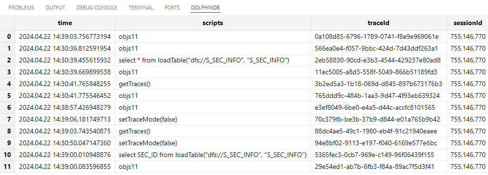
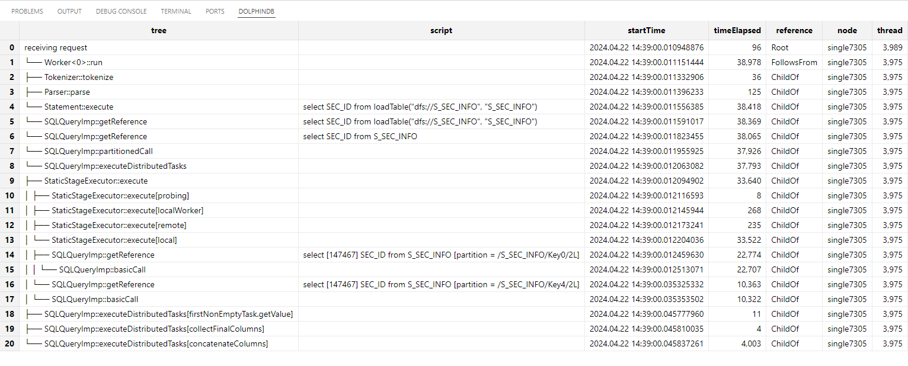

# SQL Trace

SQL Trace 是 DolphinDB 提供的一套函数工具，它能够通过跟踪 SQL 脚本的执行过程，分析复杂 SQL
查询的内部耗时，以达到定位问题并优化执行的目的。

`setTraceMode` 函数用于开启或关闭 SQL Trace。一次完整的跟踪流程必须以
`setTraceMode(true)` 作为开启标识，并以 `setTraceMode(false)`
作为结束标识。需要注意的是，DolphinDB 从开启跟踪功能后接收到的第一次请求开始跟踪。因此， `setTraceMode`
命令必须单独执行，而不能和待跟踪的语句放在同一脚本中一起执行。

开启跟踪后，可以通过调用`getTraces()`
函数来获取一张包含跟踪信息的表。这张表记录了客户端将脚本发送给服务器的时间戳、客户端发送给服务器端执行的脚本、记录SQL Trace信息的 id 和发起 SQL Trace
的会话的 id。

例如，下面的脚本展示了一次完整的 SQL Trace
跟踪流程。

```
setTraceMode(true)
go
select * from loadTable("dfs://S_SEC_INFO", "S_SEC_INFO")
setTraceMode(false)
```

使用`getTraces()` 函数得到的跟踪信息如下图所示。



此外，使用 `viewTraceInfo(traceId, [isTreeView = true])` 还可以展示某个 traceId
对应脚本的跟踪信息。例如，要查看上面执行的 SQL 脚本的跟踪信息，可以使用以下命令。

```
viewTraceInfo("2eb58830-90cd-e3b3-4544-429237e80ad8")
```

下图以树状结构清晰地展示了 SQL 的执行流程，并详细列出了每个步骤的脚本执行耗时。

Copyright

**©2025 浙江智臾科技有限公司 浙ICP备18048711号-3**
