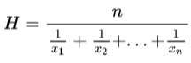
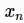

# mapr

在分布式环境中，使用 mapr 语句可以定义 `用户自定义聚合函数（UDAF）<udaf>` 的 map reduce
实现。此外，若要在 cgroup by 中使用用户自定义聚合函数，亦需要在 mapr 语句中进行声明。

## 语法

`mapr udaf(args..){mapF1, mapF2, ..., mapFn -> reduceFunc[; cumF1, cumF2,
..., cumFn -> runningReduceFunc]}`

## 参数

`udaf(args...)` 是用户自定义函数的函数名和参数。

`mapF1~mapFn` 是 map 函数，该部分计算将被 map 到各个数据节点进行。

`reduceFunc` 是 reduce 函数，map 的计算结果将被传入 reduceFunc 用于进一步计算。

[] 部分为可选参数，用于自定义聚合函数的 cgroup by 实现。cgroup（cumulative
group）即累积分组，常用于按时间维度分组后累积计算每个组的统计值。与 group by 不同的是，将数据分组后，group by 每组的数据单独进行计算，而
cgroup by 每组参与计算的数据包含当前组和其之前所有组的数据，详见 cgroup by。

`cumF1~cumFn` 与 `mapF1~mapFn` 一一对应，用于对 map
的结果进行进一步计算。`cumF1~cumFn` 通常指定为内置的累积函数，如 cumsum；或者指定为内置的 copy 函数，将
map 的结果直接传给 `runningReduceFunc`，然后在 runningReduceFunc 中定义累积聚合的逻辑。

注：

mapr 语句及相关的函数需要添加到 init 配置项指定的系统初始化脚本（默认 dolphindb.dos）中，重启
server 后才会生效。

## 例子

定义一个计算调和平均数的自定义聚合函数，调和平均数对应公式如下：



上述公式对  的倒数求平均后再取倒数。基于
mapr，将求倒数平均的部分 map 到各个分区并行计算，最后在 reduce 阶段，用加权平均汇总结果，然后再求一次倒数即可。

```

// 先声明普通的聚合函数
defg harmonicMean(x){
    return x.reciprocal().avg().reciprocal()
}

// 分布式实现
// 先定义一个 map 函数 reciprocalAvg，用于求倒数的平均
def reciprocalAvg(x) : reciprocal(x).avg()

// 定义一个 reduce 函数 harmonicMeanReduce 用于进行 reduce 部分汇总和倒数计算
defg harmonicMeanReduce(reciprocalAvgs, counts) : wavg(reciprocalAvgs, counts).reciprocal()

// mapr 语句，声明 harmonicMean 的 map-reduce 实现
mapr harmonicMean(x){reciprocalAvg(x), count(x) -> harmonicMeanReduce}
```

将上述脚本追加到 init 指定的初始化脚本中。重启 server，然后在客户端运行以下脚本：

```

// 定义一个普通聚合函数，用于和 mapr 实现进行对比
defg harmonicMean_norm(x){
    return x.reciprocal().avg().reciprocal()
}

// 创建分区内存表
n = 100000
t = table((2020.09.01 + rand(9, n)).sort!() as date, take(`IBM`MSFT, n) as sym, rand(10.0, n) as value)
db = database("", RANGE, [2020.09.01, 2020.09.03, 2020.09.10])
stock = db.createPartitionedTable(t, "stock", "date").append!(t)

// 对比查询分区内存表的耗时
timer(1000) select harmonicMean_norm(value) as gval from stock group by sym // Time elapsed: 4932.661 ms
timer(1000) select harmonicMean(value) as gval from stock group by sym // Time elapsed: 2490.347 ms
```

可以看出 map-reduce 的并行计算提升了查询的性能。

在上例的基础上，对 mapr 语句进行改写，定义调和平均数的 cgroup by 实现。

```
// 定义一个累积聚合函数 harmonicMeanRunning
defg harmonicMeanRunning(reciprocalAvgs, counts) : cumwavg(reciprocalAvgs, counts).reciprocal()

// 在上述 mapr 语句的基础上，声明 harmonicMean 的 cgroup by 实现
mapr harmonicMean(x){reciprocalAvg(x), count(x) -> harmonicMeanReduce; copy, copy -> harmonicMeanRunning}
```

将上述脚本继续更新到 init 指定的初始化脚本中，重启 server，然后在客户端运行以下脚本（复用上例创建的分区内存表）：

```
// 在 cgroup by 语句中调用自定义聚合函数 harmonicMean
select harmonicMean(value) as gval from stock cgroup by date order by date
```

更多例子和说明请参考教程：[自定义聚合函数](../../tutorials/udaf.md)

