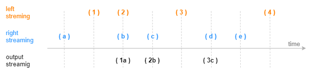
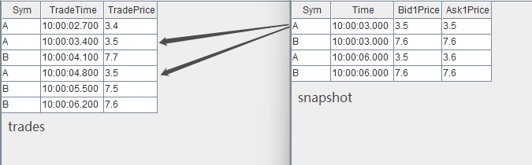
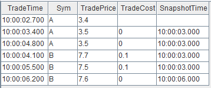

# asof join 引擎

asof join 引擎由 `createAsofJoinEngine` 函数创建。

asof join 引擎的连接机制类似于 SQL 中的 asof
join，按连接列分组，在每个分组内按时间邻近度关联左右表。引擎默认左右表是有序的，在连接列分组内，对于左表的每一条记录，当引擎判断邻近的时刻到来后，在右表缓存中选取在该条左表记录的时刻之前且最接近的一条记录，不论是否找到，引擎都将输出一条结果。

asof join 引擎在创建时通过参数 *useSystemTime* 指定以下两种规则中的一种，用于判断临近时刻是否到来：

* 规则一：以数据注入引擎时的系统时间为时序标准，则每一条左表记录注入引擎时立刻关联并输出
* 规则二：以数据中的时间列为时序标准，当右表数据的最新时刻大于左表数据的时刻时触发关联并输出

在规则二的基础上，还可以通过参数 *delayedTime* 设置超时强制触发规则。

下图展示在一个分组中，以非系统时间触发输出的 Asof Join 引擎效果（未设置超时强制触发），触发输出的时刻由右表到来新数据决定。



`createAsofJoinEngine` 函数的语法如下：

```
createAsofJoinEngine(name, leftTable, rightTable, outputTable, metrics, matchingColumn, [timeColumn], [useSystemTime=false], [delayedTime], [garbageSize], [sortByTime])
```

其参数的详细含义可以参考：[createAsofJoinEngine](../funcs/c/createAsofJoinEngine.md) 函数。

## 应用例子 1-计算个股交易成本

因为逐笔成交数据和报价数据的发生时间不可能完全一致而不能使用常用的等值连接，往往需要以成交时间为基准找到交易发生前的最近一次报价数据，因此需要以邻近匹配的方式关联两个数据流。

这个场景的特征是，每条成交记录匹配一条时刻早于自己的报价记录，输出与原始的每一条成交记录一一对应。以下脚本用
asof join
引擎来实现此场景：

```
// create table
share streamTable(1:0, `Sym`TradeTime`TradePrice, [SYMBOL, TIME, DOUBLE]) as trades
share streamTable(1:0, `Sym`Time`Bid1Price`Ask1Price, [SYMBOL, TIME, DOUBLE, DOUBLE]) as snapshot
share streamTable(1:0, `TradeTime`Sym`TradePrice`TradeCost`SnapshotTime, [TIME, SYMBOL, DOUBLE, DOUBLE, TIME]) as output

// create engine
ajEngine = createAsofJoinEngine(name="asofJoin", leftTable=trades, rightTable=snapshot, outputTable=output, metrics=<[TradePrice, abs(TradePrice-(Bid1Price+Ask1Price)/2), snapshot.Time]>, matchingColumn=`Sym, timeColumn=`TradeTime`Time, useSystemTime=false, delayedTime=1000)

// subscribe topic
subscribeTable(tableName="trades", actionName="appendLeftStream", handler=getLeftStream(ajEngine), msgAsTable=true, offset=-1, hash=0)
subscribeTable(tableName="snapshot", actionName="appendRightStream", handler=getRightStream(ajEngine), msgAsTable=true, offset=-1, hash=1)
```

* 逐笔成交数据 trades 注入引擎的左表，报价数据 snapshot 注入引擎的右表。
* 引擎参数 *useSystemTime*=false 表示通过数据中的时间列（左表为 TradeTime 字段，右表为 Time
  字段）来判断左右表中记录的时序关系。
* 引擎参数 *delayedTime* 是对默认触发机制的补充，以超时强制触发的方式保证左表及时匹配并输出。若未设置
  *delayedTime*
  是默认触发机制，对于任意一条左表记录，它必须等到右表出现一条时间戳大于它的记录才输出。但考虑到实际的应用场景中，某条右表记录可能迟迟未能到达或者始终不可能出现一条大于某些左表数据的右表记录，同时期望左表中每条记录都能匹配并输出，那么建议设置
  *delayedTime* ，在这种情况下将以左表出现更新的数据或者系统时间超时来强制触发计算。
* 引擎参数 *metrics* 中 snapshot.Time 表示取右表 snapshot 中的 Time 字段，因为左表 trades
  中也具有 Time 字段，若不加前缀、直接写 Time，则默认取左表的 Time 字段。
* 上例中创建引擎时未显式指定 *garbageSize* ，则使用默认值，*garbageSize*
  不论大小均不改变计算结果，只影响引擎的内存占用。

构造数据写入作为原始输入的 2
个流数据表，先写入右表，再写入左表：

```
// generate data: trade
t1 = table(`A`A`B`A`B`B as Sym, 10:00:02.000+(1..6)*700 as TradeTime,  (3.4 3.5 7.7 3.5 7.5 7.6) as TradePrice)
// generate data: snapshot
t2 = table(`A`B`A`B as Sym, 10:00:00.000+(3 3 6 6)*1000 as Time, (3.5 7.6 3.5 7.6) as Bid1Price, (3.5 7.6 3.6 7.6) as Ask1Price)
// input data
snapshot.append!(t2)
trades.append!(t1)
```

输入数据与关联关系如下：



关联得到的结果表
*output* 如下，左表中全部 7 条数据都有对应的输出。本例中，在创建引擎时指定了 *delayedTime*
参数，因此对于分组 B ，即使右表 *snapshot* 中没有比 10:00:06.200 更大的时间戳， 左表 *trades*
中最后一条数据 (B,10:00:06.200, 7.6) 仍然能够在注入引擎 2s 后强制输出。



## 应用例子2

```
share streamTable(1:0, `time`sym`price, [TIMESTAMP, SYMBOL, DOUBLE]) as trades
share streamTable(1:0, `time`sym`bid`ask, [TIMESTAMP, SYMBOL, DOUBLE, DOUBLE]) as quotes
prevailingQuotes=table(100:0, `time`sym`price`bid`ask`spread, [TIMESTAMP, SYMBOL, DOUBLE, DOUBLE, DOUBLE, DOUBLE])

ajEngine=createAsofJoinEngine(name="aj1", leftTable=trades, rightTable=quotes, outputTable=prevailingQuotes, metrics=<[price, bid, ask, abs(price-(bid+ask)/2)]>, matchingColumn=`sym, timeColumn=`time, useSystemTime=false)
tmp1=table(2020.08.27T09:30:00.000+2 8 20 22 23 24 as time, take(`A`B, 6) as sym, 20.01 20.04 20.07 20.08 20.4 20.5 as price)
tmp2=table(2020.08.27T09:30:00.000+1 5 6 11 19 20 21 as time, take(`A`B, 7) as sym, 20 20.02 20.03 20.05 20.06 20.6 20.4 as bid,  20.01 20.03 20.04 20.06 20.07 20.5 20.6 as ask)
tmp1.sortBy!(`time)
tmp2.sortBy!(`time)

subscribeTable(tableName="trades", actionName="joinLeft", offset=0, handler=appendForJoin{ajEngine, true}, msgAsTable=true)
subscribeTable(tableName="quotes", actionName="joinRight", offset=0, handler=appendForJoin{ajEngine, false}, msgAsTable=true)

trades.append!(tmp1)
quotes.append!(tmp2)

sleep(100)
select time, sym, bid from prevailingQuotes
```

| time | sym | bid |
| --- | --- | --- |
| 2020.08.27T09:30:00.002 | A | 20 |
| 2020.08.27T09:30:00.020 | A | 20.06 |
| 2020.08.27T09:30:00.008 | B | 20.02 |

```
//清理引擎及变量
unsubscribeTable(tableName="trades", actionName="joinLeft")
unsubscribeTable(tableName="quotes", actionName="joinRight")
undef(`trades,SHARED)
undef(`quotes,SHARED)
dropAggregator(name="aj1")

//定义引擎，设置 sortByTime=true
share streamTable(1:0, `time`sym`price, [TIMESTAMP, SYMBOL, DOUBLE]) as trades
share streamTable(1:0, `time`sym`bid`ask, [TIMESTAMP, SYMBOL, DOUBLE, DOUBLE]) as quotes
prevailingQuotes=table(100:0, `time`sym`price`bid`ask`spread, [TIMESTAMP, SYMBOL, DOUBLE, DOUBLE, DOUBLE, DOUBLE])
ajEngine=createAsofJoinEngine(name="aj1", leftTable=trades, rightTable=quotes, outputTable=prevailingQuotes, metrics=<[price, bid, ask, abs(price-(bid+ask)/2)]>, matchingColumn=`sym, timeColumn=`time, useSystemTime=false, sortByTime=true)

tmp1=table(2020.08.27T09:30:00.000+2 8 20 22 23 24 as time, take(`A`B, 6) as sym, 20.01 20.04 20.07 20.08 20.4 20.5 as price)
tmp2=table(2020.08.27T09:30:00.000+1 5 6 11 19 20 21 as time, take(`A`B, 7) as sym, 20 20.02 20.03 20.05 20.06 20.6 20.4 as bid,  20.01 20.03 20.04 20.06 20.07 20.5 20.6 as ask)
tmp1.sortBy!(`time)
tmp2.sortBy!(`time)
//只能使用 appendForJoin 插入数据
subscribeTable(tableName="trades", actionName="joinLeft", offset=0, handler=appendForJoin{ajEngine, true}, msgAsTable=true)
subscribeTable(tableName="quotes", actionName="joinRight", offset=0, handler=appendForJoin{ajEngine, false}, msgAsTable=true)

trades.append!(tmp1)
quotes.append!(tmp2)

sleep(100)
//查看结果表，数据按照全局时间顺序输出
```

| time | sym | bid |
| --- | --- | --- |
| 2020.08.27T09:30:00.002 | A | 20 |
| 2020.08.27T09:30:00.008 | B | 20.02 |
| 2020.08.27T09:30:00.020 | A | 20.06 |

