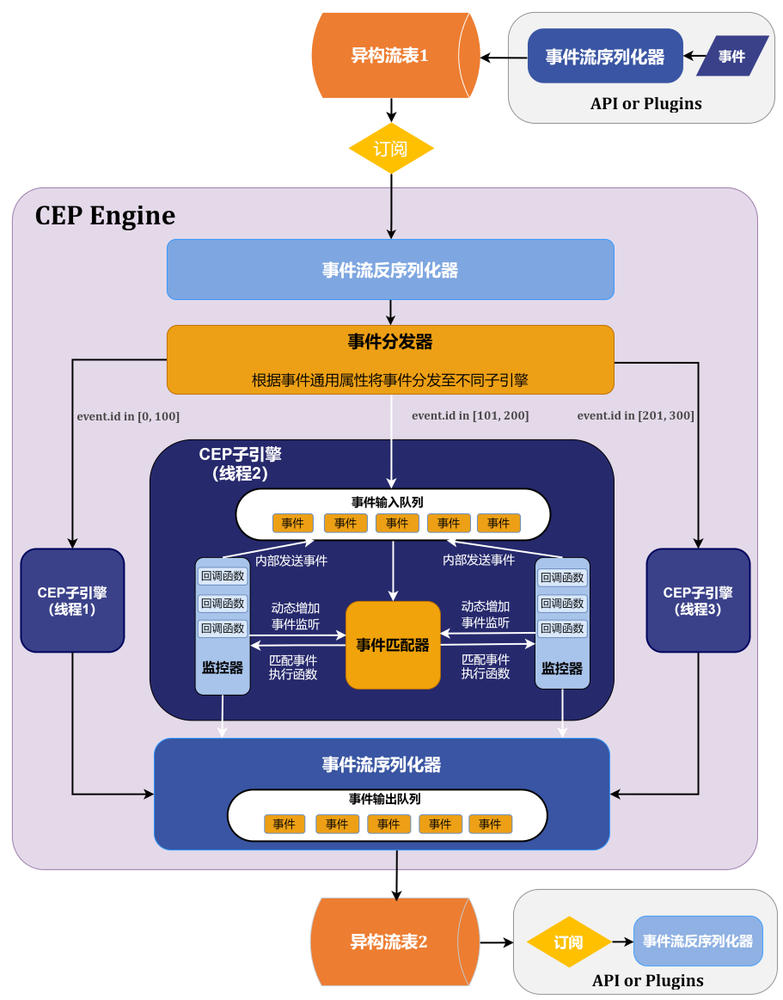

# 复杂事件处理（CEP）引擎

## 概述

复杂事件处理（Complex Event Processing，简称 CEP
）引擎是一款用于实时处理和分析事件流中复杂事件的引擎。其主要功能包括接收实时数据流，定义事件并从事件流中检测特定事件，进而对满足指定规则的事件执行预设的操作。详细功能介绍如下：

* 事件捕捉和过滤： 从大量实时数据流中找到特定事件。
* 事件模式：识别指定的事件模式，这些模式可以涉及多个事件的组合，形成具有特定含义的事件序列。
* 复杂事件处理：执行复杂的事件处理逻辑，包括筛选、聚合、转换等操作，以识别关键信息或发现特定的业务模式。

表 1. 与其它流数据处理引擎的区别

|  | CEP | 普通流处理引擎 |
| --- | --- | --- |
| **数据结构** | CEP 引擎专门处理复杂事件。同一个数据源中的数据可以被定义为多种不同的事件。多个简单的事件组合成复杂事件。它具备识别事件间特定模式和关系的能力，并根据不同的事件执行相应的处理逻辑。 | 普通流计算引擎中没有事件的概念。同一个数据源中的数据具有相同的数据结构，使用相同的处理逻辑。一个普通流计算引擎中不能处理具有不同结构的数据流，更不能识别数据流之间的关系。 |
| **处理方式** | 采用事件驱动的方式进行处理，主要通过识别和匹配复杂事件模式、窗口操作和时序分析来提取有用的信息。它通常需要定义和管理一组模式，以筛选和处理数据流中的事件。 | 普通流计算引擎应用同样的计算逻辑来处理所有接收到的数据。 |
| **目标** | 从实时数据流中提取指定的事件和模式，以便进行实时的分析、决策支持和响应。它强调在大规模、高速和复杂的数据流中发现和识别重要的事件和关联关系。 | 一般对数据进行高效的聚合、计算等，以满足具体的业务需求。 |

**CEP 架构**

CEP 引擎架构图如下：

从上图可以看出，一个完整的 CEP 应用包括以下几个部分：事件流序列化器、事件流反序列化器、事件分发器、CEP 子引擎。事件是贯穿这些部分的基本元素，在详细介绍 CEP
架构中各个部分的功能和内部接口之前，我们先了解 CEP 引擎中的基本概念。

Copyright

**©2025 浙江智臾科技有限公司 浙ICP备18048711号-3**
