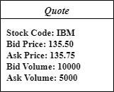

# 基本概念

DolphinDB CEP 是面向事件编程的 DolphinScript，主要包含以下基本概念：事件、监视器、监听器、模式匹配、事件处理。

## 事件

事件是描述对象变化的属性值的集合。例如，下图显示了股票报价事件。每个股票报价都有许多属性，包括当前买价、当前卖价和当前交易量。在实际生产场景中，事件以数据流的方式存在并源源不断地产生。

在 DolphinDB 中，事件（event）被定义为一个类，其类名为事件类型（eventType）。用户可在事件类中自定义事件的属性值。

通常，用户在事件流中除了定义事件外，还会对事件进行额外的限制。这些包含限制条件的事件构成了复杂事件，例如：

* 限制事件顺序：A 事件之后跟着事件 B。
* 限制事件属性值：A 的属性 A.a > 100。
* 限制时间：在5分钟内收到事件 B。

## 监视器

CEP 引擎内部通过监视器（Monitor）从事件流中检测指定的事件或事件模式。 在 DolphinDB
中，监视器也被定义为一个类，其类名表示监视器名称。一个监视器主要包含以下内容：

* 一个或多个事件监听（Event Listener)。 监听器是用于指定需要匹配的事件。它从进行 CEP 引擎的事件流中检测并筛选匹配的事件。
* 一个或多个回调函数。 回调函数是 CEP 引擎检测到匹配事件之后执行的操作。
* `onload` 方法。在引擎创建时会执行该方法，启动 Monitor 的监听动作。

监视器在 CEP 子引擎启动后进行实例化，开始工作。它从大量的事件中监视指定的事件，并在检测到匹配事件之后执行预定义的操作。一个 CEP
引擎能够同时定义数十万个监听器，以监听不同的事件。

## 监听器与匹配器

事件监听器（Event Listener）在 Monitor 中定义，其用于监听事件流中的事件。事件匹配器（Event
Matcher）对输入的事件流进行实时分析，以识别出满足预定义模式的事件。当匹配器找到与其事件表达式匹配的事件序列时，由事件监听器触发并执行相关回调函数。

在了解了 CEP 应用程序中的基本概念后，接下来将介绍如何定义它们。对它们所包含的接口及参数进行详细说明。

