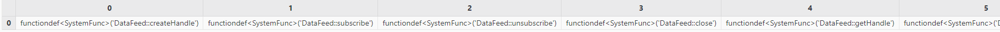
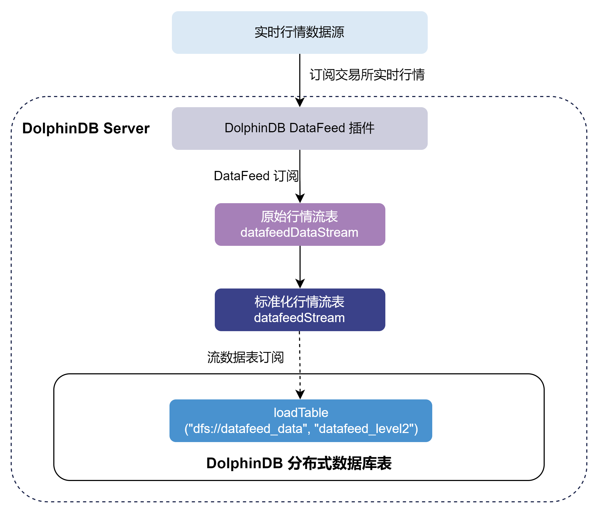
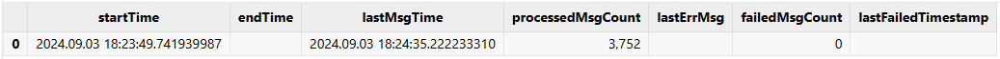

# DolphinDB DataFeed 行情插件最佳实践指南

Datafeed 是中国金融期货交易所提供的非展示型行情源数据服务，用于发送股票或期货的实时
Level-2行情数据，主要应用于算法交易、风险控制、数据分析研究和策略开发等场景。DolphinDB DataFeed 行情插件通过集成中金所提供的 SDK
来接收非展示型行情源数据，并存入 DolphinDB 的数据表。该插件使用组播方式接收数据，依赖第三方库 libdatafeed\_multi\_api.so。

本文主要介绍如何通过 DataFeed 插件将实时行情数据写入分布式数据库，以及如何实现节点启动时自动订阅 Datafeed 实时行情。本文所涉及的所有代码需运行在
DolphinDB server 2.00.10 或更高版本上。插件仅支持 Linux 系统。

## 1. DolphinDB DataFeed 行情插件介绍

关于 DataFeed 插件的接口介绍详见 [Datafeed
文档说明](../plugins/datafeed.html)。注意，DataFeed 插件基于中金所官方提供的 DataFeed 2.0 组播版本的 SDK 实现。由于 2.0 版本的接口设计和
1.0 版本具有较大差别，若您的订阅账号为 DataFeed 1.0 组播版本，本文提到的 2.00.10 版本插件将无法支持，建议您联系 DolphinDB
技术支持以获取进一步帮助。

## 2. 基本使用介绍

### 2.1 安装插件

安装插件前，执行如下代码登录默认的管理员账号：

```
login("admin", "123456")
```

节点启动后，连接节点并在 GUI（或 VS Code、Web UI）等 [DolphinDB 客户端](../db_distr_comp/clients.html)中执行 `installPlugin` 函数，则可以下载到与当前 server
版本适配的 DataFeed 插件文件，插件文件包括插件描述文件及插件的二进制文件。

```
installPlugin("DataFeed")
```

`installPlugin`
函数若正常返回，则代表下载成功，其返回值为插件描述文件（*PluginDataFeed.txt*）的安装路径，如：

```
/path_to_dolphindb_server/server/plugins/DataFeed/PluginDataFeed.txt
```

`installPlugin` 函数实际上是完成从远程文件服务器拉取插件文件到 DolphinDB server
所在的服务器，因此需要一定的耗时，请耐心等待大约一分钟。

### 2.2 加载插件

在脚本中调用插件相关的接口前，需要先加载插件。在客户端中执行 `loadPlugin`
函数加载插件。以下示例中直接使用了插件名，也可以使用相对路径 *./plugins/DataFeed/PluginDataFeed.txt 或*2.1
中返回的绝对路径
*/path\_to\_dolphindb\_server/server/plugins/DataFeed/PluginDataFeed.txt*。

```
loadPlugin("DataFeed")
```

`loadPlugin` 函数正常返回则插件加载成功，以 VS Code 为例，首次加载成功后返回的部分信息如下，返回值是
Datafeed 插件提供的所有函数，至此插件安装与加载已全部完成。



注意: 如果重复执行 `loadPlugin` 加载插件，会抛出模块已经被使用的错误提示。节点启动后，只需加载一次 DataFeed
插件，即可在任意会话中调用该插件提供的函数。错误提示如下：

```
The module [DataFeed] is already in use.
```

可以通过 `try-catch` 语句捕获这个错误，避免因为插件已加载而中断后续脚本代码的执行：

```
try{ loadPlugin("DataFeed") }catch(ex){print ex}
```

若节点重启，则需要重新加载插件。

## 3.实时行情数据接入

本章以订阅中金所全市场的股票和期货期权交易数据并实时写入 DolphinDB 分布式数据库为例，对 DataFeed 插件的使用进行说明。整体流程如下：



* 通过 DataFeed 插件订阅实时交易数据写入 DolphinDB datafeedDataStream
  (保留上游DataFeed发送数据)持久化流数据表中。持久化流数据表是具备发布订阅功能的内存表。
* 订阅datafeedDataStream 后对原始数据进行自定义的标准化处理，并标准化交易数据写入 DolphinDB
  datafeedStream持久化流数据表中。
* 订阅 datafeedStream 持久化流数据表写入 DolphinDB 分布式数据库。另外注意请勿使用 DataFeed
  插件将行情数据直接写入分布式数据库。因为分布式数据库并不适用于此类高频的流式写入。建议在使用时，借助流数据表及其发布的订阅功能以实现微批处理。这样既可以提高写入的吞吐，也有助于降低时延。

下面分步骤介绍关键的 DolphinDB 代码实现，完整脚本见附录。

### 3.1 参数配置

**DataFeed 连接配置**

用户配置 DataFeed 账户信息，账户具体信息需根据用户实际情况进行修改。

```
hostIp = "111.111.1.111"
ips = ["protocol://ipaddress:port"]
userName = "xxxx"
password = "xxxx"
logpath = "/home/DolphinDB/server/plugins/DataFeed/log.txt"
logLevel = 4
config = {
        "receiveTime":true,
        "OutputElapsed":true
    }
```

**变量说明：**

* *hostIp* 参数为 STRING 类型标量，表示用户本地 IP 地址，用来校验地址以及指定组播接收网卡。注意：请保证传入的 IP
  地址合法，且相应的网卡已能组播，否则无法收到数据。
* *ips* 参数为 STRING
  类型向量，表示后台服务器地址。服务器地址的格式为："protocol://ipaddress:port"，如："tcp://127.0.0.1:8888"。
  "tcp" 代表传输协议，"127.0.0.1" 代表服务器地址，"8888" 代表服务器端口号。
* *userName* 参数为 STRING 类型标量，表示用户名。
* *password* 参数为 STRING 类型标量，表示密码。
* *logpath* 参数为 STRING 类型标量，用于指定存储 DataFeed 日志的路径。

**原始数据流数据表配置**

*marketTBCapacity* 参数是行情数据的流表预分配容量大小，表示流数据表在内存中最多保留多少行。

```
marketTBCapacity = 2000000
// 原始数据进入的流数据表表名
datafeedSubTBName = "datafeedDataStream"
// 原始数据标准化后进入的流数据表表名
stdStreamTBName = "datafeedStream"
```

**原始数据入库配置**

```
// 标准化数据入库的数据库名
stdDestDBName = "dfs://datafeed_data"
// 标准化数据入库的数据表名
stdDestTBName = "datafeed_level2"
```

### 3.2 清理环境（可选）

为保证本文的示例脚本能够反复执行，特提供了以下流环境清理脚本。

由于相同的流数据表名和订阅无法进行重复定义，因此先取消相关订阅并清除需要用到的流数据表。

```
use ops

// 断开datafeed连接
try{
	handle = DataFeed::getHandle()
	DataFeed::close(handle)
}catch(ex){	print(ex) }
// 清理原始数据环境
unsubscribeAll(tbName=datafeedSubTBName)
dropStreamTable(datafeedSubTBName, force=true)
// 清理标准化数据环境
unsubscribeAll(tbName=stdStreamTBName)
dropStreamTable(stdStreamTBName, force=true)
```

### 3.3 建立 DataFeed 连接

用户配置 DataFeed 账户信息，使用 [DataFeed::createHandle](../plugins/datafeed.html#createhandle) 函数创建一个和 DataFeed
行情服务器之间的连接，返回一个句柄，该连接是线程安全的，无法多次订阅使用。

```
handle = DataFeed::createHandle(ips, userName, password, logLevel, logpath)
```

### 3.4 创建库表

**创建持久化原始行情流数据表**

首先调用 [DataFeed::getSchema](../plugins/datafeed.html#getschema) 函数获取 DataFeed 原始行情数据表的表结构，再调用 [enableTableShareAndPersistence](../funcs/e/enableTableShareAndPersistence.html) 函数将流数据表共享，创建持久化流数据表。

```
needReceiveTime = config["receiveTime"].nullFill(false)
needElapsedTime = config["OutputElapsed"].nullFill(false)
tb = DataFeed::getSchema(needReceiveTime, needElapsedTime)
enableTableShareAndPersistence(
	table=streamTable(marketTBCapacity:0, tb.name, tb.typeString),
	tableName=datafeedSubTBName,
	cacheSize=marketTBCapacity,
	preCache=0)
```

* 为保证 `enableTableShareAndPersistence`
  函数能够正常执行，需要节点启动之前在配置文件中（单节点：*dolohindb.cfg*，集群：*cluster.cfg*）指定配置参数
  *persistenceDir* ，配置参考 [功能配置](../db_distr_comp/cfg/function_configuration.html)。
* 函数中的 *cacheSize* 参数指定了在建表时预分配内存的大小以及流数据表可占用的最大内存，其单位是行，设置较大的
  `cacheSize` 可以降低出现峰值时延的频率。此处引用了配置好的参数
  *marketTBCapacity*,具体大小可以根据实际的可使用的内存大小决定。具体优化原理可参考 [DolphinDB
  流计算时延统计与性能优化](../tutorials/streaming_timer.html)。

**创建分布式数据库**

为将行情数据存入分布式数据库，需要提前创建存储 DataFeed 行情数据的分布式库表。本例选用了按天值分区和按标的代码哈希分区，具体分区规则参考自[《基于 DolphinDB 存储金融数据的分区方案最佳实践》](../tutorials/best_practices_for_partitioned_storage.html)。

```
if(existsDatabase("dfs://datafeed_data")){
    dropDatabase("dfs://datafeed_data")
}

// 创建数据库
create database "dfs://datafeed_data"
partitioned by VALUE(2024.01.01..2024.01.31), HASH([SYMBOL, 10])
engine='TSDB'

// 构建分区表
// 按时间和代码分区，分区列：trade_date, unified_code
// 分区内排序字段（索引功能）sortColumns的设置： `unified_code`data_time
create table "dfs://datafeed_data"."datafeed_level2" (
    trade_date              DATE
    ticker                  SYMBOL
    unified_code            SYMBOL
    settlement_group_id     SYMBOL
    settlement_id           INT
    last_price              DOUBLE
    pre_settlement_price    DOUBLE
    pre_close_price         DOUBLE
    pre_open_price          DOUBLE
    open_price              DOUBLE
    high_price              DOUBLE
    low_price               DOUBLE
    volume                  INT
    turnover                DOUBLE
    open_interest           DOUBLE
    close_price             DOUBLE
    settlement_price        DOUBLE
    upper_limit_price       DOUBLE
    lower_limit_price       DOUBLE
    pre_delta               DOUBLE
    delta                   DOUBLE
    update_time             SECOND
    update_ms               INT
    bid_price               DOUBLE[]
    bid_volume              INT[]
    ask_price               DOUBLE[]
    ask_volume              INT[]
    banding_upper_price     DOUBLE
    banding_lower_price     DOUBLE
    data_time               TIMESTAMP
)
partitioned by trade_date, unified_code,
sortColumns=[`unified_code,`data_time],
keepDuplicates=ALL
```

**创建持久化标准化行情流数据表**

获取标准化流表的列名和列的类型，然后创建标准化流数据表。

```
colNames = loadTable(stdDestDBName, stdDestTBName).schema().colDefs.name
colTypes = loadTable(stdDestDBName, stdDestTBName).schema().colDefs.typeString
tb = streamTable(marketTBCapacity:0,colNames, colTypes)
enableTableShareAndPersistence(table=tb,
tableName=stdStreamTBName,cacheSize=marketTBCapacity,preCache=0)
setStreamTableFilterColumn(objByName(stdStreamTBName), `unified_code)
```

其中，`setStreamTableFilterColumn`
为可选步骤，其作用是给标准化流表设置过滤列。当下游对标准化流表有订阅时，可以指定 *filter* 参数，选择只接收指定标的范围的数据。

### 3.5 订阅流数据表将增量数据实时写入分布式数据库

首先订阅 3.4 节中的持久化原始行情流数据表进行数据预处理，再订阅持久化标准化行情流数据表，将增量数据实时写入分布式数据库。调用 [subscribeTable](../funcs/s/subscribeTable.html)
函数从客户端节点订阅本地或远程服务器的流数据表。

```
// 订阅持久化原始行情流数据表
subscribeTable(tableName=datafeedSubTBName, actionName=datafeedSubTBName+"Std",
offset=-1, handler=datafeedHandler{, stdStreamTBName}, msgAsTable=true,
batchSize=1000, throttle=0.001, hash=0, reconnect=true)
// 订阅持久化标准化行情流数据表
subscribeTable(tableName=stdStreamTBName, actionName=stdStreamTBName + "ToDfs",
offset=-1, handler=loadTable(stdDestDBName, stdDestTBName), msgAsTable=true,
batchSize=5000, throttle=1, hash=1, reconnect=true)
```

通过调整 subscribeTable 函数中的 *batchSize* 和 *throttle*参数可以控制写入分布式数据库的频率。

* *batchSize*=1000 表示当未处理消息的数量达到 1000 时，handler 才会处理消息。
* *throttle*=0.001 表示继上次 handler 处理消息之后，若未处理消息的数量还没有达到 1000 ，但是时间间隔 1ms
  后也会处理消息。
* 因此，达到 *batchSize* 设置的条件或者达到 *throttle* 设置的条件，才会向分布式数据库写入一次。

通过调整 subscribeTable 函数中的 *handler*
参数处调用的函数来处理订阅数据。以下示例为标准化原始行情数据的函数，用户可根据实际情况进行修改。

```
// 标准化处理函数
def datafeedHandler(msg, stdStreamTBName){
    datafeedProcess = select
        TradingDay as trade_date,
        InstrumentID as ticker,
        InstrumentID + ".CFE" as unified_code,
        SettlementGroupID as settlement_group_id,
        SettlementID as settlement_id,
        LastPrice as last_price,
        PreSettlementPrice as pre_settlement_price,
        PreClosePrice as pre_close_price,
        PreOpenInterest	as pre_open_price,
        OpenPrice as open_price,
        HighPrice as high_price,
        LowPrice as low_price,
        Volume as volume,
        Turnover as turnover,
        OpenInterest as open_interest,
        ClosePrice as close_price,
        SettlementPrice as settlement_price,
        UpperLimitPrice as upper_limit_price,
        LowerLimitPrice as lower_limit_price,
        PreDelta as pre_delta,
        CurrDelta as delta,
        UpdateTime as update_time,
        UpdateMsec as update_ms,
        BidPrice as bid_price,
        BidVolume as bid_volume,
        AskPrice as ask_price,
        AskVolume as ask_volume,
        BandingUpperPrice as banding_upper_price,
        BandingLowerPrice as banding_lower_price,
        temporalAdd(concatDateTime(TradingDay, time(UpdateTime)), UpdateMsec, "ms")
        as data_time
    from msg

    objByName(stdStreamTBName).append!(datafeedProcess)
}
```

### 3.6 订阅 DataFeed 行情将增量数据实时写入流数据表

使用 [DataFeed::subscribe](../plugins/datafeed.html#subscribe) 函数订阅 DataFeed 实时行情入库，行情数据将进入流数据表。

```
DataFeed::subscribe(handle, hostIp, objByName(datafeedSubTBName))
```

### 3.7 查询 DataFeed 行情接收情况

运行过程中，可以调用 [DataFeed::getStatus](../plugins/datafeed.html#getstatus) 函数查询 DataFeed 行情的接收情况。

```
DataFeed::getStatus()
```

返回结果如下：



当在盘中启动时，可以看到 lastMsgTime 与 processedMsgCount 均不为空。lastMsgTime
表示收到最后一条数据的系统时刻，processedMsgCount 表示已处理的数据量。

## 4. 节点启动时自动订阅 DataFeed 实时行情数据入库

DolphinDB 系统的启动流程如下图所示：


* 用户启动脚本（*startup.dos*）

  用户启动脚本是通过配置参数 *startup* 后才会执行，单节点模式在
  *dolphindb.cfg* 中配置，集群模式在 *cluster.cfg*
  中配置，可配置绝对路径或相对路径。若配置了相对路径或者没有指定目录，系统会依次搜索本地节点的 home
  目录、工作目录和可执行文件所在目录。

  配置举例如下:

```
startup=/DolphinDB/server/startup.dos
```

将上述业务代码添加到 */DolphinDB/server* 目录的 *startup.dos* 文件中，并在对应的配置文件中配置参数
*startup*，即可完成节点启动时的自动订阅部署。

注： DataFeed 的账户信息需要根据实际环境进行修改。

## 5. 启动关闭 DataFeed

为了处理每日收盘后接收到的测试数据，用户可以调用 [scheduleJob](../tutorials/scheduledJob.html) 函数设定 DataFeed 连接和关闭的定时任务，参考代码如下：

```
// 由于 scheduleJob 中的 jobFunc 必须是没有参数的函数，所以首先定义关闭 DataFeed 连接函数
def datafeedClose(){
	try{
		handle = DataFeed::getHandle()
		DataFeed::close(handle)
	}catch(ex){
		print(ex)
	}
}

scheduleJob(jobId=`daily_open, jobDesc="Daily open job",
jobFunc=run{"startup.dos"}, scheduleTime=08:40m, startDate=2024.09.01,
endDate=2025.09.01, frequency='D')
scheduleJob(jobId=`daily_close, jobDesc="Daily close job", jobFunc=datafeedClose,
scheduleTime=16:00m, startDate=2024.09.01, endDate=2025.09.01, frequency='D')
```

此外，若定时开启时间早于 DataFeed 上游服务开启时间，可将 *startup.dos* 脚本中的建立 DataFeed 连接的脚本（对应 3.3
章节）换成以下代码。以下代码实现了每 10s 重新连接一次的功能，最多尝试重连到 09:30，以确保成功连接 DataFeed 上游服务。

```
handle = NULL
do{
    try{
        handle = DataFeed::createHandle(ips, userName, password, logLevel, logpath)
    }catch(ex){
        print(ex)
    }
    if(typestr(handle)=="VOID"){
        sleep(10000)
    }else{
        break
    }
}while(time(now())<=09:30:00.000)
```

**注意事项**：

因为定时任务初始化时，会用的 DataFeed 插件里的函数，所以需要在启动时自动加载 DataFeed 插件。

可以通过配置参数 *preloadModules*=plugins::DataFeed 让节点启动时自动加载 DataFeed 插件。对于单节点，在
dolphindb.cfg 中配置 *preloadModules* 参数。对集群，在 controller.cfg 和 cluster.cfg 中配置
*preloadModules* 参数。

## 附录

* 详细启动脚本配置可以参考官网文档教程：[启动脚本教程](../tutorials/Startup.html)。
* 关于节点启动时自动订阅处理业务的部署可以参考官网文档教程：[节点启动时的流计算自动订阅教程](../tutorials/streaming_auto_sub.html)。
* *[startup.dos](scripts/datafeed_best_practice/startup.dos)* 启动脚本（账户信息需要根据用户实际情况进行修改） 。

