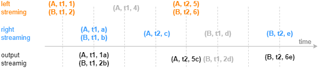
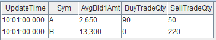

# equi join 引擎

equi join 引擎由 `createEquiJoinEngine` 函数创建。

equi join 引擎的连接机制类似于 SQL 中的 equi
join，按连接列和时间列等值关联左右表，对于左表（或右表）中的每一条记录，当它成功匹配上右表（或左表）中连接列一致的一条记录时，引擎将输出一条结果。

与 SQL 中的 equi join
不同的是，因为引擎内部并不缓存所有历史数据，所以可能出现左表（或右表）中的某条记录到来后无法关联到已经从引擎缓存中清除的历史右表（或左表）记录，进而不会输出结果。这是由
equi join 引擎的设计初衷和内部实现决定的，该引擎是为以连接列和时间列为键值的输入数据设计的，比如每支股票在每分钟有一条记录。

下图展示字段结构为（连接列，时间列，指标）的输入数据注入等值关联引擎的效果。



建议按推荐场景使用 equi join 引擎，即对连接列和时间列唯一的数据使用本引擎。若非推荐场景，为了理解输出效果，可以参考如下设计原理：Equi Join
引擎内部分别为左右表数据维护两个以连接列和时间列作为键值的键值表作为缓存，并对每条记录标识是否关联过。下面以左表为例介绍，右表同理。当一条左表记录注入引擎，则查找右表缓存，
若能成功匹配则输出一条结果，并在右表缓存中标识对应记录为已关联，这时左表缓存中不会保存这条立刻关联输出的左表记录（此原理会导致上图中后续的灰色数据（A, t1,
4）无法匹配而不输出），若未能匹配成功，则将该条左表记录加入左表缓存，并标识为未关联。

需要注意，对于缓存中的已关联、未关联的数据，equi join 引擎都会进行过期清理，清理原理可参考用户手册。若遵循推荐场景使用此引擎，但是引擎输出结果与 SQL equi
join 结果仍不完全一致，则是设置的清理规则导致的差异。

createEquiJoinEngine 函数的语法如下：

```
createEquiJoinEngine(name, leftTable, rightTable, outputTable, metrics, matchingColumn, timeColumn, [garbageSize=5000], [maxDelayedTime])
```

其参数的详细含义可以参考：[createEquiJoinEngine](../funcs/c/createEquiJoinEngine.html)。

注： 如果您使用的 DolphinDB 版本早于 1.30.21/2.00.9，请将脚本中的
`createEquiJoinEngine` 替换为 `createEqualJoinEngine`。自
1.30.21/2.00.9 版本起，`createEqualJoinEngine` 更名为
`createEquiJoinEngine`，原函数名可继续使用。

## 应用例子 1-拼接不同数据源的实时分钟指标

在量化金融的实盘中往往会对原始的行情快照、逐笔成交等进行降采样形成分钟指标，以作为输入提供给进一步的交易策略，这时则需要将多个不同数据源计算出的指标关联到同一张表中。本例将对快照和成交数据分别做实时的
1 分钟聚合，并将快照指标和成交指标关联后输出到同一张宽表中。

这个场景的特征是，每支股票的行情快照分钟指标在每一分钟只有一条记录，逐笔成交分钟指标同样有这样的唯一性，并且在某一分钟的输出上，期望总是在两类指标都计算完成后再将关联输出。以下脚本用
equi join 引擎来实现此场景。

```
// create table
share streamTable(1:0, `Sym`TradeTime`Side`TradeQty, [SYMBOL, TIME, INT, LONG]) as trades
share streamTable(1:0, `UpdateTime`Sym`BuyTradeQty`SellTradeQty, [TIME, SYMBOL, LONG, LONG]) as tradesMin
share streamTable(1:0, `Sym`Time`Bid1Price`Bid1Qty, [SYMBOL, TIME, DOUBLE, LONG]) as snapshot
share streamTable(1:0, `UpdateTime`Sym`AvgBid1Amt, [TIME, SYMBOL, DOUBLE]) as snapshotMin
share streamTable(1:0, `UpdateTime`Sym`AvgBid1Amt`BuyTradeQty`SellTradeQty, [TIME, SYMBOL, DOUBLE, LONG, LONG]) as output

// create engine:
eqJoinEngine = createEquiJoinEngine(name="EquiJoin", leftTable=tradesMin, rightTable=snapshotMin, outputTable=output, metrics=<[AvgBid1Amt, BuyTradeQty, SellTradeQty]>, matchingColumn=`Sym, timeColumn=`UpdateTime)
// create engine:
tsEngine1 = createTimeSeriesEngine(name="tradesAggr", windowSize=60000, step=60000, metrics=<[sum(iif(Side==1, 0, TradeQty)), sum(iif(Side==2, 0, TradeQty))]>, dummyTable=trades, outputTable=getLeftStream(eqJoinEngine), timeColumn=`TradeTime, keyColumn=`Sym, useSystemTime=false, fill=(0, 0))
// create engine:
tsEngine2 = createTimeSeriesEngine(name="snapshotAggr", windowSize=60000, step=60000, metrics=<[avg(iif(Bid1Price!=NULL, Bid1Price*Bid1Qty, 0))]>, dummyTable=snapshot, outputTable=getRightStream(eqJoinEngine), timeColumn=`Time, keyColumn=`Sym, useSystemTime=false, fill=(0.0))

// subscribe topic
subscribeTable(tableName="trades", actionName="minAggr", handler=tsEngine1, msgAsTable=true, offset=-1, hash=1)
subscribeTable(tableName="snapshot", actionName="minAggr", handler=tsEngine2, msgAsTable=true, offset=-1, hash=2)
```

* 首先用两个独立的时序聚合引擎（createTimeSeriesEngine）对原始的快照和成交数据流按数据中的时间戳做实时聚合、输出每一分钟的指标，之后通过引擎级联的方式，将两个时序聚合引擎的输出分别作为左右表注入连接引擎。
* equi join 引擎对左、右表的处理是完全相同的，即上例中在 `createEquiJoinEngine`
  时交换左右表不会影响关联结果。

构造数据写入作为原始输入的 2 个流数据表：

```
// generate data: snapshot
t1 = table(`A`B`A`B`A`B as Sym, 10:00:52.000+(3 3 6 6 9 9)*1000 as Time, (3.5 7.6 3.6 7.6 3.6 7.6) as Bid1Price, (1000 2000 500 1500 400 1800) as Bid1Qty)
// generate data: trade
t2 = table(`A`A`B`A`B`B`A`B`B`A as Sym, 10:00:54.000+(1..10)*700 as TradeTime,  (1 2 1 1 1 1 2 1 2 2) as Side, (1..10) * 10 as TradeQty)
// input
trades.append!(t2)
snapshot.append!(t1)
```

关联得到的结果表 *output* 如下：



## 应用例子 2

```
share streamTable(1:0, `time`sym`price, [SECOND, SYMBOL, DOUBLE]) as leftTable
share streamTable(1:0, `time`sym`val, [SECOND, SYMBOL, DOUBLE]) as rightTable
output=table(100:0, `time`sym`price`val`total, [SECOND, SYMBOL, DOUBLE, DOUBLE, DOUBLE])
ejEngine=createEquiJoinEngine("test1", leftTable, rightTable, output, [<price>, <val>, <price*val>], `sym, `time)
subscribeTable(tableName="leftTable", actionName="joinLeft", offset=0, handler=appendForJoin{ejEngine, true}, msgAsTable=true)
subscribeTable(tableName="rightTable", actionName="joinRight", offset=0, handler=appendForJoin{ejEngine, false}, msgAsTable=true)

tmp1=table(13:30:10+1..20 as time, take(`AAPL, 10) join take(`IBM, 10) as sym, double(1..20) as price)
leftTable.append!(tmp1)
tmp2=table(13:30:10+1..20 as time, take(`AAPL, 10) join take(`IBM, 10) as sym, double(50..31) as val)
rightTable.append!(tmp2)

select count(*) from output
// output
20
```

## 应用例子 3

下例中时间列类型为 TIMESTAMP，若不设置 *maxDelayedTime*，取默认值 3000 ms。

```
share streamTable(5000000:0, `timestamp`sym`price, [TIMESTAMP, SYMBOL, DOUBLE]) as leftTable
share streamTable(5000000:0, `timestamp`sym`val, [TIMESTAMP, SYMBOL, DOUBLE]) as rightTable
share table(5000000:0, `timestamp`sym`price`val`total`diff`ratio, [TIMESTAMP, SYMBOL, DOUBLE, DOUBLE, DOUBLE, DOUBLE, DOUBLE]) as output
ejEngine=createEquiJoinEngine("test1", leftTable, rightTable, output, <[price, val, price+val, price-val, price/val]>, `sym, `timestamp, 5000)
topic1=subscribeTable(tableName="leftTable", actionName="writeLeft", offset=0, handler=appendForJoin{ejEngine, true}, batchSize=10000, throttle=1)
topic2=subscribeTable(tableName="rightTable", actionName="writeRight", offset=0, handler=appendForJoin{ejEngine, false}, batchSize=10000, throttle=1)
def writeLeftTable(mutable tb){
   batch = 1000
   for(i in 1..300){
           tmp = table(batch:batch, `timestamp`sym`price, [TIMESTAMP, SYMBOL, DOUBLE])
           tmp[`timestamp]=take(2012.01.01T00:00:00.000+i, batch)
           tmp[`sym]=shuffle("A"+string(1..batch))
           tmp[`price]=rand(100.0, batch)
           tb.append!(tmp)
   }
}

def writeRightTable(mutable tb){
   batch = 500
   for(i in 1..200){
           tmp = table(batch:batch, `timestamp`sym`val, [TIMESTAMP, SYMBOL, DOUBLE])
           tmp[`timestamp]=take(2012.01.01T00:00:00.000+i, batch)
           tmp[`sym]=shuffle("A"+string(1..batch))
           tmp[`val]=rand(100.0, batch)
           tb.append!(tmp)
   }
}

job1 = submitJob("writeLeft", "", writeLeftTable, leftTable)
job2 = submitJob("writeRight", "", writeRightTable, rightTable)

select count(*) from output order by sym, timestamp
100000
```

