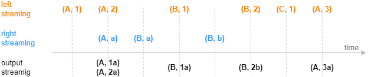
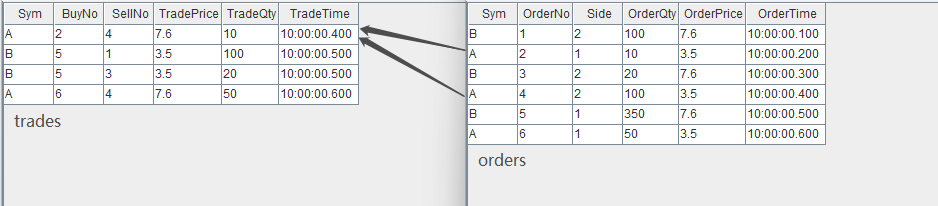
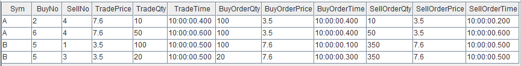
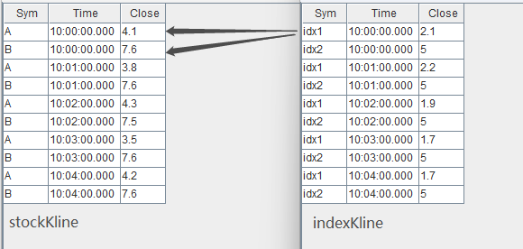
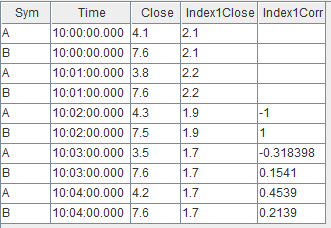

# leftSemi join 引擎

leftSemi join 引擎由 `createLeftSemiJoinEngine` 函数创建。

leftSemi join 引擎的连接机制类似于 SQL 中的 equi join
，按连接列等值关联左右表，对于左表中的每一条记录，当它成功匹配上右表中连接列一致的一条记录时，引擎将输出一条结果。未成功匹配的左表的记录将一直由引擎缓存，等待与右表中更新的记录匹配。

与 SQL 中的 equi join
不同的是，引擎在内部缓存右表的记录时，对于相同连接列的数据总是只保留第一条或者最新一条，因此对于左表的每一条记录至多只会匹配一条右表记录并输出一次。

下图展示字段结构为（连接列，指标）的输入数据，注入右表保留最新一条记录的 leftSemi join 引擎的效果，左表数据总是等到匹配成功才输出。后文将分别介绍两个
leftSemi join 引擎的实际应用场景：一是对逐笔成交数据补充原始委托信息，二是关联股票和指数行情并计算相关性。



`createLeftSemiJoinEngine` 函数的语法如下：

```
createLeftSemiJoinEngine(name, leftTable, rightTable, outputTable, metrics, matchingColumn, [garbageSize=5000], [updateRightTable=false])
```

其参数的详细含义可以参考：[createLeftSemiJoinEngine](../funcs/c/createLeftSemiJoinEngine.md)。

## 应用例子 1-对逐笔成交数据补充原始委托信息

逐笔成交数据中包含买卖双方的原始委托订单号，本例通过股票代码和订单号去关联逐笔委托数据，以达到在成交数据的基础上丰富其原始委托信息的目的。

这个场景的特征是，对于每条逐笔成交都应该找到对应的委托单，输出与原始输入中的逐笔成交记录一一对应。在找到对应的委托单前，该条逐笔成交记录暂时不输出。

以下脚本用两个 leftSemi join 引擎级联的方式，对成交表 *trades*
中的卖方委托单、买方委托单依次进行了关联。多个引擎之间采用了引擎级联的方式处理。

```
// create table
share streamTable(1:0, `Sym`BuyNo`SellNo`TradePrice`TradeQty`TradeTime, [SYMBOL, LONG, LONG, DOUBLE, LONG, TIME]) as trades
share streamTable(1:0, `Sym`OrderNo`Side`OrderQty`OrderPrice`OrderTime, [SYMBOL, LONG, INT, LONG, DOUBLE, TIME]) as orders
share streamTable(1:0, `Sym`SellNo`BuyNo`TradePrice`TradeQty`TradeTime`BuyOrderQty`BuyOrderPrice`BuyOrderTime, [SYMBOL, LONG, LONG, DOUBLE, LONG, TIME, LONG, DOUBLE, TIME]) as outputTemp
share streamTable(1:0, `Sym`BuyNo`SellNo`TradePrice`TradeQty`TradeTime`BuyOrderQty`BuyOrderPrice`BuyOrderTime`SellOrderQty`SellOrderPrice`SellOrderTime, [SYMBOL, LONG, LONG, DOUBLE, LONG, TIME, LONG, DOUBLE, TIME, LONG, DOUBLE, TIME]) as output

// create engine: left join buy order
ljEngineBuy=createLeftSemiJoinEngine(name="leftJoinBuy", leftTable=outputTemp, rightTable=orders, outputTable=output,  metrics=<[SellNo, TradePrice, TradeQty, TradeTime, BuyOrderQty, BuyOrderPrice, BuyOrderTime, OrderQty, OrderPrice, OrderTime]>, matchingColumn=[`Sym`BuyNo, `Sym`OrderNo])

//  create engine: left join sell order
ljEngineSell=createLeftSemiJoinEngine(name="leftJoinSell", leftTable=trades, rightTable=orders, outputTable=getLeftStream(ljEngineBuy),  metrics=<[BuyNo, TradePrice, TradeQty, TradeTime, OrderQty, OrderPrice, OrderTime]>, matchingColumn=[`Sym`SellNo, `Sym`OrderNo])

// subscribe topic
subscribeTable(tableName="trades", actionName="appendLeftStream", handler=getLeftStream(ljEngineSell), msgAsTable=true, offset=-1)
subscribeTable(tableName="orders", actionName="appendRightStreamForSell", handler=getRightStream(ljEngineSell), msgAsTable=true, offset=-1)
subscribeTable(tableName="orders", actionName="appendRightStreamForBuy", handler=getRightStream(ljEngineBuy), msgAsTable=true, offset=-1)
```

* 数据流向：首先，将 *trades* 和 *orders* 分为作为左、右表注入引擎 leftJoinSell，此次以
  *trades* 数据中的卖单号关联 *orders* 中的对应订单。之后，将上述引擎的输出作为左表直接注入引擎
  leftJoinBuy ，该引擎的右表仍然设置为 *orders*，此次以 *trades* 数据中的买单号关联 *orders*中的对应订单。
* 内存管理：上例中创建引擎时未显式指定 *garbageSize* ，则使用默认值，*garbageSize*
  不论大小均不改变计算结果。注意，和其他连接引擎不同，该函数的 *garbageSize*
  参数只用于清理左表的历史数据，右表的历史数据不进行回收，因此上述案例中两个引擎至少分别占用一个 *orders* 表大小的内存。

构造数据写入作为原始输入的 2 个流数据表：

```
// generate data: trade
t1 = table(`A`B`B`A as Sym, [2, 5, 5, 6] as BuyNo, [4, 1, 3, 4] as SellNo, [7.6, 3.5, 3.5, 7.6]as TradePrice, [10, 100, 20, 50]as TradeQty, 10:00:00.000+(400 500 500 600) as TradeTime)
// generate data: order
t2 = table(`B`A`B`A`B`A as Sym, 1..6 as OrderNo, [2, 1, 2, 2, 1, 1] as Side, [100, 10, 20, 100, 350, 50] as OrderQty, [7.6, 3.5, 7.6, 3.5, 7.6, 3.5] as OrderPrice, 10:00:00.000+(1..6)*100 as OrderTime)
// input data
orders.append!(t2)
trades.append!(t1)
```

输入数据与关联关系如下：



通过两个 leftSemi join 引擎，上图中 *trades* 数据流中的每一条记录将分别和 *orders* 数据流中的两条记录关联，进而取得
*orders* 中的委托量、价、时间等字段，关联得到的结果表 *output* 如下：



## 应用例子 2-关联股票与指数行情并计算相关性

本例中我们实时计算股票和某个指数在过去一段时间内分钟收益率的相关性。输入使用已经降为分钟频率的股票数据和指数数据。

这个场景的特征是，两个数据流的时间戳频率一致，全部股票都需要关联同一支指数，输出与原始输入中的股票数据一一对应。 以下脚本用 Left Semi Join
引擎来实现此关联场景。

```
// create table
share streamTable(1:0, `Sym`Time`Close, [SYMBOL, TIME, DOUBLE]) as stockKline
share streamTable(1:0, `Sym`Time`Close, [SYMBOL, TIME, DOUBLE]) as indexKline
share streamTable(1:0, `Time`Sym`Close`Index1Close, [TIME, SYMBOL, DOUBLE, DOUBLE]) as stockKlineAddIndex1
share streamTable(1:0, `Sym`Time`Close`Index1Close`Index1Corr, [SYMBOL, TIME, DOUBLE, DOUBLE, DOUBLE]) as output

//  create engine: calculate correlation
rsEngine = createReactiveStateEngine(name="calCorr", dummyTable=stockKlineAddIndex1, outputTable=output, metrics=[<Time>, <Close>, <Index1Close>, <mcorr(ratios(Close)-1, ratios(Index1Close)-1, 3)>], keyColumn="Sym")

//  create engine: left join Index1
ljEngine1 = createLeftSemiJoinEngine(name="leftJoinIndex1", leftTable=stockKline, rightTable=indexKline, outputTable=getStreamEngine("calCorr"), metrics=<[Sym, Close, indexKline.Close]>, matchingColumn=`Time)

// subscribe topic
def appendIndex(engineName, indexName, msg){
	tmp = select * from msg where Sym = indexName
	getRightStream(getStreamEngine(engineName)).append!(tmp)
}
subscribeTable(tableName="indexKline", actionName="appendIndex1", handler=appendIndex{"leftJoinIndex1", "idx1"}, msgAsTable=true, offset=-1, hash=1)
subscribeTable(tableName="stockKline", actionName="appendStock", handler=getLeftStream(ljEngine1), msgAsTable=true, offset=-1, hash=0)
```

* 数据流向：首先，股票数据 stockKline 注入连接引擎 leftJoinIndex1
  的左表，指数数据经过滤后注入该引擎的右表，这一步将股票与指数的分钟指标关联。之后，将上述连接引擎的输出直接注入响应式状态引擎（createReactiveStateEngine），利用响应式状态引擎内置的
  `mcorr` 和 `ratios`
  函数计算股票与指数的相关性指标。多个引擎之间采用了引擎级联的方式处理。响应式状态引擎教程见 [金融高频因子的流批统一计算：DolphinDB响应式状态引擎介绍](reactive_state_engine.md) 。
* 订阅指数数据 indexKline 时指定 *handler* 为自定义函数 `appendIndex`
  ，是指不断地收到 indexKline 数据后，首先过滤出指数数据中指数名为 idx1 的数据，然后再注入连接引擎的右表。

构造数据写入作为原始输入的 2 个流数据表：

```
// generate data: stock Kline
t1 = table(`A`B`A`B`A`B`A`B`A`B as Sym, 10:00:00.000+(0 0 1 1 2 2 3 3 4 4)*60000 as Time, (4.1 7.6 3.8 7.6 4.3 7.5 3.5 7.6 4.2 7.6) as Close)
// generate data: index Kline
t2 = table(`idx1`idx2`idx1`idx2`idx1`idx2`idx1`idx2`idx1`idx2 as Sym, 10:00:00.000+(0 0 1 1 2 2 3 3 4 4)*60000 as Time, (2.1 5 2.2 5 1.9 5 1.7 5 1.7 5) as Close)
// input data
indexKline.append!(t2)
stockKline.append!(t1)
```

输入数据与关联关系如下：



关联得到的结果表 *output* 如下，对于股票 A 、B 每分钟都会关联对应分钟的指数 idx1 。因为 `mcorr`
滑动窗口为3，所以前两分钟结算结果为空。



## 应用例子 3

```
share streamTable(1:0, `time`sym`price, [TIMESTAMP, SYMBOL, DOUBLE]) as leftTable
share streamTable(1:0, `time`sym1`vol, [TIMESTAMP, SYMBOL, INT]) as rightTable

output=table(100:0, `time`sym`price`vol`total, [TIMESTAMP, SYMBOL, DOUBLE, INT, DOUBLE])
lsjEngine=createLeftSemiJoinEngine(name="test1", leftTable=leftTable, rightTable=rightTable, outputTable=output,  metrics=<[price, vol,price*vol]>, matchingColumn=[[`time,`sym], [`time,`sym1]], updateRightTable=true)

subscribeTable(tableName="leftTable", actionName="joinLeft", offset=0, handler=appendForJoin{lsjEngine, true}, msgAsTable=true)
subscribeTable(tableName="rightTable", actionName="joinRight", offset=0, handler=appendForJoin{lsjEngine, false}, msgAsTable=true)

v = [1, 5, 10, 15]
tp1=table(2012.01.01T00:00:00.000+v as time, take(`AAPL, 4) as sym, rand(100,4) as price)
leftTable.append!(tp1)

v = [1, 1, 3, 4, 5, 5, 5, 15]
tp2=table(2012.01.01T00:00:00.000+v as time, take(`AAPL, 8) as sym, rand(100,8) as vol)
rightTable.append!(tp2)

select * from output
```

| time | sym | price | vol | total |
| --- | --- | --- | --- | --- |
| 2012.01.01T00:00:00.001 | AAPL | 44 | 76 | 3344 |
| 2012.01.01T00:00:00.005 | AAPL | 15 | 64 | 960 |
| 2012.01.01T00:00:00.015 | AAPL | 24 | 75 | 1800 |

若要再次执行以上脚本，需要先删除引擎并取消订阅：

```
dropStreamEngine("test1")
lsjEngine=NULL
unsubscribeTable(tableName="leftTable", actionName="joinLeft")
unsubscribeTable(tableName="rightTable", actionName="joinRight")
```

