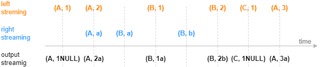
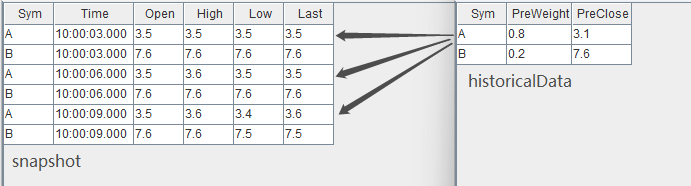
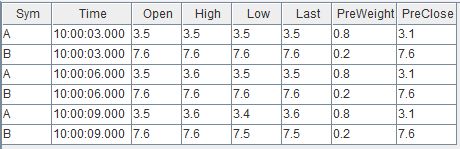

# lookup join 引擎

lookup join 引擎由 `createLookupJoinEngine` 函数创建。

lookup join 引擎的默认连接机制类似于 SQL 中的 left
join，按连接列等值关联左右表，左表中的每一条记录注入引擎时便立刻关联当前时刻的右表，不论是否在右表中匹配到连接列一致的记录，引擎都会立刻输出一条结果，若未能匹配上则结果中右表相关的字段为空。用户也可通过参数设置，采用内连接方式，即仅在右表中找到匹配记录时才输出结果。注意：当参数
*keepDuplicates*=true（即引擎保留右表各分组内的所有数据）时，引擎只能采用内连接方式。

引擎的右表可以是数据流或者数据集。对于数据流，引擎通过数据流不断地注入引擎来更新内部的右表缓存；对于数据集，引擎通过对数据集的定时查询来更新内部的右表缓存。

下图展示默认设置下，字段结构为（连接列，指标）的输入数据，注入右表保留最新一条记录的 Lookup Join 引擎的效果，左表数据总是在达到后立刻输出。



`createLookupJoinEngine` 函数的语法如下：

`createLookupJoinEngine(name, leftTable, rightTable,
outputTable, metrics, matchingColumn, [rightTimeColumn], [checkTimes],
[outputElapsedMicroseconds=false], [keepDuplicates=false], [isInnerJoin], [snapshotDir],
[snapshotIntervalInMsgCount])`

其参数的详细含义可以参考：[createLookupJoinEngine](../funcs/c/createLookupJoinEngine.html)。

## 应用例子 1-实时行情与历史日频指标关联

在当日的实时计算中可能会需要依赖历史指标，本例在行情快照的基础上，通过股票代码关联该股票在昨日的日频指标。

这个场景的特征是，每条快照记录到达后要求立刻关联输出，如果日频数据里没有对应的股票，输出结果对应的字段为空，输出与原始输入中的每一条行情快照记录一一对应。同时，日频指标并非实时数据，而是一个以较低频率更新的有主键的离线数据集。以下脚本用
lookup join 引擎来实现此场景。

```
// create table
share streamTable(1:0, `Sym`Time`Open`High`Low`Close, [SYMBOL, TIME, DOUBLE, DOUBLE, DOUBLE, DOUBLE]) as snapshot
historicalData = table(`A`B as Sym, (0.8 0.2) as PreWeight, (3.1 7.6) as PreClose)
share table(1:0, `Sym`Time`Open`High`Low`Close`PreWeight`PreClose, [SYMBOL, TIME, DOUBLE, DOUBLE, DOUBLE, DOUBLE, DOUBLE, DOUBLE]) as output

// create engine
lookupJoinEngine = createLookupJoinEngine(name="lookupJoin", leftTable=snapshot, rightTable=historicalData, outputTable=output, metrics=<[Time, Open, High, Low, Close, PreWeight, PreClose]>, matchingColumn=`Sym, checkTimes=10s)

// subscribe topic
subscribeTable(tableName="snapshot", actionName="appendLeftStream", handler=getLeftStream(lookupJoinEngine), msgAsTable=true, offset=-1)
```

* 订阅流数据表 *snapshot* 注入引擎的左表。引擎右表为普通内存表 *historicalData*，它不能且不需要进行订阅。
* 引擎会在内部维护一个最新的右表，在创建引擎时会查询右表 *historicalData* 并缓存在引擎内部。参数
  *checkTimes*=10s 表示之后的每 10s 引擎会再次查询右表 *historicalData*
  并更新一次内部的缓存。

构造数据写入作为引擎左表输入的流数据表 *snapshot*：

```
// generate data: snapshot
t1 = table(`A`B`A`B`A`B as Sym, 10:00:00.000+(3 3 6 6 9 9)*1000 as Time, (3.5 7.6 3.5 7.6 3.5 7.6) as Open, (3.5 7.6 3.6 7.6 3.6 7.6) as High, (3.5 7.6 3.5 7.6 3.4 7.5) as Low, (3.5 7.6 3.5 7.6 3.6 7.5) as Close)
snapshot.append!(t1)
```

输入数据与关联关系如下：



结果在左表数据到达引擎时立刻输出，关联得到的结果表 output 如下：



## 应用例子 2

```
login(`admin, `123456)
share streamTable(1000:0, `timestamps`sym`price, [TIMESTAMP, SYMBOL, DOUBLE]) as trades
share streamTable(1000:0, `timestamps`sym`val`id, [TIMESTAMP, SYMBOL, DOUBLE, INT]) as prices
output = table(100:0, `sym`factor1`factor2`factor3, [SYMBOL, DOUBLE, DOUBLE, DOUBLE])

LjEngine = createLookupJoinEngine(name="test1", leftTable=trades, rightTable=prices, outputTable=output, metrics=<[price,val,price*val]>, matchingColumn=`sym)
subscribeTable(tableName="trades", actionName="append_leftTable", offset=0, handler=appendForJoin{LjEngine, true}, msgAsTable=true)
subscribeTable(tableName="prices", actionName="append_rightTable", offset=0, handler=appendForJoin{LjEngine, false}, msgAsTable=true)

n = 15
tem1 = table( (2018.10.08T01:01:01.001 + 1..12) join (2018.10.08T01:01:01.001 + 1..3)as timestamps,take(`A`B`C, n) as sym,take(1..15,n) as val,1..15 as id)
prices.append!(tem1)
sleep(2000)
n  = 10
tem2 = table( 2019.10.08T01:01:01.001 + 1..n as timestamps,take(`A`B`C, n) as sym,take(0.1+10..20,n) as price)
trades.append!(tem2)
sleep(100)
select * from output
```

| sym | factor1 | factor2 | factor3 |
| --- | --- | --- | --- |
| A | 10.1 | 13 | 131.3 |
| B | 11.1 | 14 | 155.4 |
| C | 12.1 | 15 | 181.5 |
| A | 13.1 | 13 | 170.3 |
| B | 14.1 | 14 | 197.4 |
| C | 15.1 | 15 | 226.5 |
| A | 16.1 | 13 | 209.3 |
| B | 17.1 | 14 | 239.4 |
| C | 8.1 | 15 | 271.5 |
| A | 19.1 | 13 | 248.3 |

## 应用例子 3

```
share streamTable(1000:0, `timestamps`sym`price, [TIMESTAMP, SYMBOL, DOUBLE]) as trades
share streamTable(1000:0, `timestamps`sym`val`id, [TIMESTAMP, SYMBOL, DOUBLE, INT]) as prices
output = table(100:0, `sym`factor1`factor2`factor3, [SYMBOL, DOUBLE, DOUBLE, DOUBLE])
LjEngine = createLookupJoinEngine(name="test1", leftTable=trades, rightTable=prices, outputTable=output, metrics=<[price,val,price*val]>, matchingColumn=`sym, rightTimeColumn=`timestamps)
subscribeTable(tableName="trades", actionName="append_leftTable", offset=0, handler=appendForJoin{LjEngine, true}, msgAsTable=true)
subscribeTable(tableName="prices", actionName="append_rightTable", offset=0, handler=appendForJoin{LjEngine, false}, msgAsTable=true)

n = 15
tem1 = table( (2018.10.08T01:01:01.001 + 1..12) join (2018.10.08T01:01:01.001 + 1..3)as timestamps,take(`A`B`C, n) as sym,take(1..15,n) as val,1..15 as id)
prices.append!(tem1)
sleep(2000)
n  = 10
tem2 = table( 2019.10.08T01:01:01.001 + 1..n as timestamps,take(`A`B`C, n) as sym,take(0.1+10..20,n) as price)
trades.append!(tem2)
sleep(100)
select * from output
```

| sym | factor1 | factor2 | factor3 |
| --- | --- | --- | --- |
| A | 10.1 | 10 | 101 |
| B | 11.1 | 11 | 122.1 |
| C | 12.1 | 12 | 145.2 |
| A | 13.1 | 10 | 131 |
| B | 14.1 | 11 | 155.1 |
| C | 15.1 | 12 | 181.2 |
| A | 16.1 | 10 | 161 |
| B | 17.1 | 11 | 188.1 |
| C | 18.1 | 12 | 217.2 |
| A | 19.1 | 10 | 191 |

## 应用例子 4

```
share streamTable(1000:0, `timestamps`sym`price, [TIMESTAMP, SYMBOL, DOUBLE]) as trades
output = table(100:0, `sym`factor1`factor2`factor3, [SYMBOL, DOUBLE, DOUBLE, DOUBLE])
prices=table(1000:0, `timestamps`sym`val`id, [TIMESTAMP, SYMBOL, DOUBLE, INT])
LjEngine = createLookupJoinEngine(name="test1", leftTable=trades, rightTable=prices, outputTable=output, metrics=<[price,val,price*val]>, matchingColumn=`sym, rightTimeColumn=`timestamps, checkTimes=1s)
subscribeTable(tableName="trades", actionName="append_leftTable", offset=0, handler=appendForJoin{LjEngine, true}, msgAsTable=true)

n = 15
tem1 = table( (2018.10.08T01:01:01.001 + 1..12) join (2018.10.08T01:01:01.001 + 1..3)as timestamps,take(`A`B`C, n) as sym,take(1..15,n) as val,1..15 as id)
prices.append!(tem1)
sleep(2000)
n  = 10
tem2 = table( 2019.10.08T01:01:01.001 + 1..n as timestamps,take(`A`B`C, n) as sym,take(0.1+10..20,n) as price)
trades.append!(tem2)
sleep(100)
select * from output
```

| sym | factor1 | factor2 | factor3 |
| --- | --- | --- | --- |
| A | 10.1 | 10 | 101 |
| B | 11.1 | 11 | 122.1 |
| C | 12.1 | 12 | 145.2 |
| A | 13.1 | 10 | 131 |
| B | 14.1 | 11 | 155.1 |
| C | 15.1 | 12 | 181.2 |
| A | 16.1 | 10 | 161 |
| B | 17.1 | 11 | 188.1 |
| C | 18.1 | 12 | 217.2 |
| A | 19.1 | 10 | 191 |

## 应用例子 5

左表为一个实时的交易表与右表（相对稳定的维度表）做连接。

```
share streamTable(1000:0, `time`volume`id, [TIMESTAMP, INT,INT]) as trades
dbPath="dfs://testlj"
if(existsDatabase(dbPath)){
   dropDatabase(dbPath)
}
rt=table(1000:0, `time`price`id, [TIMESTAMP, DOUBLE, INT])
db=database(dbPath, VALUE, `A`B`C)
prices=db.createTable(rt,`rightTable)
outputTable = table(10000:0, `id`volume`price`prod, [INT,INT,DOUBLE,DOUBLE])

tradesLookupJoin = createLookupJoinEngine(name="streamLookup1", leftTable=trades, rightTable=prices, outputTable=outputTable, metrics=<[volume,price,volume*price]>, matchingColumn=`id, rightTimeColumn=`time,checkTimes=1s)
subscribeTable(tableName="trades", actionName="append_trades", offset=0, handler=appendForJoin{tradesLookupJoin, true}, msgAsTable=true)

def writeData(t,n){
    timev = 2021.10.08T01:01:01.001 + timestamp(1..n)
    volumev = take(1..n, n)
    id = take(1 2 3, n)
    insert into t values(timev, volumev, id)
}
//n=7
writeData(rt, 10)
prices.append!(rt)
sleep(2000)
writeData(trades, 6)
sleep(2)

select * from outputTable
```

| id | volume | price | prod |
| --- | --- | --- | --- |
| 1 | 1 | 10 | 10 |
| 2 | 2 | 8 | 16 |
| 3 | 3 | 9 | 27 |
| 1 | 4 | 10 | 40 |
| 2 | 5 | 8 | 40 |
| 3 | 6 | 9 | 54 |

