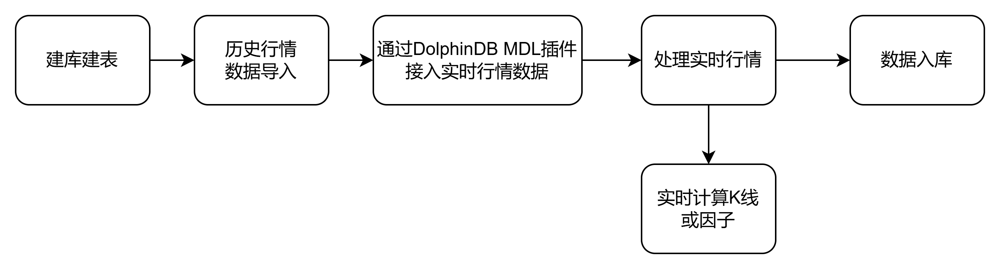
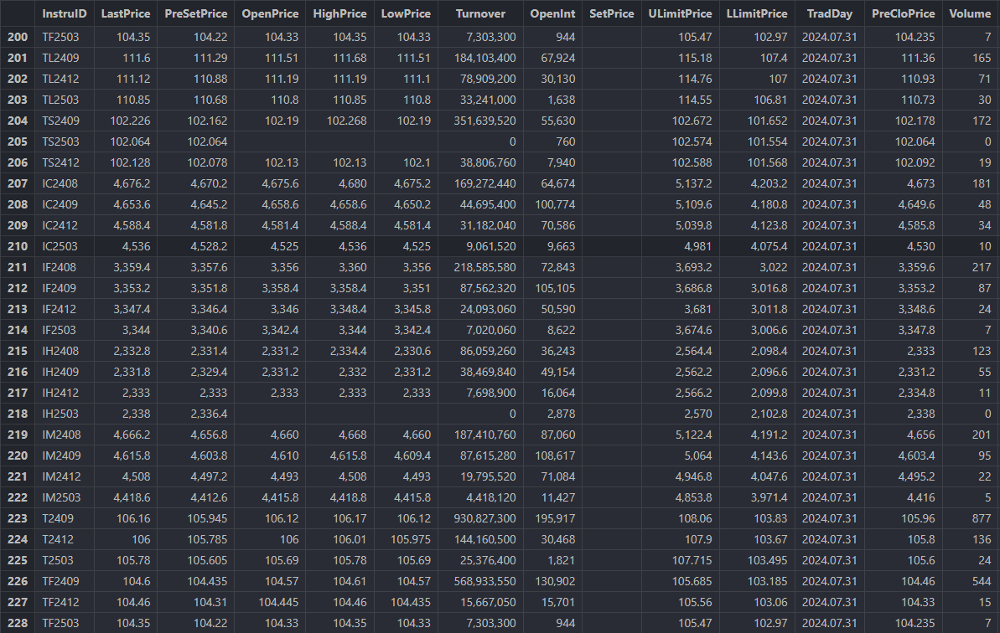

# 基于 MDL 行情插件的中金所L1数据最佳实践

本文介绍了如何通过 DolphinDB 的 MDL 插件订阅并处理中金所 Level 1 实时数据。首先，文章简要介绍了 MDL 插件的功能和作用。它是基于 MDL
官方提供的行情数据服务 C++ SDK（即 TCP 版本 MDL
）实现，提供了实时数据获取和处理的能力。接着文章详细阐述了数据的存储方案，以及实时数据与历史数据字段对齐的方法。此外，本文还提供了实时合成K线的模块，并讨论了数据处理中的关键细节，例如主力合约的选择和成交量加权平均价格（VWAP）的计算方法。值得注意的是，本文的方法不仅适用于中金所
L1 数据，还可以扩展到其他期货交易所的数据处理，因此具有一定的通用性。

本文中的实时数据处理功能依托于DolphinDB的流数据功能。在继续阅读本文之前，建议读者先了解DolphinDB的[流数据订阅](str_intro.html)及[流计算引擎](../funcs/themes/streamingEngine.html)的相关概念，以便更好地理解本文所述的实时行情处理流程及技术实现。

本教程的代码基于 DolphinDB 2.00.12版本开发，建议用户使用2.00.12及3.00.1版本以上运行。具体 MDL 插件的接口说明，请参考 [DolphinDB MDL 插件使用说明](../plugins/MDL.html)。

## 1. DolphinDB MDL 插件使用流程

MDL 是通联数据提供的高频行情数据服务， DolphinDB 提供了能够从 MDL 服务器获取高频行情数据的 DolphinDB MDL 插件，用户可以通过
DolphinScript 接入数据，实现高效的数据订阅与处理。

以下是接入 MDL 数据的基本流程，详情请参见[《 MDL 行情插件最佳实践指南》](../tutorials/best_practice_for_mdl.html)：

1. 插件安装及加载

   安装 MDL 插件并加载到 DolphinDB 中。确保您的 DolphinDB 环境满足插件的依赖要求。通常需要下载插件包并在
   DolphinDB
   中加载，具体步骤请参考官方文档。

   ```
   installPlugin("MDL") //安装 MDL 插件
   loadPlugin("MDL") //加载 MDL 插件
   ```
2. 获取数据结构

   在接入数据之前，需要通过 MDL 插件获取目标行情数据的结构。用户输入目标行情的数据服务 ID 和消息 ID
   号，具体行情号请参考由通联数据提供的《通联数据 MDL
   消息参考》。

   ```
   cffexLevel1Schema = MDL::getSchema(" MDL SID_ MDL _CFFEX", 1) //中金所level1数据结构
   ```

   该接口返回一张表，含
   name、type 两列，共41个字段。

   注： 有关 MDL
   插件对数据品类的支持情况，请联系 DolphinDB 小助手，微信号：dolphndb1。
3. 创建持久化流表

   根据获得的数据结构，创建持久化流表以便存储接收到的行情数据。可以配置表的内存大小和持久化时间以控制数据大小。

   ```
   enableTableShareAndPersistence(
           streamTable(1:0, cffexLevel1Schema["name"], cffexLevel1Schema["type"]),
           "streamCffexLevel1",
           cacheSize = 1000000, // 保留在系统的内存中的表的条数 1000000条
           retentionMinutes=1440,  // 持久化保留时间 1天
           preCache=1000 // 重建时预加载1000条记录
       )
   ```
4. 建立 MDL 连接句柄

   通过指定 MDL 服务器的地址、端口、认证信息等，建立 MDL
   连接句柄。确保连接的稳定性，并进行必要的配置，如获取接收时间戳和延迟时间设置。

   ```
   handle =MDL::createHandle("Handle_CFFE_L1_Future", host, port, username)
   ```
5. 订阅行情数据

   根据上述步骤建立的 MDL 连接句柄和输出的流表，用户可以指定 MDL 的数据服务 ID、数据服务版本号、消息 ID
   来订阅需要的数据源。用户也可以通过`fieldName`、`fieldValues`、`extraOrderLeve`来过滤不要的字段、值或者指定部分数据源中的档位深度。

   ```
   MDL::subscribe(handle, objByName("streamCffexLevel1"),
                         " MDL SID_ MDL _CFFEX", " MDL VID_ MDL _CFFEX", 1)
   ```
6. 启动 MDL 连接

   启动 MDL
   连接并开始数据接收。

   ```
   MDL::connect MDL (handle)
   ```
7. MDL 运行状态监控

   通过接口用户可实时查看 MDL
   连接的运行状态，确保数据传输正常。该接口会返回一张表，其中包含已经处理的消息数、处理失败的消息数、最后一条错误消息发生的时间等。

   ```
   MDL::getStatus(handle)
   ```

## 2. 中国金融期货交易所简介

[中国金融期货交易所](http://www.cffex.com.cn/gk/)（以下简称“中金所”）是经国务院同意，中国证监会批准设立的，专门从事金融期货、期权等金融衍生品交易与结算的公司制交易所。

中金所期货上市类产品包括:

* 权益类
  + 沪深300股指期货，简称 IF
  + 中证500股指期货，简称 IC
  + 中证1000股指期货，简称 IM
  + 上证50股指期货，简称 IH
* 利率类
  + 2年期国债期货，简称 TS
  + 5年期国债期货，简称 TF
  + 10年期国债期货，简称 T
  + 30年期国债期货，简称 TL

## 3. MDL 行情数据介绍

本节将介绍由通联数据公司提供的中金所期货Level1的行情数据结构。该数据分为历史数据和实时行情数据，通常操作是将历史数据落库后接入实时数据。由于两种数据的结构有所不同，因此需要对实时数据进行处理，将其与历史数据对齐后再接入。本文主要介绍字段对齐部分。

### 3.1 期货 Level 1 数据说明

期货市场的Level1和 Level 2 数据是指交易行情和订单委托行情（Trades and Quotes, TAQ）的快照数据，快照频率为 500ms
一个推送。 Level 1 和 Level 2 的区别在于Level1的订单委托行情只有一档，而 Level 2 则有五档，所以 Level 2 相比于
Level 1 提供了更深的订单委托行情数据。目前，期货市场的 Level 1 快照为500ms，Level 2
中，中金所和上期所是500ms，其他交易所是250ms。

### 3.2 中金所 Level 1 数据结构

通联数据提供的中金所 Level 1 分为实时数据及历史数据，以下是两种数据源的结构说明：

表 3-1 实时行情数据结构

| **列名** | **类型** | **含义** |
| --- | --- | --- |
| InstruID | STRING | 合约代码 |
| LastPrice | DOUBLE | 最新价 |
| PreSetPrice | DOUBLE | 昨结算 |
| OpenPrice | DOUBLE | 今开盘 |
| HighPrice | DOUBLE | 最高价 |
| LowPrice | DOUBLE | 最低价 |
| Turnover | DOUBLE | 成交金额，单位元，单边计算 |
| OpenInt | DOUBLE | 持仓量，单位手，单边计算 |
| SetPrice | DOUBLE | 今结算 |
| ULimitPrice | DOUBLE | 涨停板价 |
| LLimitPrice | DOUBLE | 跌停板价 |
| TradDay | DATE | 结算日 |
| PreCloPrice | DOUBLE | 昨收盘 |
| Volume | INT | 成交量，单位手，单边计算 |
| ClosePrice | DOUBLE | 今收盘 |
| PreDelta | DOUBLE | 昨虚实度 |
| CurrDelta | DOUBLE | 今虚实度 |
| UpdateTime | TIME | 最后修改时间 |
| PreOpenInt | DOUBLE | 昨持仓量，单位手，单边计算 |
| BidPrice1 | DOUBLE | 申买价一 |
| BidVolume1 | INT | 申买量一 |
| AskPrice1 | DOUBLE | 申卖价一 |
| AskVolume1 | INT | 申卖量一 |
| BidPrice2 | DOUBLE | 申买价二 |
| BidVolume2 | INT | 申买量二 |
| AskPrice2 | DOUBLE | 申卖价二 |
| AskVolume2 | INT | 申卖量二 |
| BidPrice3 | DOUBLE | 申买价三 |
| BidVolume3 | INT | 申买量三 |
| AskPrice3 | DOUBLE | 申卖价三 |
| AskVolume3 | INT | 申卖量三 |
| BidPrice4 | DOUBLE | 申买价四 |
| BidVolume4 | INT | 申买量四 |
| AskPrice4 | DOUBLE | 申卖价四 |
| AskVolume4 | INT | 申卖量四 |
| BidPrice5 | DOUBLE | 申买价五 |
| BidVolume5 | INT | 申买量五 |
| AskPrice5 | DOUBLE | 申卖价五 |
| AskVolume5 | INT | 申卖量五 |
| AveragePrice | DOUBLE | 均价 |
| ActionDay | DATE | 交易日 |

表 3-2 历史行情数据结构

| **列名** | **类型** | **含义** |
| --- | --- | --- |
| CONTRACTID | SYMBOL | 合约代码 |
| LASTPX | DOUBLE | 最新价 |
| PRESETTLE | DOUBLE | 昨结算 |
| OPENPX | DOUBLE | 开盘价 |
| HIGHPX | DOUBLE | 最高价 |
| LOWPX | DOUBLE | 最低价 |
| OPENINTS | DOUBLE | 持仓量 |
| RISELIMIT | DOUBLE | 涨停板 |
| FALLLIMIT | DOUBLE | 跌停板 |
| PRECLOSE | DOUBLE | 昨收盘 |
| CLOSEPX | DOUBLE | 收盘价 |
| PREDELTA | DOUBLE | 昨虚实度 |
| CURRDELTA | DOUBLE | 今虚实度 |
| B1 | DOUBLE | 申买价一 |
| B2 | DOUBLE | 申买价二 |
| B3 | DOUBLE | 申买价三 |
| B4 | DOUBLE | 申买价四 |
| B5 | DOUBLE | 申买价五 |
| BV1 | INT | 申买量一 |
| BV2 | INT | 申买量二 |
| BV3 | INT | 申买量三 |
| BV4 | INT | 申买量四 |
| BV5 | INT | 申买量五 |
| S1 | DOUBLE | 申卖价一 |
| S2 | DOUBLE | 申卖价二 |
| S3 | DOUBLE | 申卖价三 |
| S4 | DOUBLE | 申卖价四 |
| S5 | DOUBLE | 申卖价五 |
| SV1 | INT | 申卖量一 |
| SV2 | INT | 申卖量二 |
| SV3 | INT | 申卖量三 |
| SV4 | INT | 申卖量四 |
| SV5 | INT | 申卖量五 |
| TDATE | DATE | 交易日期 |
| SETTLEMENTPX | DOUBLE | 结算价 |
| TM | DOUBLE | 累计成交金额 |
| CLEARINGDAY | DATE | 清算日期 |
| TTIME+UPDATEMILLISEC | TIME | 交易时间+交易时间毫秒 |
| INITOPENINTS | INT | 初始持仓量 |
| AVGPX | DOUBLE | 当日均价 |
| TQ | INT | 累计成交量 |
| TTIME | TIME | 交易时间 |
| ExchangeInstID | SYMBOL | 合约交易所编码 |
| CM | DOUBLE | 瞬时成交金额 |
| OC | SYMBOL | 开平仓性质 |
| LASTQTY | INT | 最新成交量 |
| INTSCHG | INT | 持仓量变化 |
| LIFELOW | DOUBLE | 历史最低价 |
| LIFEHIGH | DOUBLE | 历史最高价 |
| AVGPX | DOUBLE | 当日均价 |
| BIDIMPLYQTY | INT | 申买推导量 |
| ASKIMPLYQTY | INT | 申卖推导量 |
| BSRATIO | DOUBLE | 买比 |
| SIDE | SYMBOL | 买卖方向 |
| MFLXID | SYMBOL | 连续合约代码 |
| MFLXNAME | SYMBOL | 连续合约名称 |
| LOCALTM | TIME | 本地时间戳 |
| MARKET | SYMBOL | 交易所 |
| CHG | DOUBLE | 价格涨跌 |
| CHGPCT | DOUBLE | 价格涨跌幅（%） |
| VARIETIES | SYMBOL | 品种索引 |
| SETTLEGROUPID | SYMBOL | 结算组代码 |
| SETTLEID | INT | 结算编号 |
| UNIX | LONG | 交易时间对应的 UNIX 时间戳 |
| MFLAG | SYMBOL | 主力合约标记 |
| SOURCE | SYMBOL | 数据源 |
| Offset | INT | 更新时间毫秒级偏移量 |
| TFLAG | SYMBOL | 日夜盘标记 |
| CONTRACTNAME | SYMBOL | 合约名称 |
| CONTRACTCODE | SYMBOL | 合约代码（英文） |
| CQ | INT | 瞬时成交量 |

### 3.3 数据存储方案

为实现数据库存储及查询的最优性能，我们需要针对不同数据的特点，设计不同的分区方案存储。本文提供存储期货 Level 1
数据的最佳存储方案，用户也可以根据自身需要进行调整。更多金融数据的存储方案可参考[《存储金融数据的分区方案最佳实践》](../tutorials/best_practices_for_partitioned_storage.html)。

#### 3.3.1 期货L1数据存储方案

存储引擎：TSDB

分区方式： VALUE，按天分区

分区字段： `TDATE`

```
def createFutureL1(dbName,tbName){
	if(!existsDatabase(dbName)){
		db = database(dbName, VALUE, 2020.01.01..2020.01.02,,"TSDB")
	}else{
		db = database(dbName)
	}
	name = `TDATE`TTIME`UPDATEMILLISEC`CONTRACTID`ExchangeInstID`CONTRACTNAME`LASTPX`HIGHPX`LOWPX`CQ`CM`OC`TQ`TM`LASTQTY`INITOPENINTS`OPENINTS`INTSCHG`RISELIMIT`FALLLIMIT`PRESETTLE`PRECLOSE`BuyPrice`BuyVol`SellPrice`SellVol`OPENPX`CLOSEPX`SETTLEMENTPX`LIFELOW`LIFEHIGH`AVGPX`BIDIMPLYQTY`ASKIMPLYQTY`BSRATIO`SIDE`MFLXID`MFLXNAME`PREDELTA`CURRDELTA`LOCALTM`MARKET`CHG`CHGPCT`VARIETIES`SETTLEGROUPID`SETTLEID`UNIX`CLEARINGDAY`MFLAG`SOURCE`CONTRACTCODE`Offset`TFLAG
	type = [DATE, SECOND, INT, SYMBOL, SYMBOL, SYMBOL, DOUBLE, DOUBLE, DOUBLE, INT, DOUBLE, SYMBOL, INT, DOUBLE, INT, INT, INT, INT, DOUBLE, DOUBLE, DOUBLE, DOUBLE, DOUBLE[], INT[], DOUBLE[], INT[], DOUBLE, DOUBLE, DOUBLE, DOUBLE, DOUBLE, DOUBLE, INT, INT, DOUBLE, SYMBOL, SYMBOL, SYMBOL, DOUBLE, DOUBLE, TIME, SYMBOL, DOUBLE, DOUBLE, SYMBOL, SYMBOL, INT, LONG, DATE, SYMBOL, SYMBOL, SYMBOL, INT, SYMBOL]
	schemaTable = table(1:0, name, type)
	db.createPartitionedTable(
			table=schemaTable, tableName=tbName, partitionColumns=`TDATE,
			compressMethods={TradeTime:"delta"}, sortColumns=`CONTRACTID`TTIME,
			keepDuplicates=ALL)
}
```

#### 3.3.2 期货分钟线存储方案

存储引擎：TSDB

分区方式：RANGE，按年分区

分区字段：`TDATE`

```
ddef createFutureL1_KMin(dbName,tbName){
	if(!existsDatabase(dbName)){
		db = database(dbName, RANGE, 1980.01M + (1..20) * 60,,"TSDB")
	}else{
		db = database(dbName)
	}
	name = `CLEARINGDAY`TDATE`CONTRACTID`MARKET`Offset`bartime`closeprice`openprice`highprice`lowprice`volume`value`vwap`OPENINTS
	type = `DATE`DATE`SYMBOL`SYMBOL`INT`MINUTE`DOUBLE`DOUBLE`DOUBLE`DOUBLE`INT`DOUBLE`DOUBLE`INT
	schemaTable = table(1:0, name, type)
	db.createPartitionedTable(table=schemaTable, tableName=tbName,
	partitionColumns=`TDATE, compressMethods={TradeTime:"delta"},
	sortColumns=`CONTRACTID`TDATE`bartime, keepDuplicates=ALL,
	sortKeyMappingFunction = [hashBucket{,10}, hashBucket{,50}])
}
```

### 3.4 实时行情对齐历史行情

从表3-1和表3-2可以看出 MDL
提供的历史行情和实时行情字段名和字段数量不完全相同，历史行情提供了更多的信息，因此以下提供对齐方法，以及如何对缺失值处理。

表 3-3 实时行情对齐历史行情字段

| **实时数据字段** | **实时数据字段含义** | **历史数据字段** | **历史数据字段含义** | **缺失值处理** |
| --- | --- | --- | --- | --- |
| InstruID | 合约代码 | CONTRACTID | 合约代码 |  |
| LastPrice | 最新价 | LASTPX | 最新价 |  |
| PreSetPrice | 昨结算 | PRESETTLE | 昨结算 |  |
| OpenPrice | 今开盘 | OPENPX | 开盘价 |  |
| HighPrice | 最高价 | HIGHPX | 最高价 |  |
| LowPrice | 最低价 | LOWPX | 最低价 |  |
| OpenInt | 持仓量，单位手，单边计算 | OPENINTS | 持仓量 |  |
| ULimitPrice | 涨停板价 | RISELIMIT | 涨停板 |  |
| LLimitPrice | 跌停板价 | FALLLIMIT | 跌停板 |  |
| PreCloPrice | 昨收盘 | PRECLOSE | 昨收盘 |  |
| ClosePrice | 今收盘 | CLOSEPX | 收盘价 |  |
| PreDelta | 昨虚实度 | PREDELTA | 昨虚实度 |  |
| CurrDelta | 今虚实度 | CURRDELTA | 今虚实度 |  |
| BidPrice1 | 申买价一 | B1 | 申买价一 |  |
| BidPrice2 | 申买价二 | B2 | 申买价二 |  |
| BidPrice3 | 申买价三 | B3 | 申买价三 |  |
| BidPrice4 | 申买价四 | B4 | 申买价四 |  |
| BidPrice5 | 申买价五 | B5 | 申买价五 |  |
| BidVolume1 | 申买量一 | BV1 | 申买量一 |  |
| BidVolume2 | 申买量二 | BV2 | 申买量二 |  |
| BidVolume3 | 申买量三 | BV3 | 申买量三 |  |
| BidVolume4 | 申买量四 | BV4 | 申买量四 |  |
| BidVolume5 | 申买量五 | BV5 | 申买量五 |  |
| AskPrice1 | 申卖价一 | S1 | 申卖价一 |  |
| AskPrice2 | 申卖价二 | S2 | 申卖价二 |  |
| AskPrice3 | 申卖价三 | S3 | 申卖价三 |  |
| AskPrice4 | 申卖价四 | S4 | 申卖价四 |  |
| AskPrice5 | 申卖价五 | S5 | 申卖价五 |  |
| AskVolume1 | 申卖量一 | SV1 | 申卖量一 |  |
| AskVolume2 | 申卖量二 | SV2 | 申卖量二 |  |
| AskVolume3 | 申卖量三 | SV3 | 申卖量三 |  |
| AskVolume4 | 申卖量四 | SV4 | 申卖量四 |  |
| AskVolume5 | 申卖量五 | SV5 | 申卖量五 |  |
| ActionDay | 交易日 | TDATE | 交易日期 |  |
| SetPrice | 今结算 | SETTLEMENTPX | 结算价 |  |
| Turnover | 成交金额，单位元，单边计算 | TM | 累计成交金额 |  |
| TradDay | 结算日 | CLEARINGDAY | 清算日期 |  |
| UpdateTime | 最后修改时间 | TTIME+UPDATEMILLISEC | 交易时间+交易时间毫秒 |  |
| PreOpenInt | 昨持仓量，单位手，单边计算 | INITOPENINTS | 初始持仓量 |  |
| AveragePrice | 均价 | AVGPX | 当日均价 |  |
| Volume | 成交量，单位手，单边计算 | TQ | 累计成交量 |  |
| 缺失 |  | TTIME | 交易时间 | second(TTIME+UPDATEMILLISEC) |
| 缺失 |  | ExchangeInstID | 合约交易所编码 | 用NULL填充 |
| 缺失 |  | CM | 瞬时成交金额 | 用0填充 |
| 缺失 |  | OC | 开平仓性质 | 用0填充 |
| 缺失 |  | LASTQTY | 最新成交量 | 用NULL填充 |
| 缺失 |  | INTSCHG | 持仓量变化 | 通联计算，OPENINTS- INITOPENINTS |
| 缺失 |  | LIFELOW | 历史最低价 | 用NULL填充 |
| 缺失 |  | LIFEHIGH | 历史最高价 | 用NULL填充 |
| 缺失 |  | AVGPX | 当日均价 | 用NULL填充 |
| 缺失 |  | BIDIMPLYQTY | 申买推导量 | 用NULL填充 |
| 缺失 |  | ASKIMPLYQTY | 申卖推导量 | 用NULL填充 |
| 缺失 |  | BSRATIO | 买比 | 用0填充 |
| 缺失 |  | SIDE | 买卖方向 | 用NULL填充 |
| 缺失 |  | MFLXID | 连续合约代码 | 用NULL填充 |
| 缺失 |  | MFLXNAME | 连续合约名称 | 用NULL填充 |
| LocalTime | 本地创建时间 | LOCALTM | 本地时间戳 |  |
| 缺失 |  | MARKET | 交易所 | 用CFFEX填充 |
| 缺失 |  | CHG | 价格涨跌 | (LASTPX- PRESETTLE) |
| 缺失 |  | CHGPCT | 价格涨跌幅（%） | (LASTPX/ PRESETTLE -1)\*100% |
| 缺失 |  | VARIETIES | 品种索引 | 用NULL填充 |
| 缺失 |  | SETTLEGROUPID | 结算组代码 | 用NULL填充 |
| 缺失 |  | SETTLEID | 结算编号 | 用0填充 |
| 缺失 |  | UNIX | 交易时间对应的 UNIX 时间戳 | 用0填充 |
| 缺失 |  | MFLAG | 主力合约标记 | 按照前一天的持仓量来确定主力合约 |
| 缺失 |  | SOURCE | 数据源 | 用“ MDL ”填充 |
| 缺失 |  | Offset | 更新时间毫秒级偏移量 | 用NULL填充 |
| 缺失 |  | TFLAG | 日夜盘标记 | 用1填充 |
| 缺失 |  | CONTRACTNAME | 合约名称 | 用NULL填充 |
| 缺失 |  | CONTRACTCODE | 合约代码（英文） | 去除合约代码的到期时间获得 |
| 缺失 |  | CQ | 瞬时成交量 | 用0填充 |

上述表格中历史数据结构由通联公司提供，包括了多个期货交易所的数据字段或者历史数据字段，并非是实时数据缺少信息，所以我们将中金所没有的字段用空值或其他值填充。其中真正需要计算确定的有有：`TTIME,
INTSCHG, MARKET, CHG, CHGPCT, MFLAG, SOURCE, CONTRACTCODE`

* `TTIME`: 交易时间，对最后修改时间取 `second` 获取，即
  `second(TTIME+UPDATEMILLISEC)`
* `INTSCHG`: 持仓量变化，使用持仓量减去初始持仓量 `(OPENINTS-
  INITOPENINTS)` 计算
* `MARKET`: 交易所，针对的是中金所数据处理，因此填充 CFFEX
* `CHG, CHGPCT`:
  价格涨跌，价格涨跌幅（%），分别表示价格变化和变化的百分比幅度，因此用`LASTPX-
  PRESETTLE`和`(LASTPX/ PRESETTLE -1)*100%`计算
* `SOURCE`: 数据源，由于只有一个数据源，所以就只填充 MDL
* `CONTRACTCODE`: 通过去除合约代码的到期时间获得。
  + 由于存在 EFP（期货转现货交易，Exchange of Futrues for
    Physicals）的情况，简单的去除到期时间不一定能够获取到正确的合约代码，还需要进行一层替换，`CONTRACTID.regexReplace("[0-9]",
    "").strReplace("(EFP)", "")`
* `MFLAG`:
  主力合约标记，0表示不是当天的主力合约，1表示是当天的主力合约，主力合约的判断是在盘前通过前一个交易日的持仓量最大的合约来确定，并且在盘中不做更改。主力合约选择需要依据历史数据。

## 4. DolphinDB MDL 行情数据接入解决方案

DolphinDB 专门提供 MDL 插件，用于实时接入 MDL 行情数据，并提供流计算等功能帮助用户实时计算行情数据，以下为数据接入处理的流程图：



注： 历史的行情数据导入请联系 DolphinDB 小助手，微信号：dolphindb1。

### 4.1 实时行情落库

实时行情落库的步骤通常是接收数据、处理实时数据，最后将数据写入分布式库表。其中，实时数据的处理是指对齐历史结构与实时结构的字段。对齐方法已在上一节中说明。

#### 4.1.1 创建接收行情的流数据表

创建一个名为 quoteData Level1 的持久化共享流表创建成功，用于存放订阅的行情数据。

```
// 设置流表名称
quoteData = "quoteDataLevel1"

// 获取行情数据格式
tbSchema = MDL::getSchema(svrID, msgID)

// 创建持久化流数据表
enableTableShareAndPersistence(
    streamTable(1:0, tbSchema["name"], tbSchema["type"]),
    quoteData,
    cacheSize=1000000, // 保留在系统的内存中的表的条数 1000000条
    retentionMinutes=1440,  // 持久化保留时间 1天
    preCache=1000 // 预加载1000条记录
)
```

#### 4.1.2 连接 MDL 并订阅行情

输入MDL软件的IP、端口及账户信息后，建立句柄，连接后开始接收数据。

```
// MDL 的 IP、端口及账户
host =
port =
username =

// 创建 MDL 句柄
handle = MDL::createHandle("Handle_CFFE_L1_Future", host, port, username)

// 获取流表对象
outputTable = objByName("quoteDataLevel1")

// 订阅行情数据
svrID, svrVersion, msgID = " MDL SID_ MDL _CFFEX", " MDL VID_ MDL _CFFEX", 1
MDL::subscribe(handle, outputTable, svrID, svrVersion, msgID)

// 开始订阅
MDL::connect MDL (handle)
```

svrID、svrVersion、msgID 分别表示通联插件的数据服务 ID、数据服务版本号、消息 ID，用于获取通联的中金所实时期货数据。

只有在用户执行了`MDL::connect MDL (handle)`后， MDL
插件才会正式开始接收行情数据。此时可以查看流表：



#### 4.1.3 实时行情转换落库代码

实时行情数据入库时，我们通常不推荐数据实时入库，因为会造成数据库后台频繁的刷盘，推荐方法两种：

1. 建立定时任务：盘后取出流表数据，处理后统一入库，附录模块文件中展示该方法；
2. 建立流订阅：每N小时入库一次，以下代码将展示该方法，设置最大间隔为24小时：

流订阅步骤一：获取主力合约对应的码表

```
// 根据持仓量获取主力合约码表
dbName = "dfs://tlFutL1"
tbName = "cffexL1"

// 获取上一个交易日
todayDate = date(now())
predate = getMarketCalendar("CFFEX",todayDate-10,todayDate-1)
predate = predate[predate.size()-1]

// 根据持仓量获取主力合约码表
main_contract_map = select *,
    CONTRACTID.regexReplace("[0-9]", "").strReplace("(EFP)", "") as group
    from (
      select sum(OPENINTS) as sum_int from loadTable(dbName, tbName
    )
    where TDATE=predate group by CONTRACTID)
    context by CONTRACTID.regexReplace("[0-9]", "").strReplace("(EFP)", "")
    csort sum_int desc
    limit 1
share(main_contract_map, "mainContractMap")
```

流订阅步骤二：根据以上计算或填充规则处理缺失列数据

```
// L1数据处理函数
def L1_convert_handle(dbName, tbName, msg) {
    // 对应列的名称修改
    origin_name = ["InstruID", "LastPrice", "PreSetPrice", "OpenPrice", "HighPrice", "LowPrice", "OpenInt", "ULimitPrice", "LLimitPrice", "PreCloPrice", "ClosePrice", "PreDelta", "CurrDelta", "BidPrice1", "BidPrice2", "BidPrice3", "BidPrice4", "BidPrice5", "BidVolume1", "BidVolume2", "BidVolume3", "BidVolume4", "BidVolume5", "AskPrice1", "AskPrice2", "AskPrice3", "AskPrice4", "AskPrice5", "AskVolume1", "AskVolume2", "AskVolume3", "AskVolume4", "AskVolume5", "ActionDay", "SetPrice", "Turnover", "TradDay", "UpdateTime", "PreOpenInt", "AveragePrice", "Volume", "LocalTime"]
    new_name = ["CONTRACTID", "LASTPX", "PRESETTLE", "OPENPX", "HIGHPX", "LOWPX", "OPENINTS", "RISELIMIT", "FALLLIMIT", "PRECLOSE", "CLOSEPX", "PREDELTA", "CURRDELTA", "B1", "B2", "B3", "B4", "B5", "BV1", "BV2", "BV3", "BV4", "BV5", "S1", "S2", "S3", "S4", "S5", "SV1", "SV2", "SV3", "SV4", "SV5", "TDATE", "SETTLEMENTPX", "TM", "CLEARINGDAY", "TTIME_UPDATEMILLISEC", "INITOPENINTS", "AVGPX", "TQ", "LOCALTM"]
    tmp = sql(sqlColAlias(sqlCol(origin_name), new_name), msg)
    tmp =  MDL _7_1_0_add_columns(tmp)
    tmp =  MDL _7_1_0_add_MFLAG(tmp)

    // 导入数据库中
    n = count(tmp)
    tb = loadTable(dbName, tbName)
    rows = tb.tableInsert(tmp)

    // 判断是否导入成功
    if(n != rows){
      throw "导入失败，需要导入数据" + string(n) + "条，仅导入数据" + string(rows) + "条."
    }
}
// 订阅实时行情并处理落库
subscribeTable(
    name="L1DataConvert",
    tableName="quoteDataLevel1",
    actionName="L1DataConvertProcess",
    handler=L1_convert_handle{dbName, tbName},
    msgAsTable=true,
    batchSize=700000, // 每日数据量大概60w，统一盘后入库
    timeTrigger=true,
    throttle=24*60*60 // 设置为每24h触发一次
)
```

这里通过`subscribeTable`函数订阅上一步 quoteDataLevel1
的流表，处理后直接写入分布式库表内。

其中`L1_convert_handle`函数先将数据列名对齐后，通过 `MDL
_7_1_0_add_columns`函数添加缺失的字段，`MDL
_7_1_0_add_MFLAG`函数判断主力合约标记。最终将数据写入数据库中，如果导入不成功将会报错。具体字段处理方法可查看附录文件。

### 4.2 实时行情聚合分钟K线

由于数据存在时延，原始行情数据往往在盘后时间到达。所以在计算前，需要先对原始行情的数据时间进行规整处理。而后再将规整的数据进行实时聚合计算及指标计算。DolphinDB提供流计算引擎将行情实时计算，和实时计算需要的其他指标，例如成交量加权平均价格（VWAP）以及判断当前主力合约等。

#### 4.2.1 原始行情数据处理

原始行情的数据处理涉及到对中午、下午收盘时间的规整处理以及对缺失值进行处理，方便K线聚合计算。

##### 4.2.1.1 收盘时间规整处理

由于实时行情从交易所到用户的过程中存在一定的时延，因此临近收盘时的行情数据通常会在交易所收盘后才到达用户手中，导致用户的K线提前闭合，计算K线错误，所以在使用实时行情数据合成K线的时候需要先对行情数据进行时间规整处理。

第一，处理临近收盘时的数据。例如将 11:30:02 的数据规整到 11:30:00
，避免数据丢失。核心处理逻辑如下，其中的`end_time_map`分别表示不同品种的中午收盘时间和下午收盘时间，需要用户提前根据合约规则指定。

```
def orgin_data_process(msg, Process_engine) {
	end_time_map1, start_time_map2 = objByName("edate1"), objByName("sdate2")
	end_time_map2 = objByName("edate2")

    tmp = select InstruID as unified_code, "CCFX" as market,
              concatDateTime(ActionDay, UpdateTime) as data_time,
              TradDay as trade_date,
              LastPrice as last_price,
              PreCloPrice as pre_close_price,
              OpenPrice as open_price,
              HighPrice as high_price,
              LowPrice as low_price,
              ClosePrice as close_price,
              Volume as volume,
              Turnover as turnover,
              long(NULL) as trades_count,
              ULimitPrice as upper_limit_price,
              LLimitPrice as lower_limit_price,
              double(NULL) as iopv,
              PreSetPrice as pre_settlement_price,
              SetPrice as settlement_price,
              OpenInt as open_interest
          from msg

	// 中午收盘时的处理
	update tmp set data_time = concatDateTime(date(data_time),
		end_time_map1[unified_code.regexReplace("[0-9]", "").strReplace("(EFP)", "")])
		where time(data_time)>end_time_map1[unified_code.regexReplace("[0-9]", "").strReplace("(EFP)", "")]
		and time(data_time)<start_time_map2[unified_code.regexReplace("[0-9]", "").strReplace("(EFP)", "")]

	// 下午收盘时的处理
	update tmp set data_time=concatDateTime(date(data_time),
      end_time_map2[unified_code.regexReplace("[0-9]", "").strReplace("(EFP)", "")])
      where time(data_time)>end_time_map2[unified_code.regexReplace("[0-9]", "").strReplace("(EFP)", "")]
      and time(data_time)<temporalAdd(end_time_map2[unified_code.regexReplace("[0-9]", "").strReplace("(EFP)", "")], 2,"H")

	tableInsert(getStreamEngine(Process_engine), tmp)
}
```

第二，处理空值和累计值。对原始数据的空值进行填充，并且将 volume 这样的累计值转化为差值，方便后续计算K线时加总求和。转化代码如下：

```
@state
def calDeltasDay(val, data_time, unified_code){
    timeMap = objByName(`sdate1)
    return iif(deltas(val)==NULL, iif(timeMap[unified_code.regexReplace("[0-9]", "").strReplace("(EFP)", "")]==NULL, val, 0.0), deltas(val))
}

def process_convert(){
    convert = [<market>,<data_time>,
        <trade_date>,<last_price>, <pre_close_price>,<open_price>,
        <cummax(iif(high_price==0.0, NULL, high_price))>,
        <cummin(iif(low_price==0.0, NULL, low_price))>,
        <close_price>, <volume>, <turnover>, <trades_count>, <upper_limit_price>,
        <lower_limit_price>, <iopv>,
        <pre_settlement_price>, <settlement_price>, <open_interest>,
        <iif(deltas(cummax(iif(high_price==0.0, NULL, high_price)))>0.000001, 1, 0) as deltas_high_price>,
        <iif(abs(deltas(cummin(iif(low_price==0.0, NULL, low_price))))>0.000001, -1, 0) as deltas_low_price>,
        <calDeltasDay(volume, data_time, unified_code) as deltas_volume>,
        <calDeltasDay(turnover, data_time, unified_code) as deltas_turnover>,
        <iif(deltas(trades_count)==NULL, trades_count, deltas(trades_count)) as deltas_trades_count>]
    return convert
}
```

第三，将上述两个处理方法通过ReactiveState Engine流引擎以及流订阅关联，注意流计算的代码开发步骤与链路是相反的。

```
// 1. 创建中间过程流表
process_table = "processed_data"

colNames = `unified_code`market`data_time`trade_date`last_price`pre_close_price`open_price`high_price`low_price`close_price`volume`turnover`trades_count`upper_limit_price`lower_limit_price`iopv`pre_settlement_price`settlement_price`open_interest`deltas_high_price`deltas_low_price`deltas_volume`deltas_turnover`deltas_trades_count
colTypes = ["SYMBOL","SYMBOL","TIMESTAMP","DATE","DOUBLE","DOUBLE","DOUBLE","DOUBLE","DOUBLE","DOUBLE","LONG","DOUBLE","LONG","DOUBLE","DOUBLE","DOUBLE","DOUBLE","DOUBLE","LONG","DOUBLE","DOUBLE","DOUBLE","DOUBLE","DOUBLE"]

enableTableShareAndPersistence(
    streamTable(100000:0, colNames, colTypes),
    process_table,
    cacheSize = 1000000, // 保留在系统的内存中的表的条数 1000000条
    retentionMinutes=1440, // 持久化保留时间 1天
    preCache=0
)

// 2. 创建填充空值的流引擎
Process_engine = "L1_QuoteData_process"
createReactiveStateEngine(
        name=Process_engine, metrics=process_convert(),
        dummyTable=process_input_schema(1),
        outputTable=objByName(process_table),
        keyColumn="unified_code",
        keepOrder = true)

// 3. 订阅 QuoteData
subscribeTable(
    tableName=QuoteData, actionName=QuoteData+"Process",
    handler=orgin_data_process{, Process_engine}, // 数据处理
    msgAsTable=true,
    batchSize=5000, throttle=0.001, reconnect=true
)
```

接下来就是通过生成的中间数据流表 processed\_data 来合成K线。

#### 4.2.2 K线聚合

K线聚合的过程同样分为两步，首先将高频数据通过时序聚合引擎 DailyTimeSeriesEngine 聚合为分钟频数据，再通过响应式状态引擎
ReactiveStateEngine 处理缺失值及计算成交量加权平均价格（VWAP）。

##### 4.2.2.1 时序聚合引擎合成 K 线

1. 确定需要计算的OHLC等列，以及计算方法；

   ```
   // K线计算方法
   // priceFilter方法用于筛选出其他期货日夜盘价格，具体代码请参考模块
   def process_to_kline(){
   	convert = [<first(market) as market>,
   			<first(trade_date) as trade_date>,
               <firstNot(priceFilter(last_price, volume, data_time, unified_code)) as open_price>,
   			<max(priceFilter(last_price, volume, data_time, unified_code)) as high_price>,
   			<min(priceFilter(last_price, volume, data_time, unified_code)) as low_price>,
   			<lastNot(last_price) as close_price>,
   			<sum(deltas_volume) as volume>,
   			<sum(deltas_turnover) as turnover>,
   			<sum(deltas_trades_count) as trades_count>,
   			<firstNot(pre_close_price) as pre_close_price>,
   			<firstNot(upper_limit_price) as upper_limit_price>,
   			<firstNot(lower_limit_price) as lower_limit_price>,
   			<last(settlement_price) as settlement_price>,
   			<last(pre_settlement_price) as pre_settlement_price>,
   			<last(open_interest) as open_interest>,
   			<firstNot(iopv) as iopv>,
   			<tseConstFill(00f) as day_session_open>,
   			<tseConstFill(string(NULL)) as domainid>,
   			<lastNot(open_price) as first_open_price>,
   			<lastNot(low_price) as first_low_price>,
   			<lastNot(high_price) as first_high_price>]
   	fillList = ["ffill", "ffill", 'null', 'null', 'null', 'null', 0, 0,
   				'null', 'ffill', 'ffill', 'ffill', 'ffill', "ffill", "ffill", 'null',
   				'null', 'null', "ffill", 'ffill', "ffill"]
   	return convert, fillList
   }
   ```
2. 创建两个时序聚合引擎
   1. 创建两个引擎的原因：中金所部分期货的下午收盘时间为 15:15:00 ，而其他的则是正常的 15:00:00
      ，目前单个时序聚合引擎还无法做到将这两者区分。
   2. 开盘第一根K线处理方法：当`createDailyTimeSeriesEngine`的
      *closed*取值为“right”时，9:30-9:31
      中的数据合并的K线被称为9:31，因此为了获取到9:30的 K 线，需要将区间的开始时间往前拉 n
      分钟。

   ```
   // 用于填充值
   defg tseConstFill(fillVal){
   	return fillVal
   }

   // n分钟的k线
   nMinute = 1

   // 创建日聚合引擎1
   windowSize = 60000*nMinute
   convert, fillList = process_to_kline()
   sessionBegin = time([temporalAdd(09:30:00,-nMinute,"m"),13:00:00])
   sessionEnd = time(11:30:00 15:00:00)

   createDailyTimeSeriesEngine(
       name="Kline_engine00",
       windowSize=windowSize, step=windowSize, metrics=convert,
       dummyTable=objByName(process_table),
       outputTable=getStreamEngine(cal_Kline_engine),
       timeColumn=`data_time,
       keyColumn="unified_code",
       closed="right",
       useWindowStartTime=false,
       forceTriggerTime=1, fill=fillList,
       sessionBegin=sessionBegin, sessionEnd=sessionEnd,
       mergeSessionEnd=true, forceTriggerSessionEndTime=windowSize
   )

   // 创建日聚合引擎2
   windowSize = 60000*nMinute
   convert, fillList = process_to_kline()
   sessionBegin = time([temporalAdd(09:30:00,-nMinute,"m"),13:00:00])
   sessionEnd = time(11:30:00 15:15:00)
   createDailyTimeSeriesEngine(
       name="Kline_engine15",
       windowSize=windowSize, step=windowSize, metrics=convert,
       dummyTable=objByName(process_table),
       outputTable=getStreamEngine(cal_Kline_engine),
       timeColumn=`data_time,
       keyColumn="unified_code",
       closed="right",
       useWindowStartTime=false,
       forceTriggerTime=1, fill=fillList,
       sessionBegin=sessionBegin, sessionEnd=sessionEnd,
       mergeSessionEnd=true, forceTriggerSessionEndTime=windowSize
   )
   ```

##### 4.2.2.2 响应式状态引擎 ReactiveStateEngine处理缺失值及计算VWAP

我们用响应式状态引擎
ReactiveStateEngine对缺失的数据进行填充。其中，VWAP的计算公式为`value/volume`，表示一手合约的平均价值，成交额数据的单位是元，成交量的单位是手。但期货的报价并不等于一手合约的价值，例如利率期货合约的报价是百元净价报价，权益类期货合约的报价是指数点。因此在计算
VWAP
时需要一个**转换系数**，将一手合约的平均价值转换为报价相匹配的单位。如2年期国债期货合约，其报价方式为百元净价报价，合约的标的是面值为200万元人民币、票面利率为3%的名义中短期国债，因此需要将一手合约的平均价值除以20000从而和报价相匹配，其余的期货合约同理。因此，本模块维护了一个转换系数的字典
volmap 记录中金所所有期货合约的转换系数。

```
// 计算vwap函数，下有详细说明
def calVwap(volume, turnover, unified_code){
	volMap = objByName(`vwap_map) //转换系数字典，参考模块内代码
	vol = nullFill(volMap[unified_code.regexReplace("[0-9]", "").strReplace("(EFP)", "")], 1.0)
	return turnover\volume\vol
}

// k线处理
def cal_kline_convert(){
    convert = [<data_time>,<trade_date>,
            <nullFill(open_price, cumlastNot(close_price).nullFill(pre_close_price))>,
            <nullFill(high_price, cumlastNot(close_price).nullFill(pre_close_price))>,
            <nullFill(low_price, cumlastNot(close_price).nullFill(pre_close_price))>,
            <nullFill(close_price, cumlastNot(close_price).nullFill(pre_close_price))>,
            <nullFill(volume, 0)>,
            <nullFill(turnover, 0.0)>,
            <calVwap(volume, turnover, unified_code).nullFill(cumlastNot(close_price).nullFill(pre_close_price))>,
            <trades_count>,
            <pre_close_price>,
            <upper_limit_price>,
            <lower_limit_price>,
            <settlement_price>,
            <pre_settlement_price>,
            <open_interest>,
            <iopv>,
            <day_session_open>,
            <domainid>
            ]
    return convert
}

// 建立rse引擎
engine = createReactiveStateEngine(name=cal_Kline_engine, metrics=cal_kline_convert(),
    dummyTable=cal_kline_input(1),
    outputTable=objByName(KlineData),
    keyColumn=["unified_code", "market"],
    keepOrder = true
)
// 共享该引擎上锁
share(engine ,cal_Kline_engine)
```

## 5. 总结

本文详细介绍了DolphinDB MDL 插件针对中金所 Level1 期货行情数据的实时接入流程。首先，我们介绍了中国金融期货交易所的期货产品以及 MDL
提供的Level 1 数据结构。针对此，我们提供了中金所
Level1数据及分钟K线的存储方案。在做好准备工作后，我们详细说明了实时接入数据的步骤与细节。通过创建流数据表、连接MDL并订阅行情，本文展示了如何高效地接入、存储并处理实时行情数据。此外，分钟K线的合成过程也得到了详细说明。

通过本文的介绍，读者能够全面了解 DolphinDB MDL 插件的使用方法及在其期货市场中的实际应用场景，为金融数据的实时处理、存储与分析提供了可行的解决方案。

## 6. 附录

[MDLCFFEX.zip](scripts/mdl_bset_practice/MDLCFFEX.zip)

