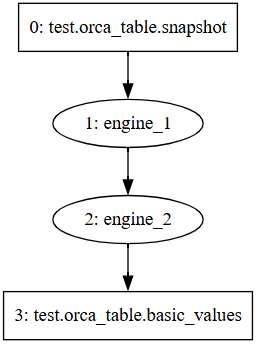
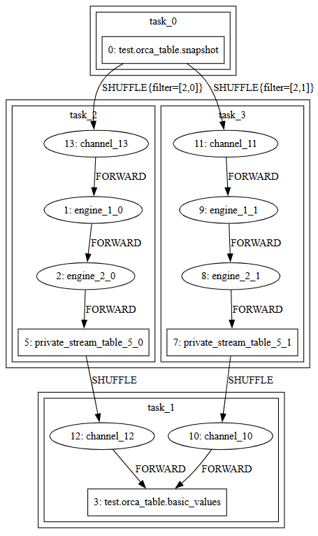
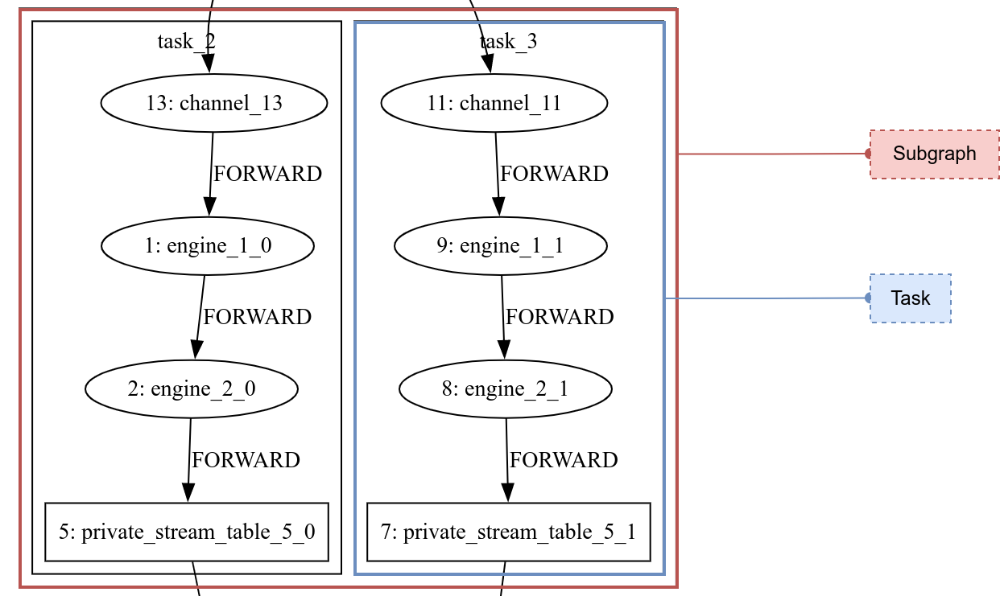
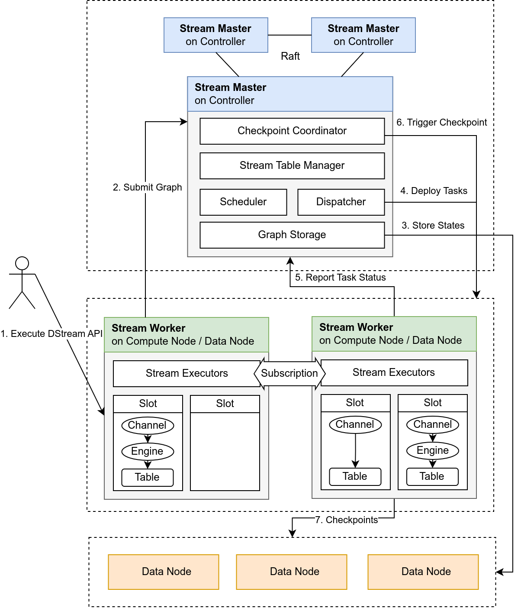
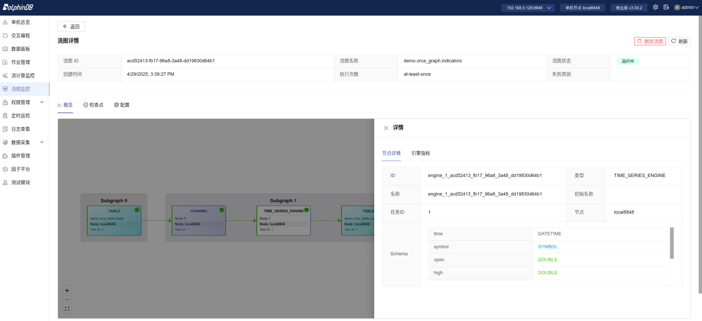

# Orca 实时计算平台

## 1. Orca 概述

随着多集群部署逐渐成为常态，企业对流数据产品提出了更高的要求。多集群的流数据访问、计算和运维需求日益复杂，而传统流计算架构难以应对复杂任务之间的依赖关系表达、资源调度与高可用需求，逐渐成为业务发展的瓶颈。

当前流计算方案面临以下核心问题：

* **编码复杂，出错率高**

  用户需要手动推导不同引擎间的表结构，自行编写并行逻辑、级联关系、资源清理等代码，导致编码繁琐且出错风险高。
* **暴露底层概念，心智负担重**

  缺乏抽象层，比如流表的发布依赖 `share`
  关键字，用户还需理解共享会话机制等系统细节，导致使用门槛较高。
* **部署与运维复杂**

  用户需手动指定流任务部署在哪台物理节点上。节点重启后，整套流计算框架需要重新搭建，缺乏自动恢复机制。
* **运维操作割裂**

  查看流表、写入数据、引擎预热等操作必须连接到特定节点执行，不利于统一管理和自动化调度。

Orca 在 DolphinDB 现有流数据产品之上提供了一层抽象与增强，核心目标是：

* **计算抽象**

  提供一套声明式
  API，支持链式编程风格，简化流计算框架构建流程。用户无需关心表结构推导、并行度拆分、级联订阅与资源清理。
* **自动调度**

  系统根据构建的流图，结合集群拓扑与资源状况，自动完成任务的部署与执行，无需用户干预。
* **计算任务高可用**

  通过内置 Checkpoint
  机制，当节点发生故障或机器宕机时，可自动恢复至最近一次快照状态，确保计算任务不遗漏任何待处理的数据。

## 2. 核心概念

本节将介绍 Orca 的基础概念，包括声明式 API 的编程模型、流图的类别与生命周期、流表的作用划分、子图与流任务的拆解等。

### 2.1 全限定名

DolphinDB 支持数据目录（catalog），用于统一组织各类数据库对象，包括对分布式表的支持。现在，Orca 进一步扩展了 catalog
的应用范围，将流图、流表和流引擎也注册进 catalog 中，使用户能够通过一种统一的方式访问各类元素。

为了唯一标识 catalog 中的对象，当前版本采用了 `<catalog>.<schema>.<name>`
的三段式命名方式，称其为全限定名（Fully Qualified Name，FQN）。

在为对象命名时，用户只需指定 name，系统将自动补全 FQN：

* catalog 由当前 catalog 决定
* schema 根据对象是流图、流表、引擎分别命名为 orca\_graph, orca\_table, orca\_engine。

### 2.2 声明式 API

Orca 提供了一套声明式 API（Declarative Stream API，DStream API），用于简洁地构建实时流计算图。该 API
屏蔽了底层并行调度、订阅关系、资源清理等复杂逻辑，让用户聚焦于业务本身的表达。

用户无需手动推导表结构，编写并行引擎构建逻辑，显式订阅数据，编写任务清理与销毁逻辑。系统会将用户定义的 DStream API 转换为 DolphinDB
的函数调用（如
`streamTable`、`subscribeTable`、`createReactiveStateEngine`
等），并自动封装为可调度的流任务分发至各个节点执行。

DStream API 主要包含以下几类调用：

* 节点定义类：如 `source`, `buffer`,
  `sink`, `timeSeriesEngine`,
  `reactiveStateEngine` 等；
* 节点修饰类：如 `setEngineName`, `parallelize`,
  `sync` 等；
* 边操作类：如 `map`、`fork` 等。

接口列表见[附录](#topic_zgc_ync_3fc)。用户的思维模式应类似构造链式数据结构：不断向尾部添加或修饰节点，逐步完成整个流图的拼装。

### 2.3 流图

使用 DStream API 构建的计算流程被抽象为一个有向无环图，即流图（Stream
Graph），其中每个节点代表一个流表或引擎，每条边表示节点之间的数据传递关系（如级联或订阅）。

流图可分为逻辑流图和物理流图：

* **逻辑流图**是用户调用 DStream API 一步步构建的流图，它代表实际业务逻辑。如图 2-1 所示。
* **物理流图**是用户提交（`submit`）逻辑流图时，系统经过添加私有流表、应用调度优化、拆分子图与并行任务等过程得到的流图，它定义了实际的流任务。如图
  2-2 所示。

图 1. 图 2-1 逻辑流表



图 2. 图 2-2 物理流表



为了管理流图的生命周期，Orca 定义了一系列状态和状态转移。分别是：

* **building**：任务已调度。当前系统中任务未分发、正在执行级联或构建订阅。
* **running**：任务已构建。流计算任务正常运行。
* **error**：可恢复错误。例如任务出现资源上的异常，需要重新调度。
* **failed**：不可恢复错误。例如任务本身逻辑有误，需要用户介入修改脚本。
* **destroying**：用户请求销毁流图。当前系统正在销毁。
* **destroyed**：流图已销毁。状态机终止。

### 2.4 流表

Orca 支持两类流表，用于数据中转与存储：

* **私有流表**是非持久化的流表，仅供当前流图使用，用于缓存中间结果、并行度匹配、多下游订阅等，不支持直接通过 SQL
  语句查询。销毁流图时，会销毁流图中的所有私有流表。
* **公共流表**是持久化流表，可同时被多个流图订阅，用于与外部交互、持久化输出或作为数据源，可直接通过 SQL
  语句查询。当无任何流图订阅某公共流表时，该表将自动销毁并释放其全限定名。

### 2.5 子图与流任务

当用户提交逻辑流图时，系统会对逻辑流图进行如下处理：

1. **检查环**：通过拓扑排序检查是否成环，若存在环则报错；
2. **添加流表**：添加私有流表缓存中间结果。比如某引擎存在多个输出或上下游节点并行度不同等情况。因为引擎只能级联输出，不可以被订阅，所以当有多个下游出现时，必须添加流表进行中转。上下游节点并行度不同时，需要中间流表，将上游数据汇总后按照下游并发度重新分发，这个过程称为
   shuffle。
3. **优化**：删除多余的新增私有流表。
4. **分割子图**：将整个图拆分成并行度相同的、尽量长的**子图（Subgraph）**。这一步的目的是尽可能减少需要并行执行的任务数。
5. **拆分计算任务**：在子图内按照并行度拆分出**流任务（Stream
   Task）**。流任务是分发执行的单位，每个任务都会被调度到一个线程上运行，即一个流任务内部的引擎和流表构成级联关系，由一个线程按顺序执行。而流任务之间通过订阅传递数据。任务数的总量决定了系统线程的使用上限。Orca
   会尽量减少任务数量以提升资源利用率。
6. **添加 Channel** ：为了在流任务执行 Checkpoint 时对齐 Barrier（在数据流中插入的标记，详见 Checkpoint
   机制），系统需要添加 Channel 。

如图 2-3 所示，红色方框代表子图，蓝色方框代表流任务：

图 3. 图 2-3 子图与流任务



## 3. 系统架构

Orca 采用典型的 Master-Worker 架构，结合 DolphinDB
的分布式文件系统（DFS）实现流图的自动部署、任务调度与容错恢复。系统中各组件职责明确，通过集中式状态管理，实现了高可用的流计算平台。

### 3.1 整体架构

Orca 架构如图 3-1 所示：

* 用户通过调用 Orca 接口，提交流图定义；
* Stream Master 接收逻辑流图，并根据拓扑和资源状况生成物理流图和调度计划；
* Stream Worker 负责实际构建流表与引擎、运行任务、进行 Checkpoint；
* 所有核心状态（包括流图结构、调度记录、流表位置、Checkpoint 元信息等）均持久化至 DFS 表；
* 系统内部通过心跳检测、状态上报与 Barrier 机制实现计算图的高可用运行。

图 4. 图 3-1 Orca 架构



### 3.2 Stream Master

Stream Master 部署在控制节点（Controller）上，其职责如下：

* 接收用户请求（流图提交、删除、状态查询等）；
* 接收 Stream Worker 的状态上报；
* 执行流图状态机（构建 → 运行 → 错误恢复 → 销毁）；
* 分配任务到各个节点，管理并行度与资源隔离；
* 定时触发 Checkpoint，协调流图内所有任务执行快照；
* 维护元信息，持久化到 DFS 表。

### 3.3 Stream Worker

Stream Worker 部署在数据节点（data node）或计算节点（compute node），其职责如下：

* 接收 Stream Master 分发的任务，构建流表、引擎、级联与订阅结构；
* 执行并监控流任务（如聚合计算、状态计算、指标生成）；
* 完成本地状态快照，上传Checkpoint。

Stream Worker 的数据处理完全在内存中实现，除公共流表以外，不做本地持久化。引擎状态通过 Checkpoint 记录。

## 4. 流任务调度

为实现任务的合理分发与高效执行，Orca
内置一套分布式调度算法，基于节点资源打分、调度规则匹配与流图拓扑解析，动态完成流任务的分配。系统还支持错误恢复重调度、计算组隔离等功能，确保资源隔离与运行稳定性。

### 4.1 调度原则

调度器遵循以下原则：

* **均衡负载**：优先将任务分配至空闲资源充足的节点，避免 CPU、内存或磁盘资源过载；
* **计算组隔离**：同一流图内的任务运行在同一计算组中；
* **流表调度约束**：公共流表部署在数据节点；
* **Siblings 任务亲和性**：具有相同上游和下游的任务称为 siblings 任务，将它们分配至同一节点，减少通信代价；

### 4.2 节点打分机制

系统根据每个候选节点的资源，计算一个评分值表示该节点的调度优先级。对不同节点类型采取不同的评分标准：

* 计算节点的评分由其 CPU 使用率和内存使用率计算得到。
* 数据节点的评分由其 CPU 使用率、内存使用率和磁盘使用率计算得到。

### 4.3 调度流程与任务分配

调度过程基于贪心策略，整体流程如下：

1. **任务复杂度排序**：系统根据流任务中的算子数量，评估其复杂度，越复杂的任务越早被调度。
2. **候选节点评分**：按前述规则计算所有符合调度约束的节点分数。
3. **节点优先筛选：**
   * 若任务包含公共流表，则限定在数据节点中筛选；
   * 若任务不包含公共流表，限定在同一个计算组内筛选计算节点；
   * 若某一节点已分配同流图 siblings 任务 ，则增大其评分值。
4. **任务分配**：将任务分配给得分最高的节点，并更新其评分值，确保后续任务感知当前负载变化。

## 5.计算任务高可用

为保障流计算任务在分布式环境中的稳定运行，Orca
通过流图级别的 Checkpoint 机制，在任何节点宕机、网络或存储故障场景下都能快速恢复计算任务，保证数据不丢失。

### 5.1 Checkpoint 机制

Orca 的 Checkpoint 实现基于 Chandy–Lamport 分布式快照算法，引入
**Barrier**标记流图内部的数据流的一致性边界，从而获得全局一致快照。

Checkpoint 的核心流程如下：

1. Checkpoint Coordinator 组件定期触发 Checkpoint 任务，并向所有 source 节点注入 Barrier。
2. source 节点在收到 Barrier 后将其原子性地写入流表，并记录当前流表的数据偏移量（offset）。
3. 流图中的引擎或流表在收到上游的 Barrier 时，将自身状态做一次快照，然后将 Barrier 向下游传递。
4. 当 sink 节点收到 Barrier，标志其上游所有节点均已完成快照。当所有 sink 节点都收到 Barrier，标志此次 Checkpoint
   完成。

### 5.2 端到端一致性

一致性语义包含以下两种类型：

* AT\_LEAST\_ONCE：数据至少处理一次，即不会丢失，但可能会被重复处理。
* EXACTLY\_ONCE：数据仅处理一次，既不丢失，也不重复。

Orca 的端到端一致性是指从数据源（ source 节点）到数据接收端（ sink 节点）的一致性，包括 source 端一致性，计算任务（除
source、sink 外的中间节点）的一致性和 sink 端一致性。如前文所述，Checkpoint
机制已确保了计算任务的一致性。若要实现端到端的一致性，还需实现 source 端和 sink 端的一致性：

* **source 端一致性：**source
  端的一致性依赖于系统在重启后能够从指定位置恢复数据。由于使用了持久化的流表，可通过偏移量（offset）记录数据的回放位置，因此 source
  端天然实现一致性。
* **计算任务一致性 ：**Orca 通过实现 Chandy-Lamport 分布式快照算法，保证计算任务在分布式环境中的全局一致性。
* **sink 端一致性**：sink 端一致性由流表类型决定，只有当除了 source 以外的所有公共流表都是 keyedStreamTable
  或 latestKeyedStreamTable 时，依靠这两种流表的去重功能，将上游的重复数据过滤，才能实现端到端的EXACTLY\_ONCE
  一致性，否则只能实现端到端的 AT\_LEAST\_ONCE 一致性。

注：

EXACTLY\_ONCE 由于依靠键值的去重功能实现，因此只能保证内存中数据的主键唯一性。当某一主键被持久化后，keyedStreamTable 和
latestKeyedStreamTable 仍然能够接受新插入的相同主键。

这种方案可以确保内存中数据键值的唯一性，而不是全局唯一性。尽管如此，仍足以应对多路写入或网络延迟可能导致的重复提交问题。

### 5.3 Barrier 对齐

对于 EXACTLY\_ONCE 一致性，在引擎或流表传递 Barrier 的过程中，如果有多个上游，则需要等收到所有上游的 Barrier
后再做快照。这个过程称作 Barrier 对齐。

Orca 引入了轻量级中间组件 Channel，该组件位于除 source 节点外的所有流任务中，用于实现 Barrier 对齐：

* Channel 位于引擎或流表的每一个上游通路上，接收到 Barrier 时会暂停该通路上的数据传输；
* 待所有 Channel 均收到 Barrier，则推动该流任务中所有下游引擎或流表依次完成快照。
* 完成后将 Barrier 转发至该任务的输出流表中，从而将其向下游传递。

## 6. 运维与权限

为了支持流计算任务的稳定运行与高效排障，Orca 提供了完善的运维接口与可视化支持。

### 6.1 流图运维

Orca 提供了丰富的运维函数，可对流图进行全面监控，详情请参考[附录](#topic_zgc_ync_3fc)。

### 6.1 可视化界面支持

除运维函数外，Orca 还提供了 Web 可视化模块，用于图形化展示流图结构与运行状态。该模块可展示当前集群中所有流图。图 6-1
展示了流图中某个节点的状态：

图 5. 图 6-1 Web 可视化界面



### 6.2 权限控制

Orca 的权限控制基于 DolphinDB 权限系统：

提交、删除等对流图的操作要求用户具有 COMPUTE\_GROUP\_EXEC 权限。

## 7. 使用示例：构建一分钟 K 线聚合与指标计算流图

本节将通过一个完整示例，演示如何使用 Orca 构建一个流计算图，实现对逐笔交易数据的 1 分钟 K 线聚合和常见技术指标（如
EMA、MACD、KDJ）的实时计算。

整个流程共分为五步，以下所有脚本均在计算节点或单节点环境中运行：

### 7.1 准备工作

增加必要配置项：

* 在配置文件 controller.cfg，cluster.cfg 中配置 `enableORCA=true`，开启
  Orca；
* 在配置文件 cluster.cfg 中配置 `persistenceDir`，用于持久化公共流表数据；

定义 catalog、指标函数与算子：

```
if (!existsCatalog("demo")) {
	createCatalog("demo")
}
go
use catalog demo
```

编写技术指标函数:

```
@state
def EMA(S, N) {
	return ::ewmMean(S, span = N, adjust = false)
}
@state
def RD(N, D = 3) {
	return ::round(N, D)
}
@state
def HHV(S, N) {
	return ::mmax(S, N)
}
@state
def LLV(S, N) {
	return ::mmin(S, N)
}
@state
def MACD(CLOSE, SHORT_ = 12, LONG_ = 26, M = 9) {
	DIF = EMA(CLOSE, SHORT_) - EMA(CLOSE, LONG_)
	DEA = EMA(DIF, M)
	MACD = (DIF - DEA) * 2
	return RD(DIF, 3), RD(DEA, 3), RD(MACD, 3)
}
@state
def KDJ(CLOSE, HIGH, LOW, N = 9, M1 = 3, M2 = 3) {
	RSV = (CLOSE - LLV(LOW, N)) \ (HHV(HIGH, N) - LLV(LOW, N)) * 100
	K = EMA(RSV, (M1 * 2 - 1))
	D = EMA(K, (M2 * 2 - 1))
	J = K * 3 - D * 2
	return K, D, J
}
```

定义聚合算子与指标算子：

```
aggerators = [
    <first(price) as open>,
    <max(price) as high>,
    <min(price) as low>,
    <last(price) as close>,
    <sum(volume) as volume>
]

indicators = [
    <time>,
    <high>,
    <low>,
    <close>,
    <volume>,
    <EMA(close, 20) as ema20>,
    <EMA(close, 60) as ema60>,
    <MACD(close) as `dif`dea`macd>,
    <KDJ(close, high, low) as `k`d`j>
]
```

### 7.2 构建流图并提交

使用 DStream API 定义流图，并提交。

```
g = createStreamGraph("indicators")
g.source("trade", 1:0, `time`symbol`price`volume, [DATETIME,SYMBOL,DOUBLE,LONG])
    .timeSeriesEngine(windowSize=60, step=60, metrics=aggerators, timeColumn=`time, keyColumn=`symbol)
    .buffer("one_min_bar")
    .reactiveStateEngine(metrics=indicators, keyColumn=`symbol)
    .buffer("one_min_indicators")
g.submit()
```

等待流图状态转为 running 后再进行后续操作，期间可通过以下接口查看流图运行状态：

```
getStreamGraphMeta()
```

示例输出（已转为运行中）：

| id | fqn | status | semantics | checkpointConfig | ... |
| --- | --- | --- | --- | --- | --- |
| df83...08 | demo.orca\_graph.indicators | running | at-least-once | ... | ... |

### 7.3 插入模拟数据

以下脚本模拟写入了股票的秒级 K 线数据：

```
sym = symbol(`600519`601398`601288`601857)
ts = 2025.01.01T09:30:00..2025.01.01T15:00:00

n =size(ts) * size(sym)
symbol = stretch(sym, n)
timestamp = take(ts, n)
price = 100+cumsum(rand(0.02, n)-0.01)
volume = rand(1000, n)
trade = table(timestamp, symbol, price, volume)

appendOrcaStreamTable("trade", trade)
```

### 7.4 查询结果

通过 SQL 获取 1 分钟聚合 K 线和指标：

```
select * from demo.orca_table.trade
select * from demo.orca_table.one_min_bar
select * from demo.orca_table.one_min_indicators
```

### 7.5 清理流图

以下脚本会清理流图中定义的所有引擎和流表：

```
dropStreamGraph("indicators")
```

## 8. 未来规划

为持续提升 Orca 的功能完备性、灵活性与性能表现，未来我们将围绕以下方向进行优化：

### 8.1 功能增强

**跨集群能力：**支持跨 DolphinDB 集群的数据流动，包括跨集群订阅、跨集群流表访问以及跨集群 Join，满足多集群业务整合需求。

**更丰富的状态控制能力：**支持计算任务的灵活管理，例如暂停计算、重置流图状态等，提升运维与调试便利性。

**更精细的参数调整：**允许用户调整 DStream API
中自动生成的参数，如订阅参数（`subscribeTable`）、私有流表配置（`enableTableShareAndCachePurge`）等，实现更细粒度的性能调优。

**声明式 API 的扩展：**丰富 API 能力，支持用户在定义流表时显式指定分区数，支持在同一流图中使用 sourceByName
等高级用法，提升图构建灵活性。

**可选的高可用协议：**引入可选的流数据高可用协议，支持在不同容错级别与延迟表现之间灵活权衡，满足多样化业务需求。

**可选的调度算法：**提供灵活的流图调度策略，支持高吞吐与低延迟之间的自定义权衡，进一步允许接入用户自定义调度算法。

### 8.2 性能优化

**物理流图优化：**优化表连接性能，提升跨节点表连接的执行效率，减少数据 shuffle。

**运行时优化：**用级联代替订阅，进一步减小时延，提升运行效率。

**Checkpoint 性能优化：**针对 Barrier 对齐进行进一步优化，引入增量快照与异步快照机制，降低 Checkpoint
对计算性能的影响，缩短容错恢复时间。

## 9. 附录

Orca 提供了关于流图、流表、引擎、Checkpoint 等多种类型的接口：

| 分类 | 接口 | 功能简述 |
| --- | --- | --- |
| 定义 | createStreamGraph | 创建一个StreamGraph对象 |
| StreamGraph::setConfigMap | 设置图的私有流表和订阅的配置项 |
| StreamGraph::source / keyedSource / latestKeyedSource / haSource / haKeyedSource | 定义流图输入源流表 |
| StreamGraph::sourceByName | 获取一个 Orca 创建的公共流表 |
| DStream::anomalyDetectionEngine | 定义异常检测引擎 |
| DStream::asofJoinEngine | 定义 asof join 引擎 |
| DStream::crossSectionalEngine | 定义横截面计算引擎 |
| DStream::cryptoOrderBookEngine | 定义数字货币实时订单簿引擎 |
| DStream::dailyTimeSeriesEngine | 定义日级时间序列引擎 |
| DStream::dualOwnershipReactiveStateEngine | 定义 Dual Ownership 响应式状态引擎 |
| DStream::narrowReactiveStateEngine | 定义生成窄表的响应式状态引擎 |
| DStream::orderBookSnapshotEngine | 定义订单簿引擎 |
| DStream::pricingEngine | 定义估值定价引擎 |
| DStream::reactiveStateEngine | 定义响应式状态引擎 |
| DStream::reactiveStatelessEngine | 定义响应式无状态引擎 |
| DStream::ruleEngine | 定义规则引擎 |
| DStream::sessionWindowEngine | 定义会话窗口引擎 |
| DStream::timeBucketEngine | 定义自定义窗口长度（长度相同或不同）的时间序列聚合引擎 |
| DStream::timeSeriesEngine | 定义时间序列聚合引擎 |
| DStream::equalJoinEngine | 定义等值连接引擎 |
| DStream::leftSemiJoinEngine | 定义左半等值连接引擎 |
| DStream::lookupJoinEngine | 定义 lookup join 引擎 |
| DStream::snapshotJoinEngine | 定义快照连接引擎 |
| DStream::windowJoinEngine | 定义窗口连接引擎 |
| DStream::buffer / keyedBuffer / latestKeyedBuffer | 定义中间结果流表 |
| DStream::sink / keyedSink / latestKeySink / haSource / haKeyedSource | 定义数据输出流表 |
| DStream::map | 定义数据转换逻辑 |
| DStream::fork | 定义流图分叉 |
| DStream::parallelize | 设置流图并行度 |
| DStream::sync | 同步上游计算结果 |
| DStream::setEngineName | 设置当前引擎名称用于预热 |
| DStream::getOutputSchema | 获取表结构用于下游定义 |
| 流图管理 | StreamGraph::submit | 提交流图以启动运行 |
| getStreamGraph | 获取流图对象 |
| dropStreamGraph | 销毁流图 |
| purgeStreamGraphRecords | 删除流图记录 |
| 流表操作 | appendOrcaStreamTable | 向流表插入数据 |
| select \* from orca\_table.<name> 或select \* from <catalog>.orca\_table.<name> | 查询流表内容 |
| 引擎操作 | warmupOrcaStreamEngine | 预热流引擎以提升首批计算效率 |
| 监控运维 | getStreamGraphInfo/getStreamGraphMeta | 获取流图元信息 |
| getOrcaStreamTableMeta | 获取流表元信息 |
| getOrcaStreamEngineMeta | 获取流引擎元信息 |
| getOrcaStreamTaskSubscriptionMeta | 获取订阅元信息 |
| getOrcaStateMachineEventTaskStatus | 获取状态机任务状态 |
| StreamGraph::toGraphviz / str | 输出拓扑结构 |
| Checkpoint管理 | setCheckpointConfig | 配置Checkpoint参数 |
| getCheckpointConfig | 查看Checkpoint配置 |
| getCheckpointJobinfo | 查看Checkpoint Job运行信息 |
| getCheckpointSubjobInfo | 查看Checkpoint子任务运行信息 |

