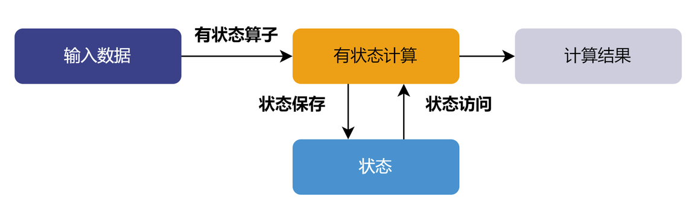

# 有状态算子

有状态算子是指在处理流数据时，需要维护状态的算子。这种算子的输出不仅依赖于当前输入，还依赖于先前的状态或历史记录。在处理完当前输入后，有状态算子会更新其内部状态，并将其用于后续的计算。因此，相同的输入在不同的状态下可能会产生不同的输出。



## 有状态算子

在 DolphinDB 的部分流计算引擎中，例如状态引擎、时序聚合引擎、window join
引擎，可以使用内置有状态算子。内置的有状态算子经过系统优化，实现了增量计算，可以提高计算性能。在状态引擎中，还可以使用自定义状态算子，以满足用户复杂的流计算需求。

**内置有状态算子**

以下内置函数可以作为响应式状态引擎的有状态算子：

* 累计窗口函数：[cumavg](../funcs/c/cumavg.html), [cumsum](../funcs/c/cumsum.html), [cumprod](../funcs/c/cumprod.html), [cumcount](../funcs/c/cumcount.html), [cummin](../funcs/c/cummin.html), [cummax](../funcs/c/cummax.html), [cumvar](../funcs/c/cumvar.html), [cumvarp](../funcs/c/cumvarp.html), [cumstd](../funcs/c/cumstd.html), [cumstdp](../funcs/c/cumstdp.html), [cumcorr](../funcs/c/cumcorr.html), [cumcovar](../funcs/c/cumcovar.html), [cumbeta](../funcs/c/cumbeta.html), [cumwsum](../funcs/c/cumwsum.html), [cumwavg](../funcs/c/cumwavg.html), [cumfirstNot](../funcs/c/cumfirstNot.html),
  [cumlastNot](../funcs/c/cumlastNot.html), [cummed](../funcs/c/cummed.html), [cumpercentile](../funcs/c/cumpercentile.html), [cumnunique](../funcs/c/cumnunique.html),
  [cumPositiveStreak](../funcs/c/cumPositiveStreak.html), [cummdd](../funcs/c/cummdd.html)
* 滑动窗口函数：[ema](../funcs/c/../e/ema.html), [mavg](../funcs/c/../m/mavg.html), [msum](../funcs/c/../m/msum.html), [mcount](../funcs/c/../m/mcount.html), [mprod](../funcs/c/../m/mprod.html), [mvar](../funcs/c/../m/mvar.html), [mvarp](../funcs/c/../m/mvarp.html), [mstd](../funcs/c/../m/mstd.html), [mstdp](../funcs/c/../m/mstdp.html), [mskew](../funcs/c/../m/mskew.html), [mkurtosis](../funcs/c/../m/mkurtosis.html), [mmin](../funcs/c/../m/mmin.html), [mmax](../funcs/c/../m/mmax.html), [mimin](../funcs/c/../m/mimin.html), [mimax](../funcs/c/../m/mimax.html), [mmed](../funcs/c/../m/mmed.html), [mpercentile](../funcs/c/../m/mpercentile.html), [mrank](../funcs/c/../m/mrank.html), [mcorr](../funcs/c/../m/mcorr.html), [mcovar](../funcs/c/../m/mcovar.html), [mbeta](../funcs/c/../m/mbeta.html), [mwsum](../funcs/c/../m/mwsum.html), [mwavg](../funcs/c/../m/mwavg.html), [mmad](../funcs/c/../m/mmad.html), [mfirst](../funcs/c/../m/mfirst.html), [mlast](../funcs/c/../m/mlast.html), [mslr](../funcs/c/../m/mslr.html), [tmove](../funcs/c/../t/tmove.html), [tmfirst](../funcs/c/../t/tmfirst.html), [tmlast](../funcs/c/../t/tmlast.html), [tmsum](../funcs/c/../t/tmsum.html), [tmsum2](../funcs/c/../t/tmsum2.html), [tmavg](../funcs/c/../t/tmavg.html), [tmcount](../funcs/c/../t/tmcount.html), [tmvar](../funcs/c/../t/tmvar.html), [tmvarp](../funcs/c/../t/tmvarp.html), [tmstd](../funcs/c/../t/tmstd.html), [tmstdp](../funcs/c/../t/tmstdp.html), [tmprod](../funcs/c/../t/tmprod.html), [tmskew](../funcs/c/../t/tmskew.html), [tmkurtosis](../funcs/c/../t/tmkurtosis.html), [tmmin](../funcs/c/../t/tmmin.html), [tmmax](../funcs/c/../t/tmmax.html), [tmmed](../funcs/c/../t/tmmed.html), [tmpercentile](../funcs/c/../t/tmpercentile.html),
  [tmrank](../funcs/c/../t/tmrank.html), [tmcovar](../funcs/c/../t/tmcovar.html), [tmbeta](../funcs/c/../t/tmbeta.html), [tmcorr](../funcs/c/../t/tmcorr.html), [tmwavg](../funcs/c/../t/tmwavg.html), [tmwsum](../funcs/c/../t/tmwsum.html), [tmoving](../funcs/c/../ho_funcs/tmoving.html), [moving](../funcs/c/../ho_funcs/moving.html), [sma](../funcs/c/../s/sma.html), [wma](../funcs/c/../w/wma.html), [dema](../funcs/c/../d/dema.html), [tema](../funcs/c/../t/tema.html),
  [trima](../funcs/c/../t/trima.html), [linearTimeTrend](../funcs/c/../l/linearTimeTrend.html), [talib](../funcs/c/../ho_funcs/talib.html), [t3](../funcs/c/../t/t3.html), [ma](../funcs/c/../m/ma.html), [gema](../funcs/c/../g/gema.html), [wilder](../funcs/c/../w/wilder.html), [mmaxPositiveStreak](../funcs/c/../m/mmaxPositiveStreak.html), [movingWindowData](../funcs/c/../m/movingWindowData.html), [tmovingWindowData](../funcs/c/../t/tmovingWindowData.html)
* 行计算函数： [rowMin](../funcs/c/../r/rowMin.html), [rowMax](../funcs/c/../r/rowMax.html), [rowAnd](../funcs/c/../r/rowAnd.html), [rowOr](../funcs/c/../r/rowOr.html), [rowXor](../funcs/c/../r/rowXor.html), [rowProd](../funcs/c/../r/rowProd.html), [rowSum](../funcs/c/../r/rowSum.html), [rowSum2](../funcs/c/../r/rowSum2.html), [rowSize](../funcs/c/../r/rowSize.html), [rowCount](../funcs/c/../r/rowCount.html), [rowAvg](../funcs/c/../r/rowAvg.html), [rowKurtosis](../funcs/c/../r/rowKurtosis.html), [rowSkew](../funcs/c/../r/rowSkew.html), [rowVar](../funcs/c/../r/rowVar.html), [rowVarp](../funcs/c/../r/rowVarp.html), [rowStd](../funcs/c/../r/rowStd.html), [rowStdp](../funcs/c/../r/rowStdp.html)
* 序列相关函数：[deltas](../funcs/c/../d/deltas.html), [ratios](../funcs/c/../r/ratios.html), [ffill](../funcs/c/../f/ffill.html), [move](../funcs/c/../m/move.html), [prev](../funcs/c/../p/prev.html), [iterate](../funcs/c/../i/iterate.html), [ewmMean](../funcs/c/../e/ewmMean.html), [ewmVar](../funcs/c/../e/ewmVar.html), [ewmStd](../funcs/c/../e/ewmStd.html), [ewmCov](../funcs/c/../e/ewmCov.html), [ewmCorr](../funcs/c/../e/ewmCorr.html), [prevState](../funcs/c/../p/prevState.html), [percentChange](../funcs/c/../p/percentChange.html)
* topN相关函数：[msumTopN](../funcs/c/../m/msumTopN.html), [mavgTopN](../funcs/c/../m/mavgTopN.html), [mstdpTopN](../funcs/c/../m/mstdpTopN.html), [mstdTopN](../funcs/c/../m/mstdTopN.html), [mvarpTopN](../funcs/c/../m/mvarpTopN.html), [mvarTopN](../funcs/c/../m/mvarTopN.html), [mcorrTopN](../funcs/c/../m/mcorrTopN.html), [mbetaTopN](../funcs/c/../m/mbetaTopN.html), [mcovarTopN](../funcs/c/../m/mcovarTopN.html), [mwsumTopN](../funcs/c/../m/mwsumTopN.html), [cumsumTopN](../funcs/c/cumsumTopN.html), [cumwsumTopN](../funcs/c/cumwsumTopN.html), [cumvarTopN](../funcs/c/cumvarTopN.html), [cumvarpTopN](../funcs/c/cumvarpTopN.html), [cumstdTopN](../funcs/c/cumstdTopN.html), [cumstdpTopN](../funcs/c/cumstdpTopN.html), [cumcorrTopN](../funcs/c/cumcorrTopN.html), [cumbetaTopN](../funcs/c/cumbetaTopN.html), [cumavgTopN](../funcs/c/../m/mstdpTopN.html), [msumTopN](../funcs/c/../m/msumTopN.html), [mavgTopN](../funcs/c/../m/mavgTopN.html), [mstdpTopN](../funcs/c/../m/mstdpTopN.html), [mstdTopN](../funcs/c/../m/mstdTopN.html), [mvarpTopN](../funcs/c/../m/mvarpTopN.html), [mvarTopN](../funcs/c/../m/mvarTopN.html), [mcorrTopN](../funcs/c/../m/mcorrTopN.html), [mbetaTopN](../funcs/c/../m/mbetaTopN.html), [mcovarTopN](../funcs/c/../m/mcovarTopN.html), [mwsumTopN](../funcs/c/../m/mwsumTopN.html), [cumsumTopN](../funcs/c/cumsumTopN.html), [cumwsumTopN](../funcs/c/cumwsumTopN.html), [cumvarTopN](../funcs/c/cumvarTopN.html), [cumvarpTopN](../funcs/c/cumvarpTopN.html), [cumstdTopN](../funcs/c/cumstdTopN.html), [cumstdpTopN](../funcs/c/cumstdpTopN.html), [cumcorrTopN](../funcs/c/cumcorrTopN.html), [cumbetaTopN](../funcs/c/cumbetaTopN.html), [cumavgTopN](../funcs/c/cumavgTopN.html), [cumskewTopN](../funcs/c/cumskewTopN.html), [cumkurtosisTopN](../funcs/c/cumkurtosisTopN.html), [mskewTopN](../funcs/c/../m/mskewTopN.html),
  [mkurtosisTopN](../funcs/c/../m/mkurtosisTopN.html),[tmsumTopN](../funcs/c/../t/tmsumTopN.html), [tmavgTopN](../funcs/c/../t/tmavgTopN.html), [tmstdTopN](../funcs/c/../t/tmstdTopN.html), [tmstdpTopN](../funcs/c/../t/tmstdpTopN.html), [tmvarTopN](../funcs/c/../t/tmvarTopN.html), [tmvarpTopN](../funcs/c/../t/tmvarpTopN.html), [tmskewTopN](../funcs/c/../t/tmskewTopN.html), [tmkurtosisTopN](../funcs/c/../t/tmkurtosisTopN.html), [tmbetaTopN](../funcs/c/../t/tmbetaTopN.html), [tmcorrTopN](../funcs/c/../t/tmcorrTopN.html), [tmcovarTopN](../funcs/c/../t/tmcovarTopN.html), [tmwsumTopN](../funcs/c/../t/tmwsumTopN.html)
* 高阶函数：[segmentby](../funcs/c/../ho_funcs/segmentby.html) (参数 *func* 暂支持 cumsum, cummax, cummin, cumcount,
  cumavg, cumstd, cumvar, cumstdp, cumvarp), [moving](../funcs/c/../ho_funcs/moving.html), [byColumn](../funcs/c/../ho_funcs/byColumn.html), [accumulate](../funcs/c/../ho_funcs/accumulate.html), [window](../funcs/c/../ho_funcs/window.html)
* 其他函数：[talibNull](../funcs/c/../t/talibNull.html), [dynamicGroupCumsum](../funcs/c/../d/dynamicGroupCumsum.html), [dynamicGroupCumcount](../funcs/c/../d/dynamicGroupCumcount.html), [topRange](../funcs/c/../t/topRange.html), [lowRange](../funcs/c/../l/lowRange.html), [trueRange](../funcs/c/../t/trueRange.html), [sumbars](../funcs/c/../s/sumbars.html)
* 特殊函数（仅支持在引擎内使用）：[stateIterate](../funcs/c/../s/stateIterate.html), [conditionalIterate](../funcs/c/conditionalIterate.html), [genericStateIterate](../funcs/c/../g/genericStateIterate.html), [genericTStateIterate](../funcs/c/../g/genericTStateIterate.html)

以下内置函数可以作为时序聚合引擎的有状态算子：

corr, covar, first, last, max, med, min, percentile, quantile, std, var, sum, sum2,
sum3, sum4, wavg, wsum, count, firstNot, ifirstNot, lastNot, ilastNot, imax, imin,
nunique, prod, sem, mode, searchK, beta, avg。

以下内置函数可以作为 window join 引擎的有状态算子：

sum, sum2, avg, std, var, corr, covar, wavg, wsum, beta, max, min, last, first, med,
percentile。

**自定义有状态算子**

用户还可以通过 @state 声明自定义函数，将其封装一个自定义的状态算子。在使用自定义状态函数时，需要注意以下事项：

1. 需在定义前添加声明 "@state"。状态函数只能包含赋值语句和 return 语句。

   自 2.00.9 版本起，支持使用 if-else
   条件语句，且条件只能是标量。

   自2.00.11 版本起，支持使用 for 循环（包含 break, continue
   语句），请注意不支持嵌套 for 循环，且循环次数须小于 100 次。
2. 状态引擎中可以使用无状态函数或者状态函数。但不允许在无状态函数中嵌套使用状态函数。
3. 若赋值语句的右值是一个多返回值的函数（内置函数或自定义函数），则需要将多个返回值同时赋予多个变量。例如：两个返回值的函数 linearTimeTrend
   应用于自定义状态函数中，正确写法为：

   ```
   @state
   def forcast2(S, N){
         linearregIntercept, linearregSlope = linearTimeTrend(S, N)
         return (N - 1) * linearregSlope + linearregIntercept
   }
   ```

自定义状态算子在使用上存在一些局限性，例如其运行效率低于内置状态算子，并且仅支持部分语句。为更方便用户开发自定义状态算子，DolphinDB
还提供了更灵活且易于维护的解决方案：

* 使用 DolphinDB Class 开发状态算子。更多信息，请参考使用 DolphinDB Class 来开发流计算状态算子 。

## 有状态算子应用示例

本节我们以涨幅为例介绍如何使用响应式状态引擎进行有状态计算。在股票市场中涨幅指最新成交价格与之前某一刻的历史成交价格的价差的比。本例中将涨幅定义为当前一条行情快照的最新价与上一条行情快照的最新价格的比。

**step1：创建发布流数据表**

```
share(table=streamTable(1:0, `securityID`datetime`lastPrice`openPrice, [SYMBOL,TIMESTAMP,DOUBLE,DOUBLE]), sharedName=`tick)
```

**step2：创建存储处理后数据的共享流数据表**

```
share(table=streamTable(10000:0, `securityID`datetime`factor, [SYMBOL, TIMESTAMP, DOUBLE]), sharedName=`resultTable)
```

**step3：自定义状态算子--涨幅因子**

```
@state
def priceChange(lastPrice){
    return lastPrice \ prev(lastPrice) - 1
}
```

**step4：**创建响应式状态引擎****

```
try{ dropStreamEngine("reactiveDemo") } catch(ex){ print(ex) }
createReactiveStateEngine(name="reactiveDemo",
metrics =<[datetime, priceChange(lastPrice)]>,
dummyTable=tick, outputTable=resultTable, keyColumn="securityID")
```

创建响应式状态引擎时指定
securityID 作为分组列，即计算每支股票各自的价格涨幅。 输入引擎的消息格式同表 tick，结果输出到内存表 resultTable
中。需要计算的指标定义在 *metrics*里。

**step5：订阅发布流数据表**

```
subscribeTable(tableName="tick", actionName="reactiveDemo",
handler=getStreamEngine(`reactiveDemo), msgAsTable=true, offset=-1)
```

**step6：模拟批量数据写入**

```
securityID = ["AA", "AA", "BB", "AA"]
dateTime = [2024.06.02 09:00:00.000, 2024.06.02 09:01:00.000, 2024.06.02 09:03:00.000, 2024.06.02 09:04:00.000]
lastPrice = [9.99, 1.58, 5.37, 9.82]
openPrice = [10.05, 1.50, 5.25, 9.70]
simulateData =  table(securityID, dateTime, lastPrice, openPrice)
tableInsert(tick, simulateData)
```

**step7：查询结果表数据**

```
res = select * from resultTable
```

返回结果
res：


**step8：取消订阅**

```
unsubscribeTable(tableName="tick", actionName="reactiveDemo")
```

**step9：删除响应式状态引擎**

```
dropStreamEngine(name="reactiveDemo")
```

**step10：删除发布流数据表和结果流数据表**

**注意**：删除发布流数据表前，必须先把其所有订阅取消掉。

```
dropStreamTable(tableName="tick")
dropStreamTable(tableName="resultTable")
```

