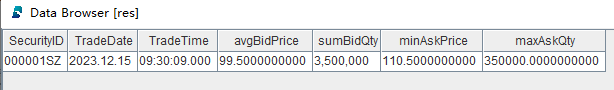

# 无状态算子

无状态算子用于无状态计算场景，其特性在于计算过程中的输出完全基于当前输入，不受先前状态或历史记录的影响。即无论计算执行之前是否有其他输入，只要每次输入相同，对应的输出结果都将保持一致。


DolphinDB 内置了丰富的计算函数，方便用户低代码实现复杂的数据分析和金融量化因子计算。内置的转换函数均可以无缝地作为无状态算子，应用于流数据的无状态计算中。

## 无状态算子应用

本节介绍自定义回调函数进行数据的 ETL 的案例。其实现过程中需要自定义无状态算子。

本例以 levle2 股票快照数据为例，对原始行情数据进行数据的清洗和转换。

**step 1：创建发布流数据表**

```
colNames = `SecurityID`DateTime`PreClosePx`OpenPx`HighPx`LowPx`LastPx`TotalVolumeTrade`TotalValueTrade`InstrumentStatus`BidPrice0`BidPrice1`BidPrice2`BidPrice3`BidPrice4`BidPrice5`BidPrice6`BidPrice7`BidPrice8`BidPrice9`BidOrderQty0`BidOrderQty1`BidOrderQty2`BidOrderQty3`BidOrderQty4`BidOrderQty5`BidOrderQty6`BidOrderQty7`BidOrderQty8`BidOrderQty9`OfferPrice0`OfferPrice1`OfferPrice2`OfferPrice3`OfferPrice4`OfferPrice5`OfferPrice6`OfferPrice7`OfferPrice8`OfferPrice9`OfferOrderQty0`OfferOrderQty1`OfferOrderQty2`OfferOrderQty3`OfferOrderQty4`OfferOrderQty5`OfferOrderQty6`OfferOrderQty7`OfferOrderQty8`OfferOrderQty9
colTypes = [SYMBOL, TIMESTAMP, DOUBLE, DOUBLE, DOUBLE, DOUBLE, DOUBLE, INT, DOUBLE, SYMBOL, DOUBLE, DOUBLE, DOUBLE, DOUBLE, DOUBLE, DOUBLE, DOUBLE, DOUBLE, DOUBLE, DOUBLE, INT, INT, INT, INT, INT, INT, INT, INT, INT, INT, DOUBLE, DOUBLE, DOUBLE, DOUBLE, DOUBLE, DOUBLE, DOUBLE, DOUBLE, DOUBLE, DOUBLE, INT, INT, INT, INT, INT, INT, INT, INT, INT, INT]
share(table=streamTable(1:0, colNames, colTypes), sharedName="pubTable")
```

**step 2：创建存储处理后数据的共享流数据表**

```
colNames = ["SecurityID", "TradeDate", "TradeTime", "avgBidPrice", "sumBidQty", "minAskPrice", "maxAskQty"]
colTypes = [SYMBOL, DATE, TIME, DOUBLE, INT, DOUBLE, DOUBLE]
share(table=streamTable(1:0, colNames, colTypes), sharedName=`result)
```

**step 3：定义数据清洗和转换的回调函数**

```
def dataETL(mutable result, msg){
	// data ETL
	tmp = 	select 	SecurityID,
			date(DateTime) as TradeDate,
			time(DateTime) as TradeTime,
			avg(BidPrice0+BidPrice1+BidPrice2+BidPrice3+BidPrice4+BidPrice5+BidPrice6+BidPrice7+BidPrice8+BidPrice9) as avgBidPrice,
			sum(BidOrderQty0+BidOrderQty1+BidOrderQty2+BidOrderQty3+BidOrderQty4+BidOrderQty5+BidOrderQty6+BidOrderQty7+BidOrderQty8+BidOrderQty9) as sumBidQty,
			min(OfferPrice0+OfferPrice1+OfferPrice2+OfferPrice3+OfferPrice4+OfferPrice5+OfferPrice6+OfferPrice7+OfferPrice8+OfferPrice9) as stdAskPrice,
			max(OfferOrderQty0+OfferOrderQty1+OfferOrderQty2+OfferOrderQty3+OfferOrderQty4+OfferOrderQty5+OfferOrderQty6+OfferOrderQty7+OfferOrderQty8+OfferOrderQty9) as skewAskQty
		from msg
		where LastPx>0, time(DateTime)>=09:30:00.000
	// result storage
	result.append!(tmp)
}
```

注：

自定义回调函数 `dataETL` 的参数 *result* 为一个共享流数据表，用于存储处理后的数据。需要通过 mutable
将其标识为可变参数，否则它只是只读变量，不能 `append!` 进行追加数据等操作。

**step 4：订阅发布流数据表**

```
subscribeTable(tableName="pubTable", actionName="dataETL", offset=-1, handler=dataETL{result}, msgAsTable=true, batchSize=2000, throttle=0.01, reconnect=true)
```

注：

handler 是自定义回调函数 `dataETL`，它接受 2 个参数：*result* 和
*msg*。其中，*result* 是一个在外部已经定义并初始化的变量，需要通过部分应用（使用
`{}`）的方式传入 `handler` 函数中。而 *msg*
是从订阅的流数据表中接收到的增量数据对象，在 `handler`
函数的定义中，无需显式指定其传入方式，因为它会自动作为第二个参数传递给函数。

**step 5：模拟批量数据写入**

```
rowNums = 10
simulateData = table(
	take(`000001SZ, rowNums) as SecurityID,
	take(0..(rowNums-1), rowNums)*1000*3+2023.12.15T09:30:00.000 as DateTime,
	take(10.6, rowNums) as PreClosePx,
	take(10.8, rowNums) as OpenPx,
	take(10.8, rowNums) as HighPx,
	take(10.2, rowNums) as LowPx,
	take(10.5, rowNums) as LastPx,
	take(0..(rowNums-1), rowNums)*1000+100000 as TotalVolumeTrade,
	take(0..(rowNums-1), rowNums)*1000*10.6+100000*10.6 as TotalValueTrade,
	take(`s, rowNums) as InstrumentStatus,
	take(10.4, rowNums) as BidPrice0,
	take(10.3, rowNums) as BidPrice1,
	take(10.2, rowNums) as BidPrice2,
	take(10.1, rowNums) as BidPrice3,
	take(10.0, rowNums) as BidPrice4,
	take(9.9, rowNums) as BidPrice5,
	take(9.8, rowNums) as BidPrice6,
	take(9.7, rowNums) as BidPrice7,
	take(9.6, rowNums) as BidPrice8,
	take(9.5, rowNums) as BidPrice9,
	take(10000, rowNums) as BidOrderQty0,
	take(20000, rowNums) as BidOrderQty1,
	take(30000, rowNums) as BidOrderQty2,
	take(40000, rowNums) as BidOrderQty3,
	take(50000, rowNums) as BidOrderQty4,
	take(60000, rowNums) as BidOrderQty5,
	take(50000, rowNums) as BidOrderQty6,
	take(40000, rowNums) as BidOrderQty7,
	take(30000, rowNums) as BidOrderQty8,
	take(20000, rowNums) as BidOrderQty9,
	take(10.6, rowNums) as OfferPrice0,
	take(10.7, rowNums) as OfferPrice1,
	take(10.8, rowNums) as OfferPrice2,
	take(10.9, rowNums) as OfferPrice3,
	take(11.0, rowNums) as OfferPrice4,
	take(11.1, rowNums) as OfferPrice5,
	take(11.2, rowNums) as OfferPrice6,
	take(11.3, rowNums) as OfferPrice7,
	take(11.4, rowNums) as OfferPrice8,
	take(11.5, rowNums) as OfferPrice9,
	take(10000, rowNums) as OfferOrderQty0,
	take(20000, rowNums) as OfferOrderQty1,
	take(30000, rowNums) as OfferOrderQty2,
	take(40000, rowNums) as OfferOrderQty3,
	take(50000, rowNums) as OfferOrderQty4,
	take(60000, rowNums) as OfferOrderQty5,
	take(50000, rowNums) as OfferOrderQty6,
	take(40000, rowNums) as OfferOrderQty7,
	take(30000, rowNums) as OfferOrderQty8,
	take(20000, rowNums) as OfferOrderQty9)
tableInsert(pubTable, simulateData)
```

**step 6：查询结果表数据**

```
res = select * from result where tradetime=09:30:09.000
```

返回结果 res：



可以看到成功对原始行情数据进行了清洗和转换。

**step 7：取消订阅**

```
unsubscribeTable(tableName="pubTable", actionName="dataETL")
```

**step 8：删除发布流数据表和结果流数据表**

删除发布流数据表前，必须先把其所有订阅取消掉。

```
dropStreamTable(tableName="pubTable")
dropStreamTable(tableName="result")
```

Copyright

**©2025 浙江智臾科技有限公司 浙ICP备18048711号-3**
