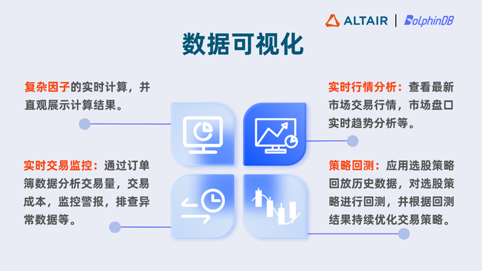
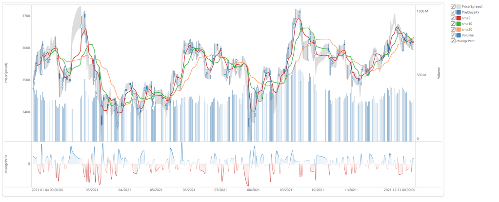
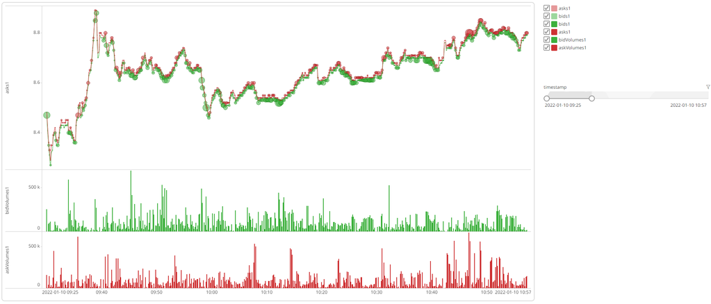
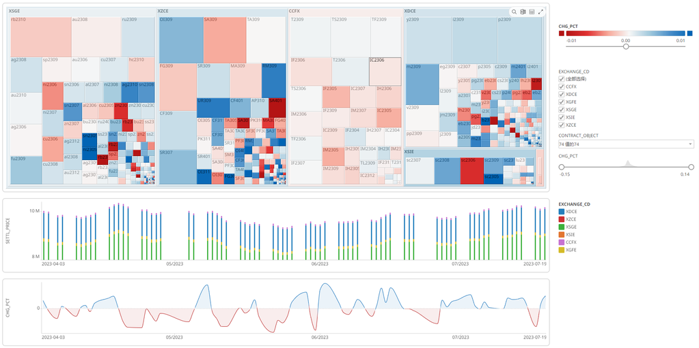
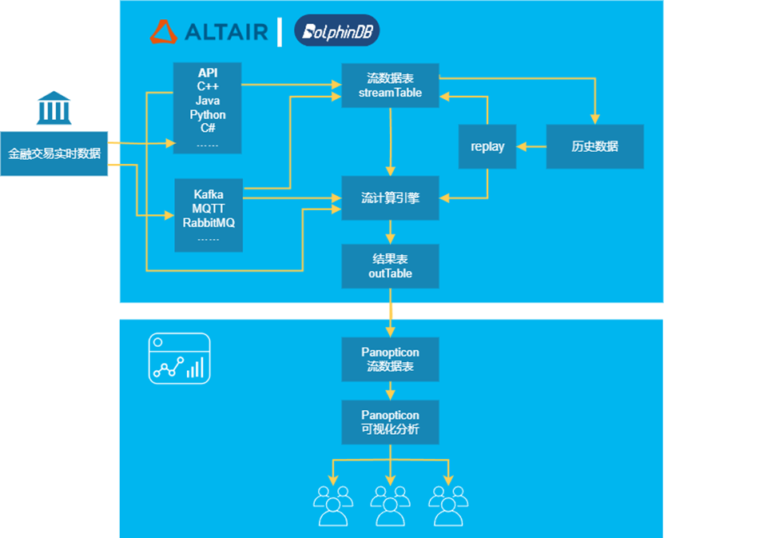
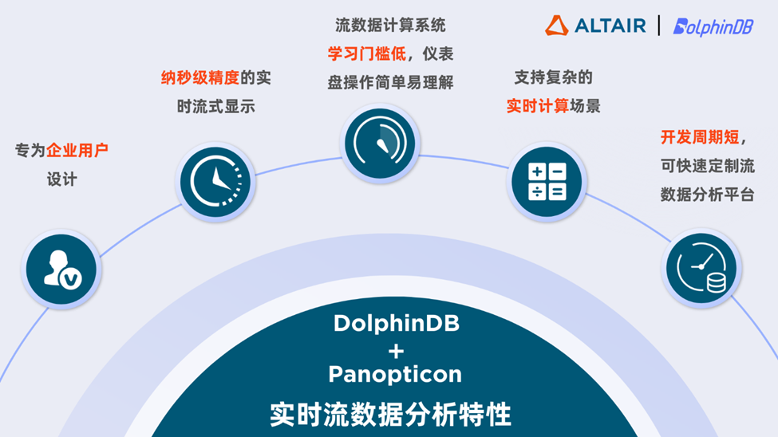

# Altair 连接 DolphinDB 数据源

在数据爆炸增长时代，不仅需要高效分析来洞察数据背后的规律，更要敏锐把握时机，才能更好地释放数据价值，实时反控商业决策。数据可视化是一种将数据转化成图形化表达的技术，通过图表、图形、地图的展现形式，海量复杂数据能够化繁为简，快速、清晰地传达关键趋势和规律信息。

实时数据可视化在全球金融市场业务中的交易、分析、监控等各个场景都有广泛应用价值。例如报表数据的实时计算，配合关键指标直观输出和展示，能帮助决策者更好地理解业务运作情况，为决策提供数据可视化支持。

为了用户能更方便地实现数据可视化，DolphinDB 已完成与 Altair® Panopticon™ 流数据分析平台的数据对接。

## Panopticon 流数据分析平台

Panopticon 流数据分析平台由数据科学和人工智能领域领先企业 Altair
研发，包含了一套专门针对时序数据进行了优化的实时数据可视化系统。系统仪表盘交互便捷，具有丰富的过滤工具，用户只需简单点击，便可以自由调整时间线长度、聚焦重点数据以及排除无关变量，直观地理解复杂关系。

## DolphinDB 流数据应用

DolphinDB
高吞吐、低延迟、高可用的流数据框架能帮助用户实现流数据的发布、订阅、预处理、实时内存计算、复杂指标的滚动窗口计算、实时关联、异常数据检测等各种功能，内置的 10+
流数据计算引擎能满足复杂业务场景下的数据处理需求。

## 应用场景示例

用 DolphinDB 和 Altair Panopticon 共同搭建的高性能时序数据分析平台包括了 SQL
查询和流数据表订阅两种数据接口，用户能够访问和分析实时流数据、日内累计数据和历史数据，并对接收到的数据实时地进行可视化展示。直观易懂的操作流程让用户可以快速地掌握使用方法，在几分钟内连接到数据源，设计一个自动刷新的可交互仪表盘并将其发布，以供交易、分析、监控等相关人员使用。

图 1. 日频交易数据分析

例如，使用 DolphinDB 流计算引擎搭配 Panopticon 可视化应用搭建价格分析仪表盘，可以将 K
线、移动平均指数、交易量等信息组合在一张图中，快速查看市场整体趋势或关键指标。

DolphinDB 和 Panopticon 的流数据引擎支持实时流数据分析或历史数据回放，用户可以选择实时监控或回放任意频率、任意时间段的交易活动。

图 2. 订单簿分析

图 3. 期货行情分析

## 实时流数据分析流程

DolphinDB + Panopticon 实时流数据分析流程如下图所示：

图 4. 流数据处理流程

* DolphinDB 订阅源数据并进行数据预处理。
* 预处理后的数据接入流数据引擎进行计算分析，DolphinDB
  针对不同场景提供了多种流计算引擎，用户可以根据需要选择引擎或组合使用多种引擎共同完成计算任务。
* 计算完成的流数据表会被发布供消费端进行订阅及消费。
* 通过 Panopticon 流数据订阅接口接收 DolphinDB
  发送的数据，并按业务需求制作仪表盘，供交易、分析、监控等相关人员使用。Panopticon
  内置的聚合引擎、计算引擎和警报引擎可以满足不类型的图表制作以及完整性校验需求。
* 迭代、扩展和部署流处理计算系统。
* 迭代、扩展和部署可视化分析仪表盘。

此次 DolphinDB 与 Altair Panopticon
携手成功地搭建了高性能时序数据可视化分析平台，帮助用户实现实时数据的可视化分析，通过将大量复杂数据转化为直观的图形表达，用户可以轻松地访问、分析和可视化展示各种数据、理解数据趋势和信息规律，从而更高效的实现数据价值。

## 使用方法

如需了解 Altair 连接 DolphinDB 数据源的方法，请联系 DolphinDB 技术支持。

