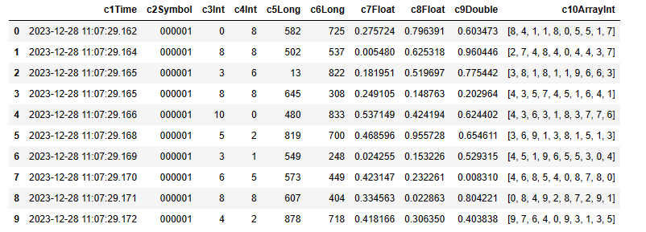
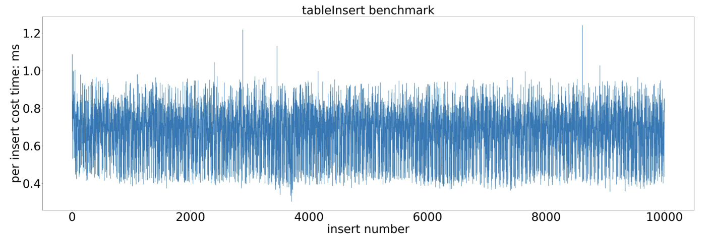
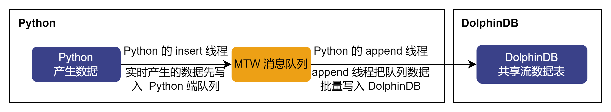

# Python API 接入数据

实时流数据接入是指将数据从数据源实时写入 DolphinDB 中，供后续进行清洗、计算等使用。本文档介绍如何使用 Python API 把数据写入 DolphinDB。

按照上游发布端数据产生频率大小推荐不同的写入接口：

* 当数据实时写入频率小于 100 条每秒时，推荐使用 `tableInsert`
  同步写入接口，其写入延时相对其它接口是最低的。
* 当数据实时写入频率大于 100 条每秒时，推荐使用 `MultithreadedTableWriter`
  异步写入接口，其吞吐量和写入延时综合效益最高。

下面将介绍两种场景下推荐函数的使用方法和基准性能。

如果本文档中遇到 DolphinDB Python API 使用相关问题，参考：[Python API](https://docs.dolphindb.cn/zh/pydoc/py.md)。

## tableInsert 同步写入接口

当数据实时写入频率小于 100 条每秒时，推荐使用 `tableInsert` 同步接口写入数据。本文档提供 10
列数据的写入示例和基准性能。

### step1：创建共享普通流数据表

```
import dolphindb as ddb
import numpy as np
import pandas as pd
import random

s = ddb.session()
s.connect(host="localhost", port=8848, userid="admin", password="123456")

script = """
  name = `c1Time`c2Symbol`c3Int`c4Int`c5Long`c6Long`c7Float`c8Float`c9Double`c10ArrayInt
  type = [TIMESTAMP, SYMBOL, INT, INT, LONG, LONG, FLOAT, FLOAT, DOUBLE, INT[]]
  share(table=streamTable(20000:0, name, type), sharedName="sharedMinBar")
"""
s.run(script)
```

注意：生产环境推荐使用共享持久化流数据表。

### step2：tableInsert 写入数据

```
def createData():
    c1Time = [pd.Timestamp.now()]
    c2Symbol = ['000001']
    c3Int = [random.randint(0, 10)]
    c4Int = [random.randint(0, 10)]
    c5Long = [random.randint(0, 1000)]
    c6Long = [random.randint(0, 1000)]
    c7Float = [random.uniform(0, 1)]
    c8Float = [random.uniform(0, 1)]
    c9Double = [random.uniform(0, 1)]
    c10ArrayInt = [np.random.randint(10,size=10)]
    return [c1Time, c2Symbol, c3Int, c4Int, c5Long, c6Long, c7Float, c8Float, c9Double, c10ArrayInt]

if __name__ == "__main__":
    inertRows = 10000
    for i in range(inertRows):
        insertData = createData()
        s.run("tableInsert{sharedMinBar}",insertData)
```

### step3：查询表中数据

```
pd = s.run("select * from sharedMinBar limit 10")
```



### step4：删除流数据表并关闭当前会话

```
script = """
    dropStreamTable(tableName="sharedMinBar")
"""
s.run(script)
s.close()
```

### 基准性能

`tableInsert` 同步写入接口基准性能测试代码请参考附录 B，测试结果如下：

| 指标 | 性能（毫秒） |
| --- | --- |
| 最小单次插入耗时 | 0.31 |
| 最大单次插入耗时 | 1.24 |
| 平均单次插入耗时 | 0.69 |

单次插入耗时统计图如下：



基准性能测试结果显示，DolphinDB Python API 的 `tableInsert` 同步写入接口具有以下特点：

* 实时逐条写入共享流数据表的平均耗时是 0.69 毫秒。
* 稳定性较好，波动较小，平均单条数据写入的最大耗时小于 2 毫秒。

## MultithreadedTableWriter 异步写入接口

当数据写入频率大于 100 条每秒时，推荐使用 `MultithreadedTableWriter`（MTW） 函数写入数据。

如下图所示，`MultithreadedTableWriter` 函数把 Python 端实时产生的数据先通过 insert 线程写入
MTW 消息队列，同时 append 线程会批量取出消息队列的数据，自动转换数据类型后把数据写入 DolphinDB。



下面为 `MultithreadedTableWriter` 使用示例。

1. 逐笔成交表

   ```
   import numpy as np
   import pandas as pd
   import dolphindb as ddb
   import random
   import datetime

   s = ddb.session()
   s.connect(host="localhost", port=8848, userid="admin", password="123456")

   writer = ddb.MultithreadedTableWriter("localhost", 8848, "admin", "123456","","tglobal",False,False,[],10,0,2,"SecurityID")
   start = datetime.datetime.now()
   for i in range(100):
       res = writer.insert(random.randint(1,100),random.randint(1,100),str(i),random.randint(1,100),random.randint(1,100),str(i),str(i),random.random(),random.randint(1,100),str(i),np.datetime64('2021-01-04T09:30:02.000'),9,random.randint(1,100),random.randint(1,100),random.random(),str(i),random.randint(1,100),str(i),str(i))
   writer.waitForThreadCompletion()
   print(writer.getStatus())

   // output
   '''
   errorCode     : None
    errorInfo     :
    isExiting     : True
    sentRows      : 10000
    unsentRows    : 0
    sendFailedRows: 0
    threadStatus  :
    	threadId	sentRows	unsentRows	sendFailedRows
   	       0	       0	         0	             0
   	2474632960	    4994	         0	             0
   	2483025664	    5006	         0	             0
   <dolphindb.session.MultithreadedTableWriterStatus object at 0x7f0ca9f0e8d0>
   '''
   ```
2. arrayVector 类型快照表

   ```
   writer = ddb.MultithreadedTableWriter("localhost", 8892, "admin", "123456","","tglobal",False,False,[],10,0,2,"SecurityID")
   for i in range(10000):
       res = writer.insert(str(i),np.datetime64('2021-01-04T09:30:02.000'),random.random(),random.random(),random.random(),random.random(),random.random(),random.randint(1,100),random.random(),"OCALL",np.random.rand(10),np.random.randint(10,size=10),np.random.randint(10,size=10),np.random.randint(10,size=10),np.random.rand(10),np.random.randint(10,size=10),np.random.randint(10,size=10),np.random.randint(10,size=10),random.randint(1,100),random.random(),random.randint(1,100),random.randint(1,100),random.random(),random.random(),random.randint(1,100),random.randint(1,100),random.randint(1,100),random.randint(1,100),random.randint(1,100),random.randint(1,100),random.randint(1,100),random.randint(1,100),random.random(),random.randint(1,100),random.randint(1,100),random.random(),random.randint(1,100),random.randint(1,100),random.random(),random.randint(1,100),random.randint(1,100),random.random())
   writer.waitForThreadCompletion()
   print(writer.getStatus())

   // output
   '''
   errorCode     : None
    errorInfo     :
    isExiting     : True
    sentRows      : 10000
    unsentRows    : 0
    sendFailedRows: 0
    threadStatus  :
    	threadId	sentRows	unsentRows	sendFailedRows
   	       0	       0	         0	             0
   	2474632960	    4994	         0	             0
   	2466240256	    5006	         0	             0
   <dolphindb.session.MultithreadedTableWriterStatus object at 0x7f0cb032e190>
   '''
   ```
3. multicolumn 类型快照表

   ```
   writer = ddb.MultithreadedTableWriter("localhost", 8892, "admin", "123456","","tglobal",False,False,[],10,0,2,"SecurityID")
   for i in range(10000):
       res = writer.insert(str(i),np.datetime64('2021-01-04T09:30:02.000'),random.random(),random.random(),random.random(),random.random(),random.random(),random.randint(1,100),random.random(),str(i),random.random(),random.random(),random.random(),random.random(),random.random(),random.random(),random.random(),random.random(),random.random(),random.random(),random.randint(1,100),random.randint(1,100),random.randint(1,100),random.randint(1,100),random.randint(1,100),random.randint(1,100),random.randint(1,100),random.randint(1,100),random.randint(1,100),random.randint(1,100),random.randint(1,100),random.randint(1,100),random.randint(1,100),random.randint(1,100),random.randint(1,100),random.randint(1,100),random.randint(1,100),random.randint(1,100),random.randint(1,100),random.randint(1,100),random.randint(1,100),random.randint(1,100),random.randint(1,100),random.randint(1,100),random.randint(1,100),random.randint(1,100),random.randint(1,100),random.randint(1,100),random.randint(1,100),random.randint(1,100),random.random(),random.random(),random.random(),random.random(),random.random(),random.random(),random.random(),random.random(),random.random(),random.random(),random.randint(1,100),random.randint(1,100),random.randint(1,100),random.randint(1,100),random.randint(1,100),random.randint(1,100),random.randint(1,100),random.randint(1,100),random.randint(1,100),random.randint(1,100),random.randint(1,100),random.randint(1,100),random.randint(1,100),random.randint(1,100),random.randint(1,100),random.randint(1,100),random.randint(1,100),random.randint(1,100),random.randint(1,100),random.randint(1,100),random.randint(1,100),random.randint(1,100),random.randint(1,100),random.randint(1,100),random.randint(1,100),random.randint(1,100),random.randint(1,100),random.randint(1,100),random.randint(1,100),random.randint(1,100),random.randint(1,100),random.random(),random.randint(1,100),random.randint(1,100),random.random(),random.random(),random.randint(1,100),random.randint(1,100),random.randint(1,100),random.randint(1,100),random.randint(1,100),random.randint(1,100),random.randint(1,100),random.randint(1,100),random.random(),random.randint(1,100),random.randint(1,100),random.random(),random.randint(1,100),random.randint(1,100),random.random(),random.randint(1,100),random.randint(1,100),random.random())
   writer.waitForThreadCompletion()
   print(writer.getStatus())

   // output
   '''
   errorCode     : None
    errorInfo     :
    isExiting     : True
    sentRows      : 10000
    unsentRows    : 0
    sendFailedRows: 0
    threadStatus  :
    	threadId	sentRows	unsentRows	sendFailedRows
   	       0	       0	         0	             0
   	2474632960	    4994	         0	             0
   	2466240256	    5006	         0	             0
   <dolphindb.session.MultithreadedTableWriterStatus object at 0x7f0ca9b37fd0>
   '''
   ```

## 附录 A-测试环境

表 1. 硬件环境

| 硬件名称 | 配置信息 |
| --- | --- |
| CPU | Intel(R) Xeon(R) Silver 4216 CPU @ 2.10GHz |
| 内存 | 32 GB |
| 磁盘 | SSD 500 GB |

表 2. 软件环境

| 软件名称 | 版本信息 |
| --- | --- |
| 操作系统 | CentOS Linux 7 (Core) |
| 内存 | 3.10.0-1160.el7.x86\_64 |
| DolphinDB server | 2.00.10.9 2023.12.09 |
| DolphinDB Python API | 1.30.22.6 |
| Python | 3.11.5 |
| Numpy | 1.24.4 |
| Pandas | 2.1.1 |

## 附录 B-tableInsert 同步写入接口基准性能测试代码

```
import dolphindb as ddb
import numpy as np
import pandas as pd
import random

#模拟数据
def createData():
    c1Time = [pd.Timestamp.now()]
    c2Symbol = ['000001']
    c3Int = [random.randint(0, 10)]
    c4Int = [random.randint(0, 10)]
    c5Long = [random.randint(0, 1000)]
    c6Long = [random.randint(0, 1000)]
    c7Float = [random.uniform(0, 1)]
    c8Float = [random.uniform(0, 1)]
    c9Double = [random.uniform(0, 1)]
    c10ArrayInt = [np.random.randint(10,size=10)]
    return [c1Time, c2Symbol, c3Int, c4Int, c5Long, c6Long, c7Float, c8Float, c9Double, c10ArrayInt]

if __name__ == "__main__":
    #与DolphinDB建立会话
    s = ddb.session()
    s.connect(host="localhost", port=8200, userid="admin", password="123456")
    #创建共享普通流数据表
    script = """
      name = `c1Time`c2Symbol`c3Int`c4Int`c5Long`c6Long`c7Float`c8Float`c9Double`c10ArrayInt
      type = [TIMESTAMP, SYMBOL, INT, INT, LONG, LONG, FLOAT, FLOAT, DOUBLE, INT[]]
      share(table=streamTable(20000:0, name, type), sharedName="sharedMinBar")
    """
    s.run(script)
    #测试写入数据行数
    inertRows = 10000
    #延时统计
    minCostTime = 1000.0
    maxCostTime = 0.0
    totalCostTime = 0.0
    count = 0
    for i in range(inertRows):
        insertData = createData()
        startTime = pd.Timestamp.now()
        s.run("tableInsert{sharedMinBar}",insertData)
        delta = (pd.Timestamp.now() - startTime) / np.timedelta64(1, 'ms')
        if(delta < minCostTime):
            minCostTime = delta
        if(delta > maxCostTime):
            maxCostTime = delta
        totalCostTime += delta
        count += 1
        #每隔一段时间打印写入性能测试结果
        if(count %10000 == 0):
            print(f"min: {minCostTime} ms")
            print(f"max: {maxCostTime} ms")
            print("count:", count)
            print(f"totalCostTime: {totalCostTime} ms")
            print(f"avg: {totalCostTime / count} ms")
    #删除流数据表
    script = """
        dropStreamTable(tableName="sharedMinBar")
    """
    s.run(script)
    #关闭当前会话
    s.close()
```

