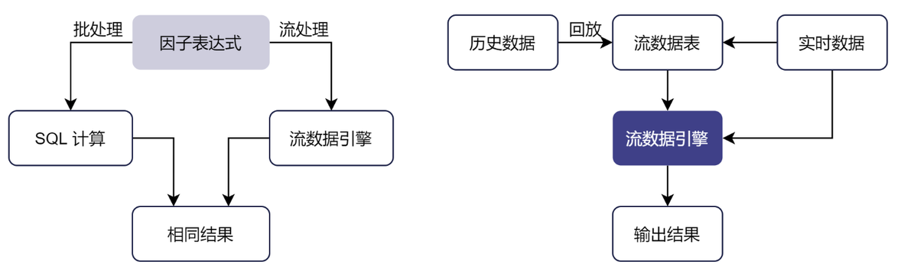

# 流批一体

流批一体是指将研发环境中基于历史数据建模分析得到的因子或表达式直接应用于生产环境的实时数据中，并保证流计算的结果和批量计算完全一致，二者使用同一套代码，称为“流批一体”。

## 处理架构

DolphinDB
将历史数据和实时数据分析计算整合，在研发环境中开发的核心因子表达式可以直接应用于生产环境的实时数据中。实时行情订阅、行情数据收录、交易实时计算、盘后研究建模，全都用同一套代码完成，保证在历史回放和生产交易当中数据完全一致。相比传统的
Python 与 C++ 两套代码的方案，开发上线周期可缩短 90% 以上。在生产环境中，DolphinDB
提供了实时流计算框架。在流计算框架下，用户在投研阶段封装好的基于批量数据开发的因子函数，可以无缝投入交易和投资方面的生产程序中。同时，流计算框架在算法路径上进行了精细的优化，兼顾了高效开发和计算性能的优势。用户无需维护两套代码，节约了开发成本，还规避了两套体系可能带来的批计算与流计算结果不一致的问题。

图 1. 流批一体处理架构



流批一体在 DolphinDB 中有两种实现方法：

## 方法一

**使用一套核心函数定义或表达式，代入不同的计算引擎实现历史数据或流数据的计算。**

流数据引擎可以直接重用批处理（研发阶段）中基于历史数据编写的表达式或函数，避免在生产环境重写代码，降低了维护研发和生产两套代码的负担。DolphinDB
脚本语言表示的表达式实际上是对因子语义的描述，因子计算的具体实现则交由相应的计算引擎完成。DolphinDB
确保流式计算的结果与批量计算完全一致，因此代码只要在历史数据的批量计算中验证正确，即可保证流数据的实时计算正确，极大降低了实时计算的调试成本。实际应用中，投研批处理阶段定义的因子表达式无需修改，在生产阶段只需创建流式计算引擎指定该指标即可实现增量流计算。

例如，计算每天主买成交量占全部成交量的比例，可以自定义函数 `buyTradeRatio`：

```
@state
def buyTradeRatio(buyNo, sellNo, tradeQty){
    return cumsum(iif(buyNo>sellNo, tradeQty, 0))\cumsum(tradeQty)
}
```

在批处理模式下，可以使用 SQL 查询，发挥库内并行计算的优势，使用 `csort` 语句对组内数据按照时间顺序排序：

```
factor = select TradeTime, SecurityID, `buyTradeRatio as factorname, buyTradeRatio(BuyNo, SellNo, TradeQty) as val from loadTable("dfs://tick_SH_L2_TSDB","tick_SH_L2_TSDB") where date(TradeTime)<2020.01.31 and time(TradeTime)>=09:30:00.000 context by SecurityID, date(TradeTime) csort TradeTime
```

在流处理模式下，可以通过响应式状态引擎指定该因子实现增量计算。在批计算中定义的因子函数 `buyTradeRatio` ，只需增加
`@state` 标识声明其为状态函数即可在流式计算中复用。通过以下代码创建响应式状态引擎 demo，以 SecurityID
作为分组键，输入的消息格式同内存表 *tickStream*。

```
tickStream = table(1:0, `SecurityID`TradeTime`TradePrice`TradeQty`TradeAmount`BuyNo`SellNo, [SYMBOL,DATETIME,DOUBLE,INT,DOUBLE,LONG,LONG])
result = table(1:0, `SecurityID`TradeTime`Factor, [SYMBOL,DATETIME,DOUBLE])
factors = <[TradeTime, buyTradeRatio(BuyNo, SellNo, TradeQty)]>
demoEngine = createReactiveStateEngine(name="demo", metrics=factors, dummyTable=tickStream, outputTable=result, keyColumn="SecurityID")
```

## 方法二

**回放历史数据模拟实时数据流入，使用流数据计算引擎完成计算。**

为确保研发和生产环境使用同一套代码，可以研发阶段需将历史数据严格按照事件发生的时间顺序进行回放，以此模拟交易环境。使用这种方法计算历史数据的因子值，效率会略逊与基于
SQL 的批量计算。

下例通过用户自定义函数 `sum_diff` 与内置函数 `ema` (exponential moving
average) 计算高频因子 factor1：

```
def sum_diff(x, y){
 return (x-y)/(x+y)
}
factor1 = <ema(1000 * sum_diff(ema(price, 20), ema(price, 40)),10) -  ema(1000 * sum_diff(ema(price, 20), ema(price, 40)), 20)>

// 定义响应式状态引擎实现因子流式计算
share streamTable(1:0, `sym`date`time`price, [STRING,DATE,TIME,DOUBLE]) as tickStream
result = table(1:0, `sym`factor1, [STRING,DOUBLE])
rse = createReactiveStateEngine(name="reactiveDemo", metrics =factor1, dummyTable=tickStream, outputTable=result, keyColumn="sym")
subscribeTable(tableName=`tickStream, actionName="factors", handler=tableInsert{rse})
```

回放历史数据模拟实时数据注入引擎触发计算：

```
// 从 trades 表中加载一天的数据，回放到流数据表 tickStream 中
inputDS = replayDS(<select sym, date, time, price from loadTable("dfs://TAQ", "trades") where date=2021.03.08>, `date, `time, 08:00:00.000 + (1..10) * 3600000)
replay(inputDS, tickStream, `date, `time, 1000, true, 2)
```

