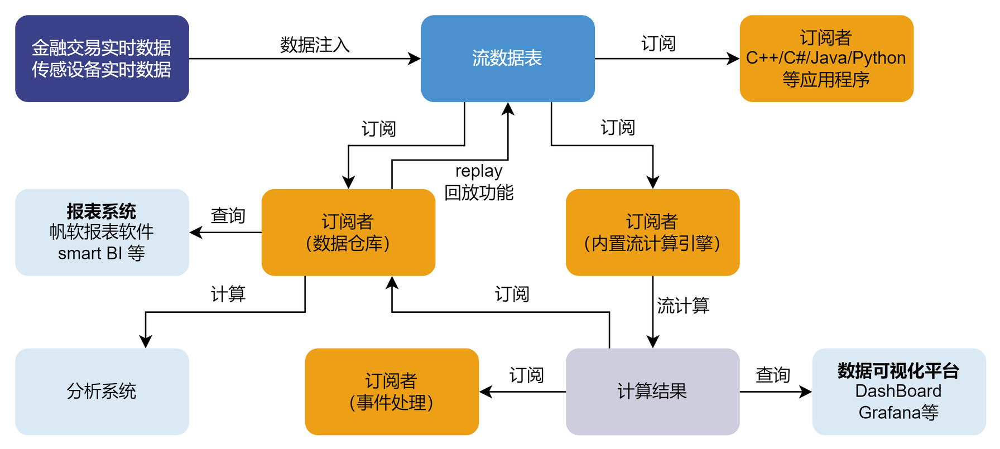

# 功能简介

本节总体介绍 DolphinDB 流数据功能，主要包括：DolphinDB 流数据功能架构 、流数据表、订阅与发布 、流式处理中的状态、流处理中的时间概念
。在介绍功能之前，我们先了解下相关概念。

## 流数据表

流数据表是 DolphinDB
的一种特殊的内存表，用于存储和发布流数据。被订阅后，它会在收到数据时及时把增量数据推送给订阅者。向流数据表插入一条记录等价于数据源发布一条消息。

流数据表的查询接口与普通内存表相同，支持使用 SQL 语句进行查询和分析。此外，流数据表支持并发读写，但与普通内存表不同，流数据表不支持修改或删除记录。

## 发布与订阅

DolphinDB 采用经典的发布订阅（Pub-Sub）模式。每当有新的流数据注入负责发布消息的流数据表时，会通知所有的订阅方处理新的流数据。

## 流计算引擎

流数据计算引擎是专门用于处理特定计算场景的内置计算函数，如实时合成 K
线、实时多源关联、实时计算状态指标等。流计算引擎使用上比较灵活，不仅可以单独使用，还可以多个引擎级联使用。

## 流数据处理架构

DolphinDB 流数据处理模块采用发布-订阅-消费的模式。流数据首先注入流数据表中，通过流数据表来发布数据，数据节点或者第三方的应用可以通过 DolphinDB
脚本或 API 来订阅及消费流数据。

上图展示了 DolphinDB
的流数据处理框架。外部实时数据注入到发布节点的流数据表后，数据被发布到流数据表的订阅者。一个流数据表可同时将数据发布给多个订阅者，供它们并行消费：

* 流数据表可由数据仓库订阅并保存，作为分析系统与报表系统的数据源。
* 流数据表可由流数据计算引擎订阅，进行计算，并将结果输出到流数据表。计算结果既可以由 Grafana
  等平台进行实时展示，也可以作为数据源再次发布，供二次订阅做事件处理。
* 流数据表可通过 API 进行订阅，并提供给第三方应用程序，例如第三方的 Java 应用程序可以通过 Java API 订阅流数据以进行操作。

