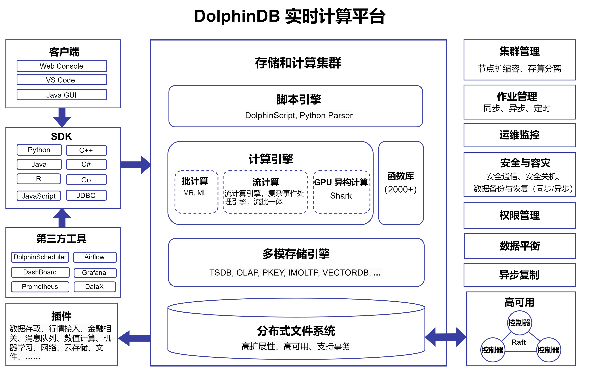
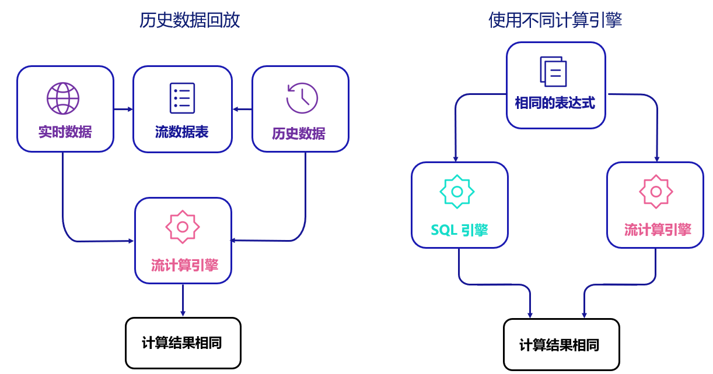
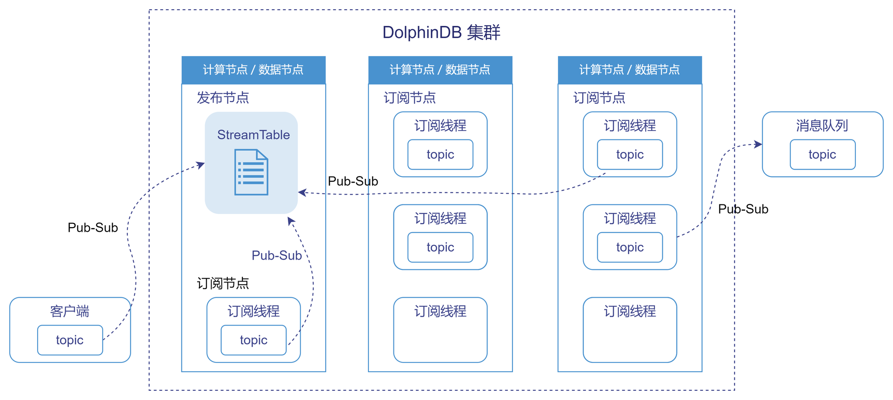

# 流数据

## DolphinDB 流数据简介

DolphinDB 流数据（DolphinDB Stream）是基于 C++ 自主研发的高性能流处理引擎，支持实时
ETL、实时低延时复杂计算、实时多源数据关联等流数据处理任务，具备数据库融合、丰富的算子和流计算引擎、金融级高可用、流批一体和分布式等特性。

DolphinDB
的流数据功能非常适合**吞吐量大**、**时延要求高**、**复杂实时分析**等业务场景，其在以下两大领域已被广泛应用（不限于这些场景）：

* 金融领域：

  + 搭建实时行情中心
  + 量化交易中的实时多因子计算和交易信号构建
  + AI 算法交易中的实时特征工程构建和模型在线推断
  + 量化交易订单实时监控
  + 做市业务实盘监控
  + 行情数据的实时衍生指标计算和分发
* 物联网领域：

  + 大型电厂百万测点监控数据实时接入和计算分析
  + 海量地震数据的实时特征工程构建和预测模型在线推断
  + 数字化智慧工厂生产流水线运行状态的实时监控和自动化反向操控

## DolphinDB 流数据核心特性

### 数据库融合

流数据与时序数据库无缝集成在 DolphinDB 中，因此 DolphinDB
不仅可以解决海量历史数据的存储和批计算问题，还广泛支持了流数据的实时计算和实时存储。

### 算子丰富

DolphinDB 内置了丰富的计算函数，使用户能够通过低代码方式轻松实现复杂的数据分析和金融量化因子计算。内置计算函数包括但不限于以下大类：

* 时序处理函数
* 窗口函数
* 聚合函数
* 排序/查找/分类函数
* 统计函数
* 分布函数
* 机器学习
* 三角函数
* 逻辑函数
* 傅里叶变换函数

### 内置流数据引擎丰富

DolphinDB 内置了超过 10 个流计算引擎， 提供了灵活的计算方式和丰富的功能，适用于多样化的实时数据处理需求。

### 金融级高可用

基于 Raft 协议提供高可用功能，确保流数据处理级别可以保证 Exactly-Once。

### 流批一体

### 分布式****订阅与发布****

