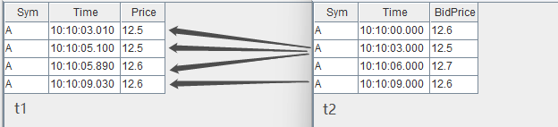
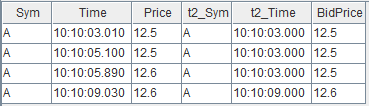
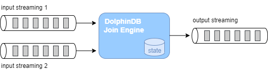

# 内置多数据源流式关联引擎

在进行数据分析时经常需要对多个不同的数据源进行关联操作，因此在各类数据库的 SQL 语言中均包含了丰富的 join 语句，以支持批计算中的多种关联操作。 DolphinDB
不仅通过 join
语法支持了对于全量历史数据的关联处理，而且在要求低延时的实时计算场景中，也提供了多种流数据连接引擎来支持对不断增长的数据流进行实时的关联处理。流数据连接引擎在内部实现上以增量计算为原则，在大数据流量下依然能够保持毫秒级的时延性能。

本节系统地介绍 DolphinDB 中的 5 种不同的流数据连接引擎，从实时数据流关联、DolphinDB
连接引擎分类、用连接引擎实现金融应用场景等方面层层递进，帮助用户深入理解 DolphinDB 的流计算连接引擎和快速上手多数据源实时关联处理。

注： DolphinDB 2.00.8 及以上版本支持本教程所有代码。

## 流数据实时关联

### DolphinDB 批计算表关联

在批计算场景中， DolphinDB SQL 语句中不仅提供了与传统关系型数据库类似的 equi join, full join, left join,
prefix join, cross join 等表连接方式，还提供了两种专门为时序数据设计的连接方式：asof join 和 window join。

以下是一个简单的 asof join 批计算的示例，更详细应用介绍请参考：[应用教程：使用 Asof Join, Window Join 快速估计个股交易成本](https://ask.dolphindb.cn/blog/9)。我们将通过它进一步分析实时连接中的挑战。

```
// data
t1 = table(take(`A, 4) as Sym, 10:10:03.000+(10 2100 2890 6030) as Time, 12.5 12.5 12.6 12.6 as Price)
t2 = table(take(`A, 4) as Sym, 10:10:00.000+(0 3000 6000 9000) as Time, 12.6 12.5 12.7 12.6 as BidPrice)

// asof join calculation
select *  from aj(t1, t2, `Time)
```



asof join 能够关联当前时刻或距离当前时刻最近时刻的数据。指定连接列为 Time 字段后，如上图所示，*t1* 表的每行记录总是关联
*t2* 表中 Time 值小于它的 Time 值的那一行 *t2* 记录。关联后的结果如下：



### 实时数据流关联面临的挑战

批计算的关联操作，作为计算输入的 *t1* 表和 *t2*
表的数据是有界的，关联操作作用在全量输入数据上，计算结果一次性全量输出。现在考虑一下实时关联的场景，首先在输入上，*t1*,
*t2*
的记录数会不断增长，表现为数据无界且无法预知下一条记录何时到来，比如股票市场中的交易数据、行情快照数据，而对于关联结果，我们会希望在每一条输入到来后尽快且尽可能正确地输出结果记录，这时计算是不断增量进行的。

那么，对于流式的实时关联场景，我们需要解决以下两个问题：

* 何时触发计算并输出：以上面的 asof join 为例，数据流 *t1* 中第一条记录（Time
  值为10:10:03:010）到达系统时，假设 *t2* 数据流中也有一条记录（Time
  为10:10:00.000），此时实时计算模块是决定关联目前 t2
  中最近的一条记录并输出，还是等待某个触发条件再关联输出，这是技术实现上要解决的问题。
* 如何管理内存：为了能够正确地关联到两个数据流，实时计算模块需要缓存历史的数据流，而输入是源源不断的，则需要历史数据的清理机制。

## 流数据连接引擎

DolphinDB 提供了 `createAsofJoinEngine`,
`createWindowJoinEngine`, `createEquiJoinEngine`,
`createLeftSemiJoinEngine`,
`createLookupJoinEngine` 等 5 种不同的流计算连接引擎函数，不同连接引擎的关联规则基本上与批计算中相应的
join 类似，差异将在后续小节中详细说明。本章首先概述 DolphinDB 流计算引擎，之后依次介绍各个引擎的原理和效果。

流计算连接引擎是 DolphinDB 中对数据流进行实时关联的计算模块，可以理解为一个设置了关联规则的计算黑盒，输入为 2 条数据流，输出为 1
条数据流，引擎内部会自动维护计算状态。



以下代码是 asof join SQL 的流计算实现的脚本，首先创建 2 个流数据表作为输入、1 个流数据表作为输出，然后通过函数
`createAsofJoinEngine` 创建流计算引擎，之后通过函数
`subscribeTable` 分别订阅 2
个流数据表并将数据实时注入流计算引擎的左、右表。之后当数据不断写入两个流数据表时，输出结果表 *output*
中的记录数会相应地增加。流数据订阅功能更详细的介绍见： [流数据功能应用](../tutorials/streaming_tutorial.md) 。

```
// create table
share streamTable(1:0, `Sym`Time`Price, [SYMBOL, TIME, DOUBLE]) as trade
share streamTable(1:0, `Sym`Time`BidPrice, [SYMBOL, TIME, DOUBLE]) as snapshot
share table(1:0, `Time`Sym`Price`t2_Time`BidPrice, [TIME, SYMBOL, DOUBLE, TIME, DOUBLE]) as output

// create engine
ajEngine = createAsofJoinEngine(name="asofJoin", leftTable=trade, rightTable=snapshot, outputTable=output, metrics=<[Price, snapshot.Time, BidPrice]>, matchingColumn=`Sym, timeColumn=`Time, useSystemTime=false, delayedTime=1000)

// subscribe topic
subscribeTable(tableName="trade", actionName="joinLeft", offset=0, handler=getLeftStream(ajEngine), msgAsTable=true)
subscribeTable(tableName="snapshot", actionName="joinRight", offset=0, handler=getRightStream(ajEngine), msgAsTable=true)
```

以下代码构造输入数据并写入 2 个流数据表，查看结果表 *output* 将看到引擎计算的结果。

```
// generate data
t1 = table(take(`A, 4) as Sym, 10:10:03.000+(10 2100 2890 6030) as Time, 12.5 12.5 12.6 12.6 as Price)
t2 = table(take(`A, 4) as Sym, 10:10:00.000+(0 3000 6000 9000) as Time, 12.6 12.5 12.7 12.6 as BidPrice)
// input data
snapshot.append!(t2)
trade.append!(t1)
```

流计算连接引擎通过内置实现和简单的参数接口来解决上一章提到的实时数据流关联的问题。对于内存管理，每个引擎都提供了 *garbageSize*
参数来清理不再需要的历史数据。对于触发计算的机制，不同的引擎会稍有不同，可以大致分为以下几类：

1. 若关联计算依赖数据的时间顺序，则处理的方式有：

   1. 以数据注入引擎时的系统时间为时序标准
   2. 以数据中的时间列为时序标准，这种情况下因为无法预知后续将到达的数据的时间戳，则时序判断以最新的时间戳为依据，认为时间戳早于它的全部数据都已经到齐，同时辅以超时强制触发的规则
2. 关联计算不依赖数据的时间顺序，则处理的方式有：

   1. 在数据注入引擎时立即计算输出
   2. 等待到匹配数据后才计算输出，同时辅以超时强制触发的规则

关联规则和触发规则决定了引擎的计算结果，下面我们详细介绍每一个连接引擎的原理和关联效果。

## 流数据连接引擎的比较

| 连接引擎 | 连接列 | 关联机制 | 类似的 SQL join | 结果表行数 | 应用场景 |
| --- | --- | --- | --- | --- | --- |
| AsofJoinEngine | matchingColumn | 左表每到来一条记录，匹配右表连接列一致且时间戳最近的一条记录。 | asof join | 小于或等于左表行数 | [计算个股交易成本](../tutorials/streaming-real-time-correlation-processing.md) |
| WindowJoinEngine | matchingColumn | 左表每到来一条记录，匹配右表中连接列一致，且在由左表时间戳确定的窗口范围内的数据。 | window join | 小于或等于左表行数 | [将行情快照和逐笔成交数据融合](../tutorials/streaming-real-time-correlation-processing.md) |
| EquiJoinEngine | matchingColumn+timeColumn | 左（右）表每到来一条记录，匹配右（左）表连接列一致的最新的一条记录。 | equi join | 等于左右表能完全等值匹配的行数（在左右表中的连接列均唯一的前提下） | [拼接不同数据源的实时分钟指标](../tutorials/streaming-real-time-correlation-processing.md) |
| LookupJoinEngine | matchingColumn | 左表每到来一条记录，匹配右表连接列一致的记录。 | left join/equi join | 默认情况下等于左表的行数 | [将实时行情与历史日频指标关联](../tutorials/streaming-real-time-correlation-processing.md) |
| LeftSemiJoinEngine | matchingColumn | 对于左表的每一条记录，匹配右表连接列一致的第一条或最后一条记录。 | equi join | 小于或等于左表行数 | [对逐笔成交数据补充原始委托信息](../tutorials/streaming-real-time-correlation-processing.md)、[关联股票和指数行情并计算相关性](../tutorials/streaming-real-time-correlation-processing.md)。 |
| SnapshotJoinEngine | matchingColumn | 左（右）表每到来一条记录，匹配右（左）表连接列一致的全部或最新的一条记录。 | left join | 大于等于左表与右表行数之和 | 风控场景：实时连接账户资产表和资产市价表以计算杠杆率，净值等指标衡量风险。 |

## 总结

DolphinDB 提供了 5
个不同的流数据连接引擎，引擎均内置实现了高效的关联计算、实时触发规则和内存管理机制，开发人员通过简单的引擎参数配置便能够快速实现复杂的实时关联需求。本文重点介绍了各个连接引擎的原理、关联效果、实际应用案例，并在文末简要总结各个引擎的特点，旨在降低开发人员在实时数据流关联处理中的开发门槛。结合
DolphinDB
流数据框架中其他流计算引擎、流水线处理、并行计算等重要特性，开发人员可以将自己的业务场景实时化，通过提升速度掌握更及时的信息、挖掘更多的业务价值。

