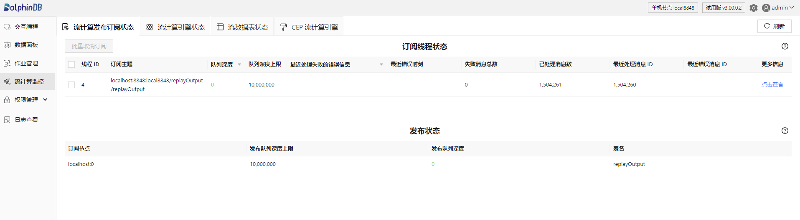
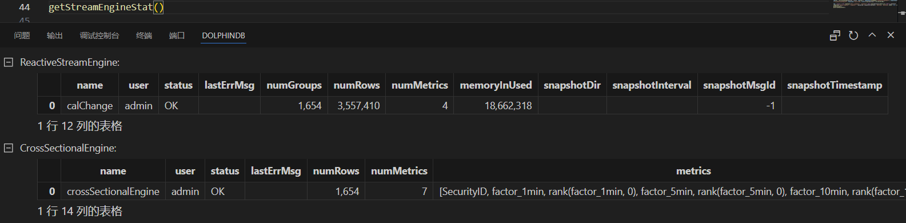
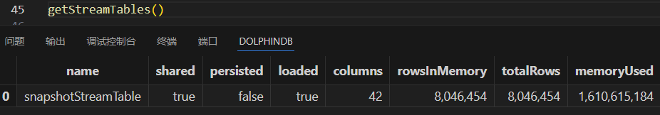
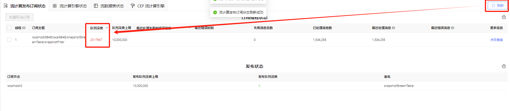
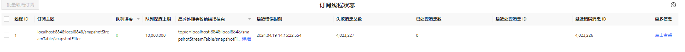

# 流计算状态监控

在 DolphinDB 中提交订阅后，流数据注入实时处理时所有的计算都在后台进行。用户无法直观地看到运行的情况，因此需要通过特定方式监控发布订阅以及消息处理的状态。与此同时，流计算引擎为系统嵌套的计算模块，引擎内部缓存了分组以及对应的状态等信息，用户需要通过特定的接口来查询流计算引擎的运行状态。流计算状态监控可以帮助用户及时地发现计算中出现的问题并进行修正。本文首先简单介绍 DolphinDB 提供的两种流计算监控方式，之后介绍流计算运行过程中需要重点关注的监控指标。

## 1. 流计算监控方式

DolphinDB 主要提供两种监控流计算状态的方法：Web 面板和函数查询。通过这两种方式，可以查询流计算中订阅节点的工作线程状态、本地发布节点和订阅节点连接状态等，以监控计算过程。

### 1.1 Web 面板（推荐）

首先打开浏览器，在浏览器地址栏中输入 <ip>:<port>，即 DolphinDB 所在服务器的 IP 和 DolphinDB server 的端口号。登陆客户端后点击 Web 界面左侧功能面板里的“流计算监控”进入监控页面，可以查看以下状态：

* **流计算发布订阅状态**：显示流计算订阅节点的工作线程的状态、本地发布节点和它的所有订阅节点之间的连接状态。表中各字段说明可分别查看`getStreamingStat().subWorkers` 和 `getStreamingStat().pubConns` 的官方文档。
* **流计算引擎状态**：显示各类流计算引擎的状态，表中各字段说明可查看 `getStreamEngineStat` 。
* **流数据表状态**：显示非持久化共享流数据表和持久化共享流数据表的状态，表中各字段说明可查看 `getStreamTables`函数。
* **CEP 流计算引擎**：显示节点上全部 CEP 引擎的内部状态以及 CEP 引擎中创建的数据视图（Data View），同时提供与 CEP 引擎进行交互的接口。此页面的更多介绍见 CEP 流计算引擎状态]。

此页面上常用的操作如下：

1. **点击右上角的刷新按钮**：刷新按钮可对当前标签页的内容进行即时刷新。若不点击刷新按钮，页面不会自动刷新。查询状态数据结果均为瞬时数据，因此建议多次刷新以观察短时间内状态的变化趋势。
2. **点击页面上方不同的标签**（流计算发布订阅状态、流计算引擎状态、流数据表状态）：通过页面顶部的标签可以切换并查看所需内容，切换时会自动获取该页面对应的最新状态。
3. **点击带三角形图表的字段**（如队列深度、最近处理失败的错误信息）：通过点击字段名可以进行降序或升序排序。可以将队列深度最大的订阅线程排在列表的最前面，或者将有错误信息的订阅线程排在列表的最前面。
4. **点击方框勾选订阅线程后点击批量取消订阅**：通过此操作可以取消多个订阅，对选中的订阅后台执行了 `unsubscribeTable` 函数以释放订阅。同理，在流计算引擎状态标签页可以批量删除引擎，后台将执行 `dropStreamEngine` 函数来释放引擎。在流数据表状态标签页可以批量删除流数据表，后台将执行 `dropStreamTable` 函数删除流数据表。
5. **鼠标悬浮在表名或者字段名上方：** 通过悬浮在表名上方可以查看各个表对应的系统状态函数，如订阅线程状态表对应 `getStreamingStat().subWorkers`。通过悬浮在字段名上方可以查看该指标对应的英文名，通过查看状态函数的用户手册可以了解各个字段详细说明，如线程 ID 对应 workerId，在 [getStreamingStat](../funcs/g/getStreamingStat.html) 函数的用户手册中可以找到其具体解释为：线程 ID。若此列为空，代表该订阅尚未收到数据。

流计算监控页面的更多介绍见 [流计算监控](../db_distr_comp/db_man/web/stream_monitor.html) 。

### 1.2 函数查询

除了通过 Web 界面监控流计算状态的方法，其他终端的客户也可以通过函数直接查询流计算状态。

**流计算监控函数 [getStreamingStat](../funcs/g/getStreamingStat.html)**

`getStreamingStat`函数返回一个字典，包含以下几个不同的表：

* 表 pubConns 监控本地发布节点和它的所有订阅节点之间的连接状态，每一行表示一个订阅节点。
* 表 subConns 监控本地订阅节点和发布节点之间的连接状态，每一行表示一个发布节点。
* 表 pubTables 监控流数据表状态，每一行表示一个流数据表的信息。
* 表 persistWorkers 监控负责持久化流数据表的工作线程的状态。
* 表 subWorkers 监控订阅节点的工作线程的状态，工作线程状态信息会按照 topic 来展示。
* 表 udpPubTables 用于监控流数据表进行 UDP 组播发布的状态。

以上各表包含的列字段见 [getStreamingStat](../funcs/g/getStreamingStat.html)。Web 页面上仅展示了最常用的两个表 subWorkers 和 pubTables 的信息。注意，执行`getStreamingStat`函数返回的也是瞬时数据，因此通常需要多次执行以观察流计算状态的变化趋势。

**流计算引擎监控函数 [getStreamEngineStat](../funcs/g/getStreamEngineStat.html)**

该函数可以查看系统中定义的全部流计算引擎、各个引擎的内存占用等状态，每一类引擎对应一张表。调用该函数会返回一个 key 为引擎类型名称、value 为表的字典。详细说明见 `getStreamEngineStat`，调用该函数返回结果如下。

在上图例子中，系统中有两个流计算引擎，分别为 ReactiveStreamEngine 和 CrossSectionEngine 类型的引擎。表格中记录了它们的引擎名称、已处理的数据行数、占用的内存等状态信息。

**流数据表状态函数 [getStreamTables](../funcs/g/getstreamtables.html)**

`getStreamTables`函数查询非持久化共享流数据表和持久化共享流数据表的状态，调用该函数返回结果如下。

在上图例子中，系统中有一张名为 snapshotStreamTable 的非持久化共享流数据表，共 42 列 8046454 行。

## 2. 需重点关注的监控指标

上文介绍了通过 Web 监控面板和函数可以查看的状态信息。本章介绍需要重点关注的监控指标、其指标变化反应的问题以及建议的解决方法。

### 2.1 流计算发布订阅——队列深度

当整个节点上创建了多个不同 topic 的订阅时，定位具体流数据处理延迟阻塞问题时可优先关注队列深度。当数据流量极大而系统来不及处理时，此时系统会按照订阅端队列 → 发布端队列 → 数据注入端逐级反馈数据压力。当订阅端队列深度达到上限时开始阻止发布端数据进入，此时发布端的队列开始堆积。当发布端的队列深度达到上限时，系统会阻塞写入流数据表。

Web 监控面板中可以查看流计算发布订阅的队列深度情况，在不断刷新查看状态时，若队列深度呈现持续上升趋势，意味着订阅端处理速率小于上游输入的速率，队列堆积会导致计算时延增大。下图中订阅端队列发生了堆积，但是还没有达到其上限，因此发布端队列暂时还没有发生堆积。

当数据流消费出现阻塞时，可能有以下原因：

* 流计算引擎中 metrics 参数设置过于复杂
* 多个计算任务分配在了同一个线程上执行
* 进行历史数据回放时 replay 函数速度设置过快导致数据流量过大
* ……

建议使用各种优化手段提高消息处理的效率，以保证队列深度不会出现持续的增长。解决方法可以考虑并行计算、微批处理、增量计算等，详细的性能调优方见[流计算时延统计与性能优化](../tutorials/streaming_timer.html) 。

### 2.2 流计算发布订阅——线程ID

线程 ID 对应 `subscribeTable` 函数中设置的 hash 参数，对应关系为线程 ID = hash%subExecutor + 1，即 hash 参数按系统 subExecutor 值取模后再加 1 为线程 ID。线程 ID 的最大值是系统参数 subExecutor 的值，例如当 subExecutor 为 4 时，表示最多只有 4 个后台线程用于处理 subscribeTable 函数提交的后台作业。建议将流计算任务合理分配在不同的线程上执行，避免流计算任务都在同一个线程上执行而不能合理利用资源。

### 2.3 流计算发布订阅、流计算引擎——最近处理失败的错误信息

若订阅线程产生了错误，点击最近处理失败的错误信息的“详细”，查看发生时间最近的报错细节。该列支持倒序排名，即有错误信息的线程排列靠前展示。

假设订阅流数据表写入流计算引擎，若流计算引擎设置的 dummyTable 与实际订阅的流数据表的列数不同，发生错误情况如下图所示。解决方法为首先取消订阅，修改 *handler* 参数后再重新提交订阅。

此外，还需要关注流计算引擎状态中的最近错误消息。

### 2.4 流计算引擎状态——内存

随着订阅的流数据不断注入引擎，引擎内部缓存的数据越来越多，引擎占用的内存会逐渐增大。在创建引擎时可以通过参数 garbageSize 控制清理历史数据的频率以控制引擎中的内存占用。对于不再使用的引擎可以通过 `dropStreamEngine` 函数释放引擎，即可释放掉对应的内存。若流数据引擎的句柄仍在内存中，也需要释放，方式为：创建引擎时返回的句柄变量 = NULL。

