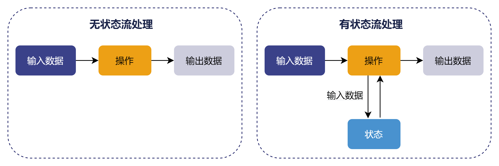

# 流式处理中的状态

流数据是指基于事件持续生成的时间序列数据。与静态有界的历史数据不同，流数据是动态变化且无界的。

状态是指在流数据处理系统中维护的、跨多个事件持久化存储的数据。流数据处理分为无状态和有状态两种方式，下图展示了无状态流处理和有状态流处理的主要区别：

* 无状态流处理：每次只转换一条输入记录，并且仅根据最新的输入记录输出结果。
* 有状态流处理：维护所有已处理记录的状态值，并根据每条新输入的记录更新状态。因此，输出记录不仅与当前记录有关，还与先前的状态或历史记录有关。

在 DolphinDB
的流数据处理系统中，许多操作需要根据当前记录的历史状态进行判断，例如响应式状态引擎中的有状态函数和时间序列引擎中的聚合函数等。因此，维护状态的正确性和持久性对于保证流数据处理系统的准确和稳定非常重要。

Copyright

**©2025 浙江智臾科技有限公司 浙ICP备18048711号-3**
