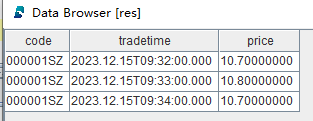
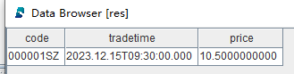

# 流数据表

流数据表是 DolphinDB
内部的一种特殊的内存表，用于存储和发布流数据。通常在发布端创建流数据表，以接收生产者实时产生的流数据。一旦被订阅，流数据表会及时将增量数据发布给订阅者。向流数据表插入一条记录等价于数据源发布一条消息。

流数据表的查询接口与普通内存表相同，均可使用 SQL 语句进行查询和分析。主要区别在于，流数据表不支持修改或删除记录。

为了应对不同的流处理场景，DolphinDB 的流数据表可以分为以下几种：

| 表类型 | 对应函数 | 是否支持键值 | 是否可以设置内存中保存最大记录数 |
| --- | --- | --- | --- |
| 非持久化流表 | [streamTable](../funcs/s/streamTable.md) | 不支持 | 不支持 |
| [keyedStreamTable](../funcs/k/keyedStreamTable.md) | 支持 | 不支持 |
| [enableTableCachePurge](../funcs/e/enabletablecachepurge.md)、[enableTableShareAndCachePurge](../funcs/e/enabletableshareandcachepurge.md) | 不支持 | 支持 |
| 持久化流数据表 | [enableTableShareAndPersistence](../funcs/e/enableTableShareAndPersistence.md)、[enableTablePersistence](../funcs/e/enableTablePersistence.md) | 不支持 | 支持 |
| [haStreamTable](../funcs/h/haStreamTable.md) | 支持 | 支持 |

## 共享流数据表

DolphinDB 的数据节点和计算节点可以充当发布者的角色，通过 streamTable 函数可以在数据节点或者计算节点上创建普通流数据表，作为发布者。

对于一个发布者，通常会被不同会话中的多个订阅端同时订阅，因此必须使用 `share` 函数或 share
语句将流数据表共享，才能使其被不同会话访问。共享的流数据表线程安全，能够支持并发写入。

首先，我们将通过一个完整的示例，引导用户体验流数据表的创建、写入和查询等操作。接下来，我们会对每种流数据表进行详细介绍。

创建一个共享的普通流数据表：

```
colNames = ["code", "tradetime", "price"]
colTypes = [SYMBOL, TIMESTAMP, DOUBLE]
share(table=streamTable(1:0, colNames, colTypes), sharedName="pubTable")
```

模拟写入几行数据，测试流数据表的写入功能：

```
tableInsert(pubTable, "000001SZ", 2023.12.15T09:30:00.000, 10.5)
tableInsert(pubTable, "000001SZ", 2023.12.15T09:31:00.000, 10.6)
tableInsert(pubTable, "000001SZ", 2023.12.15T09:32:00.000, 10.7)
tableInsert(pubTable, "000001SZ", 2023.12.15T09:33:00.000, 10.8)
tableInsert(pubTable, "000001SZ", 2023.12.15T09:34:00.000, 10.7)
tableInsert(pubTable, "000001SZ", 2023.12.15T09:35:00.000, 10.6)
```

执行以下 SQL 语句查询流数据表：

```
res = select * from pubTable where price>=10.7
```

返回结果 res：



执行以下语句进行绘图：

```
price = exec price from pubTable
tradetime = exec tradetime from pubTable
plot(price, tradetime, title="minute price", chartType=LINE)
```


执行以下语句删除流数据表：

```
dropStreamTable(tableName="pubTable")
```

### 共享普通流数据表

共享普通流表的特点是：每一条写入的数据都会被发布，不进行去重。默认情况下，所有写入的数据都会保留在内存中，不会自动清除已发布且过期的数据。需调用相关函数为流数据表开启自动清理。

创建不清理内存的共享普通流数据表：

```
colNames = ["code", "tradetime", "price"]
colTypes = [SYMBOL, TIMESTAMP, DOUBLE]
share(table=streamTable(1:0, colNames, colTypes), sharedName="pubTable")
```

为上例创建的流表 pubTable
开启自动清理功能：

```
enableTableCachePurge(table=pubTable, cacheSize=1000)
```

执行以下语句删除流数据表：

```
dropStreamTable(tableName="pubTable")
```

### 共享键值流数据表

共享键值流数据表的特点是：若写入的数据主键值重复，则会丢弃后续数据，仅发布主键值相同的第一条数据。所有写入的数据都会保留在内存中，无法自动清除已发布且过期的数据。这种表通常用于测试场景或内存充足的生产环境。

创建共享键值流数据表：

```
colNames = ["code", "tradetime", "price"]
colTypes = [SYMBOL, TIMESTAMP, DOUBLE]
share(table=keyedStreamTable(`code`tradetime, 1:0, colNames, colTypes), sharedName="pubTable")
```

上述键值流数据表的主键字段为 code 和 tradetime，写入主键相同的测试数据：

```
tableInsert(pubTable, "000001SZ", 2023.12.15T09:30:00.000, 10.5)
tableInsert(pubTable, "000001SZ", 2023.12.15T09:30:00.000, 10.6)
```

执行以下 SQL 语句查询流数据表：

```
res = select * from pubTable where code="000001SZ"
```

返回结果 res：



结果表明，重复的键值数据被丢弃。键值流数据表在写入数据时，仅保留相同主键值的第一条数据。

执行以下语句删除流数据表：

```
dropStreamTable(tableName="pubTable")
```

## 持久化流数据表

共享普通流数据表和共享键值流数据表都有一个特点，写入的每一条数据都会保留在内存中。节点重启时，所有在内存中的普通流数据表和键值流数据表的数据无法恢复。

为了解决这一问题，DolphinDB 开发了持久化流数据表，适用于内存有限的生产场景。用户可以将普通流数据表和键值流数据表设置为持久化流数据表，其特点包括：

* 通过 `enableTableShareAndPersistence` 设置流数据表为共享的持久化流数据表，不需要再使用
  `share` 函数声明其为共享变量。
* 是否支持主键去重取决于持久化流数据表的类型（普通流数据表或键值流数据表）。
* 可以设置内存中最大保留行数，以保留最新的记录。
* 节点重启时，可以恢复已写入流数据表的数据。

**注意：**

* 创建共享持久化流数据表前，必须配置参数 *persistenceDir*。
* 在单节点模式下，该参数在配置文件 dolphindb.cfg 中配置。例如，将其配置到物理机的 /ssd/dolphindb/persistenceDir
  目录，可以在 dolphindb.cfg 文件中添加如下配置：

```
persistenceDir=/ssd/dolphindb/persistenceDir
```

* 在集群模式下，该参数在配置文件 cluster.cfg 中配置。例如，将其配置到物理机的 /ssd/dolphindb/persistenceDir
  目录，可以在 cluster.cfg 文件中添加如下配置：

```
persistenceDir=/ssd/dolphindb/persistenceDir/<ALIAS>
```

### 共享持久化普通流数据表

创建共享持久化普通流数据表：

```
colNames = ["code", "tradetime", "price"]
colTypes = [SYMBOL, TIMESTAMP, DOUBLE]
enableTableShareAndPersistence(table=streamTable(1:0, colNames, colTypes), tableName="pubTable", cacheSize=10000, preCache=1000)
```

其中：*cacheSize* 用于设置流数据表在内存中最多保留的行数；*preCache* 用于设置从磁盘加载到内存的记录条数。

批量写入 10,000 行数据：

```
rowNums = 10000
simulateData = table(
	take(`000001SZ, rowNums) as code,
	take(0..(rowNums-1), rowNums)*1000*3+2023.12.15T09:30:00.000 as tradetime,
	take(10.6, rowNums) as price)
tableInsert(pubTable, simulateData)
```

查询表中行数：

```
select count(*) from pubTable
```

返回：

```
count
10,000
```

再批量写入 3,000 行数据：

```
rowNums = 3000
simulateData = table(
	take(`000001SZ, rowNums) as code,
	take(0..(rowNums-1), rowNums)*1000*3+2023.12.15T17:49:57.000 as tradetime,
	take(10.6, rowNums) as price)
tableInsert(pubTable, simulateData)
```

查询表中行数：

```
select count(*) from pubTable
```

返回：

```
count
8,000
```

可以查看 pubTable 中的数据，发现持久化流数据表中保留的 8,000 行数据是最新的记录，最早的 5,000 行记录已经自动从内存中清除。

可以执行以下语句删除持久化流数据表：

```
dropStreamTable(tableName="pubTable")
```

### 共享持久化键值流数据表

创建共享持久化键值流数据表：

```
colNames = ["code", "tradetime", "price"]
colTypes = [SYMBOL, TIMESTAMP, DOUBLE]
enableTableShareAndPersistence(table=keyedStreamTable(`code`tradetime, 1:0, colNames, colTypes), tableName="pubTable", cacheSize=10000, preCache=1000)
```

可以执行以下语句删除持久化流数据表：

```
dropStreamTable(tableName="pubTable")
```

## 高可用流数据表

高可用流数据表通过 haStreamTable 创建，具备以下特点：

* 创建高可用流表时会将其声明为共享变量，无需再使用 `share` 函数进行声明。
* 是持久化流表。在节点重启时，可以恢复已经写入的数据。
* 可以设置内存中最大保留行数，仅保留最新的记录。

高可用流数据表使用方法相对复杂，可以参考[流数据高可用功能](str_ha.md)。

