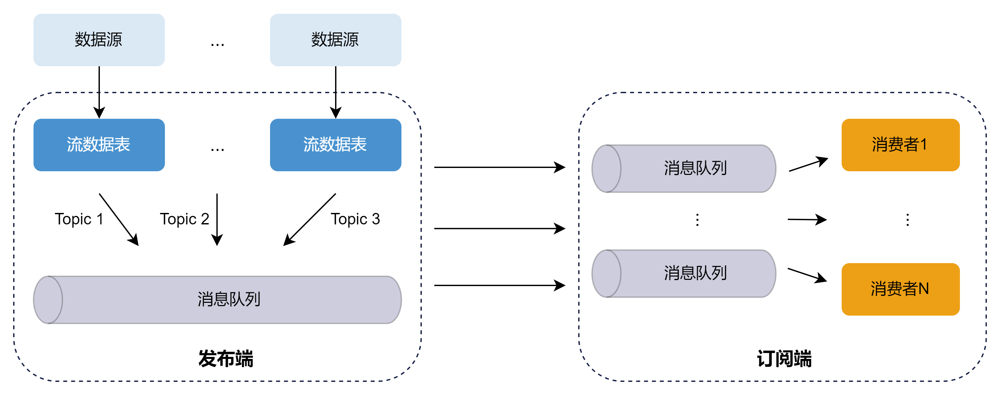
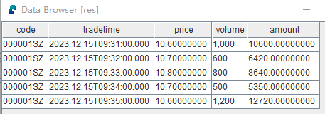
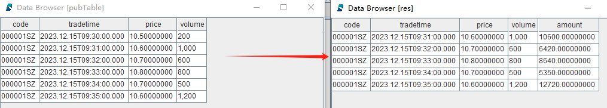
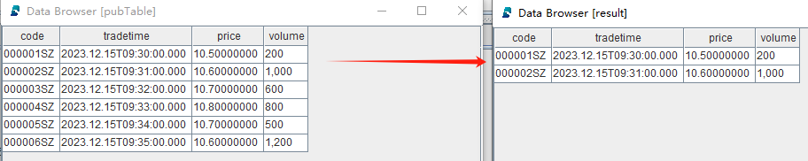

# 发布与订阅

## 发布-订阅模型

DolphinDB
采用经典的发布-订阅（Pub-Sub）通信模型，通过消息队列实现流数据的发布与订阅，从而将流数据生产者（发布者）与消费者（订阅者）解耦。这种模式促进了系统内不同组件之间的通信，提高了可伸缩性，改善了发送者的响应能力。



**发布数据**

发布端在每个节点上维护一个发布队列。当新的流数据注入到该节点的流数据表时，发布端会将这些数据发送到相应的消息发布队列。随后，发布线程将数据发布到各个订阅端的消费队列。

**订阅数据**

每个订阅线程对应一个消费队列。订阅成功后，每当有新数据写入流数据发布表时，发布端会主动通知所有订阅方，订阅端的消费线程从消费队列中获取数据进行增量处理。

## 订阅消费

DolphinDB 的数据节点和计算节点可以作为消费者，通过 [subscribeTable](../funcs/s/subscribeTable.html)
函数订阅流数据表。以下代码展示了一个简单的流数据实时清洗、转换并写入数据库的示例：

**step1：创建存储数据库和分区表**

```
drop database if exists "dfs://minuteBar"

create database "dfs://minuteBar"
partitioned by VALUE(2020.01.01..2021.01.01)
engine='OLAP'

create table "dfs://minuteBar"."minuteBar"(
	securityid SYMBOL
	tradetime TIMESTAMP
	price DOUBLE
	volume INT
	amount DOUBLE
)
partitioned by tradetime
```

**step2：创建发布流数据表，用于发布数据**

```
colNames = ["code", "tradetime", "price", "volume"]
colTypes = [SYMBOL, TIMESTAMP, DOUBLE, INT]
share(table=streamTable(1:0, colNames, colTypes), sharedName="pubTable")
```

**step3：定义数据清洗和转换的回调函数，用于清洗和转换数据**

```
def dataETL(msg){
	result = select *, price*volume as amount from msg where price>=10.6
	loadTable("dfs://minuteBar", "minuteBar").append!(result)
}
```

**step4：订阅第一步定义的流数据表**

```
subscribeTable(tableName="pubTable", actionName="dataETL", offset=-1, handler=dataETL, msgAsTable=true, batchSize=2000, throttle=0.01)
```

* *offset*=-1 表示从流数据表的当前最新行开始消费
* *handler*=dataETL 表示处理订阅的回调函数为自定义函数 dataETL
* *msgAsTable*=true 表示回调函数处理的 msg 对象数据格式为表
* *batchSize*=2000，*throttle*=0.01
  表示上游流表一旦有数据更新，满足以下任一条件触发回调函数执行：（1）待处理数据行数大于等于 2000 条；（2） 时间间隔大于等于 0.01
  秒。设置该参数的目的是为了批量处理数据以提高数据处理吞吐量

返回如下信息说明订阅成功：

```
localhost:8200:local8200/pubTable/dataETL
```

**step5：模拟单条数据写入**

```
tableInsert(pubTable, "000001SZ", 2023.12.15T09:30:00.000, 10.5, 200)
tableInsert(pubTable, "000001SZ", 2023.12.15T09:31:00.000, 10.6, 1000)
tableInsert(pubTable, "000001SZ", 2023.12.15T09:32:00.000, 10.7, 600)
tableInsert(pubTable, "000001SZ", 2023.12.15T09:33:00.000, 10.8, 800)
tableInsert(pubTable, "000001SZ", 2023.12.15T09:34:00.000, 10.7, 500)
tableInsert(pubTable, "000001SZ", 2023.12.15T09:35:00.000, 10.6, 1200)
```

**step6：查询分区表内数据**

```
res = select * from loadTable("dfs://minuteBar", "minuteBar") where date(tradetime)=2023.12.15
```

返回结果
*res*：



从返回结果可以看到，price 小于 10.6 的记录被清洗掉，且增加了 amount
列（price\*volume）：



**step7：取消订阅**

```
unsubscribeTable(tableName="pubTable", actionName="dataETL")
```

**step8：删除发布流数据表**

注意：删除流数据表前，必须先把其所有订阅取消掉。

```
dropStreamTable(tableName="pubTable")
```

**step9：删除数据库**

```
drop database if exists "dfs://minuteBar"
```

## 自动重新订阅

DolphinDB 的流数据订阅支持自动重连。当 `subscribe` 函数的 *reconnect* 参数设为 true
时，消费者会记录流数据的 offset。在连接中断时，订阅端会自动从该 offset 开始重新订阅。上述例子中的订阅可以这样设置自动重连功能：

```
subscribeTable(tableName="pubTable", actionName="dataETL", offset=-1, handler=dataETL, msgAsTable=true, batchSize=2000, throttle=0.01, reconnect=true)
```

## 过滤发布

发布端可以设置流数据表的过滤列。消费者在执行 `subscribe`
函数时，可以基于过滤列指定过滤条件。通过指定过滤列，可以在发布端进行数据过滤，减少网络流量。设置过滤发布的步骤如下：

1. 在发布端执行 [setStreamTableFilterColumn](../funcs/s/setStreamTableFilterColumn.html) 函数，指定流数据表的过滤列
2. 指定 `subscribe` 函数的 *filter* 参数。流数据表过滤列只有在*filter* 中的数据才会被发布到订阅端，不在 *filter*
   中的数据不会被发布。目前，仅支持对一个列的数据进行过滤

例如，发布端上的流数据表 *st* 只向该消费者发布 code 为 000001SZ 和 000002SZ
的数据：

**step1：创建发布流数据表并设置过滤列**

```
colNames = ["code", "tradetime", "price", "volume"]
colTypes = [SYMBOL, TIMESTAMP, DOUBLE, INT]
share(table=streamTable(1:0, colNames, colTypes), sharedName="pubTable")
go
setStreamTableFilterColumn(streamTable=pubTable, columnName="code")
```

**step2：创建存储过滤后数据的共享普通内存表**

```
colNames = ["code", "tradetime", "price", "volume"]
colTypes = [SYMBOL, TIMESTAMP, DOUBLE, INT]
share(table=streamTable(1:0, colNames, colTypes), sharedName=`result)
```

**step3：订阅发布流数据表并设置过滤条件**

```
filter=symbol(`000001SZ`000002SZ)
subscribeTable(tableName="pubTable", actionName="dataFilter", offset=-1, handler=result, msgAsTable=true, batchSize=2000, throttle=0.01, reconnect=true, filter=filter)
```

**step4：模拟单条数据写入**

```
tableInsert(pubTable, "000001SZ", 2023.12.15T09:30:00.000, 10.5, 200)
tableInsert(pubTable, "000002SZ", 2023.12.15T09:31:00.000, 10.6, 1000)
tableInsert(pubTable, "000003SZ", 2023.12.15T09:32:00.000, 10.7, 600)
tableInsert(pubTable, "000004SZ", 2023.12.15T09:33:00.000, 10.8, 800)
tableInsert(pubTable, "000005SZ", 2023.12.15T09:34:00.000, 10.7, 500)
tableInsert(pubTable, "000006SZ", 2023.12.15T09:35:00.000, 10.6, 1200)
```

查看发布端的流数据表
*pubTable* 和订阅端的过滤后的数据表 *result*：



**step5：取消订阅**

```
unsubscribeTable(tableName="pubTable", actionName="dataFilter")
```

**step6：删除发布流数据表**

注意：删除流数据表前，必须先把其所有订阅取消掉。

```
dropStreamTable(tableName="pubTable")
```

**step7：删除共享的普通内存表**

```
undef(obj="result", objType=SHARED)
```

