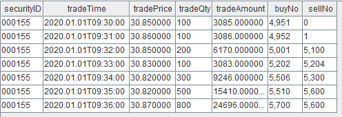

# 入门示例

本节将通过两个示例展示如何实时进行因子计算。

## 示例1：实时计算买卖价差

本例中我们将以行情快照数据作为输入，针对每一笔快照实时响应，计算并输出买卖价差这一高频因子。

**因子计算逻辑**

行情数据中包含了买卖双方多档量价信息，买卖价差的定义为卖1价与买1价之差与均价之比：


其中 offerPrice0 、 bidPrice0 分别表示卖1价与买1价。

**输入数据示例**


### 实现步骤

接下来，我们将逐步在 DolphinDB 上模拟行情快照数据流，并实时计算输出。完整脚本见附录。

**创建作为输入的流数据表**

首先创建一个共享流数据表 tick，用于存储和发布行情快照数据：

```
share(table=streamTable(1:0, `securityID`dateTime`bidPrice0`bidOrderQty0`offerPrice0`offerOrderQty0, [SYMBOL,TIMESTAMP,DOUBLE,LONG,DOUBLE,LONG]), sharedName=`tick)
```

执行上述语句后，DolphinDB 数据节点的内存中将创建一个名为 tick 的表，但目前尚未写入任何数据。

**创建作为输出的流数据表**

创建一个共享流数据表 resultTable，用于存储和发布因子计算结果：

```
share(table=streamTable(10000:0, ["securityID", "dateTime", "factor"], [SYMBOL, TIMESTAMP, DOUBLE]), sharedName=`resultTable)
```

执行以上语句后，DolphinDB 数据节点的内存中将创建一个名为 resultTable
的表，但目前尚未写入任何数据。我们希望将后续的计算结果实时写入该表中。

**定义计算逻辑**

```
def factorCalFunc(msg){
	tmp = select securityID, dateTime, (offerPrice0-bidPrice0)*2\(offerPrice0+bidPrice0) as factor from msg
	objByName("resultTable").append!(tmp)
}
```

* *msg* 可以看做一个与 tick 表结构相同的内存表。
* `objByName("resultTable").append!(tmp)` 表示向结果表 resultTable
  插入 tmp 表。
* tmp 表通过 DolphinDB SQL
  语句计算得出，(offerPrice0-bidPrice0)\*2\(offerPrice0+bidPrice0) 表示买卖价差公式，对 msg
  表中的每一行记录都会计算出对应的买卖价差因子。

**订阅流数据表**

```
subscribeTable(tableName="tick", actionName="factorCal", offset=-1, handler=factorCalFunc, msgAsTable=true, batchSize=1, throttle=0.001)
```

订阅流数据表 tick，并指定 `factorCalFunc` 作为数据处理方法，同时分配一个后台线程不断处理订阅到的新数据。每当表
tick 插入一批数据时，这些数据都会被发布到订阅端，后台线程会接收新增数据，并以此作为输入调用函数
`factorCalFunc`。

* *tableName*="tick" 表示订阅流数据表 tick。
* *actionName*="factorCal" 表示订阅任务的名称，用户自定义。相同节点上， *tableName* 和
  *actionName* 的组合必须唯一。
* *offset*=-1 表示从订阅之后表 tick 中新增的第一条数据开始消费。
* *handler*=factorCalFunc 表示对订阅数据的处理方式。
* *msgAsTable*=true 表示待处理的订阅到的数据是表，即 `factorCalFunc`
  函数的入参 *msg* 是表。
* *batchSize*=1 和 *throttle*=0.001
  共同指定了后台线程的处理频率。本例中任意有一条或多条待处理数据会触发一次 `factorCalFunc`
  的调用。

**模拟数据输入**

执行上述所有脚本后，我们提交了对流数据表 tick 的订阅，并指定调用自定义函数 `factorCalFunc`
来处理收到的订阅数据。接下来，我们将向流数据表中注入一些数据，以观察订阅消费的结果。

```
insert into tick values(`000001, 2023.01.01T09:30:00.000, 19.98, 100, 19.99, 120)
insert into tick values(`000001, 2023.01.01T09:30:03.000, 19.96, 130, 19.99, 120)
insert into tick values(`000001, 2023.01.01T09:30:06.000, 19.90, 120, 20.00, 130)
```

在向表 tick 插入若干条数据后，查看结果表 *resultTable*：


至此，我们通过发布订阅框架和流计算引擎完成了一个流计算任务的开发。不断向流数据表 tick 中插入数据将持续触发计算，并将因子输出到结果表。

如有需要，可参考管理流计算任务，对该计算任务进行监控或环境清理。

## 示例2：实时计算过去 5 分钟主动成交量占比

在本例中，我们将使用逐笔成交数据作为输入，对每笔数据进行实时响应，计算并输出过去5分钟的主动成交量占比这一高频因子。

**因子计算逻辑**

主动成交占比即主动成交量占总成交量的比例，其计算公式如下：


其中：

* actVolumest 表示 t-window 时刻到 t 时刻区间内的主动成交量；指示函数
  IbuyNo>selNo 的含义如下：
  
* totalVolumet 表示 t-window 时刻到 t 时刻区间的总成交量。

**输入数据示例**



### 实现步骤

接下来，我们将逐步在 DolphinDB 上模拟逐笔成交数据流，并实时计算输出。完整脚本见附录。

**创建作为输入的流数据表**

首先创建一个共享流数据表 trade ，用于存储和发布逐笔成交数据：

```
share(table=streamTable(1:0, `securityID`tradeTime`tradePrice`tradeQty`tradeAmount`buyNo`sellNo, [SYMBOL,TIMESTAMP,DOUBLE,INT,DOUBLE,LONG,LONG]), sharedName=`trade)
```

执行以上语句后，DolphinDB 数据节点的内存中将创建一个名为 trade 的表，但目前尚未写入任何数据。

**创建作为输出的流数据表**

创建一个共享流数据表 resultTable，用于存储和发布因子计算结果：

```
share(table=streamTable(10000:0, ["securityID", "tradeTime", "factor"], [SYMBOL, TIMESTAMP, DOUBLE]), sharedName=`resultTable)
```

执行以上语句后，DolphinDB 数据节点的内存中将创建一个名为 resultTable
的表，但目前尚未写入任何数据。我们希望将后续的计算结果实时写入该表中。

**定义计算逻辑**

示例 1
中的因子计算不涉及状态，因此实现逻辑相对简单。而本示例的主动成交量因子计算依赖于历史记录，因此其计算逻辑需要考虑如何获取状态。本节将首先介绍一种错误的实现方式，以帮助用户理解带状态因子计算的处理方法，接着给出了正确的实现逻辑。

**定义错误的计算函数**

首先，我们定义一个 factorVolumeCalFunc 函数：

```
def factorVolumeCalFunc (msg){
	tmp = select securityID, tradeTime, tmsum(tradeTime, iif(buyNo>sellNo, tradeQty, 0), 5m)\tmsum(tradeTime, tradeQty, 5m) as factor from msg context by securityID
	objByName("resultTable").append!(tmp)
}
subscribeTable(tableName="trade", actionName="factorCal", offset=-1, handler=factorVolumeCalFunc , msgAsTable=true, batchSize=1, throttle=0.001)
```

* *msg* 可以看做一个与 trade 表结构相同的内存表
* objByName("resultTable").append!(tmp) 表示往结果表 resultTable 插入 tmp 表
* tmp 表通过 DolphinDB SQL 语句计算得到：

  + SQL 语句中使用 context by 对表 msg 分组后，返回的结果表 tmp 的行数与 msg 一致。context by
    和时间序列函数（如此处的 tmsum）一起使用，可实现在分组内（ securityID
    ）按记录的顺序逐行进行滑动时间窗口聚合计算。
  + tmsum(tradeTime, tradeQty, 5m) 表示以 tradeTime 为时间列，对每一行划定过去 5
    分钟的窗口，对窗口内所有记录的 tradeQty 求和，即过去五分钟的总成交量。
  + tmsum(tradeTime, iif(buyNo>sellNo, tradeQty, 0), 5m) 表示以
    tradeTime 为时间列，对每一行划定过去 5 分钟窗口，对窗口内 buyNo>sellNo 的这部分记录的
    tradeQty 求和，即过去五分钟的主动成交量。

当该函数被用于处理订阅数据时，每次仅基于 trade
表新增的记录进行计算，而未能缓存或获取主动成交量因子依赖的历史记录。这会导致错误结果错误。下面进一步展示函数计算的过程及结果。

首先构造一批数据调用一次 factorVolumeCalFunc 函数。

```
// 定义结果表
share(table=streamTable(10000:0, ["securityID", "tradeTime", "factor"], [SYMBOL, TIMESTAMP, DOUBLE]), sharedName=`resultTable)
// 构造输入数据
input1 = table(1:0, `securityID`tradeTime`tradePrice`tradeQty`tradeAmount`buyNo`sellNo, [SYMBOL,TIMESTAMP,DOUBLE,INT,DOUBLE,LONG,LONG])
insert into input1 values(`000155, 2020.01.01T09:30:00.000, 30.85, 100, 3085, 4951, 0)
insert into input1 values(`000155, 2020.01.01T09:31:00.000, 30.86, 100, 3086, 4952, 1)
insert into input1 values(`000155, 2020.01.01T09:32:00.000, 30.85, 200, 6170, 5001, 5100)
insert into input1 values(`000155, 2020.01.01T09:33:00.000, 30.83, 100, 3083, 5202, 5204)
insert into input1 values(`000155, 2020.01.01T09:34:00.000, 30.82, 300, 9246, 5506, 5300)
insert into input1 values(`000155, 2020.01.01T09:35:00.000, 30.82, 500, 15410, 5510, 5600)
// 调用一次 factorVolumeCalFunc  函数
factorVolumeCalFunc (msg=input1)
```

执行下述语句查询结果表：

```
select * from resultTable
```

返回结果如下，目前结果正确：


再构造1条数据，并调用一次 factorVolumeCalFunc 函数：

```
// 构造输入数据
input2 = table(1:0, `securityID`tradeTime`tradePrice`tradeQty`tradeAmount`buyNo`sellNo, [SYMBOL,TIMESTAMP,DOUBLE,INT,DOUBLE,LONG,LONG])
insert into input2 values(`000155, 2020.01.01T09:36:00.000, 30.87, 800, 24696, 5700, 5600)
// 再调用一次 factorVolumeCalFunc  函数
factorVolumeCalFunc (msg=input2)
```

结果表如下，最后一行对应新增的 input2 的结果，factor 值明显错误：


**定义正确的计算函数**

为了实现正确的计算逻辑，我们需要在上文的 factorVolumeCalFunc 函数基础上进行复杂的改写，以获取历史数据。然而，DolphinDB
提供了一种更简便的实现方式——DolphinDB
计算引擎。流计算引擎可以被视为一个封装的独立计算黑盒，其内部会缓存所需的历史数据或中间结果（即状态），通过向其写入数据触发计算，并将结果输出到目标表。有关流计算引擎的详细介绍，[内置流计算引擎](../funcs/themes/streamingEngine.md) 。

针对不同场景，DolphinDB 提供了多种流计算引擎。在本例中，由于需要逐条分组响应计算并输出，因此应选择响应式状态引擎。

```
createReactiveStateEngine(name="reactiveDemo", metrics=<[tradeTime, tmsum(tradeTime, iif(buyNo>sellNo, tradeQty, 0), 5m)\tmsum(tradeTime, tradeQty, 5m)]>, dummyTable=trade, outputTable=resultTable, keyColumn="securityID")
def factorVolumeCalFunc (msg){
    getStreamEngine("reactiveDemo").append!(msg)
}
```

以上代码使用 createReactiveStateEngine 函数定义一个响应式状态引擎：

* 引擎需要一个在节点上唯一的名字，此处为 reactiveDemo。
* *dummyTable*=trade 表示引擎的输入表结构与表 trade 一致。
* *outputTable*=resultTable 表示计算结果输出到结果表 resultTable。
* *keyColumn*="securityID" 表示按 securityID 进行分组计算。分组列将作为引擎输出表的第一列。
* *metrics* 定义了因子计算的逻辑。其中的 tradeTime 表示将输入的 tradeTime
  列随计算结果一同输出，tmsum(tradeTime, iif(buyNo>sellNo, tradeQty, 0),
  5m)\tmsum(tradeTime, tradeQty, 5m) 计算得到的主动成交量占比作为计算结果列输出。

在此定义的 factorVolumeCalFunc 函数中，tmsum 在响应式状态引擎中的含义与上文 SQL
语句中的业务含义一致，但其内部实现有所不同。在引擎中，tmsum 是基于上一条计算结果进行增量计算的，因此引擎会缓存必要的计算状态。例如，对于输入记录
09:36:00.000，其过去 5 分钟的总成交量计算公式为：该记录之前的最后一条记录过去 5 分钟总成交量 + 该记录的成交量 - 上一条记录的过去 5
分钟窗口内不属于当前记录时间窗口的记录对应的成交量。

**订阅流数据表**

```
subscribeTable(tableName="trade", actionName="factorCal", offset=-1, handler=factorVolumeCalFunc, msgAsTable=true, batchSize=1, throttle=0.001)
```

subscribeTable 函数的 *handler*
参数除了指定为一元函数外，还可以直接指定为数据表。getStreamEngine("reactiveDemo") 返回的流计算引擎句柄是一个数据表，因此可以将
*handler* 直接指定为引擎句柄，而无需额外定义 factorVolumeCalFunc 函数，从而简化上述脚本。

```
createReactiveStateEngine(name="reactiveDemo", metrics=<[tradeTime, tmsum(tradeTime, iif(buyNo>sellNo, tradeQty, 0), 5m)\tmsum(tradeTime, tradeQty, 5m)]>, dummyTable=trade, outputTable=resultTable, keyColumn="securityID")
subscribeTable(tableName="trade", actionName="factorCal", offset=-1, handler=getStreamEngine("reactiveDemo"), msgAsTable=true, batchSize=1, throttle=0.001)
```

**模拟数据输入**

```
insert into trade values(`000155, 2020.01.01T09:30:00.000, 30.85, 100, 3085, 4951, 0)
insert into trade values(`000155, 2020.01.01T09:31:00.000, 30.86, 100, 3086, 4952, 1)
insert into trade values(`000155, 2020.01.01T09:32:00.000, 30.85, 200, 6170, 5001, 5100)
insert into trade values(`000155, 2020.01.01T09:33:00.000, 30.83, 100, 3083, 5202, 5204)
insert into trade values(`000155, 2020.01.01T09:34:00.000, 30.82, 300, 9246, 5506, 5300)
insert into trade values(`000155, 2020.01.01T09:35:00.000, 30.82, 500, 15410, 5510, 5600)
```

插入若干条数据到表 trade 后，查看结果表 resultTable：


以上结果符合预期。我们再插入一条数据：

```
insert into trade values(`000155, 2020.01.01T09:36:00.000, 30.87, 800, 24696, 5700, 5600)
```

结果表对应地新增了一条记录，且对于09:36:00这条记录，计算得到了正确的 factor 值：


## 管理流计算任务

系统提供了运维函数，用于查看流计算的执行情况。除了通过函数查询外，在 2.00.11 及以上版本中，用户还可以在 Web 界面的流计算监控模块中直接查看。

**查看流订阅消费的状态**

调用 `getStreamingStat` 函数，可以查看订阅状态。

```
getStreamingStat().subWorkers
```

执行代码后，可以观察到节点上有一个订阅线程在工作。该订阅已经处理了 7 条消息，目前没有报错。订阅消费队列的最大深度为1000万，目前队列里没有待处理的数据。


**查看流计算引擎状态**

```
getStreamEngineStat().ReactiveStreamEngine
```

执行以上代码后可以看到，目前插入引擎的输入数据中，只有一个分组（即000155），共输入了 7 条数据，引擎内部维护的状态占用了1836字节。


**清理流计算环境**

当流计算任务运行一段时间后，或许我们需要下线计算任务、更改计算逻辑或者修改输入源的表结构，那么我们可能需要将订阅、引擎或者流数据表分别取消掉，可以使用以下系统函数。

* 取消订阅：

  ```
  unsubscribeTable(tableName="trade", actionName="factorCal")
  ```

  执行以上代码可以取消特定的订阅关系，之后表 trade 再发布数据，系统也不会计算主动成交量因子。
* 释放流计算引擎：

  ```
  dropStreamEngine(`reactiveDemo)
  ```

  执行以上脚本可以释放流计算引擎
  `reactiveDemo` ，引擎占用的内存也会一起释放。
* 删除流数据表：

  ```
  dropStreamTable(`trade)
  ```

## 附录

**示例 1 完整脚本**

```
// 创建作为输入的流数据表
share(table=streamTable(1:0, `securityID`dateTime`bidPrice0`bidOrderQty0`offerPrice0`offerOrderQty0, [SYMBOL,TIMESTAMP,DOUBLE,LONG,DOUBLE,LONG]), sharedName=`tick)
// 创建作为输出的流数据表
share(table=streamTable(10000:0, ["securityID", "dateTime", "factor"], [SYMBOL, TIMESTAMP, DOUBLE]), sharedName=`resultTable)
go
// 定义处理函数
def factorCalFunc(msg){
	tmp = select securityID, dateTime, (offerPrice0-bidPrice0)*2\(offerPrice0+bidPrice0) as factor from msg
	objByName("resultTable").append!(tmp)
}
// 订阅流数据表
subscribeTable(tableName="tick", actionName="factorCal", offset=-1, handler=factorCalFunc, msgAsTable=true, batchSize=1, throttle=0.001)
go
// 模拟数据输入
insert into tick values(`000001, 2023.01.01T09:30:00.000, 19.98, 100, 19.99, 120)
insert into tick values(`000001, 2023.01.01T09:30:03.000, 19.96, 130, 19.99, 120)
insert into tick values(`000001, 2023.01.01T09:30:06.000, 19.90, 120, 20.00, 130)
```

**示例 2 完整脚本**

```
// 创建作为输入的流数据表
share(table=streamTable(1:0, `securityID`tradeTime`tradePrice`tradeQty`tradeAmount`buyNo`sellNo, [SYMBOL,TIMESTAMP,DOUBLE,INT,DOUBLE,LONG,LONG]), sharedName=`trade)
// 创建作为输出的流数据表
share(table=streamTable(10000:0, ["securityID", "tradeTime", "factor"], [SYMBOL, TIMESTAMP, DOUBLE]), sharedName=`resultTable)

go

// 定义处理函数
createReactiveStateEngine(name="reactiveDemo", metrics=<[tradeTime, tmsum(tradeTime, iif(buyNo>sellNo, tradeQty, 0), 5m)\tmsum(tradeTime, tradeQty, 5m)]>, dummyTable=trade, outputTable=resultTable, keyColumn="securityID")
// 订阅流数据表
subscribeTable(tableName="trade", actionName="factorCal", offset=-1, handler=getStreamEngine("reactiveDemo"), msgAsTable=true, batchSize=1, throttle=0.001)

go

insert into trade values(`000155, 2020.01.01T09:30:00.000, 30.85, 100, 3085, 4951, 0)
insert into trade values(`000155, 2020.01.01T09:31:00.000, 30.86, 100, 3086, 4952, 1)
insert into trade values(`000155, 2020.01.01T09:32:00.000, 30.85, 200, 6170, 5001, 5100)
insert into trade values(`000155, 2020.01.01T09:33:00.000, 30.83, 100, 3083, 5202, 5204)
insert into trade values(`000155, 2020.01.01T09:34:00.000, 30.82, 300, 9246, 5506, 5300)
insert into trade values(`000155, 2020.01.01T09:35:00.000, 30.82, 500, 15410, 5510, 5600)

insert into trade values(`000155, 2020.01.01T09:36:00.000, 30.87, 800, 24696, 5700, 5600)
```

