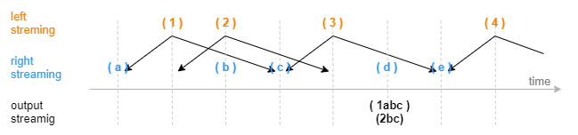
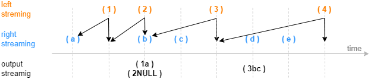
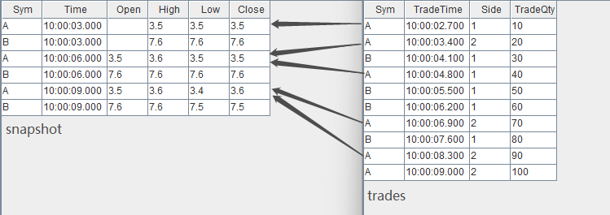
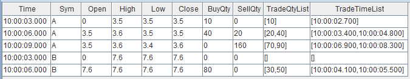

# window join 引擎

window join 引擎由 `createWindowJoinEngine` 函数创建。

window join 引擎的连接机制类似于 SQL 中的 window join，上一小节的 asof join 引擎可以看做是 window join
引擎的一个特例。按连接列分组，在每个分组内按时间邻近关联右表一个时间窗口内的数据，这个窗口由左表的每一条记录的时刻和创建引擎时指定的窗口（参数
*window*）决定。引擎默认左右表是有序的，在连接列分组内，对于左表中的每一条记录，会在右表缓存中选取由左表的时刻确定的窗口范围内的记录，可能会找到 0
至多条记录，引擎将输出一条结果，这条结果由多条右表记录聚合为一条后与左表拼接而成。

window join 引擎在创建时通过参数 *useSystemTime* 指定以下两种规则中的一种，用于判断临近时刻是否到来：

* 规则一：以数据注入引擎时的系统时间为时序标准，则系统时间达到窗口下边界时立刻关联并输出；
* 规则二：以数据中的时间列为时序标准，当右表数据的最新时刻大于窗口下边界时触发关联并输出。

在规则二的基础上，还可以通过参数 *maxDelayedTime* 设置超时强制触发规则。

下图展示在一个分组中，以非系统时间触发输出的普通窗口（参数 *window*=-1:2 ）连接的效果，由每一条左表记录基于其时间戳往前 1 个时间刻度、往后 2
个时间刻度划定窗口的上下边界，输出由大于窗口下边界的第一条右表记录触发，窗口计算不包含这条触发记录。



下图展示在一个分组中，以非系统时间触发输出的特殊窗口（参数 *window*=0:0
）连接的效果，窗口范围由相邻两条左表记录划定，输出由等于或大于左表时间戳的第一条右表记录触发，窗口计算不包含这条触发记录。后文将介绍一个基于特殊窗口的窗口关联引擎的实际应用场景：对行情快照融合逐笔成交数据。



`createWindowJoinEngine` 函数的语法如下：

```
createWindowJoinEngine(name, leftTable, rightTable, outputTable, window, metrics, matchingColumn, [timeColumn], [useSystemTime=false], [garbageSize = 5000], [maxDelayedTime], [nullFill], [outputElapsedMicroseconds=false], [sortByTime])
```

其参数的详细含义可以参考：[createWindowJoinEngine](../funcs/c/createWindowJoinEngine.html) 函数。

## 应用例子 1-行情快照与逐笔成交数据融合

行情快照和逐笔成交数据包含着不同的信息，很多高频因子的计算同时依赖行情快照和成交数据，本例在行情快照数据的基础上融合前后两个快照之间的逐笔成交数据，融合后的数据可以更方便地作为后续复杂因子的计算的输入。

这个场景的特征是，每条行情快照记录匹配一个时间窗口内的全部逐笔成交记录的聚合值，这个时间窗口的上下界由两条行情快照数据的时刻决定，输出与原始的每一条行情快照记录一一对应。对于一个窗口中的逐笔成交记录，既需要计算交易量总和这样的聚合值，也希望以一个字段保留窗口内的全部逐笔成交明细。以下脚本用
window join 引擎的特殊窗口来实现此场景。

注： 1.30 版本的 DolphinDB 不支持
array vector 数据形式，以下脚本包含 array vector 功能，因此仅支持 2.00
版本。

```
// create table
share streamTable(1:0, `Sym`TradeTime`Side`TradeQty, [SYMBOL, TIME, INT, LONG]) as trades
share streamTable(1:0, `Sym`Time`Open`High`Low`Close, [SYMBOL, TIME, DOUBLE, DOUBLE, DOUBLE, DOUBLE]) as snapshot
share streamTable(1:0, `Time`Sym`Open`High`Low`Close`BuyQty`SellQty`TradeQtyList`TradeTimeList, [TIME, SYMBOL, DOUBLE, DOUBLE, DOUBLE, DOUBLE, LONG, LONG, LONG[], TIME[]]) as output

// create engine
wjMetrics = <[Open, High, Low, Close, sum(iif(Side==1, TradeQty, 0)), sum(iif(Side==2, TradeQty, 0)), TradeQty, TradeTime]>
fillArray = [00:00:00.000, "", 0, 0, 0, 0, 0, 0, [], []]
wjEngine = createWindowJoinEngine(name="windowJoin", leftTable=snapshot, rightTable=trades, outputTable=output, window=0:0, metrics=wjMetrics, matchingColumn=`Sym, timeColumn=`Time`TradeTime, useSystemTime=false, nullFill=fillArray)

// subscribe topic
subscribeTable(tableName="snapshot", actionName="appendLeftStream", handler=getLeftStream(wjEngine), msgAsTable=true, offset=-1, hash=0)
subscribeTable(tableName="trades", actionName="appendRightStream", handler=getRightStream(wjEngine), msgAsTable=true, offset=-1, hash=1)
```

* 行情快照数据 snapshot 注入引擎的左表，逐笔成交数据 trades 注入引擎的右表。
* 引擎参数 *useSystemTime*=false 表示通过数据中的时间列（左表为 Time 字段，右表为 TradeTime
  字段）来判断左右表中记录的时序关系。
* 引擎参数 *window*=0:0 表示右表 *trades* 的计算窗口将由左表 *snapshot*
  当前和其上一条数据的时间戳划定。
* 引擎参数 *metrics* 表示计算指标，如 Open 表示取左表 *snapshot* 中 Open
  字段，`sum(iif(Side==1, TradeQty, 0))` 表示对右表
  *trades* 在窗口内的数据做聚合计算。注意，TradeQty 是右表 *trades* 中的字段，且此处对
  TradeQty 没有使用聚合函数，则表示对右表 *trades* 在窗口内的全部 TradeQty
  值保留明细，对应的输出为一个数据类型为 array vector 的字段。
* 引擎参数 *nullFill* 为可选参数，表示如何填充输出表中的空值，本例中结合实际场景，对于表示价格的字段如 Open
  等都指定将空值填充为0。注意，*nullFill* 为元组，必须和输出表列字段等长且类型一一对应。

构造数据写入作为原始输入的 2
个流数据表，先写入右表，再写入左表：

```
// generate data: snapshot
t1 = table(`A`B`A`B`A`B as Sym, 10:00:00.000+(3 3 6 6 9 9)*1000 as Time, (NULL NULL 3.5 7.6 3.5 7.6) as Open, (3.5 7.6 3.6 7.6 3.6 7.6) as High, (3.5 7.6 3.5 7.6 3.4 7.5) as Low, (3.5 7.6 3.5 7.6 3.6 7.5) as Close)
// generate data: trade
t2 = table(`A`A`B`A`B`B`A`B`A`A as Sym, 10:00:02.000+(1..10)*700 as TradeTime,  (1 2 1 1 1 1 2 1 2 2) as Side, (1..10) * 10 as TradeQty)
// input data
trades.append!(t2)
snapshot.append!(t1)
```

输入数据与关联关系如下：



关联得到的结果表
*output* 如下，其中最后两列为 array vector 类型数据，记录了窗口中全部成交记录的 TradeQty
字段明细、TradeTime 字段明细。

注意，输出表比左表 *snapshot* 少一条数据，即左表 *snapshot*
中分组 B 内时间戳为 10:00:09.000 的数据没有输出，这是因为右表 *trades* 中分组 B 内没有等于或大于
10:00:09.000 的数据来关闭窗口。在实际生产中，当接入实时数据时，若需要左表 *snapshot* 一旦达到引擎便立即输出，则建议选择
*useSystemTime*=true，即用系统时间作为时间戳，这时，对于任意一条左表记录，右表窗口是从前一条左表记录到达到本条记录到达之间进入引擎的全部右表数据。



## 应用例子 2

```
share streamTable(1:0, `time`sym`price, [TIMESTAMP, SYMBOL, DOUBLE]) as leftTable
share streamTable(1:0, `time`sym`val, [TIMESTAMP, SYMBOL, DOUBLE]) as rightTable
output=table(100:0, `time`sym`factor1`factor2`factor3, [TIMESTAMP, SYMBOL, DOUBLE, DOUBLE, DOUBLE])

nullFill= [2012.01.01T00:00:00.000, `NONE, 0.0, 0.0, 0.0]
wjEngine=createWindowJoinEngine(name="test1", leftTable=leftTable, rightTable=rightTable, outputTable=output,  window=-2:2, metrics=<[price,val,sum(val)]>, matchingColumn=`sym, timeColumn=`time, useSystemTime=false,nullFill=nullFill)

subscribeTable(tableName="leftTable", actionName="joinLeft", offset=0, handler=appendForJoin{wjEngine, true}, msgAsTable=true)
subscribeTable(tableName="rightTable", actionName="joinRight", offset=0, handler=appendForJoin{wjEngine, false}, msgAsTable=true)

n=10
tp1=table(take(2012.01.01T00:00:00.000+0..10, 2*n) as time, take(`A, n) join take(`B, n) as sym, take(NULL join rand(10.0, n-1),2*n) as price)
tp1.sortBy!(`time)
leftTable.append!(tp1)

tp2=table(take(2012.01.01T00:00:00.000+0..10, 2*n) as time, take(`A, n) join take(`B, n) as sym, take(double(1..n),2*n) as val)
tp2.sortBy!(`time)
rightTable.append!(tp2)

select * from output where time between 2012.01.01T00:00:00.000:2012.01.01T00:00:00.001
```

| time | sym | factor1 | factor2 | factor3 |
| --- | --- | --- | --- | --- |
| 2012.01.01T00:00:00.000 | A | 0 | 1 | 6 |
| 2012.01.01T00:00:00.000 | A | 0 | 2 | 6 |
| 2012.01.01T00:00:00.000 | A | 0 | 3 | 6 |
| 2012.01.01T00:00:00.001 | A | 5.2705 | 1 | 10 |
| 2012.01.01T00:00:00.001 | A | 5.2705 | 2 | 10 |
| 2012.01.01T00:00:00.001 | A | 5.2705 | 3 | 10 |
| 2012.01.01T00:00:00.001 | A | 5.2705 | 4 | 10 |
| 2012.01.01T00:00:00.000 | B | 5.2705 | 2 | 9 |
| 2012.01.01T00:00:00.000 | B | 5.2705 | 3 | 9 |
| 2012.01.01T00:00:00.000 | B | 5.2705 | 4 | 9 |
| 2012.01.01T00:00:00.001 | B | 1.0179 | 2 | 14 |
| 2012.01.01T00:00:00.001 | B | 1.0179 | 3 | 14 |
| 2012.01.01T00:00:00.001 | B | 1.0179 | 4 | 14 |
| 2012.01.01T00:00:00.001 | B | 1.0179 | 5 | 14 |

下例展示特殊窗口的计算：

```
share streamTable(1:0, `time`sym`price, [TIMESTAMP, SYMBOL, DOUBLE]) as leftTable
share streamTable(1:0, `time`sym`val, [TIMESTAMP, SYMBOL, DOUBLE]) as rightTable

v = [1, 5, 10, 15]
tp1=table(2012.01.01T00:00:00.000+v as time, take(`A   , 4) as sym, rand(10.0,4) as price)

v = [1, 2, 3, 4, 5, 6, 9, 15]
tp2=table(2012.01.01T00:00:00.000+v as time, take(`A   , 8) as sym, rand(10.0,8) as val)

output=table(100:0, `time`sym`price`val`sum_val, [TIMESTAMP, SYMBOL, DOUBLE, DOUBLE[], DOUBLE])
wjEngine=createWindowJoinEngine(name="test1", leftTable=leftTable, rightTable=rightTable, outputTable=output,  window=0:0, metrics=<[price, val, sum(val)]>, matchingColumn=`sym, timeColumn=`time, useSystemTime=false)

subscribeTable(tableName="leftTable", actionName="joinLeft", offset=0, handler=appendForJoin{wjEngine, true}, msgAsTable=true)
subscribeTable(tableName="rightTable", actionName="joinRight", offset=0, handler=appendForJoin{wjEngine, false}, msgAsTable=true)

leftTable.append!(tp1)
rightTable.append!(tp2)
```

| time | sym | price | val | sum\_val |
| --- | --- | --- | --- | --- |
| 2012.01.01T00:00:00.001 | A | 8.8252 | [] |  |
| 2012.01.01T00:00:00.005 | A | 7.1195 | [7.495792,9.417891,1.419681,...] | 21.3741 |
| 2012.01.01T00:00:00.010 | A | 5.2217 | [4.840462,8.086567,3.495306] | 16.4223 |
| 2012.01.01T00:00:00.015 | A | 9.2517 | [] |  |

下例展示指定 sortByTime = true 时，引擎将按时间顺序输出数据。

```
//清理引擎及变量
unsubscribeTable(tableName="leftTable", actionName="joinLeft")
unsubscribeTable(tableName="rightTable", actionName="joinRight")
undef(`leftTable,SHARED)
undef(`rightTable,SHARED)
dropAggregator(name="test1")

//定义引擎
share streamTable(1:0, `time`sym`price, [TIMESTAMP, SYMBOL, DOUBLE]) as leftTable
share streamTable(1:0, `time`sym`val, [TIMESTAMP, SYMBOL, DOUBLE]) as rightTable
output=table(100:0, `time`sym`factor1`factor2`factor3, [TIMESTAMP, SYMBOL, DOUBLE, DOUBLE, DOUBLE])
nullFill= [2012.01.01T00:00:00.000, `NONE, 0.0, 0.0, 0.0]
wjEngine=createWindowJoinEngine(name="test1", leftTable=leftTable, rightTable=rightTable, outputTable=output,  window=-2:2, metrics=<[price,val,sum(val)]>, matchingColumn=`sym, timeColumn=`time, useSystemTime=false,nullFill=nullFill, sortByTime=true)

//定义数据
subscribeTable(tableName="leftTable", actionName="joinLeft", offset=0, handler=appendForJoin{wjEngine, true}, msgAsTable=true)
subscribeTable(tableName="rightTable", actionName="joinRight", offset=0, handler=appendForJoin{wjEngine, false}, msgAsTable=true)

n=10
tp1=table(take(2012.01.01T00:00:00.000+0..10, 2*n) as time, take(`A, n) join take(`B, n) as sym, take(NULL join rand(10.0, n-1),2*n) as price)
tp1.sortBy!(`time)
leftTable.append!(tp1)

tp2=table(take(2012.01.01T00:00:00.000+0..10, 2*n) as time, take(`A, n) join take(`B, n) as sym, take(double(1..n),2*n) as val)
tp2.sortBy!(`time)
rightTable.append!(tp2)

sleep(100)
select * from output where time between 2012.01.01T00:00:00.000:2012.01.01T00:00:00.001
```

| time | sym | factor1 | factor2 | factor3 |
| --- | --- | --- | --- | --- |
| 2012.01.01T00:00:00.000 | A | 0 | 1 | 6 |
| 2012.01.01T00:00:00.000 | A | 0 | 2 | 6 |
| 2012.01.01T00:00:00.000 | A | 0 | 3 | 6 |
| 2012.01.01T00:00:00.000 | B | 3.9389 | 2 | 9 |
| 2012.01.01T00:00:00.000 | B | 3.9389 | 3 | 9 |
| 2012.01.01T00:00:00.000 | B | 3.9389 | 4 | 9 |
| 2012.01.01T00:00:00.001 | A | 3.9389 | 1 | 10 |
| 2012.01.01T00:00:00.001 | A | 3.9389 | 2 | 10 |
| 2012.01.01T00:00:00.001 | A | 3.9389 | 3 | 10 |
| 2012.01.01T00:00:00.001 | A | 3.9389 | 4 | 10 |
| 2012.01.01T00:00:00.001 | B | 4.9875 | 2 | 14 |
| 2012.01.01T00:00:00.001 | B | 4.9875 | 3 | 14 |
| 2012.01.01T00:00:00.001 | B | 4.9875 | 4 | 14 |
| 2012.01.01T00:00:00.001 | B | 4.9875 | 5 | 14 |

