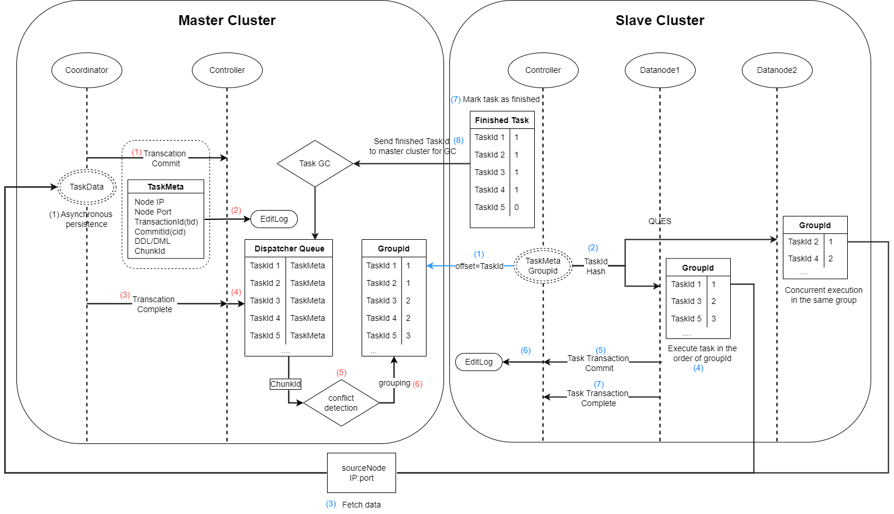

# 异步复制

集群间的异步复制指通过异步方式，将主集群复制到从集群，使主从集群数据一致。集群间的异步复制是集群异地容灾的一个解决方案，通常主集群用于实时的业务查询，而从集群则是作为主集群的一个备份。

与传统集群间的异步复制解决方案相比，DolphinDB 具有以下优势：

* 容错性强。节点宕机不会造成数据丢失，主从集群数据最终会保持一致。
* 运维便捷。提供在线监控函数以及错误修复函数。

## 支持情况

* 仅支持分布式表，暂不支持内存表和本地磁盘表。
* 对 DDL（Data Definition Language）/DML（Data Manipulation
  Language） 操作的支持情况请参见下表。
* 不支持权限管理、分级存储以及存储引擎配置修改等非 DDL/DML 操作。

| 支持 | 对应操作类型（operationType） |
| --- | --- |
| append / tableInsert | APPEND、APPEND\_CHUNK\_GRANULARITY(APPEND Best Effort) |
| delete | SQL\_DELETE |
| update | SQL\_UPDATE |
| upsert! | UPSERT |
| dropTable | DROP\_TABLE |
| dropPartition | DROP\_PARTITION |
| dropDatabase | DROP\_DB |
| addRangePartitions | ADD\_RANGE\_PARTITION |
| addValuePartitions | ADD\_VALUE\_PARTITION |
| database | CREATE\_DOMAIN |
| create, createPartitionedTable, createTable | CREATE\_TABLE, CREATE\_PARTITIONED\_TABLE |
| addColumn | ADD\_COLUMN |
| dropColumns | DROP\_COLUMN |
| renameTable | RENAME\_TABLE |
| truncate | TRUNCATE\_TABLE |
| replaceColumn | REPLACE\_COLUMN |
| setColumnComment | SET\_COLUMN\_COMMENT |
| rename! | RENAME\_COLUMN |

## 异步复制流程

（1）启用集群间的异步复制，在配置文件指定相关配置参数。

（2）配置完成后，启动服务器。在主集群数据节点调用 [setDatabaseForClusterReplication("dfs://xxx", true)](../funcs/s/setDatabaseForClusterReplication.md)
，开启某个数据库集群间的异步复制（一次调用只启动一个数据库的异步复制）。

（3）主集群开启异步复制后，从集群自动到主集群拉取异步复制任务，然后逐一执行。

（4）若从集群某个数据库的异步复制任务多次失败导致整个异步复制中断，用户可以尝试以下方案解决：

* 在从集群控制节点调用 [startClusterReplication](../funcs/s/startClusterReplication.md) 函数尝试重启异步复制。
* 在从集群控制节点调用 [getSlaveReplicationStatus](../funcs/g/getSlaveReplicationStatus.md)
  函数，查看从集群异步复制任务的失败原因，解决后再调用 [startClusterReplication](../funcs/s/startClusterReplication.md) 函数重启。
* 若无法解决失败任务，可以在从集群控制节点调用 [skipClusterReplicationTask](../funcs/s/skipClusterReplicationTask.md) 函数跳过该任务，再调用 [startClusterReplication](../funcs/s/startClusterReplication.md) 函数重启。

（5）若需要停止所有数据库的异步复制，可以在主集群和从集群的控制节点分别调用 [stopClusterReplication](../funcs/s/stopClusterReplication.md)
函数。调用后，正在执行的任务会继续进行，但主集群不再将异步复制任务放进发送队列，从集群不再从主集群拉取异步复制任务。

（6）若要停止某个数据库的异步复制，可以调用 [setDatabaseForClusterReplication("dfs://xxx", false)](../funcs/s/setDatabaseForClusterReplication.md)
。调用后，正在执行的任务会继续进行，但该数据库不再产生异步复制任务。

## 异步复制机制

**主集群：**

（1）事务完成后，根据两阶段提交协议，协调节点发送 “commit”
信号给控制节点，同时将事务的元数据发送给控制节点。若为写事务，则协调节点将该事务的数据持久化到本地。

（2）控制节点收到事务元数据后，将其持久化到 DFS 元数据文件

（3）协调节点发送事务 “complete” 信号给控制节点。

（4）控制节点将已经完成的事务的元数据放入发送队列。并根据入列先后标记任务的 taskID。

（5）对发送队列内的任务进行冲突检测。若两个任务写入或修改的 chunk 存在交集，则被认为是冲突的。

（6）根据事务的执行顺序和是否冲突，为其标记组号 groupID，系统保证同一组的任务是可以并行执行的。

**从集群（**记录一个偏移量标记从主集群拉取任务的 taskID**）：**

（1）控制节点根据偏移量从主集群发送队列获取任务以及执行集信息。

（2）根据任务的执行集信息，将获取的任务分为两个执行集。

（3）根据目标数据库的不同，将每个执行集中的任务分配到对应的执行队列。

（4）将执行队列中的任务根据组号 groupID 排序。

（5）根据哈希算法将执行队列映射到从集群的数据节点。每个队列依次将自己的事务发送给对应节点。

（6）若数据节点检测到该任务为写操作，则根据元数据中主集群节点的 ip:port，将任务的数据从主集群拉取到本地。

（7）根据任务对应的执行语句，在当前节点发起事务。多个数据节点间可以并发执行同一任务组的任务（即不冲突的任务可以并发执行）。若同一组任务中，有任务执行失败，则不再执行下一组任务。

（8）事务完成后，根据两阶段提交协议，数据节点发送 “commit” 信号给控制节点。

（9）控制节点将已经提交的任务的 taskID 写入 EditLog。

（10）数据节点发送 “complete” 信号给控制节点。控制节点收到后，标记该任务为完成状态。并继续执行步骤（5）到（10）。

（11）控制节点将标记为完成状态的 taskID 发送给主集群，主集群发送队列根据该信息进行垃圾回收。

注：

* 步骤（11）和步骤（1）同时进行。
* 若从集群增加了节点，步骤（5）的哈希算法仍基于原节点数进行映射，因此异步复制任务不会被分配到新增加的节点上。

