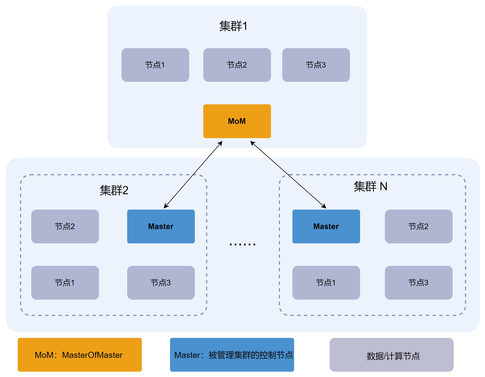
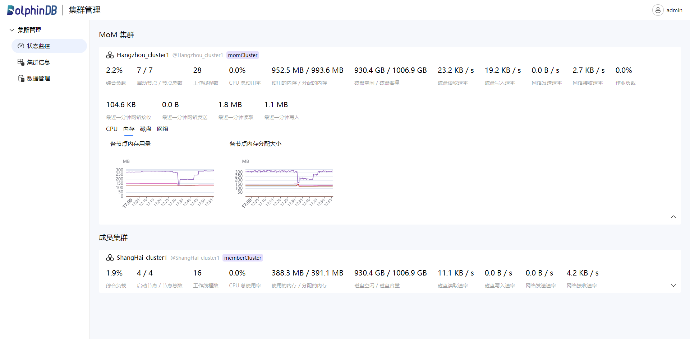
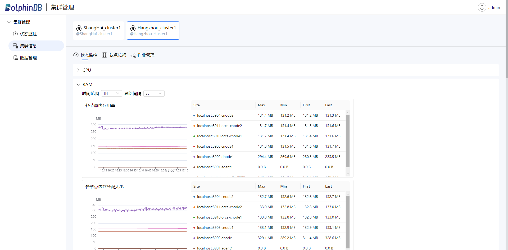
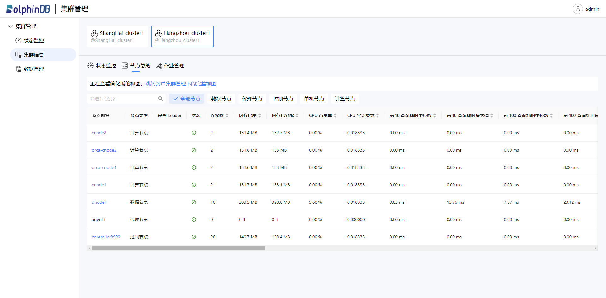
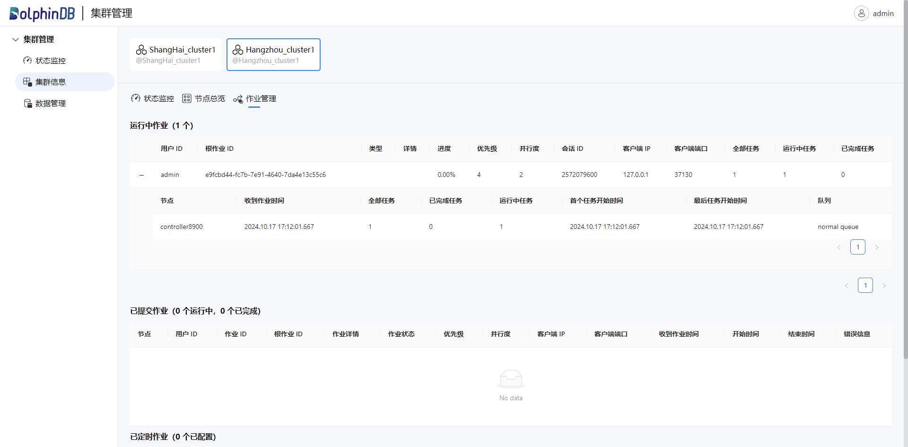
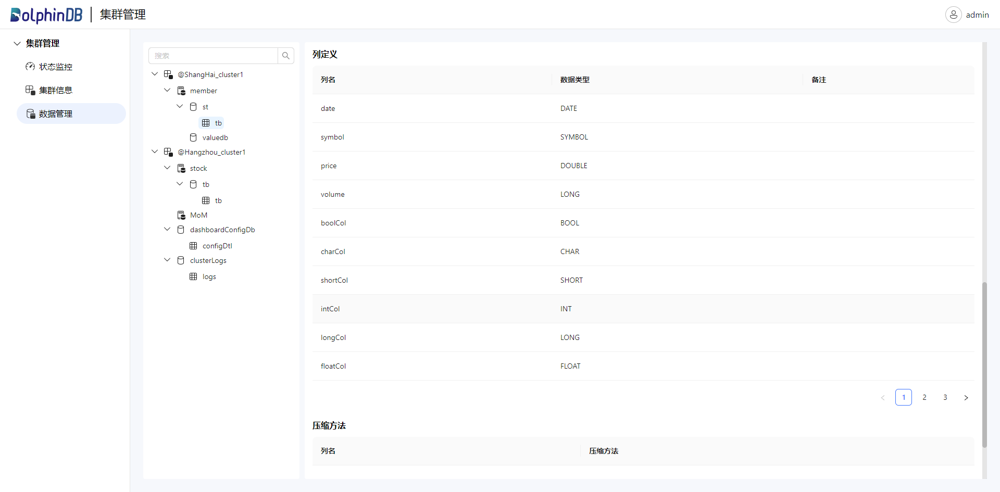

# 多集群管理

在公司内部，各个业务部门往往会独立搭建数据存储和计算集群，以满足各自的需求。然而，这种独立性导致了资源的分散和利用效率的低下。为充分利用各个集群资源，DolphiDB
提供了多集群管理工具，实现了对所有集群的统一管理和监控。其支持跨集群的数据查询，使得各部门能够更好地共享和利用资源，从而提高整体数据处理效率和决策能力。

## 架构设计

DolphinDB 多集群管理采用中心化的架构，通过一个中心节点或集群作为多集群的管理者（MoM，Master of
Master）来统一管理和维护多个成员集群。其中，MoM 只能是非高可用集群，而成员集群可以是高可用或非高可用集群。架构图如下：



在 DolphinDB 多集群架构中，MoM 负责维护多个集群的拓扑结构、数据库和表等信息。成员集群的 Master 节点（高可用时为 Leader，非高可用时为
Controller）和 MoM 节点定时向 MoM 汇报心跳信息，这些信息包含集群的状态和其他相关信息。当 MoM 收到来自成员集群的 Master
节点和自身的心跳信息时，将心跳信息作为参数调用预设的回调函数。该回调函数负责将心跳信息写入分布式分区表，以存储各个集群的监控信息。

## 基本功能

基于以上架构，DolphinDB 实现了以下功能：对多个集群的状态进行监控、在不同的集群间进行数据访问操作，同时提供对数据访问的权限控制。

### 集群管理

通过多集群管理工具（近期发布）进行集群管理，包括对集群状态进行监控、查看集群详细信息、对集群中的数据库、表进行管理等。

* 监控状态

通过该页面实时查看集群的详细状态，包括使用负载、启用节点数、CPU 使用率、磁盘容量及剩余容量、节点写入读取速率等。监控页面如下图：



* 查看集群信息

在集群信息页面，选择特定的集群，可以查看该集群详细的状态监控、节点及作业信息。也可以指定要查看的时间范围和刷新的频率：



点击”节点总览”，查看该集群下的节点信息：



点击”作业管理”，查看该集群下的作业状态：



* 数据管理

通过数据管理也能，可以查看所有集群拥有的 Catalog, Schema 以及数据库表。通过点击具体对象查看它们的详细信息：



### 跨集群数据访问

DolphinDB 在其 catalog 机制的基础上，引入”集群标识符“的概念，从而实现了多集群管理模式下的跨集群数据访问功能。用户必须在集群中使用
catalog 来定义数据库和数据表。否则，将无法进行跨集群的数据访问，只能监控集群的状态。

使用 catalog 来定义数据库和数据表的语法如下：

```
<catalog>.<schema>.<table>[@<cluster_identifier>]
```

其中，@ 之前的内容表示数据目录的存储结构，而 @ 之后的内容则是集群标识符，用于指示当前目录下的集群名称。在进行跨集群访问时，需要通过
cluster\_identifier 指定要访问的集群。例如，在集群 cluster1 中存在表 trading.stock.quote。如果想在集群
cluster2 中查询 cluster1 中的这张表，可以使用以下语句：

```
select * from trading.stock.quote@cluster1
```

注意：

* 目前仅支持对跨集群库表进行查询，不支持写入、更新等修改操作，也不支持表连接。
* 不支持在一个查询语句中同时访问来自多个不同集群的数据。

在进行跨集群数据访问时，成员集群需要先通过 MoM 获取其他集群的信息并进行身份验证，验证成功后便可以访问其他集群的数据。下一节将展开讨论访问权限管理。

### 访问权限管理

多集群管理中的权限管理与用户所在集群的权限管理相互独立，互不影响。在多集群管理中，所有跨集群的权限设置必须在 MoM 节点上执行，相关权限信息也会保存在 MoM
节点上。在未授权之前，成员集群的用户仅能访问本集群的库表。只有在 MoM 节点授予其对某个集群的访问权限后，才能访问该集群的库表。在 MoM
上进行跨集群权限管理时：

* 需要在用户（user）后面需要加上 @<cluster\_identifier>，以指示该用户属于哪个集群。
* 在应用对象/约束规则（objs）后面也需要加上 @<cluster\_identifier>，以指示进行权限管理的对象属于哪个集群。

例如：如果集群 cluster2 上的用户 user1 想要读取集群 cluster1 上的表 trading.stock.quote，则需要在 MoM
上执行以下脚本以授予相应权限：

```
grant("user1@cluster2", TABLE_READ, "trading.stock.quote@cluster1")
```

需要注意，目前仅支持设置以下权限类型：TABLE\_READ*,* SCHEMA\_READ, CATALOG\_READ。

## 多集群管理配置

要使用多集群管理功能，需要在 MoM 和成员集群的 Master 中进行相关配置：

* 在 MoM 集群上：

  + 配置当前集群是 MoM 集群，配置项 *isMasterOfMaster*。
  + MoM 集群的名称，配置项 *clusterName*。
  + 回调函数的函数视图名称，配置项 *momHeartbeatHandler*。
  + 要通过多集群管理工具监控各集群的状态，还需要完成以下配置：

    - *momHeartbeatDb*：配置存放收集到的集群信息的数据库地址，格式为 dfs://xxx。
    - *momHeartbeatTable*：配置存放收集到的集群信息的的数据表名。
    - *momDatanode*：配置存放数据库表的数据节点名称。
* 在成员集群 Master 上：

  + 配置 MoM 的 controller 的地址，配置项 *masterOfMasterSite*。
  + 当前集群（成员集群）的名称，配置项 *clusterName*。

**示例：**

希望对集群 1，集群 2 和集群 3 进行多集群管理。其中，集群 1 的 controller 将作为 MoM，其地址为192.168.1.1:8848。

* 在集群 1 的 controller.cfg 配置文件中添加：

  ```
  isMasterOfMaster=true
  clusterName=Hangzhou_cluster1
  momHeartbeatHandler=writeClusterLogToMoM
  momHeartbeatDb=dfs://clusterLogs
  momHeartbeatTable=logs
  momDatanode=dnode1
  ```
* 在集群 2 的 controller.cfg 配置文件中添加：

  ```
  clusterName=ShangHai_cluster1
  masterOfMasterSite=192.168.1.1:8848
  ```
* 在集群 3 的 controller.cfg 配置文件中添加：

  ```
  clusterName=cluster2
  masterOfMasterSite=192.168.1.1:8848
  ```

注： 如果成员集群为高可用集群，则需要在每个控制节点的 controller.cfg 中进行上述配置。

完成配置后，在由 *momDatanode*
指定的节点上进行如下操作，完成数据库表的创建：

```
// 填写 controller 的别名。如果是单机节点，则直接调用 getClusterPerf()
t = rpc("controller8900" ,getClusterPerf)
t.addColumn(["clusterName", "timeStamp"], [STRING, TIMESTAMP])
// 数据库名和配置文件中的配置保持一致
db = database("dfs://clusterLogs", VALUE, ["a", "b"])
// 表名和配置文件中的配置保持一致
tb = createPartitionedTable(db, t, `logs, `clusterName)
def writeClusterLogToMoM(table) {
	writeLog("new heart table")
	// 和配置文件中的配置保持一致
	tbHandle = loadTable("dfs://clusterLogs", `logs)
	append!(tbHandle, table)
}

// 函数名和配置文件中的 momHeartbeatHandler 保持一致
addFunctionView(writeClusterLogToMoM)
```

至此，完成多集群管理工具需要的所有配置。启动所有集群后，便可通过该工具监控所有集群状态。

## 未来规划

DolphinDB 将继续优化多集群管理，规划在未来版本中实现以下功能：

* 持在一个查询语句中同时访问来自多个不同集群的数据。
* 支持写入、更新等修改操作，不支持表连接。
* 支持更全面的权限控制。
* 提供支持更多维度的多集群管理工具，包括资源监控、数据访问和权限控制等功能。

