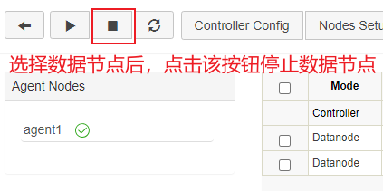

# 安全关机

在DolphinDB的早期版本中，当使用 `pkill -9` 或 `kill
-9` 的方式终止 DolphinDB 进程，重启 DolphinDB 服务时可能出现以下问题：

1. 这种终止方式可能导致某些完成的事务没有刷入磁盘。数据节点重启时，需要回放 redo log，将事务刷入磁盘。如果需要回放的 redo log
   很多，会导致数据节点启动过慢。
2. 若数据节点回放 redo log 的过程中出现问题，会导致启动失败。

DolphinDB 支持安全关机后，在系统关闭前完成事务刷盘，可以避免出现以上问题。本节主要介绍 Linux 系统下安全关机的机制，以及正确停止 DolphinDB
服务的过程。

## 安全关机机制

数据节点通过 `kill -15`（kill -TERM）命令，发送一个 SIGTERM
信号，DolphinDB 会捕获该信号并进行以下处理：

* 数据节点停止向控制节点发送心跳，以通知控制节点该节点已经关闭。此时，集群中的新发起的写入读取等任务或数据恢复任务将不会分配到该节点上。
* 若数据节点存在正在进行的事务，则等待这些事务完成并刷入磁盘。
* 对 cache engine 中的事务进行回收，并回收 redo log。

## 单实例模式安全关机的过程

* 前端交互模式：

  在控制台中输入 `quit` 以退出。
* 后台交互模式，需要使用 `kill` 命令：

  `kill -15 进程号` 或 `pkill -15
  dolphindb`

## 集群模式安全关机的过程

1. 关闭数据节点：在集群 web 管理界面通过下图的停止按钮或调用 [stopDataNode](../funcs/s/stopDataNode.html) 函数关闭数据节点，或在 GUI
   端或其他 API 客户端调用`stopDataNode`函数关闭数据节点。

   
2. 关闭代理节点和控制节点：

   安全关闭代理节点和控制节点的命令同与单实例相同。此外，还可以直接运行 stopAll.bat
   脚本关闭所有进程。

