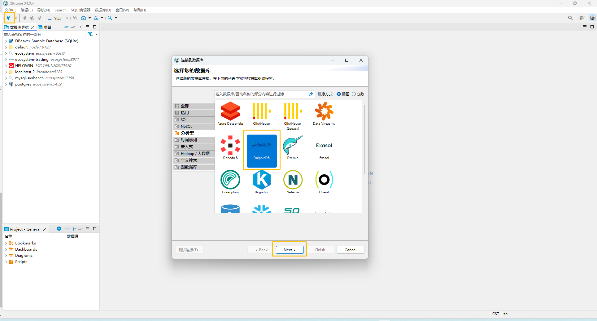
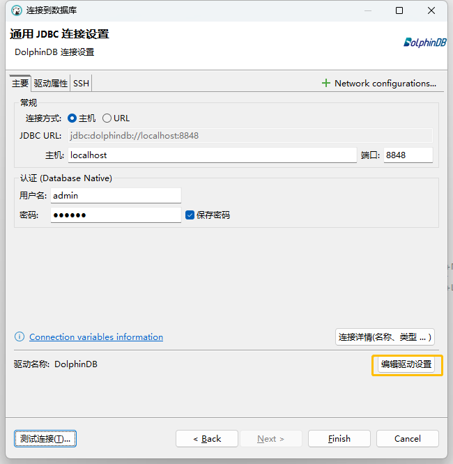
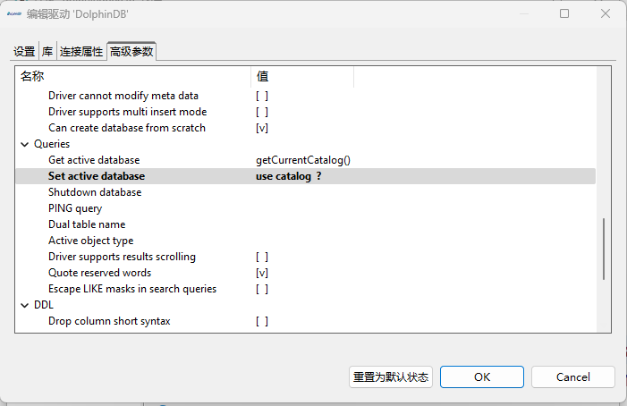
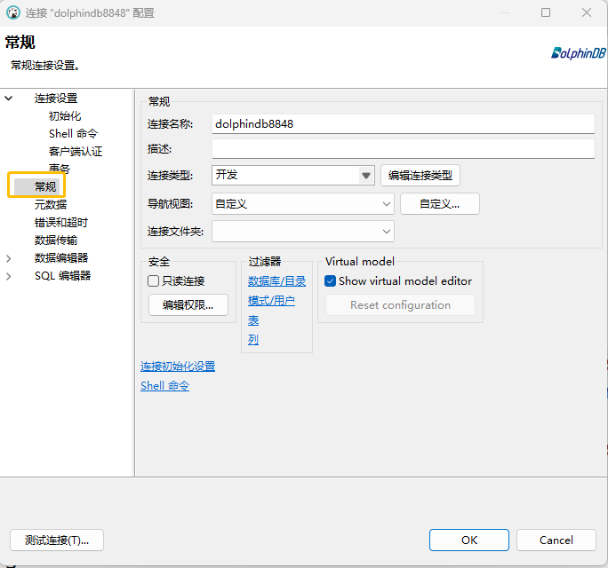
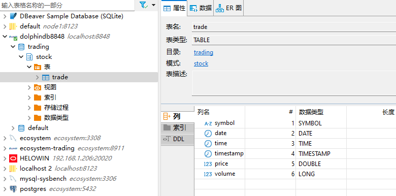
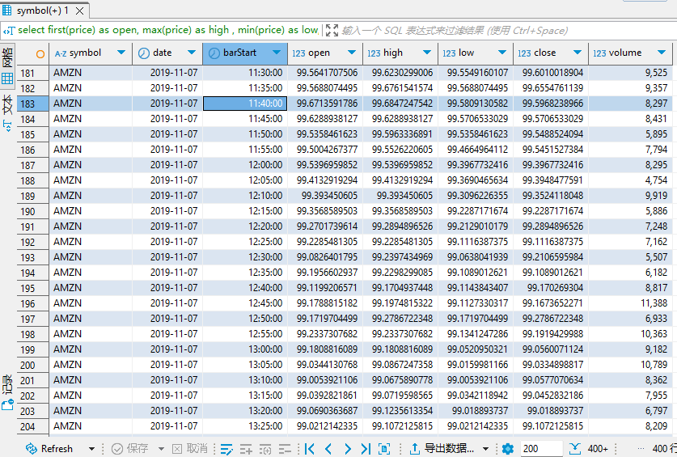
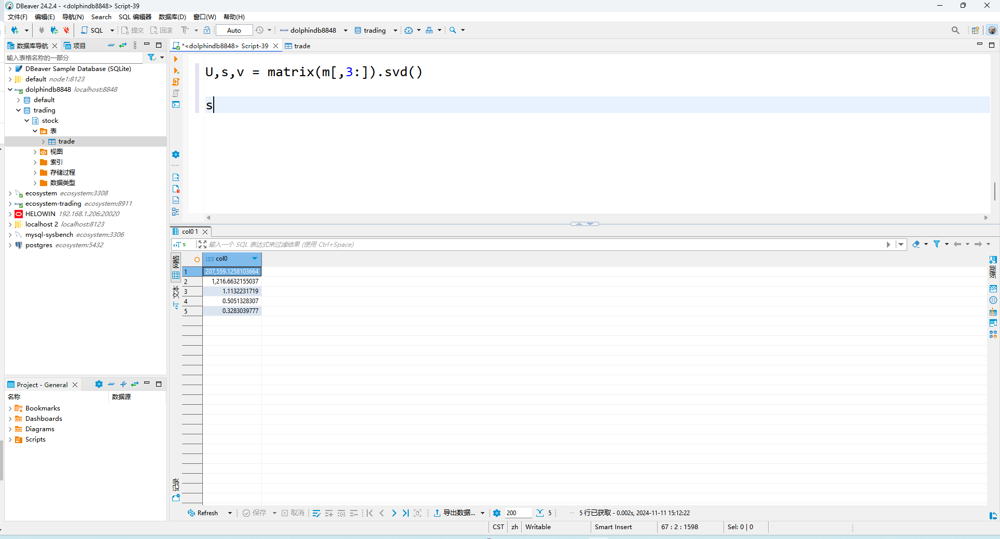
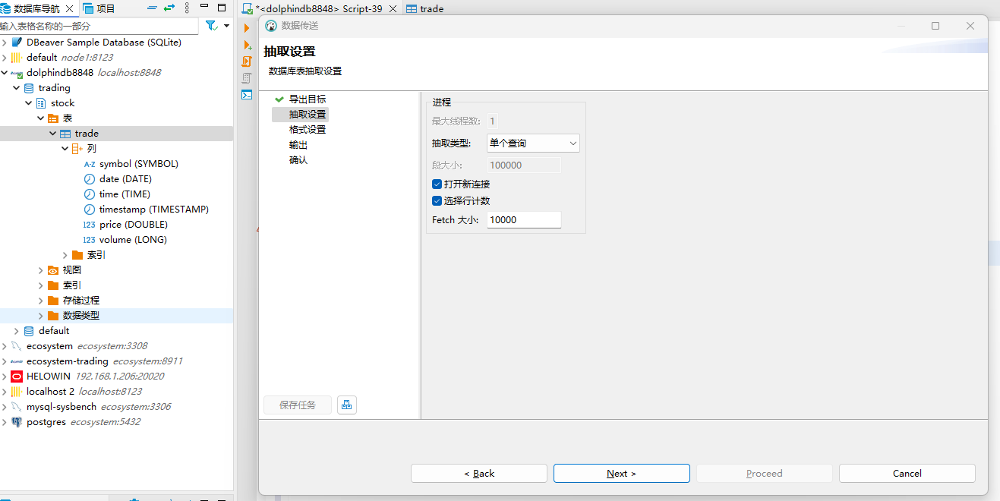

# 使用 DBEaver 连接 DolphinDB

在日常的数据开发、分析和数据库运维中，一款优秀的 IDE 能够极大地提升工作效率。DBEaver 是一款由 Java
编写的一站式跨平台连接器，其社区版本已能支持连接近百种数据库，受到广大开发者的喜爱。近期，

DolphinDB 与 DBeaver 团队共同努力，发布了 [DBeaver 24.2.1](https://github.com/dbeaver/dbeaver/releases/tag/24.2.1) 版本，新增 DolphinDB 驱动程序，支持在 DBeaver 中访问和管理
DolphinDB。

本文基于 DBeaver 24.2.1，DolphinDB 3.00.0 版本编写， 用于指导用户如何通过 DBEaver 连接和操作 DolphinDB。

## 1. DBeaver 简介及安装准备

[DBeaver](https://dbeaver.io/)
是一款开源的数据库管理工具，广泛支持多种数据库，包括关系型、时序、 图、键值数据库等。它为数据库管理员和开发者提供了丰富的功能，如数据库连接管理、SQL
编辑器、数据可视化、查询结果的导出和分析、数据迁移，以及数据库的结构查看和修改等。DBeaver 支持在多种平台（Mac, Linux,
windows）上运行。其直观的用户界面和丰富的功能，极大地提升了数据应用与开发效率，受到了广大开发者的喜爱。

**安装 DolphinDB**

DolphinDB 的版本需大于等于 3.00.0。这是因为 DBeaver 使用 JDBC DatabaseMetaData 接口中的
getCatalogs，getSchemas，getColumns 等相关方法访问数据库，而 DolphinDB 2.0 版本并没有实现
catalog。安装请参阅[部署](../deploy/deploy_intro.html)文档。

**安装 DBeaver Community**

点击[Download](https://dbeaver.io/download/) 下载 DBeaver Community 版本。根据平台选择对应版本的安装包，版本需要 >= [24.2.1](https://github.com/dbeaver/dbeaver/releases/tag/24.2.1)。

**了解 catalog**

DBeaver 访问的分布式库表需纳入 catalog 管理。若尚未了解 catalog，请先阅读文档 [数据目录](../db_distr_comp/db/catalog.html) 。以下是在使用 DBEaver
时可能用到的函数。

| **函数** | **作用** | **示例** |
| --- | --- | --- |
| [createCatalog](../funcs/c/createCatalog.html)(catalog) | 创建 catalog | ``` createCatalog("test") ```   创建 catalog test |
| [createSchema](../funcs/c/createSchema.html)(catalog, dbUrl, schema) | 把已有的数据库添加到指定的 catalog/schema 中 | ``` createSchema("catalog1", "dfs://db1", "schema1") ``` |

## 2. 配置并连接 DolphinDB

本节介绍如何通过 DBEaver 连接 DolphinDB、如何离线配置 JDBC，以及如何进行连接配置。

### 2.1 创建连接

安装完成后, 按图示创建 DolphinDB 数据库连接。



1. 创建连接

点击 **Next** 创建连接，输入主机、端口、用户名、密码这些基本的连接信息。

2. JDBC 配置及连接测试

点击**测试连接**。若本地没有 DolphinDB JDBC 驱动，DBEaver 会自动从互联网进行下载。成功连接会提示”已连接“，若失败请检查 ip
、端口、用户名、密码的正确性以及防火墙。

**离线环境配置 JDBC**

可以手动下载 [DolphinDB JDBC](https://mvnrepository.com/artifact/com.dolphindb/jdbc)（版本 >=3.00.1.0)，请选择
[jar-with-dependencies](https://repo1.maven.org/maven2/com/dolphindb/jdbc/3.00.1.0/jdbc-3.00.1.0-jar-with-dependencies.jar) 后缀的 jar
包。下载完成后，手动添加 JDBC 驱动。



在连接设置页面，点击 **编辑驱动设置** → **库** → **添加文件**，添加所下载的 jar
包。也可以通过这种方式更新DolphinDB JDBC 版本。更新版本的jdbc会实现更多的接口，使得DBEaver DolphinDB Connector
可以使用更多的功能。

### 2.2 连接配置



在上述界面中选择 高级参数 → **Queries** → **Set active database**，填入属性值

```
use catalog  ?
```

至此，配置工作完成。另外，在**常规**->**连接名称**
选项中，可以设置连接名称。可以输入一个具有辨识度的名称，以便工程化管理多个数据库。



## 3. DolphinDB Driver 使用案例

目前的 DolphinDB Driver 支持以下功能，可以满足数据开发的需求。

* 查看分布式库表结构
* 查询数据
* 执行 DolphinDB 脚本
* 导出分布式库表数据

以下是一个简单的使用案例，以及给出一些使用建议。

### 3.1 查看分布式库表结构

分布式库表需要纳入 catalog 管理。分别创建 catalog, schema, 及分布式库表，并写入数据。右键数据库连接 → SQL 编辑器，在 SQL
编辑器中，点击 按钮执行脚本。

```
login("admin", "123456")
createCatalog("trading")
go
use catalog trading

create database stock
partitioned by VALUE(2019.11.07..2019.11.08), HASH([SYMBOL,25])
engine='TSDB'
go

create table stock.trade(
	date DATE,
	time TIME,
	timestamp TIMESTAMP,
	symbol SYMBOL,
	price DOUBLE,
	volume LONG,
)
partitioned by date, symbol
sortColumns=["symbol", "timestamp"]

```

执行成功后，右键 DolphinDB连接 -> **Refresh**，就可以看到新建的库表信息。



接着尝试写入一些数据。

```
n = 10000
date = take(2019.11.07 2019.11.08, n)
time = (09:30:00.000 + rand(int(6.5*60*60*1000), n)).sort!()
timestamp = concatDateTime(date, time)
price = 100+cumsum(rand(0.02, n)-0.01)
volume = rand(1000, n)
symbol = rand(`AAPL`FB`AMZN`MSFT, n)
data = table(date, time, timestamp, symbol, price, volume).sortBy!(`symbol`timestamp)
tableInsert(stock.trade, data)
```

**注意：**

* 你可以通过 [createSchema](../funcs/c/createSchema.html) 函数将已有的
  DFS 表加入到某个 schema 中。
* 在“查看表”菜单中的“数据”子选项会对 DFS 表的数据进行逻辑分页查询，执行全表扫描并在 DBeaver 的进程中缓存数据。因此，不建议对 DFS
  表使用此选项。

### 3.2 执行 SQL 查询

在SQLEditor 中，执行SQL查询。

```
select first(price) as open, max(price) as high
, min(price) as low, last(price) as close, sum(volume) as volume
from stock.trade
group by symbol, date, bar(time, 5*60*1000) as barStart
```



在数据窗格中可以进一步对结果数据进行排序过滤，分页查看。需要注意的是，当前 DolphinDB Driver 使用的是 DBeaver Generic JDBC
连接器，其分页查询采用逻辑分页。这意味着 DBeaver 会从 DolphinDB 中查询所有结果数据，并将其缓存到 DBeaver
的内存中。因此，请避免查询大量数据（或在 SQL 中未通过 TOP/LIMIT 进行限制），否则可能会导致 DBeaver 出现 “Java heap out
of memory” 错误，甚至卡死。

如果不想手动编写 SQL 语句，可以通过右键点击表名，选择“生成 SQL” → “SELECT” 来自动生成查询 SQL 语句。

### 3.3 执行 DolphinDB 脚本

除 SQL 外，DolphinDB Driver 还支持在编辑器中执行脚本语句，进行一些简单的数据分析或运维工作。

* 矩阵计算

  ```
  m = select first(price) as open, max(price) as high
  , min(price) as low, last(price) as close, sum(volume) as volume
  from stock.trade
  group by symbol, date, bar(time, 5*60*1000) as barStart

  U,s,v = matrix(m[,3:]).svd()
  s
  ```
* 集群运维

  ```
  getSessionMemoryStat()
  clearAllCache()
  setMaxConnections(1024)
  ```

对于脚本执行，DBeaver 会针对有无返回结果（ execute方法的返回值 true/false) 进行设计。如上文中的 `U,s,v =
matrix(m[,3:]).svd()` 没有返回结果，意味着 DBeaver 不会展示 U, s, v 的值。而运行变量 s
可以查看具体的值：



如果想批量执行多行脚本需要点击按钮  。

### 3.4 导出数据至 csv

如果想要导出一些样例数据，可以右键对应的表 → **导出数据** 。



通常按导航的默认设置点击 “Next” 即可完成导出。至此，本文对如何通过 DBeaver 连接
DolphinDB，并在其中查看库表结构，读取数据，编写脚本等操作进行了详细的介绍。通过阅读本文，您可以在 DBeaver 中对 DolphinDB
有效地管理和操作数据 。

## 4. 小结

目前 DolphinDB Driver 实现了基本的使用功能，可以满足 DolphinDB 用户的查看库表结构、查询数据、编写脚本的需求。当然，目前基于 Generic
JDBC 的连接器实现存在一定的局限性。例如某些类型的变量无法直接查看。这是因为在 JDBC 的 ResultSet 接口设计中，将数据库的返回定义为一个表。

注： A table of data representing a database result set, which is
usually generated by executing a statement that queries the database.

而 DolphinDB 脚本语言做为一门多范式编程语言支持多种数量结构。针对这个冲突，DolphinDB JDBC 做了一定程度的包装（Wrap)，将
scalar，vector, matrix 包装为一个表。目前不支持 dict 结构的包装，因此无法查看 dict 类型的数据。

在后续版本中，我们会进一步地完善 DolphinDB Driver 的功能，提升用户体验。

