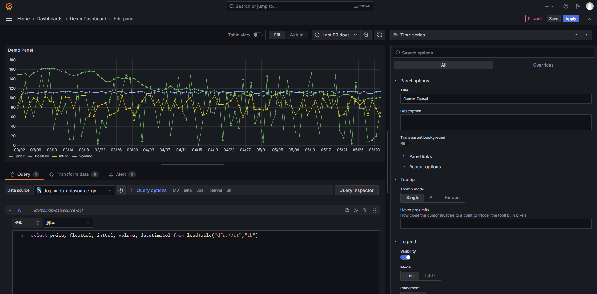

# Grafana 数据源插件

Grafana 是一个开源的数据可视化 Web 应用程序，常用于动态展示时序数据、支持多种数据源等。用户可通过配置连接的数据源、编写查询脚本，进而实现在浏览器中展示数据图表。

对此，DolphinDB 特别开发了 Grafana 数据源插件，使得用户能够在 Grafana 面板 (Dashboard) 上通过编写查询脚本、订阅流数据表的方式与 DolphinDB 进行交互，实现 DolphinDB 时序数据的可视化。

DolphinDB Dashboard 界面

## 双版本的 Grafana 数据源插件

目前，DolphinDB 提供了两种版本的 Grafana 数据源插件，其在功能和使用场景上存在明显区别。用户可根据自身需求选择使用。

* dolphindb-datasource：使用前端连接数据库的插件，使用 WebSocket 进行通信。使用该插件需要浏览器和数据库处于同一网络下。
* dolphindb-datasource-next：使用 Go 编程语言编写，运行在 Grafana 后端的插件。使用该插件需要 Grafana Server 和数据库部署在同一网络下，或 Grafana Server 可以连接到数据库。dolphindb-datasource-go 支持 Grafana Alert（警报）功能，可以自定义时间间隔查询，并在查询结果满足指定条件时发出警报。

Copyright

**©2025 浙江智臾科技有限公司 浙ICP备18048711号-3**
