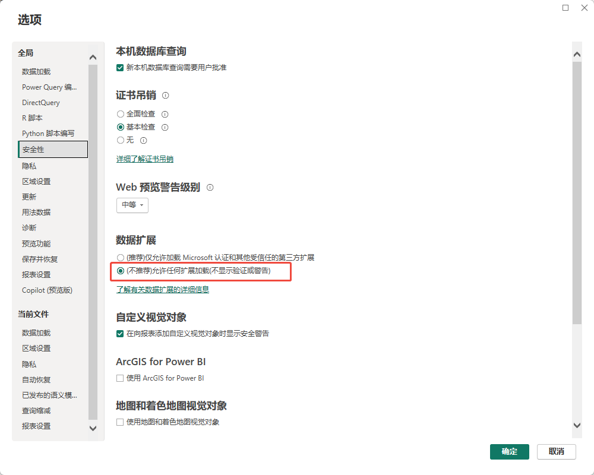
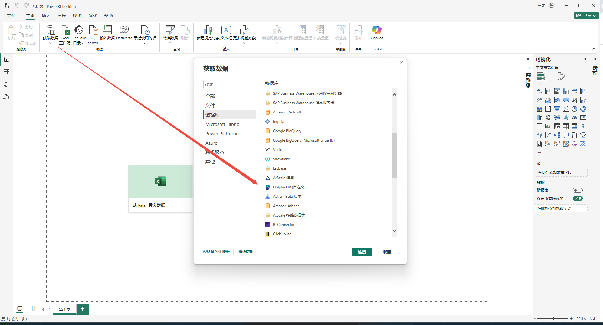
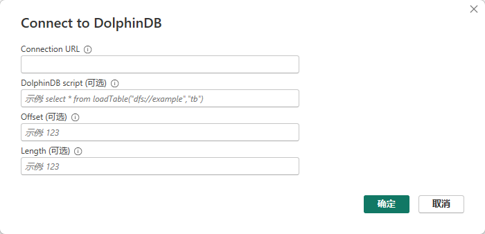
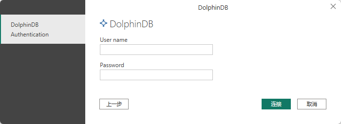
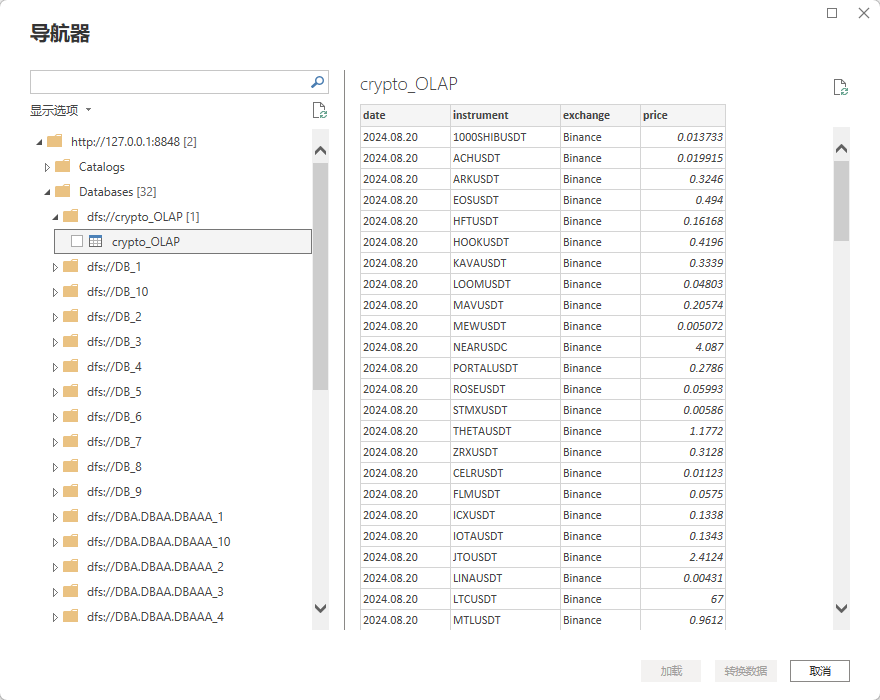
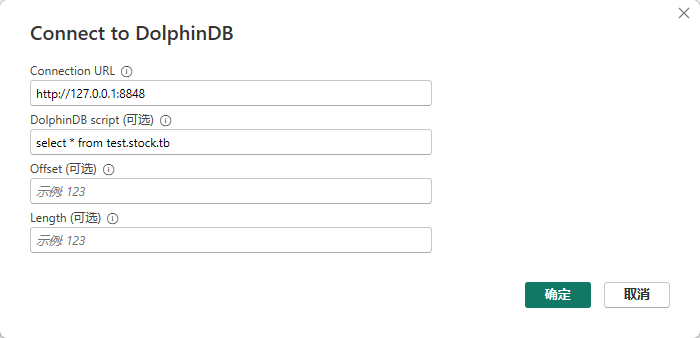
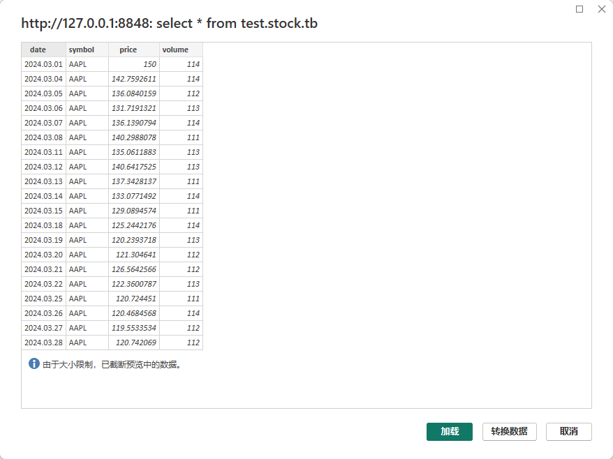
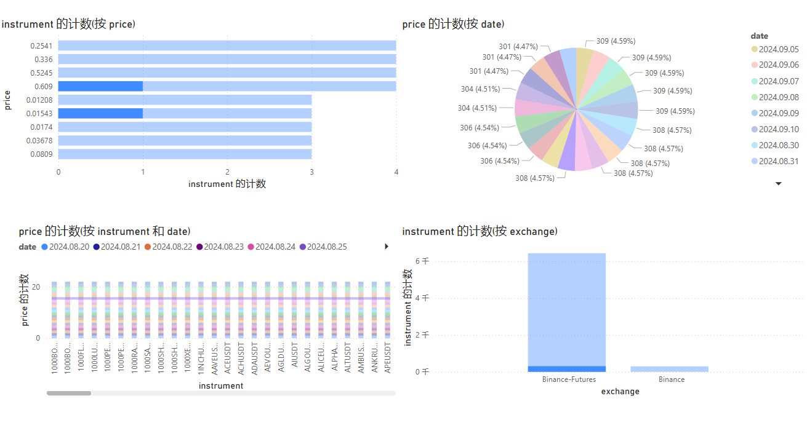

# 使用 Power BI 连接 DolphinDB

Power BI 是软件服务、应用和连接器的集合，它们协同工作以将相关数据来源转换为连贯的、视觉逼真的交互式见解。使用 Power
BI，可以轻松连接到数据源，可视化并发现重要内容，根据需求与其他人共享。

DolphinDB 开发了自定义连接器，支持用户使用 Power BI 连接 DolphinDB 数据库获取数据，并在 Power BI 中进行可视化操作。

## 1. 安装说明

1. **系统要求**

   DolphinDB server：请使用 3.00.2，2.00.14 及以上版本。
2. **安装 Power BI**

   前往 [Power BI 官网](https://www.microsoft.com/zh-cn/power-platform/products/power-bi)注册并下载安装 Power BI
   Desktop。
3. **安装 DolphinDB 自定义连接器**

   下载 [DolphinDB 自定义连接器](script/powerbi/DolphinDB.mez)（未公开发布，暂提供附件文件供测试），并将其置于 Power BI
   Desktop 的自定义连接器文件夹。默认路径为[Documents]\Power BI Desktop\Custom
   Connectors。
4. **调整数据扩展插件安全设置**

   启动 Power BI Desktop，依次选择 “选项和设置” > “选项” > “安全性”。在 “数据扩展”
   下，选择 “(不推荐)允许任何扩展加载(不显示验证或警告)”。点击 “确定”，然后重启 Power BI Desktop。

   图 1. 图 1-1 调整数据扩展插件安全设置

   

## 2.使用说明

### 2.1 导入数据

启动 Power BI Desktop，点击 “从其他数据源获取数据”。在 “数据库” 下，选择 DolphinDB，点击 “连接”。

图 2. 图 2-1 选择 DolphinDB 数据源

在连接设置页面中输入Connection URL、DolphinDB script、Offset 和 Length。

图 3. 图 2-2 填写连接信息

**参数说明：**

* **Connection URL** 表示 DolphinDB 数据库连接的
  URL，必填。示例：http://127.0.0.1:8848。
* **DolphinDB script** 表示执行的查询语句，可选。
* **Offset** 表示查询的分页偏移量，即查询跳过的行数，可选。
* **Length** 表示查询的分页页面大小，即返回的数据行数，可选。

确认上述信息无误后，点击 “确认”。

在页面中输入用户名和密码，点击 “连接” 登录。

图 4. 图 2-3 填写用户信息

若未填写查询语句，导航器将加载库表中的全部数据。

图 5. 图 2-4 加载数据

数据量较大时，不建议全部加载。可以填写查询语句并设置分页偏移量（Offset）和分页页面大小（Length）。

注：

连接3.00.2，2.00.15 及以前的 DolphinDB server 时，请不要在下图中的 DolphinDB script 框内填写 SQL
查询语句，否则会导致报错。该报错将在3.00.3，2.00.16版本修复。

图 6. 图 2-5 填写查询语句

点击 “加载” 即可将数据导入到 PowerBI。

图 7. 图 2-6 加载指定数据

注：

由于 Power BI 本身不支持显示某些类型，使用 Power BI 数据自动转换时，一些类型会转为错误的类型（如
nanotime、month）被转换为小数等。请导入 Power BI 支持的类型格式数据或手动把数据格式改成字符类型。时间最大只支持
**datetime**。

需要再次连接相同的数据源时，可以在 “主页” > “最近使用的源” 中查找。

### 2.2 数据可视化

完成数据导入后，可以通过创建自定义报表，调用 Power BI 的视觉对象进行可视化操作。

图 8. 图 2-7 数据可视化

有关 Power BI 的详细操作指南，请参见 [Power BI 官方使用文档](https://learn.microsoft.com/zh-cn/power-bi/fundamentals/power-bi-overview)。

