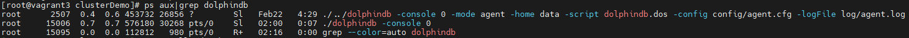
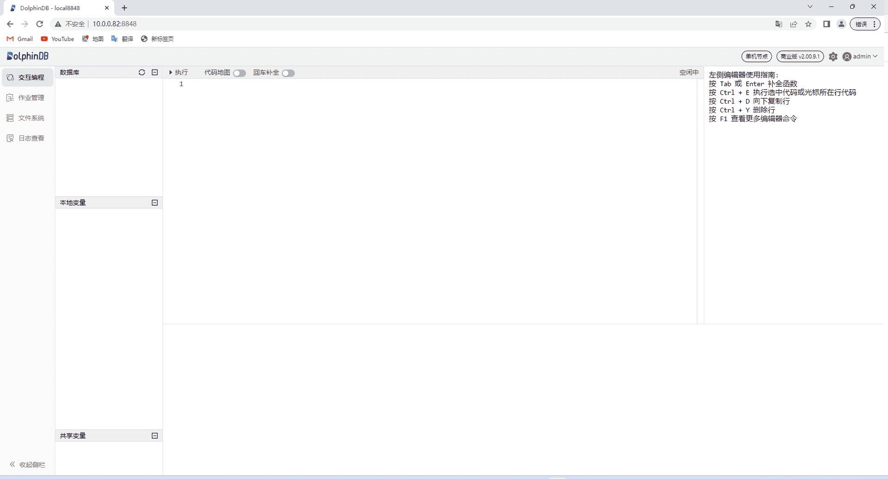

# 单节点部署与升级 (ARM)

本教程用于嵌入式 ARM 版本的单节点部署、升级、过期 License 升级，并对常见问题做出解答，便于用户快速上手 DolphinDB 。包含以下主题：

## 系统要求

| **系统要求项** | **具体指标** |
| --- | --- |
| 操作系统 | Linux（内核 3.10 及以上版本） |
| 内存 | 2GB 及以上 |
| Flash | 8GB 及以上 |
| 支持的 ARM CPU | CORTEXA15/CORTEXA9/ARMV7/ARMV8/CORTEXA53/CORTEXA57/CORTEXA72/CORTEXA73/FALKOR/THUNDERX/THUNDERX2T99/TSV110 |
| DolphinDB ARM 版使用的交叉编译器 32 位系统 | arm-linux-gnueabihf4.9 |
| DolphinDB ARM 版使用的交叉编译器 64 位系统 | aarch64-linux-gnu\_4.9.3 |

若用户在实际运行时出现问题，请反馈给我们：support@dolphindb.com。

## 部署 DolphinDB 单节点

### 第一步：下载

* 官方下载地址：https://dolphindb.cn/product#downloads
* 也可以通过 Shell 指令下载。下载方式如下：

  ```
  wget https://www.dolphindb.cn/downloads/DolphinDB_ARM64_V${release}.zip -O dolphindb.zip
  ```

  其中，`${release}` 代表版本。例如：下载 2.00.11.3 版本的 ARM64 server，使用以下指令：

  ```
  wget https://www.dolphindb.cn/downloads/DolphinDB_ARM64_V2.00.11.3.zip -O dolphindb.zip
  ```

  以此类推。
* 执行以下 Shell 指令解压安装包至指定路径(`/path/to/directory`)：

  ```
  unzip dolphindb.zip -d </path/to/directory>
  ```

**注意**： 安装路径的目录名中不能含有空格字符或中文字符，否则启动数据节点时会失败。

### 第二步：更新软件授权许可

如果用户拿到企业版试用授权许可，只需用其替换如下文件即可。

```
/DolphinDB/server/dolphindb.lic
```

如果用户没有申请企业版试用授权许可，可以直接使用程序包中的社区版试用授权许可。社区试用版指定 DolphinDB 单节点最大可用内存为 8GB，有效期为20年。

### 第三步：启动单节点

进入 */DolphinDB/server* 目录，第一次启动时需要修改文件权限，执行以下 Shell 指令：

```
chmod +x dolphindb
```

由于嵌入式系统一般实际可使用内存较小，所以第一次启动时，建议根据实际环境修改与内存相关的配置参数。在 */DolphinDB/server* 目录执行以下 Shell 指令编辑单节点配置文件：

```
vim dolphindb.cfg
```

系统默认端口号是8848。如果需要指定其它端口可以通过参数 *localSite* 设置，例如修改端口为8900：

```
localSite=localhost:8900:local8900
```

使用参数 *maxMemSize* 限制 DolphinDB 进程可用的最大内存，以 GB 为单位。建议根据实际内存大小设置，例如修改为 0.8GB：

```
maxMemSize=0.8
```

使用参数 *regularArrayMemoryLimit* 设置数组的内存限制，以 MB 为单位。该参数必须是2的指数幂，默认值512。建议根据实际内存大小设置，例如修改为 64MB：

```
regularArrayMemoryLimit=64
```

参数 *maxLogSize* 是指当日志文件达到指定大小时，系统会将日志文件存档，以 MB 为单位。默认值是1024，最小值是100。建议根据实际内存大小设置，例如修改为 100MB：

```
maxLogSize=100
```

* 前台运行

  执行以下 Shell 指令：

  ```
  ./dolphindb
  ```
* 后台运行

  执行以下 Shell 指令：

  ```
  sh startSingle.sh
  ```

  可以执行以下 Shell 指令，查看节点是否成功启动：

  ```
  ps aux|grep dolphindb
  ```

  返回如下信息说明后台启动成功：

  

### 第四步：Web 管理界面检查节点运行状态

在浏览器中输入部署服务器 IP 地址和部署端口号（默认是 8848）即可进入 Web 管理界面，教程中的部署服务器 IP 地址为10.0.0.82，部署端口为8848，所以访问地址为10.0.0.82:8848，打开后的 Web 管理界面如下：



**注意**： 如果浏览器与 DolphinDB 不是部署在同一台服务器，需要关闭防火墙或者打开对应的部署端口，Web 管理界面才能正常打开。

## 单节点升级

### 第一步：正常关闭单节点

进入 */DolphinDB/server/clusterDemo* 目录执行以下 Shell 指令：

```
./stopAllNode.sh
```

### 第二步：备份旧版本的元数据文件

单节点元数据的默认存储目录：

```
/DolphinDB/server/local8848/dfsMeta/
```

```
/DolphinDB/server/local8848/storage/CHUNK_METADATA/
```

可在 */DolphinDB/server* 目录执行以下 Shell 指令备份单节点元数据：

```
mkdir backup
cp -r local8848/dfsMeta/ backup/dfsMeta
cp -r local8848/storage/CHUNK_METADATA/ backup/CHUNK_METADATA
```

**注意**：元数据文件可能通过配置文件指定存储在其它目录，如果在默认路径没有找到上述文件，可以通过查询配置文件中的 *dfsMetaDir* 参数和 *chunkMetaDir* 参数
确认元数据文件的存储目录。若配置中未指定 *dfsMetaDir* 参数和 *chunkMetaDir* 参数，但是配置了 *volumes* 参数，*CHUNK\_METADATA* 目录在相应的 *volumes* 参数指定的目录下。

### 第三步：升级

**注意**：当 server 升级到某个版本后，使用的插件也应升级到与此对应的版本。

下载所需升级版本的安装包，官方下载地址：[http://www.dolphindb.cn/downloads.html](https://dolphindb.cn/product#downloads)。

将新版本 *server* 目录下除 *dolphindb.cfg* 以及 *dolphindb.lic* 外的所有文件覆盖替换旧版文件。

### 第四步：重新启动单节点

进入 */DolphinDB/server* 目录执行以下 Shell 指令，后台运行 DolphinDB：

```
sh startSingle.sh
```

成功启动后，打开 Web 管理界面，在交互编程界面执行以下代码，查看 DolphinDB 当前版本：

```
version()
```

## 授权许可文件过期更新

### 第一步：替换授权许可文件

用新的授权许可文件 *dolphindb.lic* 替换旧的授权许可文件，授权许可文件位置如下：

```
/DolphinDB/server/dolphindb.lic
```

### 第二步：更新授权许可文件

* 在线更新

  打开 Web 管理界面，在交互编程界面执行以下代码完成更新：

  ```
  updateLicense()
  ```

  **注意**：在线更新有如下要求：

  + License 授权的客户名称必须与原来的 License 相同。
  + 授权的节点个数，内存大小，CPU 核数不能比原来的小。
  + 更新只在执行该函数的节点生效。因此在集群环境下，需要在所有控制节点、代理节点、计算节点和数据节点上运行该函数。
  + License 的类型必须是 commercial（付费）类型和 free 类型。
* 离线更新

  关闭 DolphinDB，然后重新启动，即可完成更新。

## 常见问题解答（FAQ）

### 端口被其它程序占用导致启动失败怎么办？

DolphinDB 单节点默认启动端口是 8848，如果遇到无法启动 DolphinDB 的情况，建议打开 */DolphinDB/server* 目录下的 *dolphindb.log* 日志文件，若出现如下错误：

```
<ERROR> :Failed to bind the socket on port 8848 with error code 98
```

说明选用的端口被其他程序占用，导致 DolphinDB 无法正常启动，修改配置文件中的端口为其它空闲端口后即可正常启动。

### Web 管理界面无法访问怎么办？

DolphinDB 正常启动后，在浏览器输入正确的访问地址，但是 Web 管理界面无法正常打开，如下图所示：


出现上述问题的原因基本上都是因为浏览器与 DolphinDB 不是部署在同一台服务器，且部署 DolphinDB 的服务器开启了防火墙。可以通过关闭部署了 DolphinDB 的服务器的防火墙或者打开对应的部署端口，解决这个问题。

### Linux 升级失败如何版本回退？

如果升级以后，不能正常开启单节点 DolphinDB ，可按以下方式回退到旧版本。

**第一步：恢复旧版本元数据文件**

在 */DolphinDB/server* 目录执行以下 Shell 指令恢复已备份的单节点元数据：

```
cp -r backup/dfsMeta/ local8848/dfsMeta
cp -r backup/CHUNK_METADATA/ local8848/storage/CHUNK_METADATA
```

**第二步：恢复旧版本程序文件**

在官方下载旧版本程序包，把重新下载的旧版本 */DolphinDB/server* 目录下除 *dolphindb.cfg* 以及 *dolphindb.lic* 外的所有文件覆盖替换升级失败的文件。

### 在线更新授权文件失败怎么办？

在线更新授权文件需要满足[更新授权许可文件](#%E7%AC%AC%E4%BA%8C%E6%AD%A5%E6%9B%B4%E6%96%B0%E6%8E%88%E6%9D%83%E8%AE%B8%E5%8F%AF%E6%96%87%E4%BB%B6)中在线更新的要求。如果不满足其中的要求，可以通过离线方式进行更新，或在 DolphinDB 官网申请企业版 License。

### 如何进行配置参数调优？

可以参考 DolphinDB 官方参数配置说明进行配置参数调优。

如果遇到性能问题，请添加微信号13306510479（仅用于添加微信）或扫描下面二维码，客服会邀您进群，我们的工程师会解答您的问题。


