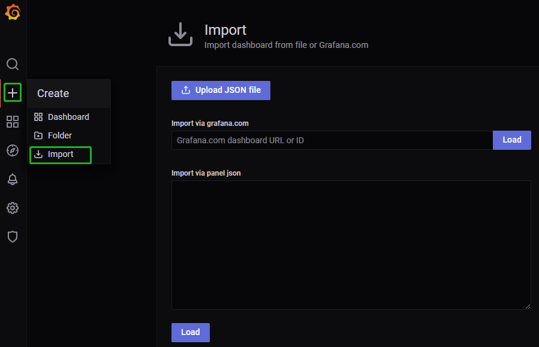

# subscribe
CN1.maxSubConnections=64
CN1.subPort=8970
CN1.subExecutors=16
```

### 创建与订阅流数据表

在计算节点 CN1 上创建流数据表：

```
t = streamTable(1:0, `sym`price, [STRING,DOUBLE])
enableTableShareAndPersistence(t, `tickStream)
```

订阅并编写实时因子计算：

```
def sum_diff(x, y){
    return (x-y)/(x+y)
}
factor1 = <ema(1000 * sum_diff(ema(price, 20), ema(price, 40)),10) -  ema(1000 * sum_diff(ema(price, 20), ema(price, 40)), 20)>
result = table(1000:0, `sym`factor1, [STRING,DOUBLE])
rse = createReactiveStateEngine(name="reactiveDemo", metrics =factor1, dummyTable=tickStream, outputTable=result, keyColumn="sym")
subscribeTable(tableName=`tickStream, actionName="factors", offset=-1, handler=tableInsert{rse})
```

往 CN1 模拟写入消息（同时另一个计算节点 CN2 执行导入数据作业）

```
n = 2000000
data = table(take("000001.SH", n) as sym, rand(10.0, n) as price)
tickStream.append!(data)
getStreamingStat().subWorkers
```

查看集群的资源消耗情况：

图 17. 图3\_3


可以看到 CN2, DN1-3 在消耗相对较高的内存和 CPU 时，CN1 并没有受到数据导入的影响，使得流计算的时延得到有效保证。

## 机器学习

机器学习是计算密集型的场景，模型的训练过程会消耗大量的 CPU、内存资源。将机器学习的作业部署至某个计算节点，可以避免对数据写入、读取类任务的负面影响。

```
def tranAdaBoost(TrainData){
	db = database(,HASH, [SYMBOL, 10])
	p10TranData = db.createPartitionedTable(table=TrainData, partitionColumns=`SecurityID)
	p10TranData.append!(TrainData)
	model = adaBoostRegressor(sqlDS(<select * from p10TranData>), yColName=`targetRV, xColNames=`BAS`DI0`DI1`DI2`DI3`DI4`Press`RV, numTrees=30, maxDepth=16, loss=`square)
	saveModel(model, "/hdd/data/finance/model/adaBoost.txt")
}

jobId="adaBoost"
jobDesc="adaBoost train snap"
submitJob(jobId, jobDesc, tranAdaBoost, Train)
```

完整代码及过程请参考[实时实际波动率预测](ml_volatility.md) 。使用 10 个线程并行训练，加速训练过程。

图 18. 图3\_4


在 CN2 训练过程中，其他节点资源未受影响。同时如果想加速机器学习训练过程，可以使用更多的线程，为 CN2 额外配置一些 CPU、内存资源，在资源管理上非常灵活。

## 运维

### 集群监控

引入计算节点的集群，在运维监控层面，需要以存储与计算分离的架构来进行监控。对于数据节点、计算节点的监控侧重点不同。具体来说，计算节点需要关注客户端请求执行情况的相关性能：包括平均响应时间、连接数、内存、CPU 使用率、网卡带宽使用率等；而数据节点更需要关注磁盘空间、IOPS、读写 MB/s 等 IO 相关指标。

### 监控软件部署

通过部署第三方软件：Grafana，Prometheus 实现集群的管理与监控，具体流程参考 [集群监控](cluster_monitor.md)。

### 监控面板

提供[计算节点与数据节点监控](https://grafana.com/grafana/dashboards/16194) dashboard，是基于存储与计算分离架构设计的一套监控面板。已上传至 Grafana 官方仓库， 可以在快速完成集群的运维监控部署工作。

点击 **Import** -> 输入对应 dashboardID，点击 **Load** 即可完成导入。

图 19. 图4\_1



### 查询监控与SESSION管理

#### session

计算节点监控的关键运行时参数主要是内存、连接数。如何避免个别 session 占用过多内存，而导致其他 session OOM，是运维管理上的重点。

1. 内存管理

   在内存紧张时，通过 getSessionMemory 视图进行会话管理，回收空闲会话：

   ```
   select
       userId
       ,sessionId
       ,memSize/1024/1024 as MB
       ,localtime(createTime) as createTime
       ,localtime(lastActiveTime) as lastActiveTime
       ,(now() - localtime(lastActiveTime))/1000 as idleSeconds
   from getSessionMemoryStat()
   order by memSize desc
   ```

   通过 closeSessions(sessionId) 来关闭对应会话并回收内存。

   图 20. 图4\_2

   

   图示，test 用户已经空闲15分钟了，视情况可以关闭此 session，并回收1000MB的内存。
2. 连接管理

   在 Linux 中，DolphinDB 的一个 connection 对应一个 TCP 连接。在物联网场景下，需要调整连接数（每个 tcp 连接消耗 4K 内存，对操作系统消耗不大），以应对高 QPS 需求，建议将计算节点的配置设置为 `maxConnections=5000` 及以上。

   ```
   The number of incoming connections has reached the limit of 512
   ```

   当日志出现以上信息时，说明连接已经不足，检查程序是否存在连接泄露的情况。应急处理请使用 `closeSessions()` 清理一些空闲会话以回收连接，并增加 *maxConnections* 。

#### 慢查询

慢查询通常会引起系统雪崩，需要重点关注。DolphinDB 提供一个 job log 日志文件，记录 DFS 表相关查询日志，默认在 log 目录下，名称为 *nodeAlias\_job.log*。

* 监控 top10 sql

  ```
  jobLogFile = getConfig(`jobLogFile)
  queryLog = loadText(jobLogFile)

  select
      node
      ,userId
      ,sessionId
      ,jobDesc as sqlText
      ,startTime
      ,endTime
      ,(endTime$DATETIME - startTime$DATETIME ) as costSeconds
  from queryLog
  order by (endTime$DATETIME - startTime$DATETIME ) desc
  limit 10
  ```

  图 21. 图4\_3

  

如图，根据 sqlText，userId，运行时间及时长，综合分析处置慢查询，比如限制一些用户进行较大规模的查询，以及对部分查询效率和速度较低的 SQL 语句进行优化。

### 参数设置

计算节点不需要设置 DFS 表存储相关的参数，包括：*volumes*, *chunkCacheEngineMemSize*, *tsdbCacheEngineSize*, *redoLogDir* 等。计算节点的核心参数包括：*MaxMemSize*, *MaxConnections*, *workerNum*, \*maxQueryResultLimit \*等。

### 计算节点扩缩容

相比于数据节点，计算节点扩缩容非常简单快捷，支持在线扩缩容。

#### 扩容

1. 在新机器上部署和配置 agent

   拷贝原机器上的 agent 部署包到新机器，并修改 *agent.cfg*，如

   ```
   mode=agent
   workerNum=4
   localSite=192.192.168.4:8950:C4-agent
   controllerSite=192.192.168.4:8990:controller3
   sites=192.192.168.4:8950:C4-agent:agent,192.192.168.2:8990:controller1:controller,192.192.168.3:8990:controller2:controller,192.192.168.4:8990:controller3:controller
   lanCluster=0
   ```

   **注意**：主要修改新机器上代理节点的 IP 和端口，以及控制节点集群的 IP 和端口。
2. 在 web 集群管理界面修改 `Nodes Setup` 配置，新增 computenode 和 agent。

   图 22. 图4\_4

   

   **注意**：在添加完每个节点的信息之后，切记点一下该行最后的 +（加号），确保添加成功。
3. 在 server/ 目录下面执行如下命令，启动新节点的 agent

   ```
   nohup ./DolphinDB -console 0 -mode agent -home data -config config/agent.cfg -logFile log/agent.log &
   ```
4. 重启 controller 节点使配置生效

   回到 web 管理界面，可以看到已经新增了一个 agent4 并且是未启动状态。

   图 23. 图4\_5

   

   **注意**：代理节点的信息需要在重启集群的controller节点之后才能显示出来，数据节点和计算节点在添加完之后刷新页面就可以观察到。

   图 24. 图4\_6

   
5. 启动新计算节点

   图 25. 图4\_7

   
6. 进入新增计算机节点 web 页面，执行查询命令，检查新增数据节点是否能够正常工作

   图 26. 图4\_8

   

   **注意**：新计算节点命名应遵守部署文档中提到的命名规则，以确保 *cluster.cfg* 能赋予新的计算节点正确的配置。

#### 缩容

1. 停止计算节点

   在 web 集群管理页面停止对应计算节点，等待其安全关闭，通常需要数秒。
2. 修改集群配置

   在 `nodes Setup` 中删除对应的 computenode 节点。

   **注意**：执行完上述操作之后，页面的计算节点信息并不会消失，需要重启集群的控制节点才会消失。

## 总结

计算节点不存储分布式数据，使用计算节点可以有效地提升集群的写入稳定性，缩短故障修复时间。计算节点之间相互隔离，架构设计者可根据应用场景，灵活地部署业务至各计算节点。推荐将流计算、机器学习部署至计算节点。在运维管理上，计算节点可以快速重启、方便地在线扩缩容。

